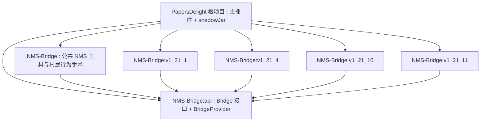
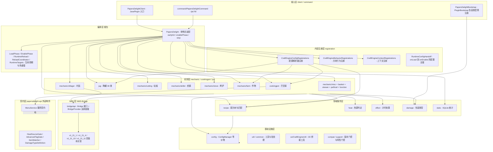
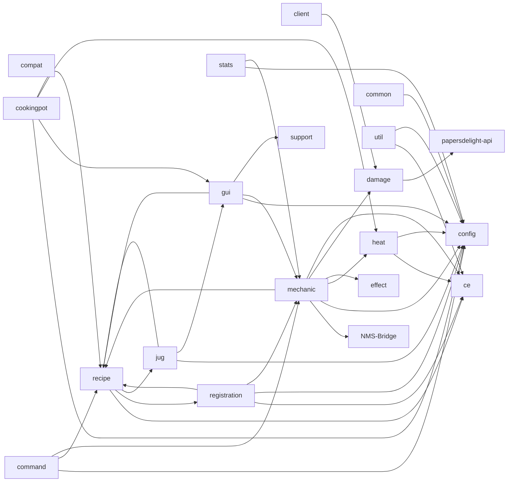

# PapersDelight 项目架构报告

> 分析时间：2026-10-02 · 分析模式：完整分析（225 个 Java 文件全量覆盖）
> 本报告与 [运行原理](02-operation-principles.md) · [工作流](03-workflow.md) · [模块函数目录](modules/) 配套阅读

---

## 1. 项目快照

| 项 | 值 |
|----|----|
| **项目名** | PapersDelight（Paper's Delight）—— Farmer's Delight 玩法的 Paper/Folia 服务端插件 |
| **版本** | `1.2.1-CE`（`gradle.properties:2`，CE = Community Edition 社区版） |
| **作者** | Shimamura Tako、Mr Dg32z_、gukuan、Cold Leaves（`paper-plugin.yml:4-8`） |
| **许可证** | AGPL-3.0 |
| **语言/运行时** | Java 21（NMS 桥接 v1_21_11 模块按 toolchain 25 编译） |
| **构建** | Gradle（Kotlin DSL）+ Shadow 9.0.0 重定位打包 + run-paper 3.0.2 本地调试 + paperweight userdev 2.0.0-beta.21（NMS 反编译依赖） |
| **目标平台** | Paper / Folia 1.21.1 ~ 26.X（`paper-plugin.yml:15-17`：`api-version: '1.21'`、`folia-supported: true`、`load: STARTUP`） |
| **代码规模** | 225 个 Java 文件 / ~35,018 行（主插件 195 文件 + NMS-Bridge 30 文件） |
| **测试** | 无任何测试源集（`find` 未发现 `*Test*.java`） |
| **CI/CD** | 无 `.github/workflows` 等配置，纯本地构建 |
| **Git** | 单 `main` 分支，6 个提交，2 个作者身份 |

### 1.1 外部依赖矩阵

| 依赖 | Gradle 作用域 | 运行时提供者 | 用途 |
|------|--------------|-------------|------|
| `io.papermc.paper:paper-api 1.21` | compileOnly | 服务器 | Bukkit/Paper API |
| `dev.tako:papersdelight-api 4.0.0` | **implementation** | 本插件（API 仅契约，无传递依赖） | 插件公开 API：`MenuService`、`HeatSourceGate`、`AdvancedTagGate`、`ItemMatcher`、`DamageTypeDefinition` 等 |
| `cn.chengzhimeow:CC-Scheduler 2.0.4` | implementation（shadow 重定位到 `dev.tako.libs.*`） | 打入 jar | Folia 区域调度器封装（全局/区域/异步三类调度） |
| `net.momirealms:craft-engine-core/bukkit/bukkit-proxy 26.8.1` | compileOnly | **CraftEngine 插件（强制依赖，BEFORE 加载）** | 自定义方块/物品/配方引擎的扩展点 |
| `me.clip:placeholderapi 2.11.6` | compileOnly | PlaceholderAPI 插件（可选） | `%papersdelight_*%` 占位符 |
| `dev.tako:libuid 1.0.0` | compileOnly | Libuid 插件（可选） | 陶罐流体机制 |
| `com.google.code.gson:gson 2.11.0` | compileOnly | 服务器自带 | 配置/序列化 |
| `org.jetbrains:annotations 24.1.0` | implementation（重定位） | 打入 jar | `@NotNull` 等注解 |
| `:NMS-Bridge` + 4 个版本子项目 | implementation | 打入 jar | 见 §5 |

强制约束：CraftEngine 版本必须 ≥ 26.8.1，否则启动即禁用（`PapersDelight.java:601-620` 的 `checkCraftEngineVersion` + `compat/CraftEngineVersionGate.java`）。

---

## 2. 仓库与 Gradle 多项目结构



（`settings.gradle.kts:45-50`）

构建要点（`build.gradle.kts`）：

- **shadowJar**（`build.gradle.kts:90-98`）：产物命名 `PapersDelight-<version>.jar`；把 `org.jetbrains.*`、`org.intellij.*`、`cn.chengzhimeow.ccscheduler.*` 重定位到 `dev.tako.libs.*` 防止类冲突；排除 `META-INF/**`；根项目 `jar` 任务被禁用（`build.gradle.kts:86-88`），`build` 强制依赖 shadowJar。
- **BUILD_FOLDER 环境变量**（`build.gradle.kts:92`）：CI 可将产物直接输出到外部目录。
- **processResources 模板展开**（`build.gradle.kts:70-83`）：把 `${version}` 与 CraftEngine 版本号注入 `paper-plugin.yml` 和 `papersdelight-build.properties`。
- **run-paper 双运行时**（`build.gradle.kts:49-67, 100-114`）：`runServer` 跑 Paper 1.21（Java 21）；`runServerFolia` 跑 Folia 26.1.2（Java 25 toolchain，4G 堆 + `--sun-misc-unsafe-memory-access=allow`），两者都自动挂载 shadowJar 产物。
- NMS-Bridge 各 `v1_21_x` 子项目使用 paperweight userdev 对**每个 Minecraft 版本**的官方反编译源码编译（详见 [modules/06](modules/06-nms-bridge-resources.md)）。

---

## 3. 运行时架构分层

插件整体是「**Bukkit 事件驱动 + 管理器装配 + CraftEngine 扩展注册**」的分层单体：



分层规则（源自 `PapersDelight.java` 装配代码与 import 统计）：

- **接入层**只认识编排层：`PapersDelightClient.onLoad()` → `PapersDelight.INSTANCE.earlyInit()`，`onEnable()` → `enablePhase()`，`onDisable()` → `stop()`（`client/PapersDelightClient.java:26-57`）。
- **编排层**是唯一的装配点：所有 Manager 的构造、事件注册、服务发布、命令注册都发生在 `PapersDelight.enable()`（`PapersDelight.java:161-409`）。
- **机制层**各子包彼此近乎独立（仅 `villager→farm`、`function→nourishment` 两条内部边），只共同依赖领域服务层。
- **契约层**是外部 Maven 构件 `dev.tako:papersdelight-api`，只含接口；GUI 引擎通过 `MenuService.get()` 服务查找暴露给附属插件（`PapersDelight.java:201-205` 把 `MenuManager` 以 `ServicePriority.Normal` 注册进 Bukkit `ServicesManager`）。

---

## 4. 包依赖全景（基于全量 import 统计）

```
client        → api, damage                    （入口，无其他内部依赖）
compat        → 无
support       → 无
ce            → 无                             （CraftEngine 桥接工具，最底层）
common        → config
util          → ce, config
heat          → ce, config
effect        → 无                             （独立，被 mechanic 消费）
damage        → api
recipe        → api, ce, jug, registration     （jug 边来自浸泡配方解码）
config        → 无内部包（YAML 加载器）
stats         → config, mechanic.nourishment   （占位符读取营养状态）
registration  → api, ce, config, cookingpot, jug, mechanic, recipe
command       → ce, config, cookingpot, jug, mechanic, recipe, util
gui           → api, ce, config, cookingpot, jug, mechanic, recipe, support, util
cookingpot    → api, ce, common, config, gui, heat, recipe, util
jug           → api, ce, common, config, gui, recipe, util
mechanic      → api, bridge, ce, client, common, config, damage, effect, heat, recipe, support, util
```



**依赖观察**：

1. **`gui` 与 `cookingpot`/`jug` 存在有意的双向引用**：`gui.MenuManager` 是通用菜单引擎；而 `gui.module.cookingpot`（菜单模块）反过来引用烹饪锅的数据类（`CookingPotLayout`/`CookingPotData`/`CookingPotManager`，`gui/module/cookingpot/CookingPotRecipeBook.java:6-9`）。菜单子模块按机制领域划分，与机制包天然耦合，循环被限制在「引擎→无、模块→机制」方向上，`MenuManager` 本身不依赖任何机制。
2. **`recipe→jug`** 由浸泡配方解码（`JugRecipeDecoderImpl` 实现 `recipe` 包定义的解码接口）产生，运行时通过 `JugRuntimeInstaller` 反转，见 §6.4。
3. **`stats→mechanic.nourishment`** 只用于 `PapersDelightExpansion` 读取营养占位符（`stats/PapersDelightExpansion.java:3`）。
4. `effect` 包零依赖、被 `mechanic/nourishment` 与 `mechanic/function` 消费，是纯粹的领域内核。

---

## 5. NMS-Bridge 版本桥设计

**问题**：村民 AI 手术、背刺附魔注册、伤害类型合成等操作必须触碰 NMS 内部类，而项目支持 4 个 Minecraft 版本。

**方案**（三层）：

1. **`bridge/api`**：纯接口 `Bridge` + `BridgeProvider`。`BridgeProvider` 在运行时读取 `Bukkit.getServer().getClass().getPackage()` 版本号，反射加载 `dev.tako.papersdelight.bridge.v1_21_X.BridgeV1_21_X` 实例并缓存。
2. **版本实现子项目**：每个 `v1_21_x` 只在对应 MC 版本的 paperweight 反编译源码上编译，互不可见；公共可版本无关的代码（`NMSHelper`、`VillagerBehaviorSurgery` 编排、`BackstabbingEnchantmentRegistrar` 骨架、`VillagerFoodBridge`）放在 `NMS-Bridge` 根项目，被各版本实现复用。
3. **主插件只 import `bridge.api`**：主源码集完全不含版本特定类，新增版本只需加一个子项目 + `settings.gradle.kts` 一行。

详细接口方法清单与四版本差异矩阵见 [modules/06-nms-bridge-resources.md](modules/06-nms-bridge-resources.md)。

---

## 6. 核心设计模式

### 6.1 单例装配器 + 两阶段生命周期

`PapersDelight.INSTANCE` 是饿汉单例（`PapersDelight.java:44`），持全部 Manager 字段；`PapersDelightClient` 是薄壳 JavaPlugin。生命周期被拆成：

- **`earlyInit()`**（onLoad 阶段，`PapersDelight.java:81-132`）：ConfigManager 加载 → CraftEngine 配置解析器注册（必须在 CE 加载资源**之前**）→ BlockBehavior 注册 → Context 注册。产出 `RuntimeConfigHandoff`。
- **`enablePhase()`**（onEnable 阶段，`PapersDelight.java:134-152` → `enable()` 161-409）：CE 可用性/版本校验 → bStats → Stats → 全部 Manager 装配 → RuntimeConfigHandoff 激活 → 菜单模块注册 → 命令注册 → 延迟 100/110/120/130 tick 的全服方块实体发现。
- **`stop()`**（onDisable，`PapersDelight.java:154-159` → `shutdown()` 411-431）：按依赖逆序停机。

用 `AtomicBoolean`（`earlyInitialized`/`enabled`）保证幂等（`PapersDelight.java:70-73, 85-87, 138-140`）。

### 6.2 跨阶段交接（Handoff 模式）

`RuntimeConfigHandoff`（`registration/RuntimeConfigHandoff.java`）把 onLoad 阶段注册的解析器产物（配方快照 `RecipeSnapshot`、高级标签快照 `AdvancedTagSnapshot`）封存，`PapersDelightEnablePhase.activate()` 在 onEnable 阶段把快照注入 `RecipeManager`/`CuttingBoardManager`/`CustomRecipeManager` 并注册 CE 重载监听器 —— 解决「CE 在 onLoad 注册 parser、但要等 onEnable 才有 Bukkit 运行时」的时序问题。

### 6.3 编译期特性门控（CE/PE 同源发行）

`support/FeatureSupport.java:5` 的 `private static final boolean EXTENDED = false;` 一行常量决定 11 个高级特性的启用（手持煎锅、手持串签、村民四大系统、宠物食品、配方浏览器、配方过滤、自定义配方、陶罐流体模型）。主类在装配点逐个判断（如 `PapersDelight.java:237-241`、`253-271`、`354-385`）。`tryUnlockAllFeatures()`（`FeatureSupport.java:11-13`）恒返回 `false`，若被破解改为 `true`，启动时输出「社区版请支持正版」警告（`PapersDelight.java:94-99`）——**同一份源码编译出社区版/高级版两种发行物**。

### 6.4 可选依赖的类加载隔离（Jug × Libuid）

陶罐机制依赖可选插件 Libuid。处理方式：

- 主类中 `jugManager` 字段类型是 `Object`（`PapersDelight.java:53`），主源码不出现任何 Libuid 类型；
- `JugRuntimeInstaller` 用独立 ClassLoader 在 early 阶段安装「配方解码器」、在 enable 阶段安装「运行时」（`PapersDelight.java:107, 212-221`）；
- `JugGate`/`JugInvoker` 提供静态门面，内部反射转发，Libuid 缺失时优雅降级为 `JugUnavailableNotice` 提示。

详细机制见 [modules/02-jug.md](modules/02-jug.md)。

### 6.5 策略 + 注册表（CraftEngine 扩展点）

项目不自己造内容引擎，而是全部挂到 CraftEngine 的三类扩展点上：

| 扩展点 | 注册类 | 例子 |
|--------|--------|------|
| 配置解析器 ConfigParser | `CraftEngineConfigRegistrations` → `PapersDelightRecipeParser`/`AdvancedTagParser` | YAML 中 `recipes.papersdelight_cooking` 节的解析 |
| 方块行为 BlockBehavior | `CraftEngineBehaviorRegistrations` | `DoubleCropBlockBehavior`、`RopeBlockBehavior`、`SkilletBlockBehavior`… |
| 上下文/函数 Context/ItemFunction | `CraftEngineContextRegistrations` | `NourishmentFunction`、`ChorusTeleportFunction`… |

### 6.6 前缀树配方匹配

`recipe/RecipeTrie.java:14-101`：按「原料个数」分桶的多路前缀树。插入时把配方原料按 `matcher.stableKey()` 排序后建树（`insert`，L27-40）；查找时 DFS + 回溯对输入做双肩匹配（`dfsMatch`，L64-80），`boolean[] used` 防止同一输入被两个原料消费。把「集合相等」匹配从 O(n!) 降为近似 O(n·d) 的树遍历。标签类原料经 `TagExpander` 展开为稳定 key。

### 6.7 容器批处理 tick（TickBatch）

`common/TickBatch.java:14-19`：`container.tick_interval_ticks > 1` 时，重活（快照/回写/粒子/GUI）按间隔合并，跳过的 tick 通过「补偿通过数」回放（`due()` 返回 `min(elapsed, interval*8)`，上限 8 倍防雪崩），保证烹饪总时长与逐 tick 一致。被烹饪锅/煎锅/砧板等容器类机制共用。

### 6.8 热重载与回滚

`PapersDelightReloadCoordinator` 编排「配置重载 → 12 个运行时重载步骤 → 失败回滚」；每步是 `PapersDelightRuntimeReload.Step(name, reloadFn, recoverFn)`（`PapersDelight.java:480-508`），配置状态用 `ConfigManager.captureState()/restoreState()` 快照（`PapersDelight.java:471-478`）。

### 6.9 其他显著模式

- **服务发布**：`MenuManager` 同时实现 API 契约 `MenuService` 并注册到 Bukkit `ServicesManager`（`PapersDelight.java:205`），附属插件零硬依赖获取 GUI 引擎。
- **静态门面 + lambda 注册**：`HeatSourceGate.register(HeatSourceService::isActiveHeatSource)`、`AdvancedTagGate.register(...)`（`PapersDelight.java:101-102`）把 SPI 桥接到 API 契约。
- **PDC 持久化**：计时效果/容器数据写进物品 PersistentDataContainer（`effect/EffectPdcStore.java`），重登可恢复。
- **防错提示**：`CraftEngineSerializationWarmup` 预热 CE 的网络序列化路径，规避首交互卡顿。

---

## 7. 类目录与规模分布

| 包 | 类数 | 核心大类 | 详情 |
|----|------|---------|------|
| 根包（编排/生命周期） | 7 | `PapersDelight` 621 行 | [modules/00](modules/00-lifecycle-config-registration.md) |
| `client` | 3 | `PapersDelightClient` 62 行 | 同上 |
| `config` | 5 | `ConfigManager` 745 行 | 同上 |
| `registration`（含 `config` 子包） | 14 | `PapersDelightRecipeParser` 340 行 | 同上 |
| `ce` / `compat` / `support` | 4 | `CraftEngineUtil` 367 行 | 同上 |
| `command` | 1 | `PapersDelightCommand` 332 行 | 同上 |
| 根包 `Metrics` | 1 | `Metrics` 905 行（bStats 内嵌） | 同上 |
| `cookingpot` | 10 | `CookingPotManager` 1640 行 | [modules/01](modules/01-cookingpot-gui.md) |
| `gui`（含 `module/*`、`recipebrowser`） | 10 | `CookingPotRecipeBook` 1097 行、`RecipeBrowserManager` 815 行 | 同上 |
| `jug`（含 `recipe`） | 38 | `JugManager` 1118 行 | [modules/02](modules/02-jug.md) |
| `mechanic/cutting` | 5 | `CuttingBoardManager` 1533 行 | [modules/03](modules/03-cutting-skillet-skewer-stove.md) |
| `mechanic/skillet` | 12 | `SkilletManager` 1032 行 | 同上 |
| `mechanic/skewer` | 11 | `HandheldSkewerManager` 617 行 | 同上 |
| `mechanic/stove` | 6 | `StoveManager` 509 行 | 同上 |
| `mechanic/farm` | 8 | `DoubleCropBlockBehavior` 1080 行 | [modules/04](modules/04-farm-villager-misc-effects.md) |
| `mechanic/villager` | 7 | `VillagerHarvestManager` 272 行 | 同上 |
| `mechanic/misc` | 7 | `RopeBlockBehavior` 280 行 | 同上 |
| `mechanic/nourishment` | 2 | `NourishmentManager` 193 行 | 同上 |
| `mechanic/basket` | 2 | `BasketManager` 333 行 | 同上 |
| `mechanic/petfood` | 1 | `PetFoodListener` 166 行 | 同上 |
| `mechanic/function` | 8 | `EndermanGristleTeleportFunction` 128 行 | 同上 |
| `recipe` | 11 | `RecipeManager` 146 行、`RecipeTrie` 101 行 | [modules/05](modules/05-recipe-effect-damage-stats.md) |
| `effect` | 4 | `TimedEffectManager` 397 行 | 同上 |
| `damage` | 2 | `DamageTypes` 240 行 | 同上 |
| `stats` | 4 | `StatsManager` 462 行 | 同上 |
| `heat` | 1 | `HeatSourceService` 85 行 | 同上 |
| `util` | 9 | `MealLoreUtil` 184 行 | 同上 |
| `common` | 4 | `ExplosionSettleFlow` 43 行 | 同上 |
| `NMS-Bridge`（api + root + 4 版本） | 30 | `BridgeV1_21_11` 412 行 | [modules/06](modules/06-nms-bridge-resources.md) |

每个包的**逐类逐函数目录**（含方法签名、行号、行为说明、调用链）在对应 modules 文件中。

---

## 8. 线程模型（Folia 区域化调度）

所有周期任务经 `CCScheduler`（`PapersDelight.java:42` 的静态 `SCHEDULER`）而非 Bukkit Scheduler：

- **GlobalRegionScheduler**：全服扫描类任务（启用后 100/110/120/130 tick 延迟发现砧板/烤炉/煎锅/篮子，`PapersDelight.java:387-405`；重载后的 5-tick 恢复任务 L529-543）。
- **RegionScheduler**：与具体方块绑定的 tick 循环（烹饪锅/煎锅/烤炉/陶罐的每-tick 或批处理烹饪推进，由各 Manager 持有）。
- **AsyncScheduler**：SQLite 统计的 warmUp/flush（`PapersDelight.java:583`）等 IO。

Folia 线程安全的关键约束：任何方块/实体操作必须在其所属 region 线程执行 —— 这就是为何「发现类」任务用全局调度器先枚举位置，再由区域调度器逐点处理。GUI 会话（`JugMenuSessionRegistry`）、破坏会话（`JugBreakSessionPolicy`）等并发敏感结构都以位置为键做会话隔离。

---

## 9. 架构风险与观察

1. **无自动化测试**：35k 行代码零测试，回归完全依赖 `runServer`/`runServerFolia` 手动冒烟。
2. **NMS 四版本矩阵维护成本**：`BridgeV*`/`CeHarvestFarmland`/`CeTradeWithVillager`/`VillagerTradePoolInjector`/`DamageTypeComposeRegistrar` 每个新增 MC 版本要复制适配 5 个类（v1_21_11 已出现 `BrainActivityCompatibility`/`VillagerTradePoolCompatibility` 兼容垫片，版本漂移迹象明显）。
3. **巨型管理器**：`CookingPotManager` 1640 行、`CuttingBoardManager` 1533 行、`JugManager` 1118 行 —— 单类聚合了事件、tick、持久化、自动化四类职责；项目已用 `*BlockEntityController`/`*Flow`/`*Id` 辅助类开始拆分。
4. **CE/PE 同源门控是安全敏感点**：`FeatureSupport.EXTENDED` 是唯一开关且为编译期常量，配合 `tryUnlockAllFeatures` 反篡改提示（`PapersDelight.java:94-99`）。
5. **`gui↔机制包` 受控循环**：菜单模块按机制内聚是合理取舍，但 `MenuManager` 必须保持零机制依赖才能维持引擎/模块分层。
