# PapersDelight 运行原理报告

> 分析时间：2026-10-02 · 配套：[架构报告](01-architecture.md) · [工作流报告](03-workflow.md) · [模块函数目录](modules/)
> 本报告回答：插件如何启动、tick 引擎如何驱动一切、数据如何在函数间流动、状态如何持久化、出错如何回滚。

---

## 1. 启动流程全景

### 1.1 五阶段生命周期总览

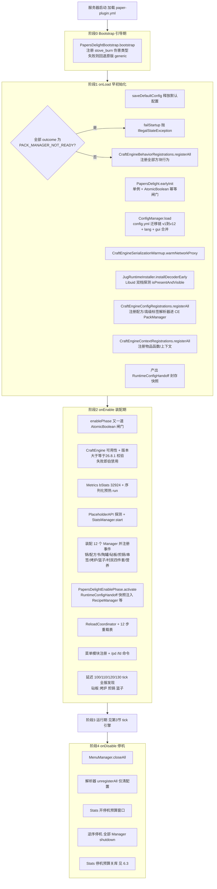

### 1.2 启动时序图（Bootstrap → onLoad → onEnable 细粒度）

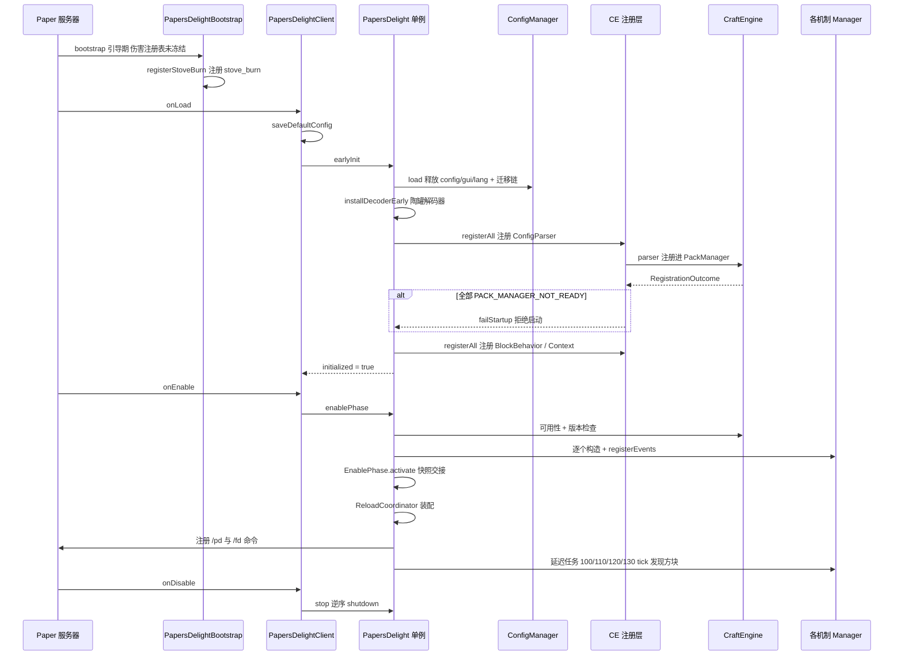

### 1.3 启动期关键决策树

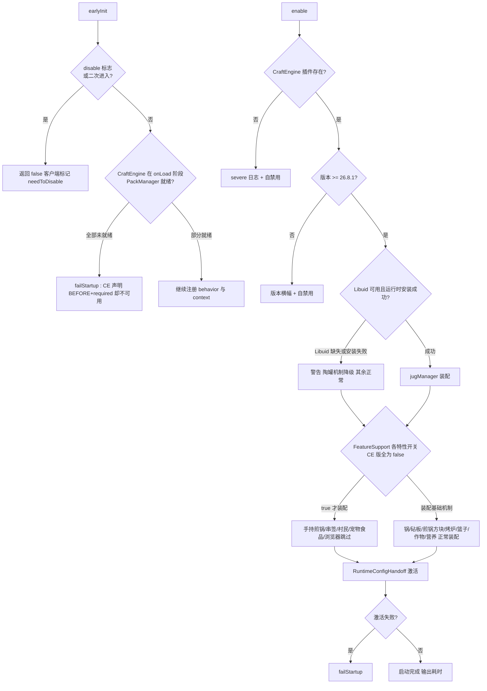

失败语义：`failStartup`（`PapersDelight.java:587-595`）无条件抛 `IllegalStateException`，由 `PapersDelightClient.onLoad/onEnable` 捕获后果走自禁用路径——启动失败绝不留下半初始化的插件实例。

---

## 2. 配置与内容数据的装载链路

### 2.1 配置装载与四級回退读取

`ConfigManager.load`（`config/ConfigManager.java`）执行：

1. 释放默认 `config.yml` → 读取 `config-version` → **迁移链 v1→v12**（11 步，含 `heat_sources` 提升为顶级、`block` 改列表、`default_tools` 改 CE 标签、`enchantment.rules` 外迁等破坏性迁移，自动落盘）；
2. 释放并读取 `lang/<lang>.yml`；
3. 释放 `gui.yml` 并**平铺合并进 config 命名空间**；
4. 解析 `heat_sources` 为 `HeatSourceDef`（material / CE block / CE block-tag 三形态，`HeatSourceService.matchesBlockDef` 消费）。

读取总线 `getOr(key, default)`：**lang → config → 内置 defaultConfig → 字面默认值** 四级回退，全项目 41 个文件消费——它同时是 i18n 与配置两条通道的合一入口。`getOr`/`getList` 前置 ConcurrentHashMap 读穿缓存（MISSING 哨兵负缓存，上限 8192 条；`load()`/`restoreState()` 末尾整体失效；getList 返回不可变快照），热路径命中免去逐级 Yaml 树查找与字符串分配。

### 2.2 CraftEngine 内容（配方）装载链

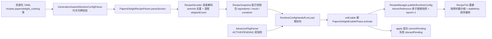

变量级数据变换（以一条烹饪配方为例）：

| 步骤 | 变量 | 类型 | 值/状态变化 | 位置 |
|------|------|------|------------|------|
| YAML 节点 | `node` | `ConfigSection` | `{type: papersdelight_cooking, ingredients: [...], result: ...}` | 资源包 |
| 解码 | `recipe` | `CookingRecipe` | `id / ingredients: List<IngredientDef> / result / container` | `registration/config/RecipeDecoder.java` |
| 原料定义 | `def` | `IngredientDef` | `matcher: ItemMatcher`（material/ce_item/tag 三态） | `recipe/IngredientDef.java` |
| 快照 | `snapshot` | `RecipeSnapshot` | 不可变列表 + 统计（parsed/skipped） | `registration/config/RecipeSnapshot.java` |
| 发布 | `state` | `RuntimeState` | `{recipes: List, trie: RecipeTrie, epoch: n}` 原子替换 | `recipe/RecipeManager.java` |
| 查询 | `match` | `CookingRecipe` | Trie DFS 命中；miss 时线性 `matches()` 贪心兜底 | `recipe/RecipeTrie.java:64-80` |

**代次令牌（ParserGeneration）**：parser 一经注册进 CE PackManager 就**永不注销**（`unregisterAll` 仅清配置）。重载时 `ParserGeneration`（公平读写锁）换代，旧代回调在 `GenerationAwareIdSectionConfigParser` 的每个入口静默失效——避免了「注销 CE 内部注册表项」这一危险操作。

### 2.3 高级标签两阶段提交

`AdvancedTagParser` 维护 `ACTIVE`/`PENDING` 双快照 + 单调递增 `epoch`。`RuntimeConfigHandoff.apply` 全部成功才 `commitPending`（PENDING→ACTIVE），任一步失败 `discardPending`。两条重载链分离：

- `/pd reload` → `reapplyAccepted`：**重放已接受的旧快照**（保守）；
- CE 自身 `/ce reload` → `applyLatest`：**拉取新快照尝试提交**（进取）。

---

## 3. 运行期 tick 引擎

### 3.1 调度拓扑

全部周期任务经 `CCScheduler`（`PapersDelight.java:42`），三类调度域：

| 调度域 | 用途 | 典型用户 |
|--------|------|---------|
| GlobalRegionScheduler | 全服扫描、跨区域协调 | 启动发现任务（100/110/120/130t）、重载恢复任务（5t）、篮子全局心跳（1t，每 tick ≤32 篮） |
| RegionScheduler | 绑定方块坐标的容器 tick | 烹饪锅 `potTick`、煎锅/烤炉/陶罐 tick、砧板漏斗 8t 周期（按区块分组派发） |
| EntityScheduler | 绑定实体的效果/交付 | TimedEffect 效果应用、陶罐手持交付、串签托管退款 |

Folia 约束：任何方块/实体操作必须在所属 region 线程执行；跨域读写一律走「捕获快照 → 调度到目标域 → 校验会话 → 写回」三段链（见 §4）。

### 3.2 容器 tick 批处理模型（TickBatch）

```
container.tick_interval_ticks = N   默认 1 即逐 tick
每次调度回调:
  due = TickBatch.due(lastPassTick, now, N)
      lastPassTick==0        -> 1      首 pass
      elapsed < N            -> 0      本 tick 跳过
      N==1                   -> 1
      else                   -> min(elapsed, N*8)   欠账回放 上限 8 倍防雪崩
  for pass in 1..due: 推进一整个 tick 的烹饪逻辑
```

配套节流（以烹饪锅为典型）：

- 热源判定缓存 **10 pass**（`HEAT_CACHE_TICKS`）——不必每 tick 查方块；
- 漏斗自动化 **每 8 pass** 才执行一次；
- 粒子三级节流：区块计数上限（`particle_throttle`）→ `ParticleVisibility` 观察者视距裁剪 → `ParticleThrottle` 计数器；声音独立节流。

### 3.3 烹饪锅 tick 主循环（最复杂的容器循环）

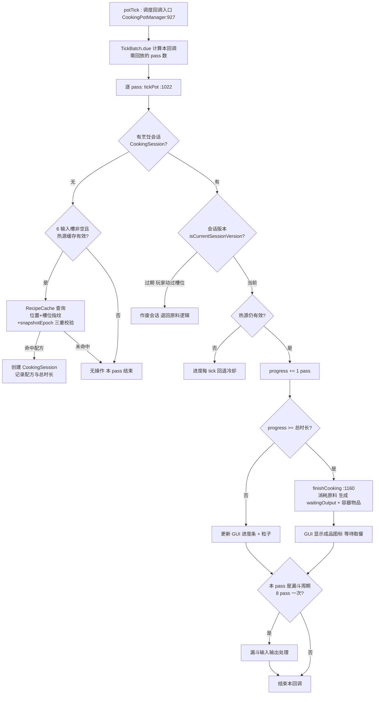

### 3.4 其他机制的 tick 循环摘要

| 机制 | 循环结构 | 冷却/异常行为 | 详情 |
|------|---------|--------------|------|
| 煎锅方块 | 单槽 + 复用原版 CampfireRecipe（`CampfireRecipeUtil` 带缓存） | 熄火时进度每 tick **-2 回退** | [modules/03 §3.3](modules/03-cutting-skillet-skewer-stove.md) |
| 烤炉 | 六槽并行、每槽独立计时 | 同上；遮蔽弹出 | [modules/03 §3.6](modules/03-cutting-skillet-skewer-stove.md) |
| 陶罐 | `tickJug` → 浸泡 `processSoaking` + 漏斗 `processHoppers` | 失效流体保全 PDC | [modules/02 §3.3](modules/02-jug.md) |
| 营养效果 | 2-tick 调度、`internalTick` 与调度严格 `+2` 对齐 | 死亡清除、退服保存 | §6.2 |
| 篮子 | 全局 1t 心跳 → chunkKey 合并 → 区域任务 | 空篮指数退避 1→32t | [modules/04 §3.5](modules/04-farm-villager-misc-effects.md) |
| 村民收割 | NMS WORK 活动内行为（非插件调度） | 补种双缓存 | [modules/04 §3.3](modules/04-farm-villager-misc-effects.md) |
| 手持串签 | 玩家持物扫描周期 | escrow PDC 断线恢复 | [modules/03 §3.5](modules/03-cutting-skillet-skewer-stove.md) |

---

## 4. Folia 并发模型：会话与三段链

项目为 Folia 区域化线程开发出一套统一原语，核心思想是**「跨线程域的数据搬运必须带会话票据」**：

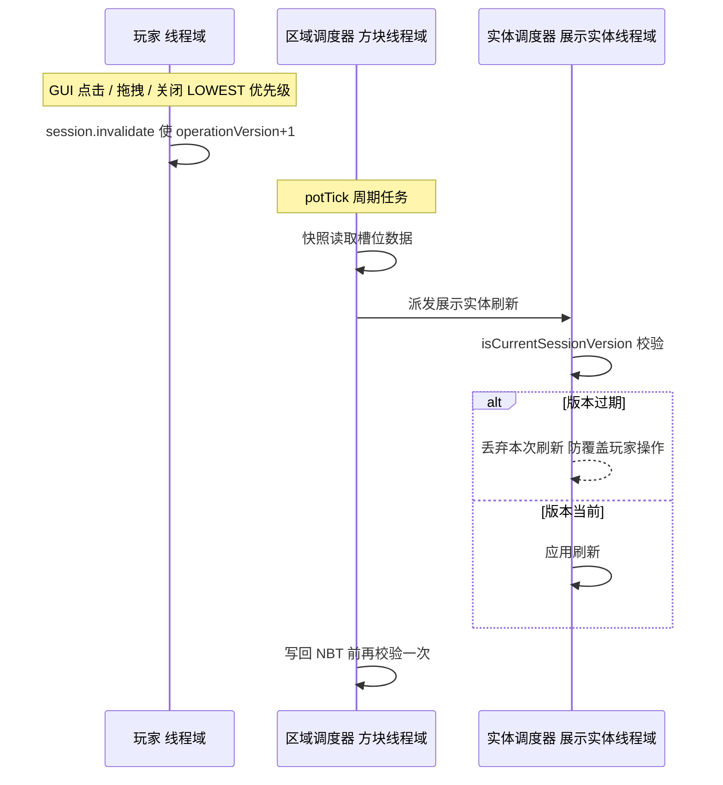

四类并发原语（`common/` 与各 Manager 内嵌）：

| 原语 | 位置 | 解决的问题 |
|------|------|-----------|
| `CookingSession.operationVersion` | `CookingPotManager` | 玩家操作与异步刷新互相覆盖 |
| `JugMenuSessionRegistry.generation` | `jug/` | 秒关秒开菜单时旧 close 回调误伤新会话 |
| `ExplosionSettleFlow` + `ExplosionStaging` | `common/` | 爆炸事件中把方块摘出 blockList 后延迟到 MONITOR 结算；GUI 打开中的容器挂起至会话关闭 |
| `MenuCloseFlow` | `common/` | 关菜单持久化：实体线程读快照 → 区域线程写回，失败挂 `pendingUnloads`，靠 `ChunkLoadEvent` 重试（覆盖「关菜单瞬间区块卸载」窗口） |
| 砧板 `hopperGeneration` 代际计数 | `CuttingBoardManager` | reload 后旧漏斗任务复活 |
| `Bukkit.isOwnedByCurrentRegion` 双实体校验 | 村民拾取扫描 | 区域所有权变更瞬间的竞态 |

---

## 5. 数据流：三条典型端到端路径

### 5.1 玩家用碗取餐（容器 → 物品组装）

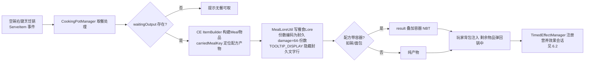

### 5.2 村民收割补种（NMS 大脑 → 插件规则）

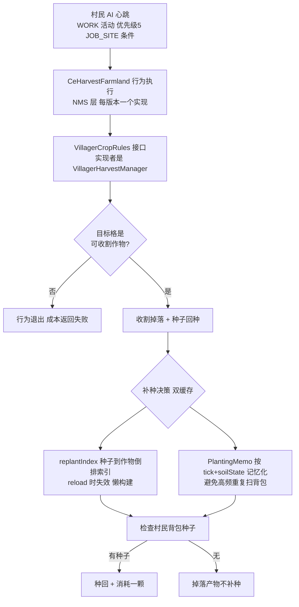

同时 `VillagerBehaviorSurgery` 在村民脑内完成两处手术：反射摘除原版 `TradeWithVillager` 行为（三层 Map + WeightedList 递归删除）→ 注入 CE 版本 `CeTradeWithVillager`（使自定义食物可分享）。1.21.10/11 中交易池 `WANDERING_TRADER_TRADES` 变为不可变 `List<Pair>`，注入只能用 `sun.misc.Unsafe` 换静态字段——这正是根构建 Folia 运行时加 `--sun-misc-unsafe-memory-access=allow` 的原因。

### 5.3 统计数据生命周期（内存缓存 → SQLite → 占位符）

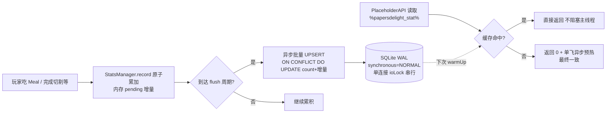

停机预算：关服时总预算默认 5 秒 → 等在途写归零 → flush → 限时关库；拿不到 IO 锁则置 `closeRequested` 交给守护看门狗线程或最后持锁者接管——**绝不卡死关服且连接必关**。

---

## 6. 状态管理与持久化

### 6.1 持久化通道总表

| 数据 | 载体 | 读写点 | 生命周期 |
|------|------|--------|---------|
| 容器物品槽 + 烹饪进度 | CE `BlockEntityController` NBT（`saveCustomData/loadCustomData`） | 各 `*BlockEntityController` | 与方块共存 |
| 「端着走」的锅 | 掉落物 PDC（`carriedMealKey/carriedContainerKey` + 餐食 Lore） | `CookingPotManager.dropStatefulPot` → `onBlockPlace` | 物品存在即存活 |
| 营养/计时效果 | 玩家 PDC `int[3]{剩余,总,等级} + byte[] extra` 双键 | `EffectPdcStore`；退服 LOWEST 存、加入 MONITOR +20t 恢复、死亡清除 | 跨重登 |
| 串签托管 escrow | 代理物品 PDC（会话 ID + 原料字节 + 原始/剩余数量） | `HandheldSkewerEscrow` | 跨掉落/死亡/退服/重启 |
| 手持煎锅托管 | 玩家 PDC 单件 | `SkilletManager` | 会话级 + 完整退款路径 |
| 陶罐流体 | 控制器 NBT；Libuid 判 INVALID 的流体以**原始字节**存 PDC（`writeOpaqueFluid`） | `JugManager/JugBlockEntityController` | Libuid 回归后可恢复 |
| 运行时生成的物品模型 | CE 数据目录 `pd_generated_model` 资源包 + manifest | `ItemModelGenerator`/`JugItemModelGenerator`（manifest 增量清理） | 跨重启 |
| 玩家统计 | SQLite（UPSERT 增量语义） | `StatsDatabase` | 永久 |

### 6.2 计时效果状态机（TimedEffect + Nourishment）

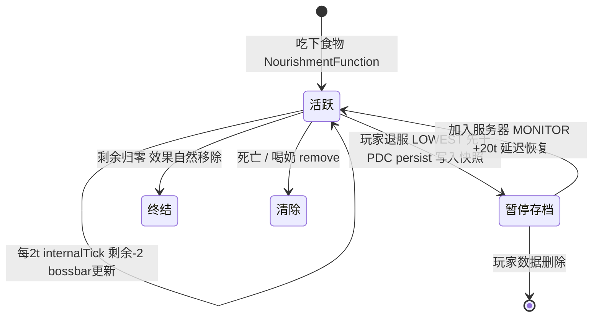

营养的 **always-eat 技巧**：手持食物且饱食度 20 时临时写为 19 使原版逻辑判定「可进食」（`NourishmentHungerMath` 纯函数计算），放手/到期/退出/喝奶各路径均恢复 20；退出恢复先于 PDC persist，防止把 19 存档。

### 6.3 容器关闭/破坏的状态恢复设计

烹饪锅菜单关闭（`closeFromOwner`）→ `CookingPotMenuCloseFlow.captureAndPersist`：实体线程读快照 → 区域线程写回 NBT；失败挂 `pendingUnloads`，靠后续 `ChunkLoadEvent` 重试。爆炸则两阶段：LOWEST 把锅/陶罐摘出爆炸 blockList（防原版炸毁逻辑），MONITOR 按半径逐块结算存活概率；GUI 会话打开中的容器**跳过爆炸**、延迟到会话关闭后补结算（`ExplosionSettleFlow`）。

---

## 7. 热重载系统（/pd reload）

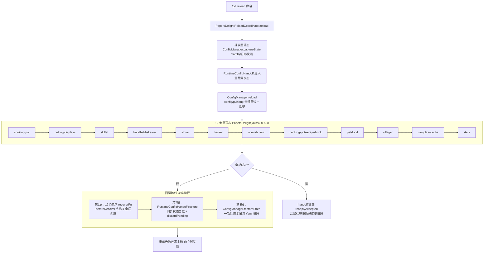

每个 Step 的 `recoverFn` 与 `reloadFn` 可以不同（如 cutting-displays 的 recover 是「延迟 5t 重新加载展示实体」而非重跑 reload）。CE 侧触发的重载（`/ce reload`）走 `applyLatest` 拉新快照，与 `/pd reload` 的 `reapplyAccepted` 重放旧快照形成双链分离。

---

## 8. 错误处理链路

### 8.1 启动失败（fail-fast）

| 失败点 | 判定位置 | 行为 |
|--------|---------|------|
| CE PackManager onLoad 期不可用 | `PapersDelight.java:123-127` | `failStartup` 抛异常 → 插件禁用 |
| CE 插件缺失 | `PapersDelight.java:162-169` | 双条 severe 提示 + 自禁用 |
| CE 版本过低 | `CraftEngineVersionGate` + `PapersDelight.java:601-620` | 72 字符横幅 + 自禁用 |
| parser 注册抛异常 | `PapersDelight.java:114-121` | failStartup 带 cause |
| RuntimeConfigHandoff 缺失/激活失败 | `PapersDelight.java:276-294` | failStartup |

### 8.2 运行时优雅降级

| 场景 | 降级行为 |
|------|---------|
| Libuid 缺失 | 陶罐三阶段（解码器/运行时/菜单）**独立降级**，仅日志警告，其余机制不受影响 |
| 伤害类型注册失败 | Bootstrap 期 catch：回退 `minecraft:generic`；运行期三级回退 自定义键→回退键→generic |
| Trie miss | 线性 `matches()` 贪心兜底（Trie 只是快路径） |
| 统计查询缓存 miss | 返回 0 + 异步预热，永不阻塞调用线程 |
| NMS playSoundByKey 失败 | 回退 Bukkit playSound |
| 玩家非法操作（串签容器搬运） | HIGHEST 优先级守卫取消 + escrow 字节级一致性比对拒绝 |
| GUI 打开中爆炸 | 挂起结算而非直接处理 |
| 重载失败 | 三层回滚（§7） |

### 8.3 数据完整性保卫

- **陶罐倒出配方两端契约**：解码端 `isLosslesslyConstructibleEmptyingFluid`（`JugRecipeDecoderImpl.java:92`）与运行端 `expressionStack`（`JugManager.java:776`）都只接受纯 fluid id / fluid+amount map——保证 EXECUTE 账实不符时能用快照完整回滚。
- **手持交付事务**：`JugDeliveryFlow` 状态机（state 0-3，立即扣、1 tick 后付），覆盖玩家离线/调度退休/区域任务失败三类异常，兜底世界掉落 + 罐体回滚；失败补偿经 `retain` 挂全局队列，由**每 20 tick 的补偿泵**重试。
- **UPSERT 增量语义**：重复 flush 不重复计数。

---

## 9. 运行原理小结（十条核心机制）

1. **两阶段启动 + 快照交接**：onLoad 只做 CE parser 注册（必须早于 CE 解析资源包），onEnable 装配并激活快照——`RuntimeConfigHandoff` 是跨阶段唯一合法通道。
2. **代次令牌替代注销**：parser 常驻 CE，重载靠 `ParserGeneration` 换代使旧回调静默失效。
3. **无锁读侧**：`RecipeManager` 用 AtomicReference 持不可变快照（列表+Trie+epoch），读零锁、写原子替换。
4. **TickBatch 欠账回放**：批处理容器跳 tick 后按 `min(elapsed, interval×8)` 回放，烹饪时长与逐 tick 完全一致。
5. **会话票据贯穿跨线程链**：operationVersion / generation / 代际计数，任何异步写回前必须验票。
6. **爆炸两阶段 + GUI 挂起**：LOWEST 摘除 → MONITOR 结算 → 会话关闭补结算。
7. **PDC 是跨生命周期的状态货币**：端着走的锅、串签 escrow、计时效果、失效流体全部编码进 PDC。
8. **三级粒子/声音节流 + 热源缓存 + 漏斗降频**构成统一的性能预算体系。
9. **伤害/声音/配方/Trie 四处都有显式回退链**——任何增强路径失败都有原版等价行为兜底。
10. **停机预算化**：统计库限时关库 + 看门狗接管，重载三层回滚——关服与重载都不会挂死或半状态。
