# PapersDelight 工作流报告

> 分析时间：2026-10-02 · 配套：[架构报告](01-architecture.md) · [运行原理报告](02-operation-principles.md)
> 本报告覆盖玩家业务工作流（每个机制一张图）、管理命令工作流与开发构建工作流；函数级调用链见各 [modules/](modules/) 文件。

---

## 0. 工作流总目录

| # | 工作流 | 参与者 | 核心类 | 详情 |
|---|--------|--------|--------|------|
| 1 | 烹饪锅烹饪与取餐 | 玩家 / 漏斗 | `CookingPotManager` | [modules/01](modules/01-cookingpot-gui.md) |
| 2 | 砧板切割与自动化 | 玩家 / 漏斗 / 发射器 | `CuttingBoardManager` | [modules/03](modules/03-cutting-skillet-skewer-stove.md) |
| 3 | 煎锅（方块+手持） | 玩家 | `SkilletManager` | [modules/03](modules/03-cutting-skillet-skewer-stove.md) |
| 4 | 手持串签 | 玩家 | `HandheldSkewerManager` | [modules/03](modules/03-cutting-skillet-skewer-stove.md) |
| 5 | 烤炉与高温伤害 | 玩家 / 生物 | `StoveManager` | [modules/03](modules/03-cutting-skillet-skewer-stove.md) |
| 6 | 陶罐流体与浸泡 | 玩家 / 漏斗 / Libuid | `JugManager` | [modules/02](modules/02-jug.md) |
| 7 | 篮子自动收集 | 掉落物 / 红石 | `BasketManager` | [modules/04](modules/04-farm-villager-misc-effects.md) |
| 8 | 作物种植与生长 | 玩家 / 村民 | `mechanic/farm/*` | [modules/04](modules/04-farm-villager-misc-effects.md) |
| 9 | 土壤转化链 | 玩家 / 时间 | `OrganicCompost`/`RichSoil` | [modules/04](modules/04-farm-villager-misc-effects.md) |
| 10 | 村民四大行为 | 村民 AI | `mechanic/villager/*` + NMS 手术 | [modules/04](modules/04-farm-villager-misc-effects.md) |
| 11 | 营养效果 | 玩家 | `NourishmentManager` + `TimedEffectManager` | [modules/04](modules/04-farm-villager-misc-effects.md) · [modules/05](modules/05-recipe-effect-damage-stats.md) |
| 12 | 食物效果函数 | 玩家 | `mechanic/function/*` | [modules/04](modules/04-farm-villager-misc-effects.md) |
| 13 | 管理命令 / 重载 / 构建开发流 | 管理员 / 开发者 | `PapersDelightCommand` / Gradle | §13-15 |

---

## 1. 烹饪锅：从放置到取餐

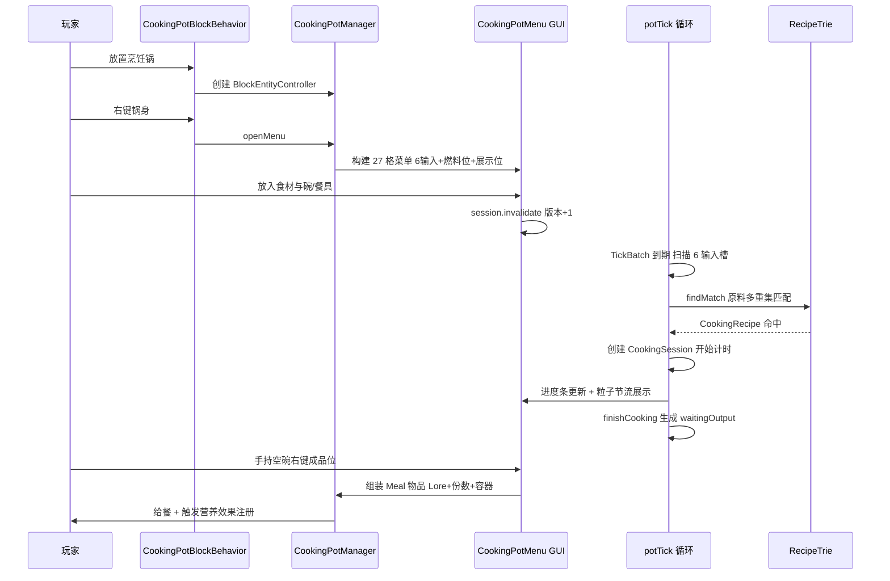

**决策点**：配方匹配三重缓存校验（位置 + 6 槽指纹 + snapshotEpoch）未命中也以 NO_MATCH 哨兵做负缓存；热源失效时进度回退冷却而非清零。

**异常恢复**：破坏锅中途端锅（PDC 迁移）；关菜单瞬间区块卸载（pendingUnloads + ChunkLoad 重试）；爆炸两阶段结算；比较器红石信号（有等待输出时输出 15）。

---

## 2. 砧板：切割与全自动化

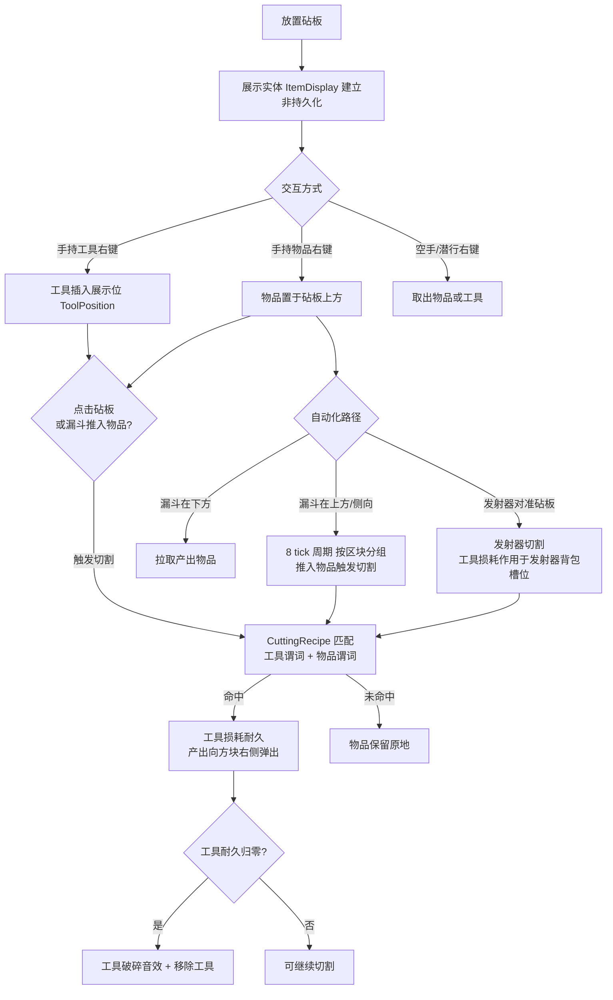

**决策规则**：工具匹配优先级为「CE 物品谓词 → 原版工具类型」；`insertable_tools.yml` 先到先得匹配 + `default` 变换继承。

**异常恢复**：区块卸载移除展示实体、加载重建；`removeDisplayEntity` 附带清扫半径 0.75 内游离 ItemDisplay 自愈；漏斗任务带 `hopperGeneration` 代际计数防 reload 后旧任务复活。

---

## 3. 煎锅：方块形态与手持形态

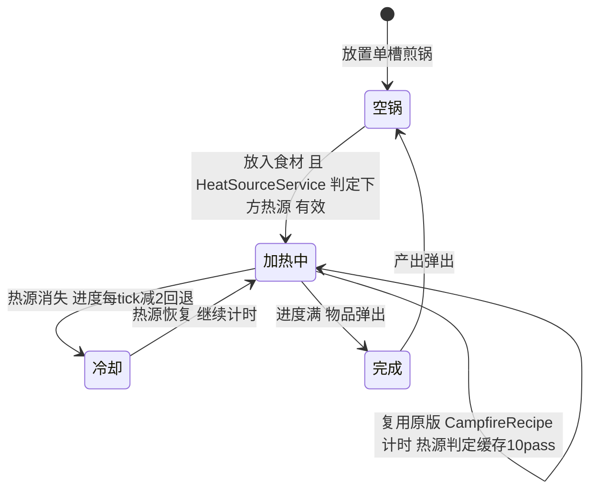

手持形态（高级版特性，CE 版编译关闭）：

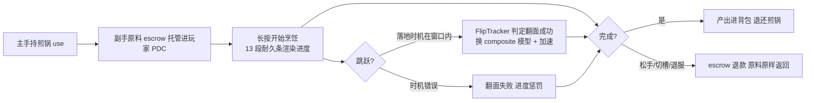

原料图标用运行时生成的 composite item_model（`ItemModelGenerator` 写入 CE 资源包 `pd_generated_model` + manifest 增量清理）。

---

## 4. 手持串签：托管与防作弊纵深

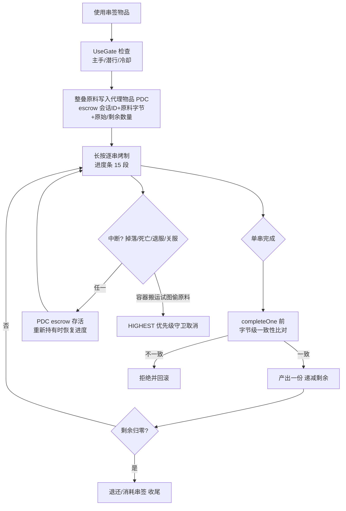

消费裁决由 13 项证据的纯函数 `ConsumeValidator` 完成——「托管进 PDC + 证据裁决 + 字节比对 + 事件守卫」四层构成防作弊纵深。

---

## 5. 烤炉：六槽并行与高温伤害

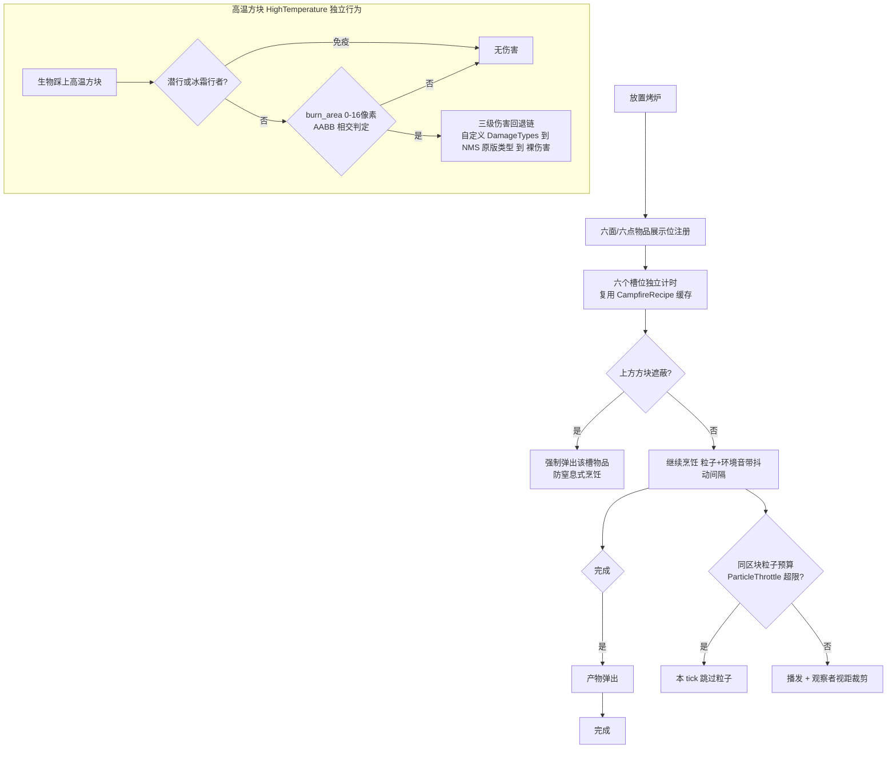

环境音优先 NMS `playSoundByKey`，失败回退 Bukkit `playSound`。

---

## 6. 陶罐：流体四部曲

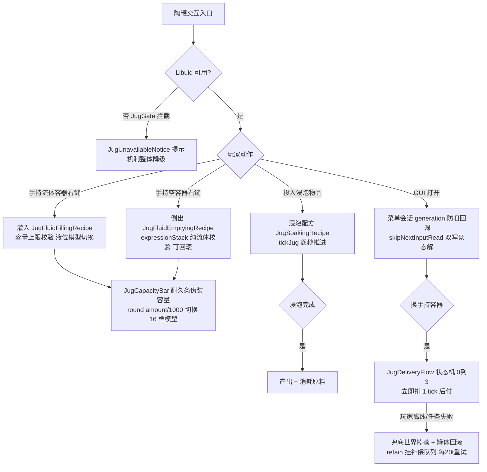

**失效流体保全**：Libuid 判 INVALID 的流体以原始字节存 PDC（`writeOpaqueFluid`），掉落/放置往返不丢，Libuid 回归后可恢复。

---

## 7. 篮子：自动收集

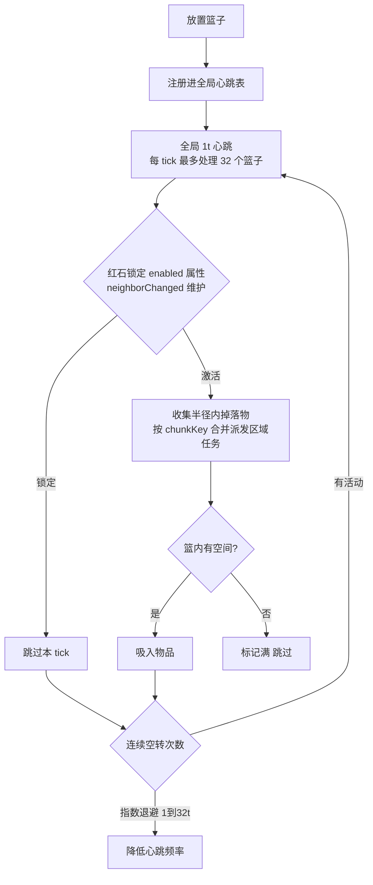

---

## 8. 作物：三套行为同构复用

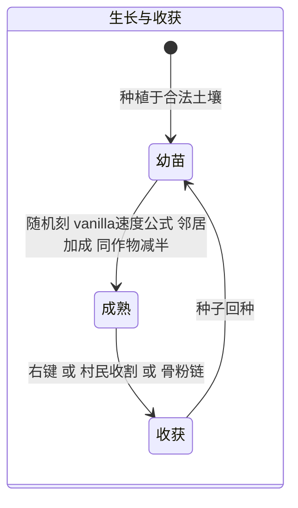

三套行为的差异点：

| 行为类 | 结构特点 | 特有机制 |
|--------|---------|---------|
| `AdvancedCropBlockBehavior` | 单格基线 | 三级土壤匹配 标签→vanilla 状态→CE id |
| `DoubleCropBlockBehavior` | 上/下半双方块 | `syncAges` 上下半同步模式；野生稻 `WildRiceBlockBehavior` 水生变体 |
| `RopedCropBlockBehavior` | 绑绳攀爬 | 破坏/水淹绑绳节后整段柱还原为绳方块 跨 Folia 区域逐格调度 |

配套：`FarmlandBlockBehavior`（耕地行为）、`CropBonemealFix`（潜行骨粉右键以 LOWEST 优先级 DENY 物品使用，防原版链路误吞——三个作物 Factory 在 create 时自动登记方块 id）。

---

## 9. 土壤转化链

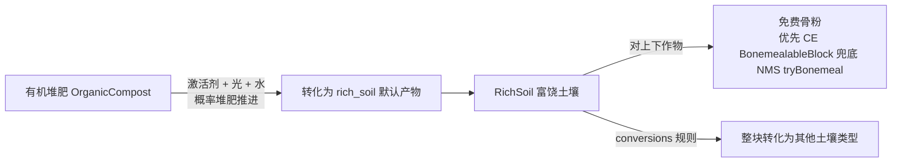

---

## 10. 村民：四大行为管理器

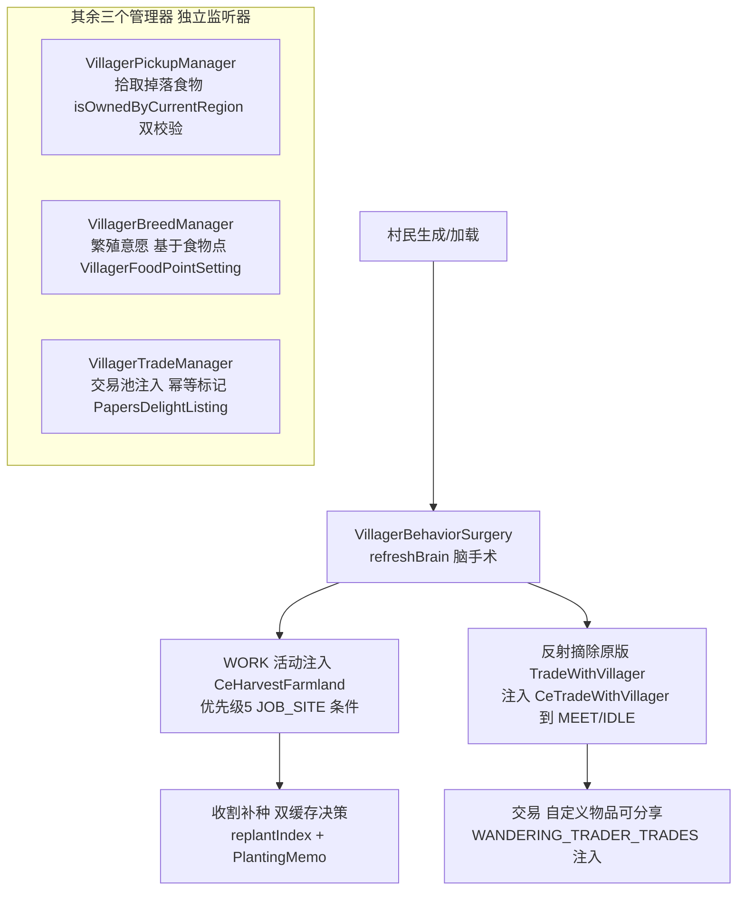

交易池注入的版本断层：1.21.1/1.21.4 直接 put 可变 Map；1.21.10/11 变不可变 `List<Pair>`，须 `sun.misc.Unsafe` 换静态字段；v1_21_11 的 LEGACY 三态探测路径直接复用 v1_21_10 的 Injector。

---

## 11. 营养效果（Nourishment）

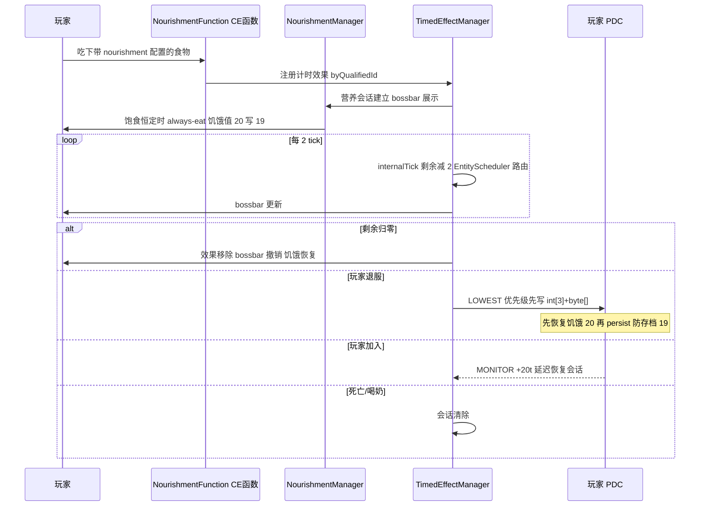

---

## 12. 食物效果函数管线（CE ItemFunction）

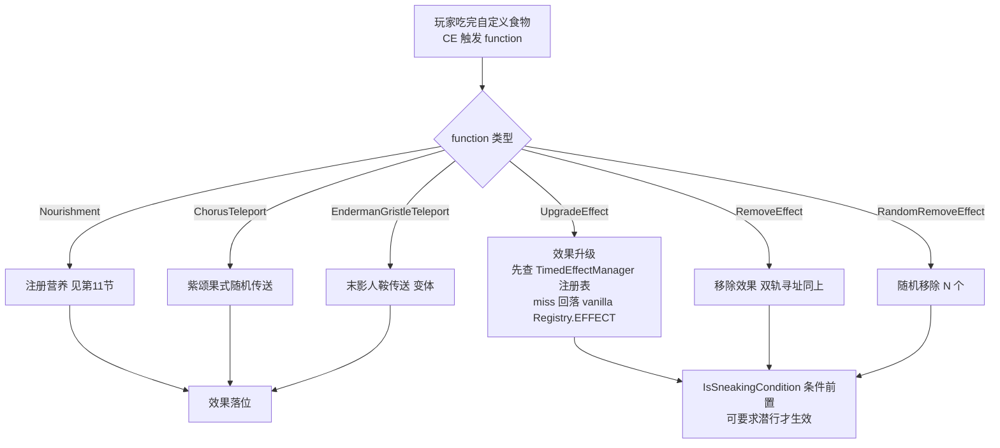

双轨寻址是复用关键：同一函数配置可同时作用于自定义计时效果与原版药水效果。

---

## 13. 管理命令工作流

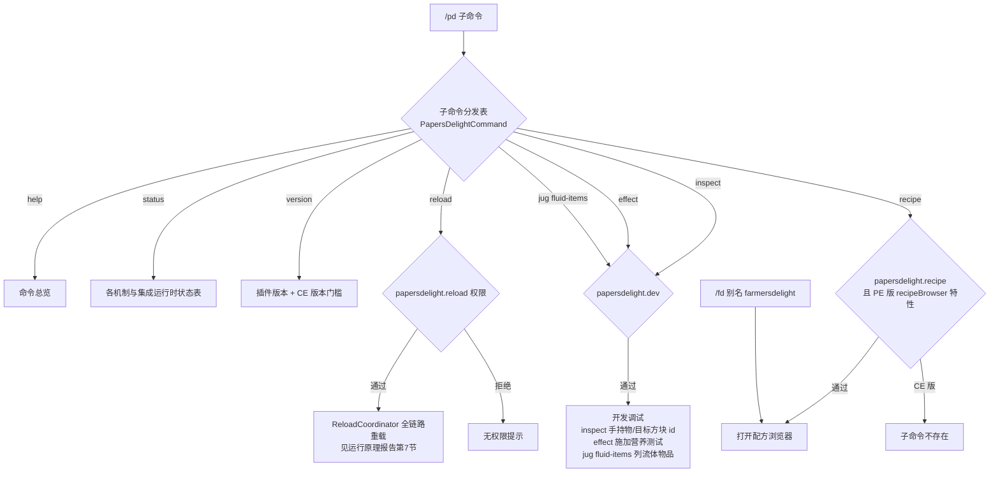

`/pd` 与 `/fd` 经 `CommandMap.register` 动态注册（`PapersDelight.java:331-352, 360-382`），不是 plugin.yml 声明式命令——因此 tab 补全走自定义 `onTabComplete`。

---

## 14. 玩家加入/退出的全局联动

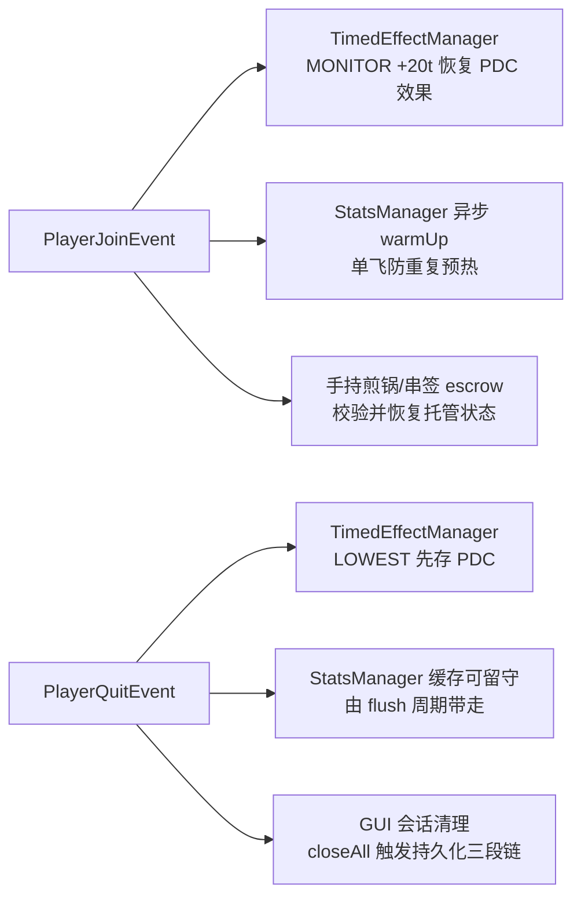

---

## 15. 开发构建工作流

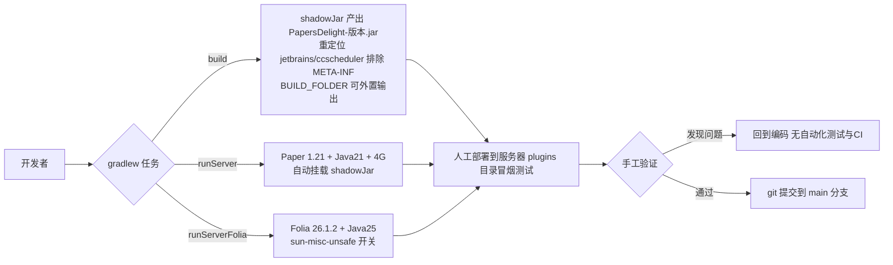

开发流特征（风险面）：

- **无测试源集**：35k 行代码零单元测试；
- **无 CI/CD**：无 workflows 配置，构建完全依赖本地环境（Java 21 + 25 双 toolchain）；
- **验证手段**：`runPaper` 插件的 `runServer`/`runServerFolia` 双运行时本地起服，`/pd status`、`/pd inspect`、`/pd effect`、`/pd jug fluid-items` 是内置的调试探针；
- **多版本联动**：NMS-Bridge 各子项目用 paperweight userdev 锁定各 MC 版本dev-bundle，修改 Bridge 接口需同步 4 个版本实现 + api 模块。

---

## 16. 跨工作流的公共约束

所有业务工作流共享以下不变式（提取自代码显式条件）：

| 不变式 | 实现位置 | 含义 |
|--------|---------|------|
| 容器烹饪总时长与 tick 间隔配置无关 | `common/TickBatch.java:14-19` | 跳 tick 必须欠账回放 上限 8 倍 |
| 异步写回前必验会话票 | `CookingPotManager` operationVersion / `JugMenuSessionRegistry` generation | 玩家操作永远胜过异步任务 |
| escrow 事务要么完整退款要么完整交付 | 串签/煎锅/陶罐交付 | 所有中断路径都通向恢复 |
| 配方查询零锁 | `RecipeManager` AtomicReference | 读路径永不阻塞游戏线程 |
| 统计查询永不阻塞 | `StatsManager` 缓存 miss 返回 0 + 异步预热 | 占位符/命令线程安全 |
| 伤害路径必有原版回退 | `DamageTypes` 三级回退 | 自定义注册失败不影响玩法 |
| 特性门控单一开关 | `support/FeatureSupport.java:5` | CE 版 11 个高级特性编译期关闭 |
