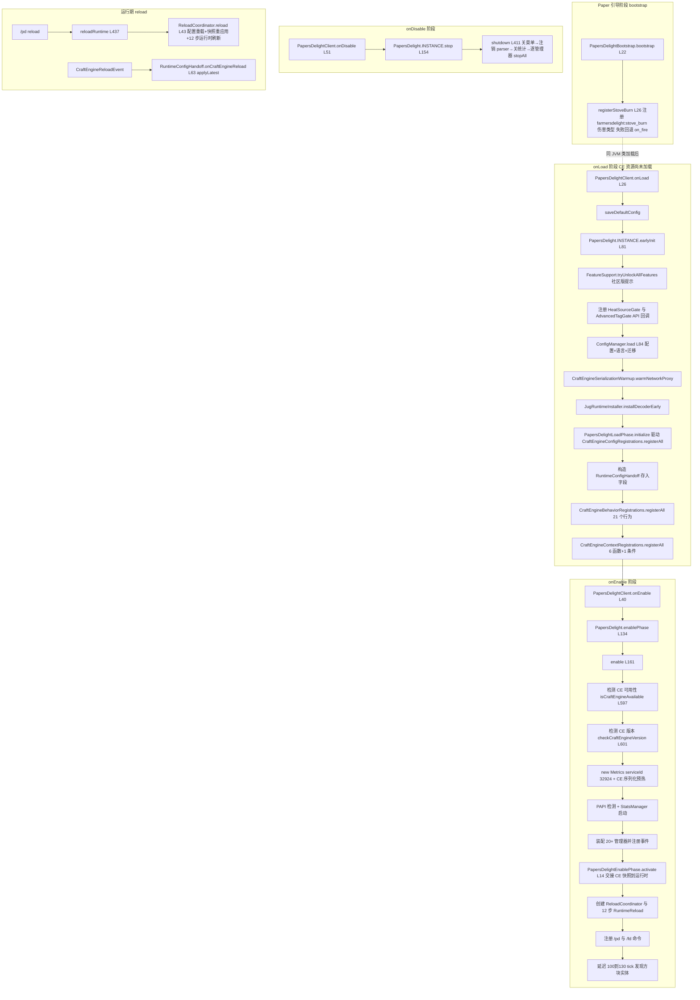
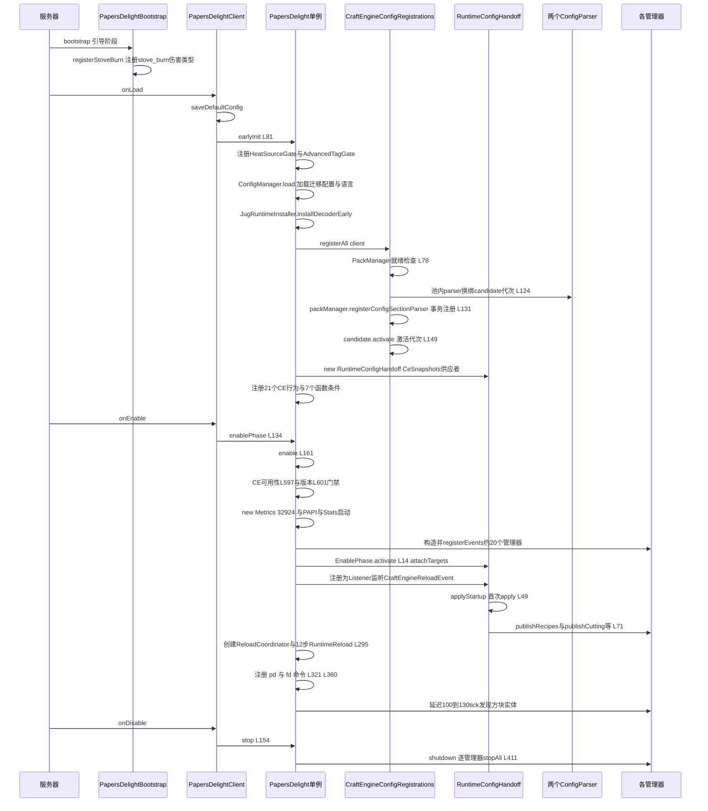
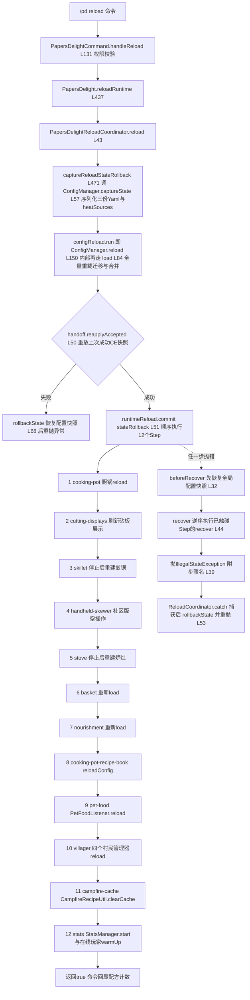
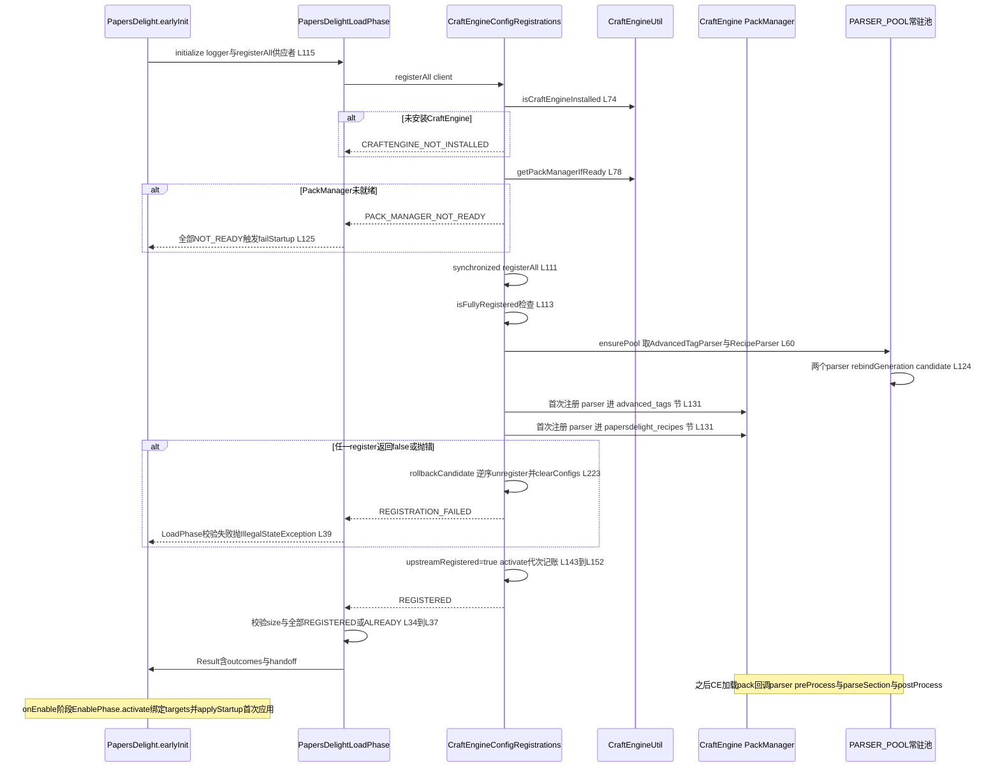

# 生命周期、配置与 CraftEngine 注册模块
> 模块职责：实现插件的 Paper 引导/onLoad/onEnable/onDisable/reload 五阶段生命周期编排，负责 config.yml 与 lang 配置的加载、迁移与热重载回滚，向 CraftEngine 注册配置解析器（配方与高级标签）、方块/物品行为与上下文函数，把 CE 解析产物通过 RuntimeConfigHandoff 交接给运行时管理器，并提供 /pd 命令与 bStats 指标。
> 文件数：36（Java 34 个 + 资源 2 个） / 总行数：6374（Java 5853 行 + config.yml 520 行 + papersdelight-build.properties 1 行）

## 1. 模块概览

### 1.1 上游依赖（import 了本项目哪些包）与被谁装配使用

本模块作为全项目的"装配根"，几乎依赖所有业务包：

| 依赖方向 | 涉及包 | 说明 |
| --- | --- | --- |
| 本模块 import 的项目包 | `recipe`、`recipe` 内 CustomRecipeManager/AdvancedTagService/CampfireRecipeUtil | RecipeManager 装配与重载、API Gate 回调、营火缓存清理 |
|  | `cookingpot`、`gui`、`gui.module.cookingpot`、`gui.recipebrowser` | 厨锅管理器、MenuManager 菜单服务、配方书、配方浏览器（社区版禁用） |
|  | `mechanic.cutting` / `skillet` / `skewer` / `stove` / `basket` / `nourishment` / `petfood` / `farm` / `villager` / `misc` / `function` | 全部机制管理器与 CE 行为/函数注册目标 |
|  | `jug` | JugRuntimeInstaller / JugSupport / JugItemModelGenerator 及配方类型 |
|  | `heat.HeatSourceService`、`api.heat.HeatSourceGate`、`api.item.AdvancedTagGate`、`api.menu`、`api.damage` | API 网关注册 |
|  | `util.TextUtil` / `ItemMetaUtil` / `CraftEngineSerializationWarmup` | 文本、物品元数据、CE 序列化预热 |
|  | `stats` | StatsManager / StatsLifecycleListener / PapersDelightExpansion |
|  | `damage.DamageTypes` | bootstrap 阶段注册 stove_burn 伤害类型 |
| 外部依赖 | `net.momirealms.craftengine.*`（CraftEngine core/bukkit API）、`cn.chengzhmeow.ccscheduler.CCScheduler`、Bukkit/Paper API、bStats 内嵌类 | CraftEngine 解析器与方块/物品 API、Folia 兼容调度器 |

被谁装配使用：
- `PapersDelightClient`（JavaPlugin 入口）驱动 `PapersDelight.INSTANCE` 单例的 earlyInit/enablePhase/stop。
- `ConfigManager` 的静态访问器（getOr/getInt/getDouble/getStringList/readSoundConfig 等）被全项目 41 个 Java 文件消费，是事实上的"配置总线"。
- `StoveConfig`→`mechanic.stove.StoveManager`、`SkilletConfig`→`mechanic.skillet.SkilletManager`、`CookingPotConfig`→`cookingpot.CookingPotManager`、`ParticleThrottleConfig` 被前两者间接消费。
- `AdvancedTagParser/AdvancedTagSnapshot` 静态快照被 `recipe.AdvancedTagService`、`recipe.DefaultItemMatcherResolver` 消费（通过 AdvancedTagGate 注册的回调）。
- `CraftEngineUtil` 被命令、机制、配方各模块广泛调用（CE 方块/物品判定与操作工具箱）。

### 1.2 生命周期总览

## 2. 类与函数目录

### 2.1 PapersDelight（`src/main/java/dev/tako/papersdelight/PapersDelight.java`，621 行）
**职责**：主装配类（饿汉单例），编排 onLoad 阶段的 CE 注册与 onEnable 阶段的全部管理器装配，并承载运行期 reload 的 12 步流程。
**继承/接口**：无（final class，私有构造 + `public static final INSTANCE`）。
**关键字段**：
| 字段 | 类型 | 说明 |
| --- | --- | --- |
| SCHEDULER | static final CCScheduler | Folia 兼容调度器实例 |
| INSTANCE | static final PapersDelight | 全局单例 |
| plugin | PapersDelightClient | 插件入口引用 |
| disable | volatile boolean | stop 后永久拒绝再启动 |
| recipeManager | RecipeManager | 厨锅配方管理器 |
| customRecipeManager | CustomRecipeManager | 自定义配方管理器 |
| cookingPotManager | CookingPotManager | 厨锅管理器 |
| jugManager | Object | 延迟加载的 Jug 运行时实例（隔离类加载） |
| cookingPotRecipeBook | CookingPotRecipeBook | 厨锅配方书 |
| cuttingBoardManager | CuttingBoardManager | 砧板管理器 |
| skilletManager | SkilletManager | 煎锅管理器 |
| handheldSkewerManager | HandheldSkewerManager | 手持烤串管理器（社区版不创建） |
| handheldSkilletIngredientModels | ItemModelGenerator | 手持煎锅食材模型生成器 |
| jugItemModels | JugItemModelGenerator | 液罐物品模型生成器 |
| stoveManager | StoveManager | 炉灶管理器 |
| nourishmentManager | NourishmentManager | 滋养效果管理器 |
| basketManager | BasketManager | 篮子管理器 |
| villagerTradeManager / villagerHarvestManager / villagerBreedManager / villagerPickupManager | 各 villager 包类 | 村民四机制管理器（社区版不创建） |
| runtimeConfigHandoff | RuntimeConfigHandoff | onLoad 产物，onEnable 交接 |
| reloadCoordinator | PapersDelightReloadCoordinator | reload 协调器 |
| runtimeReload | PapersDelightRuntimeReload | 12 步运行时重载 |
| earlyInitialized / enabled | AtomicBoolean | 阶段幂等闸门 |
| startTimeMillis | long | 启动耗时起点 |
| papiAvailable | static boolean | PlaceholderAPI 存在标志 |

**方法清单表**：
| 方法 | 签名 | 行号 | 行为说明 |
| --- | --- | --- | --- |
| 构造器 | `private PapersDelight()` | L78 | 私有构造支撑单例 |
| earlyInit | `boolean earlyInit()` | L81 | 见下方展开 |
| enablePhase | `boolean enablePhase()` | L134 | 幂等闸门后调 enable，成功则 console 输出启动耗时 |
| stop | `void stop()` | L154 | 置 disable=true→注销两个 API Gate→shutdown |
| enable | `private boolean enable(PapersDelightClient client)` | L161 | 见下方展开 |
| shutdown | `private void shutdown()` | L411 | 关闭全部菜单→CraftEngineConfigRegistrations.unregisterAll→StatsManager.beginShutdownWindow→各管理器 stopAll/stop→Jug 卸载→StatsManager.stop |
| getNourishmentManager | `NourishmentManager getNourishmentManager()` | L433 | 暴露滋养管理器给命令等 |
| reloadRuntime | `private void reloadRuntime(CommandSender sender)` | L437 | reloadCoordinator 非空走协调器，否则降级 reloadWithoutCoordinator |
| reloadWithoutCoordinator | `private boolean reloadWithoutCoordinator()` | L445 | 无 handoff 时的兜底：捕获回滚→ConfigManager.reload→runtimeReload.commit，失败回滚再抛 |
| captureReloadStateRollback | `private Runnable captureReloadStateRollback()` | L471 | ConfigManager.captureState 生成一次性回滚闭包（AtomicBoolean 防重复执行） |
| createRuntimeReload | `private PapersDelightRuntimeReload createRuntimeReload()` | L480 | 构建 12 个 reload Step，见 3.2 |
| reloadCookingPotRuntime | `private void reloadCookingPotRuntime()` | L510 | cookingPotManager.reload |
| reloadVillagerRuntime | `private void reloadVillagerRuntime()` | L514 | 四个村民管理器逐个 reload |
| reloadCuttingDisplays | `private void reloadCuttingDisplays()` | L521 | 刷新砧板展示实体并立即调 restoreCuttingDisplays |
| restoreCuttingDisplays | `private void restoreCuttingDisplays()` | L527 | 延迟 5 tick 重新加载所有已加载区块的展示实体 |
| reloadSkilletRuntime | `private void reloadSkilletRuntime()` | L534 | skilletManager.stopAll + recover |
| recoverSkilletRuntime | `private void recoverSkilletRuntime()` | L540 | skilletManager.load + 延迟 5 tick discoverAllSkillets |
| reloadHandheldSkewerRuntime | `private void reloadHandheldSkewerRuntime()` | L546 | stopAll + load（社区版空操作） |
| reloadStoveRuntime | `private void reloadStoveRuntime()` | L552 | stoveManager.stopAll + recover |
| recoverStoveRuntime | `private void recoverStoveRuntime()` | L558 | stoveManager.load + 延迟 5 tick discoverAllStoves |
| reloadBasketRuntime | `private void reloadBasketRuntime()` | L564 | basketManager.load |
| reloadNourishmentRuntime | `private void reloadNourishmentRuntime()` | L568 | nourishmentManager.load |
| reloadCookingPotRecipeBook | `private void reloadCookingPotRecipeBook()` | L572 | cookingPotRecipeBook.reloadConfig |
| reloadStatsRuntime | `private void reloadStatsRuntime()` | L576 | StatsManager.start + 对在线玩家异步 warmUp |
| failStartup | `private void failStartup(String message, Throwable cause)` | L587 | severe 日志后抛 IllegalStateException 终止启动 |
| isCraftEngineAvailable | `private boolean isCraftEngineAvailable()` | L597 | CraftEngineUtil.isCraftEngineEnabled |
| checkCraftEngineVersion | `private boolean checkCraftEngineVersion()` | L601 | 读取 CE 插件版本，CraftEngineVersionGate.isBelowRequired 为真则打印横幅并返回 false |

**earlyInit 展开步骤**（onLoad 阶段，CE 方块/物品尚未构建）：
1. L82-87 幂等：disable 直接 false；`earlyInitialized.compareAndSet` 防重入，成功才继续。
2. L88-92 记录启动时间；从 `PapersDelightClient.getInstance()` 取入口，空则 false。
3. L94-99 `FeatureSupport.tryUnlockAllFeatures()` 为真（社区版恒 false）时打印社区版/防盗版警告。
4. L101-102 注册两个 API Gate：`HeatSourceGate.register(HeatSourceService::isActiveHeatSource)`、`AdvancedTagGate.register(AdvancedTagService::isAdvancedTagged, resolveItems)`——把 heat 包与 recipe 包的静态实现接到 api 包。
5. L104-105 `ConfigManager.load(client)` 完整加载配置（见 2.10）；`CraftEngineSerializationWarmup.warmNetworkProxy` 预热 CE 网络序列化。
6. L107-111 `JugRuntimeInstaller.installDecoderEarly` 早期安装 Jug 解码器，失败仅告警。
7. L113-127 `PapersDelightLoadPhase.initialize(logger, () -> CraftEngineConfigRegistrations.registerAll(client))`：注册两个 CE 配置 parser 并取得 handoff；任何 RuntimeException 走 failStartup；若全部 outcome 为 PACK_MANAGER_NOT_READY 同样 failStartup（因为 paper-plugin.yml 声明 CE required 且 load BEFORE，此状态属于装配错误）。
8. L128-130 `CraftEngineBehaviorRegistrations.registerAll` 与 `CraftEngineContextRegistrations.registerAll`。
9. L131 返回 true，`PapersDelightClient.initialized = true`。

**enable 展开步骤**（onEnable 阶段）：
1. L162-174 CE 可用性与版本双重门禁，失败 disablePlugin 并返回 false。
2. L176-177 `new Metrics(client, 32924)`；CE 序列化预热 run。
3. L179-191 PAPI 检测→TextUtil.setPapiAvailability→StatsManager.start→StatsLifecycleListener.register→注册 PAPI Expansion。
4. L193-196 旧版 `compatibility_legacy_delights` 残留检测告警。
5. L198-249 装配 RecipeManager、CustomRecipeManager、MenuManager（注册为 Bukkit 服务 MenuService）、CookingPotManager、CookingPotRecipeBook、Jug 运行时、CuttingBoardManager、两个 ItemModelGenerator、SkilletManager、StoveManager、BasketManager、CropBonemealFix、四个村民管理器（FeatureSupport 开关）、NourishmentManager，并逐个 registerEvents。
6. L276-294 `runtimeConfigHandoff` 为空则 failStartup；`PapersDelightEnablePhase.activate` 把 handoff 绑定到 `PapersDelightRuntimeTargets`、注册 handoff 为 Bukkit Listener（监听 CraftEngineReloadEvent）、`applyStartup` 应用初始配置；失败 failStartup。
7. L295-300 创建 `runtimeReload`（12 步）与 `PapersDelightReloadCoordinator`（configReload=`ConfigManager.reload`、stateRollbackCapture=`captureReloadStateRollback`）。
8. L302-319 PetFoodListener.reload+注册（社区版跳过）；注册 cooking_pot 菜单模块；Jug 菜单注册。
9. L321-352 匿名继承 `org.bukkit.command.Command` 构造 `papersdelight` 命令（别名 pd）桥接到 `PapersDelightCommand`，`getCommandMap().register`。
10. L354-385 社区版跳过 recipeBrowser（/fd 与 setRecipeBrowser 不执行）。
11. L387-405 延迟任务：100 tick 砧板展示实体、110 tick 炉灶发现、120 tick 煎锅发现、130 tick 篮子发现。
12. L407-408 日志"已启动"并返回 true。

### 2.2 PapersDelightLoadPhase（`src/main/java/dev/tako/papersdelight/PapersDelightLoadPhase.java`，51 行）
**职责**：onLoad 阶段的事务包装器：执行 parser 注册、校验注册结果是"全成功"事务，并产出 RuntimeConfigHandoff。
**继承/接口**：final class，包私有。
**关键字段**：无实例字段（仅静态方法）；`Result` record 含 `parserRegistrations`（Map&lt;String, RegistrationOutcome&gt;）与 `handoff`。
**方法清单表**：
| 方法 | 签名 | 行号 | 行为说明 |
| --- | --- | --- | --- |
| 构造器 | `private PapersDelightLoadPhase()` | L15 | 工具类禁实例化 |
| initialize | `static Result initialize(Logger, Supplier<Map<String, RegistrationOutcome>>)` | L18 | 双参重载，快照供应者固定为 `RuntimeConfigHandoff.CeSnapshots::current` |
| initialize | `static Result initialize(Logger, Supplier<Map<String, RegistrationOutcome>>, Supplier<CeSnapshots>)` | L25 | 执行注册供应者→不可变化 outcomes→校验 size 与 sectionIds 一致且全部为 REGISTERED 或 ALREADY_REGISTERED，否则抛 IllegalStateException→new RuntimeConfigHandoff→返回 Result |
| Result（record） | `record Result(Map<String, RegistrationOutcome> parserRegistrations, RuntimeConfigHandoff handoff)` | L46 | 装载阶段结果载体 |

### 2.3 PapersDelightEnablePhase（`src/main/java/dev/tako/papersdelight/PapersDelightEnablePhase.java`，24 行）
**职责**：onEnable 阶段的交接激活器：把 targets 绑到 handoff、把 handoff 注册为 Listener、触发首次配置应用。
**继承/接口**：final class，包私有。
**关键字段**：无。
**方法清单表**：
| 方法 | 签名 | 行号 | 行为说明 |
| --- | --- | --- | --- |
| 构造器 | `private PapersDelightEnablePhase()` | L11 | 工具类禁实例化 |
| activate | `static boolean activate(RuntimeConfigHandoff, RuntimeTargets, Consumer<Listener>)` | L14 | 非空校验→attachTargets→listenerRegistration.accept(handoff)（handoff 自身是 Listener）→applyStartup |

### 2.4 PapersDelightRuntimeReload（`src/main/java/dev/tako/papersdelight/PapersDelightRuntimeReload.java`，65 行）
**职责**：有序 reload 步骤集：按序执行 commit，任一步失败先跑 beforeRecover（全局配置回滚）再逆序恢复已触碰步骤。
**继承/接口**：final class，包私有。
**关键字段**：`logger`（Logger）、`steps`（List&lt;Step&gt;，构造时 List.copyOf 防篡改）。
**方法清单表**：
| 方法 | 签名 | 行号 | 行为说明 |
| --- | --- | --- | --- |
| 构造器 | `PapersDelightRuntimeReload(Logger, List<Step>)` | L14 | 非空校验并拷贝步骤列表 |
| commit | `void commit()` | L19 | 空 beforeRecover 的便捷重载 |
| commit | `void commit(Runnable beforeRecover)` | L23 | 顺序执行每个 Step.commit 并记入 touched；失败→先跑 beforeRecover（失败仅记 SEVERE 并 addSuppressed）→recover(touched)→抛 IllegalStateException 附步骤名 |
| recover | `private void recover(List<Step>, Throwable)` | L44 | 逆序执行各 Step.recover，单个恢复失败记 SEVERE 并 addSuppressed，不中断其余恢复 |
| Step（record） | `record Step(String name, Runnable commit, Runnable recover)` | L58 | 紧凑构造器 L59-63 对三个成员做 requireNonNull |

### 2.5 PapersDelightReloadCoordinator（`src/main/java/dev/tako/papersdelight/PapersDelightReloadCoordinator.java`，76 行）
**职责**：reload 总协调器：一次性回滚闭包→重载 config→重应用 CE 快照→12 步运行时刷新，任何失败恢复配置快照后重抛。
**继承/接口**：final class，包私有。
**关键字段**：`configReload`（Runnable）、`handoff`（RuntimeConfigHandoff）、`runtimeReload`（可空）、`stateRollbackCapture`（Supplier&lt;Runnable&gt;）。
**方法清单表**：
| 方法 | 签名 | 行号 | 行为说明 |
| --- | --- | --- | --- |
| 构造器（2 参） | `PapersDelightReloadCoordinator(Runnable, RuntimeConfigHandoff)` | L16 | 委托 4 参构造，runtimeReload=null、空回滚 |
| 构造器（3 参） | `PapersDelightReloadCoordinator(Runnable, RuntimeConfigHandoff, PapersDelightRuntimeReload)` | L23 | 委托 4 参构造，空回滚 |
| 构造器（4 参） | `PapersDelightReloadCoordinator(Runnable, RuntimeConfigHandoff, PapersDelightRuntimeReload, Supplier<Runnable>)` | L31 | 全参赋值，全部 requireNonNull |
| reload | `boolean reload()` | L43 | 见 3.2 详解 |
| runOnce | `private static Runnable runOnce(Runnable)` | L61 | 用 AtomicBoolean 包装回滚使其至多执行一次 |
| rollbackState | `private static void rollbackState(Runnable, Throwable)` | L68 | 执行回滚，回滚自身异常 addSuppressed 到原失败 |

### 2.6 PapersDelightRuntimeTargets（`src/main/java/dev/tako/papersdelight/PapersDelightRuntimeTargets.java`，43 行）
**职责**：RuntimeConfigHandoff.RuntimeTargets 的项目内实现：把 CE 快照发布到 RecipeManager/CuttingBoardManager/CustomRecipeManager，并提供同步快照捕获/恢复。
**继承/接口**：final class，实现 `RuntimeConfigHandoff.RuntimeTargets`，包私有。
**关键字段**：`recipeManager`、`cuttingBoardManager`、`customRecipeManager`（构造时 requireNonNull）。
**方法清单表**：
| 方法 | 签名 | 行号 | 行为说明 |
| --- | --- | --- | --- |
| 构造器 | `PapersDelightRuntimeTargets(JavaPlugin, RecipeManager, CuttingBoardManager, CustomRecipeManager)` | L21 | 绑定三个目标管理器（plugin 参数仅用于构造签名，未存字段） |
| captureSynchronousState | `RuntimeConfigHandoff.SynchronousState captureSynchronousState()` | L26 | 三管理器 captureRuntimeState 聚合为私有 State record |
| restoreSynchronousState | `void restoreSynchronousState(SynchronousState)` | L29 | 逆序恢复 custom→cutting→recipes |
| publishRecipes | `void publishRecipes(List<CookingRecipe>)` | L35 | recipeManager.publishRuntimeConfig |
| publishJugRecipes | `void publishJugRecipes(List<JugFluidFillingRecipe>, List<JugFluidEmptyingRecipe>, List<JugSoakingRecipe>)` | L36 | recipeManager.publishJugRecipes |
| cuttingSettingsCandidate | `CuttingBoardManager.RuntimeSettings cuttingSettingsCandidate()` | L37 | cuttingBoardManager.reloadRuntimeSettings |
| publishCutting | `void publishCutting(List<CuttingRecipe>, CuttingBoardManager.RuntimeSettings)` | L38 | cuttingBoardManager.publishRuntimeConfig |
| publishCustomRecipes | `void publishCustomRecipes(List<CustomRecipe.Single>, List<CustomRecipe.Decomposition>)` | L39 | FeatureSupport.customRecipes 为真才 customRecipeManager.publishRecipes（社区版跳过） |
| State（record） | `private record State(RecipeManager.RuntimeSnapshot, CuttingBoardManager.RuntimeSnapshot, CustomRecipeManager.RuntimeSnapshot) implements SynchronousState` | L42 | 三个快照的载体 |

### 2.7 PapersDelightClient（`src/main/java/dev/tako/papersdelight/client/PapersDelightClient.java`，62 行）
**职责**：JavaPlugin 入口（Paper plugin.yml 主类），仅做生命周期转发与自我禁用控制。
**继承/接口**：`extends JavaPlugin`，public final。
**关键字段**：`instance`（static，构造器与 onLoad 双保险赋值）、`initialized`（包私有 boolean，onLoad 成功标志）、`needToDisable`（包私有 boolean，earlyInit 失败标志）。
**方法清单表**：
| 方法 | 签名 | 行号 | 行为说明 |
| --- | --- | --- | --- |
| 构造器 | `public PapersDelightClient()` | L17 | instance=this |
| getInstance | `static PapersDelightClient getInstance()` | L21 | 返回静态实例（onDisable 后为 null） |
| onLoad | `@Override public void onLoad()` | L26 | instance 双保险→saveDefaultConfig→earlyInit 失败则 needToDisable=true 并 severe 日志；成功 initialized=true |
| onEnable | `@Override public void onEnable()` | L40 | needToDisable/未初始化/enablePhase 失败任一为真则 disablePlugin(this) |
| onDisable | `@Override public void onDisable()` | L51 | initialized 才调 stop→instance=null→HandlerList.unregisterAll(this) |
| console | `public void console(String info)` | L59 | 控制台发送 & 颜色码翻译消息 |

### 2.8 PapersDelightBootstrap（`src/main/java/dev/tako/papersdelight/client/PapersDelightBootstrap.java`，51 行）
**职责**：Paper PluginBootstrap：在更早于 onLoad 的引导阶段向服务器注册 stove_burn 自定义伤害类型。
**继承/接口**：`implements PluginBootstrap`（io.papermc.paper.plugin.bootstrap）。
**关键字段**：`LOGGER`（static final，名称 "PapersDelight"）。
**方法清单表**：
| 方法 | 签名 | 行号 | 行为说明 |
| --- | --- | --- | --- |
| bootstrap | `@Override public void bootstrap(BootstrapContext)` | L22 | 调 registerStoveBurn |
| registerStoveBurn | `private static void registerStoveBurn(BootstrapContext)` | L26 | 组装 tag 集合→DamageTypes.register 注册 DamageTypeDefinition（scaling=WHEN_CAUSED_BY_LIVING_NON_PLAYER、effect=BURNING）；任何 Throwable 仅 WARNING 回退 on_fire |

### 2.9 StoveBurnDamageTypes（`src/main/java/dev/tako/papersdelight/client/StoveBurnDamageTypes.java`，24 行）
**职责**：炉灶灼烧伤害类型的纯常量 holder。
**继承/接口**：final class，私有构造抛 UnsupportedOperationException。
**关键字段**：
| 字段 | 类型 | 说明 |
| --- | --- | --- |
| STOVE_BURN_KEY | static final String | farmersdelight:stove_burn |
| STOVE_BURN_MESSAGE_ID | static final String | farmersdelight.stove |
| STOVE_BURN_EXHAUSTION | static final float | 0.1 |
| STOVE_BURN_FALLBACK_KEY | static final String | minecraft:on_fire |
| STOVE_BURN_TAG_KEYS | static final List&lt;String&gt; | is_fire / no_knockback / burn_from_stepping / panic_environmental_causes |

**方法清单表**：
| 方法 | 签名 | 行号 | 行为说明 |
| --- | --- | --- | --- |
| 构造器 | `private StoveBurnDamageTypes()` | L21 | 抛异常禁止实例化 |

### 2.10 ConfigManager（`src/main/java/dev/tako/papersdelight/config/ConfigManager.java`，745 行）
**职责**：静态配置总线：管理 config.yml/lang/gui.yml 三份 YamlConfiguration 的加载、版本迁移、默认键合并、语言回退，提供全项目的取值/音效/图标 API 与热重载状态快照。
**继承/接口**：final class，私有构造。
**关键字段**：
| 字段 | 类型 | 说明 |
| --- | --- | --- |
| config | static YamlConfiguration | 用户 config.yml + gui.yml 平铺 |
| lang | static YamlConfiguration | 当前语言文件 |
| defaultConfig | static YamlConfiguration | JAR 内置 config.yml（getOr 第三级回退） |
| heatSources | static volatile List&lt;HeatSourceDef&gt; | 解析后的热源定义 |
| MERGE_EXCLUDES | static final Set&lt;String&gt; | 合并默认键时排除 cutting_board.msg 与 skillet.msg |
| BUILTIN_LANGS | static final List&lt;String&gt; | zh_cn、en_us |
| CURRENT_CONFIG_VERSION | static final int | 12 |

**方法清单表**：
| 方法 | 签名 | 行号 | 行为说明 |
| --- | --- | --- | --- |
| 构造器 | `private ConfigManager()` | L44 | 禁实例化 |
| State（record 紧凑构造器） | `record State(String configYaml, String langYaml, String defaultConfigYaml, List<HeatSourceDef> heatSources)` | L46（紧凑构造器 L52） | 重载快照载体；heatSources 拷贝防篡改 |
| captureState | `static synchronized State captureState()` | L57 | 把三份 Yaml 序列化为字符串 + heatSources 引用 |
| restoreState | `static synchronized void restoreState(State)` | L61 | 反序列化恢复三份 Yaml 与 heatSources |
| serialize | `private static String serialize(YamlConfiguration)` | L69 | null 安全的 saveToString |
| deserialize | `private static YamlConfiguration deserialize(String)` | L73 | loadFromString，失败抛 IllegalArgumentException |
| load | `static synchronized void load(Plugin)` | L84 | 见下方展开 |
| reload | `static synchronized void reload(Plugin)` | L150 | load + 重载日志 |
| normalizeUnversionedConfig | `private static void normalizeUnversionedConfig(Plugin, YamlConfiguration)` | L155 | 无版本号的旧配置保守归一化：cooking_pot.heat_sources 迁到顶级 heat_sources（顶级已存在则保留双份并警告）；提示旧 gui.yml/default_tools 格式风险 |
| deepCopyYamlValue | `private static Object deepCopyYamlValue(Object)` | L177 | 递归深拷贝 Map/List 标量 |
| migrateConfig | `private static void migrateConfig(Plugin, File, YamlConfiguration)` | L195 | 版本迁移链 v1→…→v12，见下方要点 |
| releaseBuiltinLangFilesIfAvailable | `private static void releaseBuiltinLangFilesIfAvailable(Plugin, File)` | L364 | 遍历 JAR 的 lang/*.yml 条目，缺失的目标文件从 JAR 拷贝释放 |
| resolveLangFile | `private static File resolveLangFile(Plugin, File, String)` | L401 | 目标语言缺失时按 en_us→zh_cn 回退，全缺则返回空文件路径并警告 |
| mergeFromDefault | `private static void mergeFromDefault(Plugin, String, File, Set<String>)` | L422 | 从 JAR 默认文件向用户文件补缺失键，有变化或文件不存在时落盘 |
| copyMissing | `private static boolean copyMissing(YamlConfiguration, ConfigurationSection, String, Set<String>)` | L447 | 递归补键：节不存在则 createSection；标量键 contains 检查后 set |
| get | `static String get(String key)` | L475 | lang 直取（可能 null） |
| getOr | `static String getOr(String key, String defaultVal)` | L479 | lang→config→defaultConfig→默认值 四级回退；空串视为 null |
| getList | `static List<String> getList(String key)` | L496 | lang 列表，null 转空表 |
| describeError | `static String describeError(Throwable)` | L502 | 异常消息为空时回退类名 |
| getMaterial | `static Material getMaterial(String key, Material)` | L511 | config 取材质名 valueOf，失败回退默认 |
| getInt | `static int getInt(String, int)` | L521 | config.getInt |
| getIntegerList | `static List<Integer> getIntegerList(String)` | L525 | config.getIntegerList |
| getConfigString | `static String getConfigString(String, String)` | L529 | config.getString |
| getConfigBoolean | `static boolean getConfigBoolean(String, boolean)` | L533 | config.getBoolean |
| getBoolean | `static boolean getBoolean(String, boolean)` | L537 | 同 getConfigBoolean（历史别名） |
| hasStaleLegacyDelightsOptIn | `static boolean hasStaleLegacyDelightsOptIn()` | L541 | 检测 compatibility_legacy_delights=true 残留 |
| getDouble | `static double getDouble(String, double)` | L545 | config.getDouble |
| getStringList | `static List<String> getStringList(String)` | L549 | config 列表，null 转空表 |
| getStringOrStringList | `static List<String> getStringOrStringList(String)` | L554 | 标量或列表统一成列表 |
| getMapList | `static List<Map<?, ?>> getMapList(String)` | L563 | config.getMapList，null 转空表 |
| buildGuiItem | `static ItemStack buildGuiItem(String configPath, String langPath, String defaultName, List<String> defaultLore)` | L568 | 图标物品 + lang 名称/lore 组装 |
| buildIconFromConfig | `static ItemStack buildIconFromConfig(String configPath)` | L585 | 优先字符串图标，否则 material+custom_model_data，兜底 BARRIER |
| parseIconString | `static ItemStack parseIconString(String value)` | L603 | ce: 前缀走 CraftEngineItems.byId 构建失败回退 BARRIER；否则 Material.matchMaterial |
| HeatSourceDef（record） | `record HeatSourceDef(Material material, Map<String,String> states, String ceBlock, String ceBlockTag, boolean conductor, boolean tray, boolean heatSource)` | L621 | 热源条目定义 |
| getHeatSources | `static List<HeatSourceDef> getHeatSources()` | L626 | 返回 volatile 解析结果 |
| parseHeatSources | `private static List<HeatSourceDef> parseHeatSources()` | L631 | 解析顶级 heat_sources 列表：material 值Of、states 小写化、ce_block/ce_block_tag、conductor/tray/heat_source 布尔（默认 false/false/true）；空列表警告 |
| SoundConfig（record + 2 重载构造器 + rollPitch） | `record SoundConfig(String sound, float volume, float pitchMin, float pitchMax)` | L669（重载构造器 L671/L675，rollPitch L679） | 音效配置；rollPitch 在 min/max 间随机 |
| readSoundConfig（4 参） | `static SoundConfig readSoundConfig(String path, String, float, float)` | L686 | 委托 5 参版本（min=max） |
| readSoundConfig（5 参） | `static SoundConfig readSoundConfig(String path, String defaultSound, float defaultVolume, float defaultPitchMin, float defaultPitchMax)` | L691 | 读 path.sound/volume/pitch_min（回退 pitch）/pitch_max |
| readSoundOrSimple | `static SoundConfig readSoundOrSimple(ConfigurationSection, String)` | L701 | 字符串简写或 section 完整格式；不匹配返回 null |
| readConfigSoundOrSimple | `static SoundConfig readConfigSoundOrSimple(String)` | L717 | 以 config 为根的 readSoundOrSimple |
| getConfig | `static YamlConfiguration getConfig()` | L721 | 暴露原始 config |
| playSound（SoundConfig） | `static void playSound(World, double, double, double, SoundConfig)` | L725 | null 安全按 rollPitch 播放 |
| playSound（显式参数） | `static void playSound(World, double, double, double, String, float, float)` | L731 | 指定参数播放 |
| deleteFilesInDir | `private static void deleteFilesInDir(File)` | L737 | 删除目录下全部文件 |

**load 展开步骤**（调用链 file:line）：
1. L85-96 建 dataFolder；JAR 内 config.yml 读入 defaultConfig。
2. L98-116 用户 config.yml 不存在→saveResource；存在但无 config-version→normalizeUnversionedConfig 后写 v12；存在且带版本→migrateConfig。
3. L117 mergeFromDefault 补缺省键（排除 MERGE_EXCLUDES）；L118 加载最终 config。
4. L120-131 读 lang 名→建 lang 目录→zh_cn/en_us 两份内置语言合并默认键→releaseBuiltinLangFilesIfAvailable→resolveLangFile 回退→加载 lang。
5. L133-143 gui.yml 释放+合并，随后把所有非 section 键平铺 set 进 config（GUI 键并入主配置命名空间）。
6. L145 parseHeatSources。
7. L147 打印"已加载配置，语言: X"。

**migrateConfig 迁移链要点**：v1→v2 砧板 stack_xz_offset 0.06→0.075；v2→v3 删并重释放 gui.yml；v3→v4 仅升版本；v4→v5 写入 particle_throttle 六参数、重生成 gui.yml/recipes/tags.yml；v5→v6 三个 block 字段改列表、重生成 gui.yml；v6→v7 default_tools 改 CE 标签、删 insertable_tools/resource_directory/旧 recipes/cutting_recipes/tags.yml、重释放 insertable_tools.yml 与 gui.yml；v7→v8 移除 enchantment.rules（迁 enchantment.yml）；v8→v9 重生成 gui.yml；v9→v10 heat_sources 提升顶级；v11→v12 删除并重建内置语言文件；末尾统一钳到 CURRENT_CONFIG_VERSION 并在有变更时保存。

### 2.11 StoveConfig（`src/main/java/dev/tako/papersdelight/config/StoveConfig.java`，94 行）
**职责**：炉灶（stove.* 与 particle_throttle.*）配置的不可变值对象，由 StoveManager 消费。
**继承/接口**：final class，私有构造 + 静态工厂。
**关键字段**：`displayScale`、`displayPitch`、`displayBaseY`、`itemSmokeChance`（0-1 钳制）、`itemSmokeCount`、`soundPlaceFood`（SoundConfig）、`particleIntervalTicks`（≥1）、`particleViewDistance`（≥0）、`particleThrottle`、`ambientSoundThrottle`（均 ParticleThrottleConfig）、`ambientSoundViewDistance`、`ambientSound`（AmbientSound record）。
**方法清单表**：
| 方法 | 签名 | 行号 | 行为说明 |
| --- | --- | --- | --- |
| 构造器 | `private StoveConfig(float, float, double, double, int, SoundConfig, long, double, ParticleThrottleConfig, ParticleThrottleConfig, double, AmbientSound)` | L17 | 全字段赋值 |
| load | `static StoveConfig load(AmbientSound ambientSound)` | L44 | 从 ConfigManager 读 stove.display/particles/sounds 与 particle_throttle 节，边界钳制后构造 |
| withAmbientSound | `StoveConfig withAmbientSound(AmbientSound)` | L67 | 复制并替换环境音字段的 wither |
| AmbientSound（record） | `record AmbientSound(String soundKey, float intervalMin, float intervalMax, float volumeMin, float volumeMax, float pitchMin, float pitchMax)` | L77 | 环境音参数；`static AmbientSound defaults()` L85 给出 crackle 默认值 |

### 2.12 SkilletConfig（`src/main/java/dev/tako/papersdelight/config/SkilletConfig.java`，89 行）
**职责**：煎锅（skillet.*）配置的不可变值对象，由 SkilletManager 消费。
**继承/接口**：final class，私有构造 + 静态工厂。
**关键字段**：`displayScale`、`displayPitch`、`displayTranslateY`、`stackYOffset`、`stackXzOffset`、`soundAddFood`、`soundAddFoodCold`、`soundSizzle`、`fireAspectXzSpread`、`fireAspectVelocityYBase/YExtra/Xz`、`fireAspectOriginX/Y/Z`、`particleIntervalTicks`、`particleViewDistance`、`soundThrottle`。
**方法清单表**：
| 方法 | 签名 | 行号 | 行为说明 |
| --- | --- | --- | --- |
| 构造器 | `private SkilletConfig(float displayScale, float displayPitch, double displayTranslateY, double stackYOffset, double stackXzOffset, SoundConfig soundAddFood, SoundConfig soundAddFoodCold, SoundConfig soundSizzle, double fireAspectXzSpread, double fireAspectVelocityYBase, double fireAspectVelocityYExtra, double fireAspectVelocityXz, double fireAspectOriginX, double fireAspectOriginY, double fireAspectOriginZ, long particleIntervalTicks, double particleViewDistance, ParticleThrottleConfig soundThrottle)` | L23 | 18 参全字段赋值 |
| load | `static SkilletConfig load()` | L62 | 读 skillet.display/sounds/fire_aspect_particle/particles 与共享 ambient_sound 节流配置 |

### 2.13 CookingPotConfig（`src/main/java/dev/tako/papersdelight/config/CookingPotConfig.java`，32 行）
**职责**：厨锅（cooking_pot.particles）配置值对象，由 CookingPotManager 消费。
**继承/接口**：final class，私有构造 + 静态工厂。
**关键字段**：`particleIntervalTicks`、`particleViewDistance`、`particleThrottle`、`soundThrottle`。
**方法清单表**：
| 方法 | 签名 | 行号 | 行为说明 |
| --- | --- | --- | --- |
| 构造器 | `private CookingPotConfig(long, double, ParticleThrottleConfig, ParticleThrottleConfig)` | L9 | 全字段赋值 |
| load | `static CookingPotConfig load()` | L20 | 读 cooking_pot.particles 与 particle_throttle 的 cooking_pot/ambient_sound 键 |

### 2.14 ParticleThrottleConfig（`src/main/java/dev/tako/papersdelight/config/ParticleThrottleConfig.java`，29 行）
**职责**：粒子/音效密度节流参数（threshold + maxRate）的最小值对象。
**继承/接口**：final class，私有构造 + 静态工厂。
**关键字段**：`threshold`（int）、`maxRate`（double）。
**方法清单表**：
| 方法 | 签名 | 行号 | 行为说明 |
| --- | --- | --- | --- |
| 构造器 | `private ParticleThrottleConfig(int, double)` | L7 | 赋值 |
| load（4 参） | `static ParticleThrottleConfig load(String thresholdPath, int defaultThreshold, String maxRatePath, double defaultMaxRate)` | L12 | 委托 5 参版本，最小 maxRate 固定 0.01 |
| load（5 参） | `static ParticleThrottleConfig load(String, int, String, double, double minimumMaxRate)` | L18 | threshold 钳 ≥1，maxRate 钳 [minimumMaxRate, 1.0] |

### 2.15 CraftEngineConfigRegistrations（`src/main/java/dev/tako/papersdelight/registration/CraftEngineConfigRegistrations.java`，275 行）
**职责**：CE 配置解析器（advanced_tags + papersdelight_recipes 两个 section）的注册事务管理：常驻 parser 池、代次（generation）轮换、注册回滚与卸载。
**继承/接口**：final class，私有构造；含嵌套 `enum RegistrationOutcome`、`@FunctionalInterface ParserRegistrar`、`interface ParserLifecycle`。
**关键字段**：
| 字段 | 类型 | 说明 |
| --- | --- | --- |
| SECTION_ADVANCED_TAGS / SECTION_RECIPES | static final String | advanced_tags / papersdelight_recipes |
| SECTION_IDS | static final List&lt;String&gt; | 上述两项顺序表 |
| PARSER_POOL | static final Map&lt;String, GenerationAwareIdSectionConfigParser&gt; | 常驻 parser 对象池（跨 reload 复用，不重复注册进 CE） |
| REGISTERED_PARSERS | static final Map&lt;String, ConfigParser&gt; | 当前已激活的 parser 映射 |
| lifecycle | static ParserLifecycle | 当前上游注册器 |
| activeGeneration | static ParserGeneration | 当前激活代次 |
| upstreamRegistered | static boolean | parser 是否已进入 CE 注册表（进入后只换代不重复注册） |

**RegistrationOutcome 枚举**（L37-43）：CRAFTENGINE_NOT_INSTALLED、PACK_MANAGER_NOT_READY、REGISTERED、REGISTRATION_FAILED、ALREADY_REGISTERED。
**方法清单表**：
| 方法 | 签名 | 行号 | 行为说明 |
| --- | --- | --- | --- |
| 构造器 | `private CraftEngineConfigRegistrations()` | L34 | 禁实例化 |
| sectionIds | `static List<String> sectionIds()` | L56 | 返回 SECTION_IDS |
| ensurePool | `private static Map<String, GenerationAwareIdSectionConfigParser> ensurePool(Plugin, ParserGeneration)` | L60 | 池空时创建 AdvancedTagParser 与 PapersDelightRecipeParser 并放入池 |
| residentParser | `static synchronized ConfigParser residentParser(String sectionId)` | L69 | 取池内常驻 parser |
| registerAll（Plugin） | `static Map<String, RegistrationOutcome> registerAll(Plugin)` | L73 | 未装 CE→CRAFTENGINE_NOT_INSTALLED；PackManager 未就绪→PACK_MANAGER_NOT_READY；否则以 packManager 的 register/unregisterConfigSectionParser 构造 ParserLifecycle 调核心重载 |
| registerAll（ParserRegistrar） | `static Map<String, RegistrationOutcome> registerAll(Plugin, ParserRegistrar)` | L97 | 适配为不可注销的 ParserLifecycle（测试用） |
| registerAll（ParserLifecycle 核心） | `static synchronized Map<String, RegistrationOutcome> registerAll(Plugin, ParserLifecycle)` | L111 | 见 3.3 详解：幂等/残留检查→candidate 代次→池化 parser rebind→首注册或换代→activate→记账→REGISTERED |
| registerAdvancedTagParser | `static synchronized RegistrationOutcome registerAdvancedTagParser(Logger, ParserRegistrar)` | L160 | 单独注册 advanced_tags parser 的窄路径：已注册返回 ALREADY_REGISTERED；注册失败 invalidate+clearConfigs→REGISTRATION_FAILED；成功 activate 并记账 |
| unregisterAll | `static synchronized boolean unregisterAll(Logger)` | L197 | 失效代次并重置快照→对每个已注册 parser clearConfigs（parser 对象按设计保留在 CE 注册表）→清本地状态；恒 true |
| resetRegistrationState | `static synchronized void resetRegistrationState()` | L214 | unregisterAll 语义之外再清空 PARSER_POOL 与 upstreamRegistered（测试复位） |
| rollbackCandidate | `private static void rollbackCandidate(Logger, ParserLifecycle, ParserGeneration, Map<String, ? extends ConfigParser>, List<String>)` | L223 | candidate.invalidate→逆序 unregister 已注册 section（失败仅警告）→全部 clearConfigs |
| isFullyRegistered | `private static boolean isFullyRegistered()` | L246 | 激活代次 + 键集合与 SECTION_IDS 完全一致 |
| clearLocalRegistrationState | `private static void clearLocalRegistrationState()` | L252 | 清 REGISTERED_PARSERS/lifecycle/activeGeneration |
| invalidateAndResetSnapshots | `private static void invalidateAndResetSnapshots(ParserGeneration)` | L258 | 排他锁内失效代次并重置两个 parser 的静态快照 |
| resetSnapshots | `private static void resetSnapshots()` | L265 | AdvancedTagParser.resetSnapshot + PapersDelightRecipeParser.resetSnapshot |
| uniformOutcomes | `private static Map<String, RegistrationOutcome> uniformOutcomes(RegistrationOutcome)` | L270 | 为每个 section 生成同一 outcome 的不可变映射 |

### 2.16 CraftEngineBehaviorRegistrations（`src/main/java/dev/tako/papersdelight/registration/CraftEngineBehaviorRegistrations.java`，125 行）
**职责**：声明并注册 21 个 CE 自定义行为（方块/物品/设置）到 CraftEngine 行为注册表。
**继承/接口**：final class，私有构造；含 `record Entry(String id, Runnable registration)`。
**关键字段**：21 个 `ID_*` 常量（L36-57，papersdelight: 命名空间的 advanced_crop、roped_crop、organic_compost、rich_soil、farmland、wild_rice、double_crop、high_temperature、rope_block、rope、cutting_board、skillet、skillet_item、skewer_item、stove、basket、comparator_signal、cooking_pot、jug、jug_item、villager_food_point）与聚合 `IDS`（L59-81）。
**方法清单表**：
| 方法 | 签名 | 行号 | 行为说明 |
| --- | --- | --- | --- |
| 构造器 | `private CraftEngineBehaviorRegistrations()` | L32 | 禁实例化 |
| ids | `static List<String> ids()` | L83 | 返回 ID 列表 |
| entries | `static List<Entry> entries()` | L87 | 按 IDS 顺序构造 Entry 列表，registration 为各行为类的静态 register 方法引用 |
| registerAll | `static void registerAll(Logger)` | L113 | 逐条执行 entry.registration().run；成功 info、失败 SEVERE 记日志但不中断 |

### 2.17 CraftEngineContextRegistrations（`src/main/java/dev/tako/papersdelight/registration/CraftEngineContextRegistrations.java`，130 行）
**职责**：注册 6 个 CE CommonFunctions 函数与 1 个 CommonConditions 条件（懒加载 EntriesHolder 持有）。
**继承/接口**：final class，私有构造；含 `enum Kind {FUNCTION, CONDITION}` 与 `record Entry(String id, Kind kind, Runnable registration)`。
**关键字段**：7 个 `ID_*` 常量（remove_random_effect、remove_effect、is_sneaking、chorus_teleport、ends_delight:enderman_gristle、nourishment_effect、upgrade_effect）；`FUNCTION_IDS`、`CONDITION_IDS`、`ORDERED_IDS` 三个列表；`EntriesHolder.ENTRIES`（静态内部类懒初始化）。
**方法清单表**：
| 方法 | 签名 | 行号 | 行为说明 |
| --- | --- | --- | --- |
| 构造器 | `private CraftEngineContextRegistrations()` | L20 | 禁实例化 |
| functionIds | `static List<String> functionIds()` | L60 | 返回 FUNCTION_IDS |
| conditionIds | `static List<String> conditionIds()` | L64 | 返回 CONDITION_IDS |
| orderedIds | `static List<String> orderedIds()` | L68 | 返回 ORDERED_IDS |
| entries | `static List<Entry> entries()` | L72 | 返回 EntriesHolder.ENTRIES |
| createEntries | `private static List<Entry> createEntries()` | L80 | 逐条以 CommonFunctions/CommonConditions.register + 各函数类的 factory 组装 Entry |
| registerAll | `static void registerAll(Logger)` | L120 | 顺序执行全部注册并按 FUNCTION/CONDITION 模板打 info 日志（无 try-catch，失败直接上抛） |

### 2.18 RuntimeConfigHandoff（`src/main/java/dev/tako/papersdelight/registration/RuntimeConfigHandoff.java`，134 行）
**职责**：CE 解析产物（配方快照 + 高级标签快照）到 Java 运行时的交接器：apply/applyLatest/reapplyAccepted 三种应用路径，含同步状态回滚与高级标签 pending 提交/丢弃，同时作为 Listener 监听 CraftEngineReloadEvent。
**继承/接口**：`public final class RuntimeConfigHandoff implements Listener`。
**关键字段**：`logger`、`snapshotSupplier`（Supplier&lt;CeSnapshots&gt;）、`advancedTags`（AdvancedTagPublication）、`targets`（volatile RuntimeTargets）、`accepted`（volatile CeSnapshots，最近一次成功应用的快照）。
**方法清单表**：
| 方法 | 签名 | 行号 | 行为说明 |
| --- | --- | --- | --- |
| 构造器（public 2 参） | `public RuntimeConfigHandoff(Logger, Supplier<CeSnapshots>)` | L32 | targets=null、DefaultAdvancedTags |
| 构造器（包内 3 参） | `RuntimeConfigHandoff(Logger, Supplier<CeSnapshots>, RuntimeTargets)` | L36 | 委托 4 参 |
| 构造器（4 参） | `RuntimeConfigHandoff(Logger, Supplier<CeSnapshots>, RuntimeTargets, AdvancedTagPublication)` | L40 | 全参赋值（测试注入点） |
| attachTargets | `public void attachTargets(RuntimeTargets)` | L48 | 绑定发布目标 |
| applyStartup | `public synchronized boolean applyStartup()` | L49 | accepted 非空则重放 accepted，否则 applyLatest（首次启动） |
| reapplyAccepted | `public synchronized boolean reapplyAccepted()` | L50 | 仅重放 accepted；未应用过返回 false（/pd reload 走此路径） |
| applyLatest | `public synchronized boolean applyLatest()` | L51 | targets 为空 false；取快照→apply(candidate, true)→成功则 accepted=candidate；Throwable 记 SEVERE 返回 false |
| onCraftEngineReload | `@EventHandler public void onCraftEngineReload(CraftEngineReloadEvent)` | L63 | CE 自身 reload 完成后 applyLatest 拉新 |
| apply | `private boolean apply(CeSnapshots, boolean publishTags)` | L65 | merge→captureSynchronousState→publishRecipes/publishJugRecipes/cuttingSettingsCandidate/publishCutting/publishCustomRecipes→publishTags 为真且快照已发布时 commitPending 高级标签；失败则 restoreSynchronousState + discardPending + WARNING |
| merge | `public static RuntimeConfiguration merge(CeSnapshots)` | L88 | 快照七类 map 拷贝为 List 组装 RuntimeConfiguration（未发布时用 empty） |
| SynchronousState | `public interface SynchronousState` | L97 | 同步状态标记接口 |
| EmptyState | `private enum EmptyState implements SynchronousState` | L98 | 默认空实现 INSTANCE |
| RuntimeTargets | `public interface RuntimeTargets` | L99 | 发布目标接口：capture/restore 同步状态、publishRecipes（抽象）、publishJugRecipes/cuttingSettingsCandidate/publishCutting（默认）、publishCustomRecipes（抽象） |
| AdvancedTagPublication | `interface AdvancedTagPublication` | L110 | 高级标签发布端口：captureActive/commitPending/restoreActive/discardPending |
| DefaultAdvancedTags | `private static final class DefaultAdvancedTags implements AdvancedTagPublication` | L116 | 四个方法分别桥接 AdvancedTagParser 静态 API |
| CeSnapshots（record） | `record CeSnapshots(RecipeSnapshot recipes, long recipeEpoch, AdvancedTagSnapshot advancedTags, long advancedTagsEpoch)` | L123 | 紧凑构造器 L124 做 null→empty；`unpublished()` L125；`recipesPublished()` L126（epoch>0）；`advancedTagsPublished()` L127；`current()` L128 聚合两个 parser 的静态快照与发布纪元 |
| RuntimeConfiguration（record） | `record RuntimeConfiguration(List<CookingRecipe>, List<CuttingRecipe>, List<CustomRecipe.Single>, List<CustomRecipe.Decomposition>, List<JugFluidFillingRecipe>, List<JugFluidEmptyingRecipe>, List<JugSoakingRecipe>)` | L131 | 合并后的最终发布载荷 |

### 2.19 PapersDelightParserTypes（`src/main/java/dev/tako/papersdelight/registration/PapersDelightParserTypes.java`，12 行）
**职责**：两个 CE parser 的 type Key 常量 holder。
**继承/接口**：final class，私有构造。
**关键字段**：`ADVANCED_TAG = Key.of("papersdelight:advanced_tag")`（L7）、`RECIPE = Key.of("papersdelight:recipe")`（L8）。
**方法清单表**：
| 方法 | 签名 | 行号 | 行为说明 |
| --- | --- | --- | --- |
| 构造器 | `private PapersDelightParserTypes()` | L10 | 禁实例化 |

### 2.20 PapersDelightLoadingStages（`src/main/java/dev/tako/papersdelight/registration/PapersDelightLoadingStages.java`，12 行）
**职责**：两个 CE LoadingStage 常量 holder（声明 parser 在 CE 加载管线中的阶段与依赖）。
**继承/接口**：final class，私有构造。
**关键字段**：`ADVANCED_TAG = new LoadingStage("papersdelight:advanced_tag")`（L7）、`RECIPE = new LoadingStage("papersdelight:recipe")`（L8）。
**方法清单表**：
| 方法 | 签名 | 行号 | 行为说明 |
| --- | --- | --- | --- |
| 构造器 | `private PapersDelightLoadingStages()` | L10 | 禁实例化 |

### 2.21 PapersDelightRecipeParser（`src/main/java/dev/tako/papersdelight/registration/config/PapersDelightRecipeParser.java`，340 行）
**职责**：CE 配置节 `papersdelight_recipes` 的解析器：把 CE pack 里的配方 YAML 解码为七类配方对象，发布到静态 RecipeSnapshot 供 RuntimeConfigHandoff 消费。
**继承/接口**：`extends GenerationAwareIdSectionConfigParser`（间接实现 CE ConfigParser）。
**关键字段**：
| 字段 | 类型 | 说明 |
| --- | --- | --- |
| SNAPSHOT | static final AtomicReference&lt;RecipeSnapshot&gt; | 最近一次成功发布的配方快照 |
| PUBLICATION_EPOCH | static final AtomicLong | 发布纪元（0 表示从未成功） |
| logger / warningSink | Logger / Consumer&lt;String&gt; | 告警出口 |
| decoder | RecipeDecoder | 解码器（preProcess 创建） |
| pendingCooking / pendingCutting / pendingSingle / pendingDecomposition / pendingFluidFilling / pendingFluidEmptying / pendingSoaking | Map&lt;String, 各配方&gt; | 七类待提交配方 |
| seenIds | Set&lt;String&gt; | 配方 id 去重 |
| skippedCount | int | 跳过的非法配方计数 |

**方法清单表**：
| 方法 | 签名 | 行号 | 行为说明 |
| --- | --- | --- | --- |
| 构造器（Plugin） | `public PapersDelightRecipeParser(Plugin)` | L54 | 取 logger、无告警 sink、ParserGeneration.active |
| 构造器（Plugin+代次） | `public PapersDelightRecipeParser(Plugin, ParserGeneration)` | L58 | 同上指定代次 |
| 构造器（Logger+sink） | `PapersDelightRecipeParser(Logger, Consumer<String>)` | L62 | 指定告警 sink |
| 构造器（3 参） | `PapersDelightRecipeParser(Logger, Consumer<String>, ParserGeneration)` | L66 | 追加代次 |
| 构造器（4 参） | `PapersDelightRecipeParser(Logger, Consumer<String>, ParserGeneration, Runnable beforeCommit)` | L70 | 追加提交前回调（测试） |
| snapshot | `static RecipeSnapshot snapshot()` | L81 | 读静态快照 |
| hasSuccessfulPublication | `static boolean hasSuccessfulPublication()` | L85 | epoch>0 |
| publicationEpoch | `static long publicationEpoch()` | L89 | 读纪元 |
| resetSnapshot | `static void resetSnapshot()` | L93 | 快照置空、纪元归零（卸载时） |
| type | `@Override public Key type()` | L98 | papersdelight:recipe |
| sectionId | `@Override public String[] sectionId()` | L103 | {"papersdelight_recipes"} |
| loadingStage | `@Override public LoadingStage loadingStage()` | L108 | RECIPE 阶段 |
| dependencies | `@Override public List<LoadingStage> dependencies()` | L113 | 依赖 ADVANCED_TAG 阶段（标签先于配方） |
| async | `@Override public boolean async()` | L118 | 恒 false（同步解析） |
| setErrorHandler | `@Override public void setErrorHandler(Consumer<ResourceException>)` | L124 | 包一层：代次失效直接吞错；生效时 skippedCount++ 再委托 |
| preProcess | `@Override public void preProcess()` | L135 | 清 pending→skippedCount=0→代次失效则直接返回→建 decoder 与七个 pending map、seenIds→通知扩展 handler beginParse |
| forEachExtensionHandler | `private void forEachExtensionHandler(String phase, Consumer<RecipeTypeHandler>)` | L152 | 遍历 RecipeTypeRegistry.handlers 执行动作，单 handler 抛错仅警告 |
| parseSection | `@Override protected void parseSection(Pack, Path, Key, ConfigSection)` | L163 | 见下方解析流程 |
| parseExtension | `private void parseExtension(String, String, Path, String, ConfigSection)` | L195 | 未知内建 type 时查 RecipeTypeRegistry；无 handler 记 skipped；handler.parse 返回 false 或抛错记 skipped |
| postProcess | `@Override public void postProcess()` | L215 | commitIfGenerationActive 内：七类 pending 组装 RecipeSnapshot→SNAPSHOT.set→PUBLICATION_EPOCH 自增→统计日志→skipped 警告→扩展 handler publish；最后 clearPending |
| clearConfigs | `@Override public void clearConfigs()` | L250 | super 清存储→clearPending→skippedCount=0→扩展 handler reset |
| clearPending | `private void clearPending()` | L258 | 置空 decoder/pending/seenIds |
| parseCooking | `private void parseCooking(String id, String source, ConfigSection)` | L270 | decoder.decodeCooking，null 则 skippedCount++，否则入 pendingCooking |
| parseCutting | `private void parseCutting(String, String, ConfigSection)` | L279 | 同上入 pendingCutting |
| parseSingle | `private void parseSingle(String, String, ConfigSection)` | L288 | 同上入 pendingSingle |
| parseDecomposition | `private void parseDecomposition(String, String, ConfigSection)` | L297 | 同上入 pendingDecomposition |
| parseFluidFilling | `private void parseFluidFilling(String, String, ConfigSection)` | L306 | 同上入 pendingFluidFilling |
| parseFluidEmptying | `private void parseFluidEmptying(String, String, ConfigSection)` | L315 | 同上入 pendingFluidEmptying |
| parseSoaking | `private void parseSoaking(String, String, ConfigSection)` | L324 | 同上入 pendingSoaking |
| warn | `protected void warn(String)` | L333 | 优先 warningSink，否则 logger.warning |

**parseSection 解析流程**（file:line）：
1. L165 代次已失效（被换代/注销）直接返回——旧代回调不再产生副作用。
2. L168-172 seenIds 判重：重复 id 保留首个出现并警告。
3. L174-179 读取 `type` 字段，缺失/空白记 skipped。
4. L183-192 switch 分发：cooking/cutting/single+info/decomposition/fluid_filling/fluid_emptying/soaking 七个内建分支 + default 走 parseExtension（第三方扩展配方类型经 RecipeTypeRegistry 注册）。
5. 各分支 decode 成功入对应 pending map，失败 null 则 skippedCount++（不中断其余配方）。

### 2.22 RecipeDecoder（`src/main/java/dev/tako/papersdelight/registration/config/RecipeDecoder.java`，287 行）
**职责**：无状态的配方节点解码器：把 ConfigSection 逐字段校验并构造成七类配方对象，错误走 warn 回调返回 null。
**继承/接口**：包私有 class。
**关键字段**：`LEGACY_INGREDIENT_KEYS`（static final Set：material/tag/item/ce_item，旧包裹格式黑名单）、`warnCallback`（Consumer&lt;String&gt;）。
**方法清单表**：
| 方法 | 签名 | 行号 | 行为说明 |
| --- | --- | --- | --- |
| 构造器 | `RecipeDecoder(Consumer<String> warnCallback)` | L29 | 保存告警回调 |
| decodeCooking | `@Nullable CookingRecipe decodeCooking(String, String, ConfigSection)` | L34 | 校验 ingredients 必填、result 可为 map.id 或字符串；decodeIngredientList；读 container/time 默认 200/experience 默认 0；组装 CookingRecipe |
| decodeCutting | `@Nullable CuttingRecipe decodeCutting(String, String, ConfigSection)` | L69 | ingredient 字符串或 map.items（后者构造 ItemMatcher.anyOf）；results 必填经 decodeItemResults；tools 列表；sound 经 decodeSound；按是否有 matcher 选两种构造 |
| decodeSingle | `@Nullable CustomRecipe.Single decodeSingle(String, String, ConfigSection)` | L110 | item 必填 + description 列表 |
| decodeFluidFilling | `@Nullable JugFluidFillingRecipe decodeFluidFilling(String, String, ConfigSection)` | L125 | 委托 JugRecipeDecoderBridge |
| decodeFluidEmptying | `@Nullable JugFluidEmptyingRecipe decodeFluidEmptying(String, String, ConfigSection)` | L130 | 委托 JugRecipeDecoderBridge |
| decodeSoaking | `@Nullable JugSoakingRecipe decodeSoaking(String, String, ConfigSection)` | L135 | 委托 JugRecipeDecoderBridge |
| decodeDecomposition | `@Nullable CustomRecipe.Decomposition decodeDecomposition(String, String, ConfigSection)` | L140 | ingredient/result 必填 + catalysts 列表 |
| decodeIngredientList | `@Nullable private List<IngredientDef> decodeIngredientList(String, String, Object)` | L161 | 列表元素为字符串→ItemMatcher.of；为 map→必须只有 items 键且出现 LEGACY 键即整体拒绝（返回 null）；其他类型拒绝 |
| decodeItemResults | `@Nullable private List<ItemResult> decodeItemResults(String, String, Object)` | L195 | 字符串→(id,1,1.0)；map→id 必填、count<1 钳 1、chance 钳 [0,1]；非法元素 continue 跳过 |
| decodeSound | `@Nullable private SoundConfig decodeSound(Object)` | L235 | 字符串→(str,1,1,1)；map→id 必填 + volume/pitch |
| getString | `@Nullable private static String getString(Map<?,?>, String)` | L256 | map 取字符串 |
| getInt | `private static int getInt(Map<?,?>, String, int)` | L261 | map 取 Number.intValue |
| getDouble | `private static double getDouble(Map<?,?>, String, double)` | L267 | map 取 Number.doubleValue |
| getStringList | `private static List<String> getStringList(Map<?,?>, String)` | L273 | map 取字符串列表 |
| warn | `private void warn(String id, String source, String message)` | L284 | 格式化 "Recipe id at source: message" 回调 |

### 2.23 AdvancedTagDefinitions（`src/main/java/dev/tako/papersdelight/registration/config/AdvancedTagDefinitions.java`，286 行）
**职责**：高级标签的收集与编译模型：跨文件按 id 聚合成员（支持 replace 语义），编译期用递归+缓存+状态栈解析 ITEM/普通标签/高级标签三种成员并检测循环引用。
**继承/接口**：public final class；含 `interface Lookup`、`enum MemberType`、`record RawMember`、`PendingDefinition`、`ResolutionContext`、`enum ResolutionState`。
**关键字段**：`definitions`（LinkedHashMap&lt;Key, PendingDefinition&gt;）。
**方法清单表**：
| 方法 | 签名 | 行号 | 行为说明 |
| --- | --- | --- | --- |
| Lookup（接口） | `boolean itemExists(Key)` / `List<Key> itemsByTag(Key)` | L23-L27 | 编译期物品/普通标签查询端口 |
| 构造器 | 隐式默认构造 | — | — |
| reset | `public void reset()` | L31 | 清空全部定义 |
| collect | `public void collect(Pack, Path, Key, ConfigSection, Consumer<String>)` | L35 | 归一化 id（非法警告返回）→computeIfAbsent 取 PendingDefinition→replace=true 则 clear→markSource 记录首个来源→values 缺失警告保留空→逐成员 parseMember 后 add |
| compile | `public AdvancedTagSnapshot compile(Lookup, Consumer<String>)` | L64 | 空定义返回 empty；否则 ResolutionContext 逐 id resolve，结果为空时按 firstSource/firstNode 警告；组装 AdvancedTagSnapshot |
| readReplace | `private boolean readReplace(ConfigSection, Path, Consumer<String>)` | L85 | 读 replace 布尔，非法值按 false 处理并警告 |
| parseMember | `private RawMember parseMember(ConfigValue, String defaultNamespace, Path, Consumer<String>)` | L99 | trim 后按前缀分类：advtag: 前缀→ADVANCED_TAG、# 前缀→NORMAL_TAG、否则 ITEM；均经 normalizeIdentifier，非法警告返回 null |
| normalizeIdentifier | `private static Key normalizeIdentifier(String, String)` | L140 | trim+小写+Identifier.isValid 校验+默认命名空间补全 |
| warn | `private static void warn(Consumer<String>, Path, String node, String)` | L148 | 统一 "path @ node: message" 告警格式 |
| MemberType | `private enum MemberType { ITEM, NORMAL_TAG, ADVANCED_TAG }` | L152 | 成员三分类 |
| RawMember（record） | `private record RawMember(MemberType, Key target, String raw, Path sourcePath, String node)` | L158 | 紧凑成员；`canonical()` L159 按类型还原规范化字符串用于去重 |
| PendingDefinition | `private static final class PendingDefinition` | L168 | 成员 LinkedHashMap（canonical 去重）+ firstSource/firstNode；`clear()` L173、`markSource()` L179、`add()` L188（putIfAbsent+markSource）、`orderedMembers()` L193 |
| ResolutionContext | `private final class ResolutionContext` | L198 | 持 lookup/warnings/states/cache/stack |
| — resolve | `private List<Key> resolve(Key id)` | L210 | 缓存命中直返；无定义返空；标记 RESOLVING 入栈→按成员类型分发→finally 出栈标 RESOLVED 并写缓存 |
| — resolveItem | `private void resolveItem(RawMember, Set<Key>)` | L242 | lookup.itemExists 校验，未知物品警告忽略 |
| — resolveNormalTag | `private void resolveNormalTag(RawMember, Set<Key>)` | L251 | lookup.itemsByTag 展开，空标签警告忽略 |
| — resolveAdvancedTag | `private void resolveAdvancedTag(RawMember, Set<Key>)` | L261 | 引用未定义标签警告忽略；目标处于 RESOLVING 则输出环链警告并忽略该边；否则递归 resolve 合并 |
| ResolutionState | `private enum ResolutionState { RESOLVING, RESOLVED }` | L282 | 循环检测状态 |

### 2.24 AdvancedTagParser（`src/main/java/dev/tako/papersdelight/registration/config/AdvancedTagParser.java`，211 行）
**职责**：CE 配置节 `advanced_tags` 的解析器：收集定义、编译快照、维护 ACTIVE/PENDING 双快照与发布纪元，供 RuntimeConfigHandoff 两阶段提交。
**继承/接口**：`extends GenerationAwareIdSectionConfigParser`。
**关键字段**：
| 字段 | 类型 | 说明 |
| --- | --- | --- |
| UNPUBLISHED | static final PendingPublication | 空 pending 哨兵 |
| PUBLICATION_LOCK | static final Object | 发布状态锁 |
| ACTIVE_SNAPSHOT | static final AtomicReference&lt;AdvancedTagSnapshot&gt; | 当前生效快照 |
| PENDING_PUBLICATION | static final AtomicReference&lt;PendingPublication&gt; | 待提交快照+纪元 |
| NEXT_PUBLICATION_EPOCH | static final AtomicLong | 纪元发生器 |
| definitions | AdvancedTagDefinitions | 收集器 |
| fatalError | boolean | error handler 触发标志 |

**方法清单表**：
| 方法 | 签名 | 行号 | 行为说明 |
| --- | --- | --- | --- |
| 构造器（无参） | `public AdvancedTagParser()` | L39 | ParserGeneration.active |
| 构造器（代次） | `public AdvancedTagParser(ParserGeneration)` | L43 | 指定代次 |
| 构造器（代次+beforeCommit） | `AdvancedTagParser(ParserGeneration, Runnable)` | L47 | 测试注入 |
| snapshot | `static AdvancedTagSnapshot snapshot()` | L51 | 即 activeSnapshot |
| activeSnapshot | `static AdvancedTagSnapshot activeSnapshot()` | L55 | 读 ACTIVE |
| restoreActiveSnapshot | `static void restoreActiveSnapshot(AdvancedTagSnapshot)` | L59 | 锁内写 ACTIVE（null→empty） |
| pendingSnapshot | `static AdvancedTagSnapshot pendingSnapshot()` | L65 | 读 PENDING 的快照 |
| resolve（Key） | `static List<Key> resolve(Key id)` | L69 | 对 active 快照解析（外部 API 用） |
| resolve（String） | `static List<String> resolve(String id)` | L73 | 字符串重载 |
| hasSuccessfulPublication | `static boolean hasSuccessfulPublication()` | L77 | pending 纪元>0 |
| publicationEpoch | `static long publicationEpoch()` | L81 | 读 pending 纪元 |
| commitPending | `static boolean commitPending(AdvancedTagSnapshot, long epoch)` | L85 | 锁内校验 pending 与传入快照+纪元双匹配→ACTIVE=pending→PENDING 复位 UNPUBLISHED→true；不匹配 false |
| discardPending | `static boolean discardPending(AdvancedTagSnapshot, long epoch)` | L95 | 锁内同双匹配→仅复位 PENDING |
| resetSnapshot | `static void resetSnapshot()` | L104 | 锁内清 ACTIVE/PENDING/纪元（卸载） |
| type | `@Override public Key type()` | L112 | papersdelight:advanced_tag |
| sectionId | `@Override public String[] sectionId()` | L117 | {"advanced_tags"} |
| loadingStage | `@Override public LoadingStage loadingStage()` | L122 | ADVANCED_TAG 阶段 |
| dependencies | `@Override public List<LoadingStage> dependencies()` | L127 | 依赖 CE 内建 LoadingStages.ITEM（物品须先注册） |
| setErrorHandler | `@Override public void setErrorHandler(Consumer<ResourceException>)` | L132 | 代次失效吞错；生效时置 fatalError 再委托 |
| preProcess | `@Override public void preProcess()` | L142 | definitions.reset + fatalError=false；代次活跃时锁内 PENDING 复位 UNPUBLISHED |
| postProcess | `@Override public void postProcess()` | L153 | commitIfGenerationActive：fatalError 则警告并保留上次成功快照；否则 definitions.compile→锁内 NEXT_PUBLICATION_EPOCH 自增并写 PENDING；未提交成功则 definitions.reset |
| checkDuplicated | `@Override protected boolean checkDuplicated()` | L169 | 恒 false：允许同 id 多文件增量合并（配合 replace 语义） |
| clearConfigs | `@Override public void clearConfigs()` | L174 | super + definitions.reset + fatalError=false |
| parseSection | `@Override protected void parseSection(Pack, Path, Key, ConfigSection)` | L181 | 代次活跃时 definitions.collect |
| createLookup | `protected AdvancedTagDefinitions.Lookup createLookup()` | L187 | 以 CraftEngine.instance().itemManager 构造 Lookup（getBuildableItem / itemIdsByTag） |
| warn | `protected void warn(String)` | L202 | 走 CraftEngine logger |
| PendingPublication（record） | `private record PendingPublication(AdvancedTagSnapshot snapshot, long epoch)` | L206 | `matches()` L207 要求 epoch>0 且纪元相同且快照同引用 |

### 2.25 AdvancedTagSnapshot（`src/main/java/dev/tako/papersdelight/registration/config/AdvancedTagSnapshot.java`，63 行）
**职责**：高级标签的不可变发布快照：tag→成员列表 + 小写 id 匹配索引。
**继承/接口**：public final class。
**关键字段**：`EMPTY`（static final 单例）、`tags`（Map&lt;Key, List&lt;Key&gt;，不可变）、`matchIndex`（Map&lt;Key, Set&lt;String&gt;，成员 id 小写集合）。
**方法清单表**：
| 方法 | 签名 | 行号 | 行为说明 |
| --- | --- | --- | --- |
| 构造器 | `public AdvancedTagSnapshot(Map<Key, List<Key>> tags)` | L20 | 深拷贝成员列表并构建小写匹配索引，双 map 不可变化 |
| empty | `static AdvancedTagSnapshot empty()` | L37 | 返回 EMPTY |
| tags | `Map<Key, List<Key>> tags()` | L41 | 暴露 tags |
| isEmpty | `boolean isEmpty()` | L45 | tags 为空 |
| resolve（Key） | `List<Key> resolve(Key id)` | L49 | 取成员，缺省空表 |
| containsItem | `boolean containsItem(Key tagId, String itemId)` | L53 | 用 matchIndex 小写精确匹配成员 |
| resolve（String） | `List<String> resolve(String id)` | L60 | Key 化后映射为字符串列表 |

### 2.26 RecipeSnapshot（`src/main/java/dev/tako/papersdelight/registration/config/RecipeSnapshot.java`，52 行）
**职责**：七类配方的不可变有序快照 record。
**继承/接口**：public record。
**关键字段（组件）**：`cooking`、`cutting`、`single`、`decomposition`、`fluidFilling`、`fluidEmptying`、`soaking` 七个 Map&lt;String, ?&gt;。
**方法清单表**：
| 方法 | 签名 | 行号 | 行为说明 |
| --- | --- | --- | --- |
| 紧凑构造器 | `public RecipeSnapshot` | L23 | 七个 map 全部 immutableOrderedCopy |
| 重载构造器（4 参） | `public RecipeSnapshot(Map, Map, Map, Map)` | L33 | jug 三类补空 map |
| empty | `static RecipeSnapshot empty()` | L40 | 全空快照 |
| immutableOrderedCopy | `private static <T> Map<String, T> immutableOrderedCopy(Map<String, T>)` | L44 | LinkedHashMap 拷贝 + unmodifiable |
| totalCount | `int totalCount()` | L48 | 七类 size 求和 |

### 2.27 ParserGeneration（`src/main/java/dev/tako/papersdelight/registration/config/ParserGeneration.java`，73 行）
**职责**：parser 代次令牌：用全局公平读写锁串行化"换代/失效"与"代内提交"，防止被换代的旧 parser 回调发布脏数据。
**继承/接口**：public final class。
**关键字段**：`IDS`（static AtomicLong 代次发号器）、`COMMIT_LOCK`（static 公平 ReentrantReadWriteLock）、`id`（final long）、`active`（volatile boolean）。
**方法清单表**：
| 方法 | 签名 | 行号 | 行为说明 |
| --- | --- | --- | --- |
| 构造器 | `private ParserGeneration(boolean active)` | L15 | 记录初始活跃性 |
| candidate | `static ParserGeneration candidate()` | L20 | 非活跃候选代 |
| active | `static ParserGeneration active()` | L24 | 活跃代 |
| id | `long id()` | L28 | 代次号 |
| isActive | `boolean isActive()` | L32 | 读 volatile |
| activate | `void activate()` | L36 | 排他锁内置 true |
| commitIfActive | `boolean commitIfActive(Runnable commit)` | L41 | 读锁内检查 active 后执行提交，返回是否执行 |
| runExclusive | `static void runExclusive(Runnable)` | L53 | 写锁执行 |
| supplyExclusive | `static <T> T supplyExclusive(Supplier<T>)` | L61 | 写锁执行带返回值 |
| invalidate | `void invalidate()` | L70 | 排他锁内置 false |

### 2.28 GenerationAwareIdSectionConfigParser（`src/main/java/dev/tako/papersdelight/registration/config/GenerationAwareIdSectionConfigParser.java`，70 行）
**职责**：CE IdSectionConfigParser 的代次感知基类：所有回调（addConfig/addPending/loadAll/clearConfigs）先检查代次，保证旧代 parser 在换代后静默丢弃 CE 回调。
**继承/接口**：`abstract extends IdSectionConfigParser`（CE 类）。
**关键字段**：`generation`（volatile ParserGeneration）、`beforeCommit`（final Runnable）。
**方法清单表**：
| 方法 | 签名 | 行号 | 行为说明 |
| --- | --- | --- | --- |
| 构造器（1 参） | `protected GenerationAwareIdSectionConfigParser(ParserGeneration)` | L14 | 空 beforeCommit |
| 构造器（2 参） | `protected GenerationAwareIdSectionConfigParser(ParserGeneration, Runnable beforeCommit)` | L19 | 全参赋值 |
| rebindGeneration | `public final void rebindGeneration(ParserGeneration next)` | L25 | 排他锁内替换代次（parser 池复用时的换绑） |
| generationActive | `public final boolean generationActive()` | L31 | 代次是否活跃 |
| runIfGenerationActive | `public final boolean runIfGenerationActive(Runnable mutation)` | L36 | 读锁内条件执行 |
| commitIfGenerationActive | `public final boolean commitIfGenerationActive(Runnable commit)` | L40 | runIfGenerationActive 内先跑 beforeCommit 再 commit |
| addConfig | `@Override public void addConfig(CachedConfigSection)` | L48 | 代次活跃才 super |
| addPendingConfigSection | `@Override public synchronized void addPendingConfigSection(PendingConfigSection)` | L53 | 同上 |
| loadAll | `@Override public void loadAll()` | L58 | 同上 |
| clearConfigs | `@Override public void clearConfigs()` | L63 | 无条件清 configStorage/pendingConfigSections（基类字段），checkDuplicated 时清 id 路径映射 |

### 2.29 CraftEngineUtil（`src/main/java/dev/tako/papersdelight/ce/CraftEngineUtil.java`，367 行）
**职责**：CraftEngine API 的静态工具箱：CE 安装/就绪探测、自定义方块状态读写、物品 id 匹配与构建、合成余料解析，全部方法 try-catch 包裹容错。
**继承/接口**：final class，私有构造。
**关键字段**：`BASE_MATERIAL_CACHE`（static final ConcurrentHashMap&lt;String, Material&gt;，CE 方块→原版材质缓存）。
**方法清单表**：
| 方法 | 签名 | 行号 | 行为说明 |
| --- | --- | --- | --- |
| 构造器 | `private CraftEngineUtil()` | L34 | 禁实例化 |
| isCraftEngineInstalled | `static boolean isCraftEngineInstalled(Plugin)` | L36 | PluginManager 查 CraftEngine 是否存在 |
| isCraftEngineEnabled | `static boolean isCraftEngineEnabled(Plugin)` | L41 | 存在且 isEnabled |
| getCraftEngineInstanceIfReady | `static CraftEngine getCraftEngineInstanceIfReady()` | L47 | CraftEngine.instance() 异常吞掉返回 null |
| getPackManagerIfReady | `static PackManager getPackManagerIfReady(Plugin)` | L55 | 未装返回 null；instance 就绪才返回 packManager |
| getCustomBlockId | `static String getCustomBlockId(Block)` | L61 | 状态 owner 的 id 字符串 |
| getCustomBlockState | `static ImmutableBlockState getCustomBlockState(Block)` | L68 | 优先 BukkitWorldManager 已加载世界快速路径，回退 CraftEngineBlocks.getCustomBlockState；异常/空状态返回 null |
| getLoadedChunk | `static CEChunk getLoadedChunk(World, int, int)` | L91 | 已加载区块获取（未加载返回 null） |
| getLoadedWorld（公开） | `static CEWorld getLoadedWorld(World)` | L96 | 经 BukkitWorldManager 取已加载 CE 世界 |
| getLoadedWorld（私有） | `private static CEWorld getLoadedWorld(BukkitWorldManager, World)` | L107 | 内部实现：按 UID 取 BukkitWorld→storageWorld 并校验 UUID 一致 |
| isCustomBlock | `static boolean isCustomBlock(Block, String id)` | L117 | id 与方块自定义 id 相等 |
| getBlockEntityId | `static String getBlockEntityId(BlockEntity)` | L122 | 方块实体状态 owner id |
| isBlockEntity | `static boolean isBlockEntity(BlockEntity, String id)` | L129 | id 与方块实体 id 相等 |
| matchesAnyBlock | `static boolean matchesAnyBlock(Block, Collection<String>)` | L134 | 方块 id 命中集合任一 |
| matchesAnyBlockEntity | `static boolean matchesAnyBlockEntity(BlockEntity, Collection<String>)` | L139 | 方块实体 id 命中集合任一 |
| isValidBlockId | `static boolean isValidBlockId(String ceBlockId)` | L145 | Key.of+byId 命中；CE 方块表为空（未加载）或解析异常时宽容返回 true |
| getBaseMaterial | `static Material getBaseMaterial(String ceBlockId)` | L161 | 查缓存→CraftEngineBlocks.byId→defaultState 材质并回填缓存 |
| placeCustomBlock | `static boolean placeCustomBlock(Block, String id)` | L176 | CraftEngineBlocks.place 按 Key 放置 |
| advanceCustomBlockIntProperty | `static boolean advanceCustomBlockIntProperty(Block, String, int maxValue)` | L182 | 读当前 int 属性，-1 或越界 false，否则 set 为 +1 |
| getCustomBlockIntProperty | `static int getCustomBlockIntProperty(Block, String, int fallback)` | L188 | 字符串属性 parseInt |
| getCustomBlockProperty | `static String getCustomBlockProperty(Block, String)` | L194 | 读任意属性值字符串 |
| setCustomBlockProperty | `static boolean setCustomBlockProperty(Block, String, String)` | L208 | 按 valueByName 找值并 with+place 更新状态 |
| isItem | `static boolean isItem(ItemStack, String id)` | L229 | `#` 前缀：CE 物品标签或原版 Tag；CE 自定义物品比 id/value；否则原版 Material 匹配 |
| getCustomItemId | `static String getCustomItemId(ItemStack)` | L262 | 非自定义或空返回 null |
| matchesAnyItem | `static boolean matchesAnyItem(ItemStack, Collection<String>)` | L270 | 逐 id isItem 短路 |
| getItemIdentifier | `static String getItemIdentifier(ItemStack)` | L278 | CE id 优先否则原版 key |
| getCraftRemainderId | `static String getCraftRemainderId(String itemId)` | L285 | 非 minecraft 命名空间先查 CE craftRemainder（含 Item.byId 校验与 count>0）；再回退原版 craftingRemainingItem |
| createItem | `static ItemStack createItem(String id, int amount)` | L327 | amount 钳 ≥1；带命名空间且非 minecraft 走 CE byId buildBukkitItem；否则原版材质构造 |
| materialFromId | `static Material materialFromId(String id)` | L347 | 剥 minecraft: 前缀后 valueOf，含冒号返回 null |
| parseInt | `private static int parseInt(String, int fallback)` | L360 | NumberFormatException 回退 |

### 2.30 CraftEngineVersionGate（`src/main/java/dev/tako/papersdelight/compat/CraftEngineVersionGate.java`，84 行）
**职责**：CE 最低版本门禁：从 papersdelight-build.properties 读编译期写入的 craftengine.version 并做数值比较。
**继承/接口**：final class，私有构造。
**关键字段**：`FALLBACK_VERSION`（"26.8.1"）、`REQUIRED_VERSION`（static final，类加载时 loadRequiredVersion）、`REQUIRED_PARTS`（解析后的 int 数组）。
**方法清单表**：
| 方法 | 签名 | 行号 | 行为说明 |
| --- | --- | --- | --- |
| 构造器 | `private CraftEngineVersionGate()` | L15 | 禁实例化 |
| isBelowRequired | `static boolean isBelowRequired(String version)` | L18 | 解析实际版本，长度 0（null/空）视为不拦截；compare<0 为真 |
| loadRequiredVersion | `private static String loadRequiredVersion()` | L23 | 读 /papersdelight-build.properties 的 craftengine.version，缺失/空白/IO 异常回退 FALLBACK_VERSION |
| compare | `private static int compare(int[], int[])` | L38 | 逐段数值比较，短数组补 0 |
| parse | `private static int[] parse(String)` | L50 | 剥 `-` 预发布后缀，按 `.` 分段 parseInt，首个非数字段截断 |

### 2.31 FeatureSupport（`src/main/java/dev/tako/papersdelight/support/FeatureSupport.java`，58 行）
**职责**：编译期特性开关（社区版/高级版分流）：`EXTENDED=false` 时全部扩展特性返回 false。
**继承/接口**：final class，私有构造。
**关键字段**：`EXTENDED`（static final boolean=false）、`TryUnlockAllFeatures`（static final boolean=false）。
**方法清单表**：
| 方法 | 签名 | 行号 | 行为说明 |
| --- | --- | --- | --- |
| 构造器 | `private FeatureSupport()` | L8 | 禁实例化 |
| tryUnlockAllFeatures | `static boolean tryUnlockAllFeatures()` | L11 | 恒 false（社区版） |
| jugFluidItemModels | `static boolean jugFluidItemModels()` | L15 | EXTENDED |
| handheldSkillet | `static boolean handheldSkillet()` | L19 | EXTENDED |
| handheldSkewer | `static boolean handheldSkewer()` | L23 | EXTENDED |
| villagerTrade | `static boolean villagerTrade()` | L27 | EXTENDED |
| villagerHarvest | `static boolean villagerHarvest()` | L31 | EXTENDED |
| villagerBreed | `static boolean villagerBreed()` | L35 | EXTENDED |
| villagerPickup | `static boolean villagerPickup()` | L39 | EXTENDED |
| petFood | `static boolean petFood()` | L43 | EXTENDED |
| recipeBrowser | `static boolean recipeBrowser()` | L47 | EXTENDED |
| cookingPotRecipeControls | `static boolean cookingPotRecipeControls()` | L51 | EXTENDED |
| customRecipes | `static boolean customRecipes()` | L55 | EXTENDED |

### 2.32 HandheldSkilletSupport（`src/main/java/dev/tako/papersdelight/support/HandheldSkilletSupport.java`，31 行）
**职责**：按 Minecraft 版本判断手持煎锅特性是否受支持（≥1.21.4）。
**继承/接口**：final class，私有构造。
**关键字段**：无。
**方法清单表**：
| 方法 | 签名 | 行号 | 行为说明 |
| --- | --- | --- | --- |
| 构造器 | `private HandheldSkilletSupport()` | L4 | 禁实例化 |
| isSupported | `static boolean isSupported(String minecraftVersion)` | L7 | parse 后判断 major>1 或 1.21.4+ |
| parse | `private static int[] parse(String)` | L16 | 剥预发布后缀，2-3 段数字，缺 patch 补 0，非法返回 null |

### 2.33 PapersDelightCommand（`src/main/java/dev/tako/papersdelight/command/PapersDelightCommand.java`，332 行）
**职责**：/pd（papersdelight）命令执行器与补全器：状态、重载、检视、效果、配方浏览器（社区版禁用）、模型再生成、Jug 诊断。
**继承/接口**：`implements CommandExecutor, TabCompleter`，public final。
**关键字段**：`PERMISSION_RELOAD/DEV/RECIPE/REGENERATE_SKILLET_MODELS` 四个权限常量（L35-38）、`ROOT_COMMANDS`（L40，静态 buildRootCommands 生成：help/status/version/reload/inspect/effect + EXTENDED 时 recipe + regenerate-item-models/jug）、`JUG_SUBCOMMANDS`（fluid-items）、七个协作者字段（plugin、reloadAction、recipeManager、cookingPotManager、cuttingBoardManager、skilletManager、stoveManager、handheldSkilletIngredientModels、recipeBrowser 可空）。
**方法清单表**：
| 方法 | 签名 | 行号 | 行为说明 |
| --- | --- | --- | --- |
| buildRootCommands | `private static List<String> buildRootCommands()` | L42 | 按特性开关拼根子命令表 |
| setRecipeBrowser | `public void setRecipeBrowser(RecipeBrowserManager)` | L63 | enable 阶段回填浏览器（社区版不调用） |
| 构造器 | `public PapersDelightCommand(Plugin, Consumer<CommandSender>, RecipeManager, CookingPotManager, CuttingBoardManager, SkilletManager, StoveManager, ItemModelGenerator)` | L67 | 赋值七个协作者 |
| onCommand | `@Override public boolean onCommand(CommandSender, Command, String, String[])` | L88 | 无参/help→sendHelp；否则小写化 switch 分发 8 个分支，未知子命令提示 |
| handleStatus | `private boolean handleStatus(CommandSender)` | L112 | 输出版本、CE 加载状态、厨锅/砧板配方数、煎锅使用原版营火配方 |
| handleVersion | `private boolean handleVersion(CommandSender)` | L125 | 输出插件版本与作者列表 |
| handleReload | `private boolean handleReload(CommandSender)` | L131 | 权限→reloadAction.accept（PapersDelight.reloadRuntime）→清浏览器标签缓存→回显两类配方计数 |
| handleRegenerateItemModels | `private boolean handleRegenerateItemModels(CommandSender)` | L143 | 权限→handheldSkilletIngredientModels.regenerate 回显成败 |
| handleJug | `private boolean handleJug(CommandSender, String[])` | L152 | DEV 权限；子命令必须是 fluid-items；JugDiagnostics.collect 后逐行输出诊断 |
| handleRecipe | `private boolean handleRecipe(CommandSender)` | L172 | 权限+玩家限定；recipeBrowser.openHome（社区版 browser 为 null 时静默通过） |
| handleInspect | `private boolean handleInspect(CommandSender)` | L184 | DEV 权限+玩家；输出主手物品 material/craftengine id/item_model/amount 与准星方块 material/craftengine id/坐标 |
| handleEffect | `private boolean handleEffect(CommandSender, String[])` | L214 | DEV 权限+玩家；effectType=nourishment 时按秒数（默认 30，钳 1-3600）调 NourishmentManager.applyNourishment；未知类型提示 |
| sendHelp | `private void sendHelp(CommandSender)` | L246 | 输出六条帮助行（reload/inspect/regenerate-item-models/effect/jug 等） |
| hasPermission | `private boolean hasPermission(CommandSender, String)` | L256 | 无权限时回显所需权限并 false |
| requirePlayer | `private Player requirePlayer(CommandSender)` | L263 | 非玩家提示后返回 null |
| asPlayer | `private static Player asPlayer(CommandSender)` | L271 | instanceof 模式转换 |
| formatLocation | `private static String formatLocation(Block)` | L275 | 世界名+三坐标 |
| parseInt | `private static int parseInt(String, int fallback, int min, int max)` | L279 | 解析并钳区间 |
| onTabComplete | `@Override public List<String> onTabComplete(CommandSender, Command, String, String[])` | L288 | 第 1 参按 canUseSubcommand 过滤 ROOT_COMMANDS；第 2 参 effect→nourishment、jug→fluid-items；第 3 参 effect 秒数建议 |
| canUseSubcommand | `private boolean canUseSubcommand(CommandSender, String)` | L316 | reload/inspect+effect+jug/recipe/regenerate-item-models 分别映射权限，其余放行 |
| startsWith | `private static List<String> startsWith(List<String>, String)` | L326 | 前缀过滤（大小写不敏感） |

### 2.34 Metrics（`src/main/java/dev/tako/papersdelight/Metrics.java`，905 行）
**职责**：bStats 官方自生成指标类（v3.2.1）：向 https://bStats.org/api/v2/data/bukkit 每 30 分钟（初始 3-6 分钟随机化）GZIP POST 匿名数据。项目以 serviceId=32924 实例化（PapersDelight.java L176），**从未调用 addCustomChart，因此不追踪任何自定义图表**，仅上报标准平台与服务字段。
**继承/接口**：public class；嵌套 public static 类：MetricsBase、CustomChart、SingleLineChart、DrilldownPie、AdvancedBarChart、SimpleBarChart、MultiLineChart、AdvancedPie、SimplePie、JsonObjectBuilder、JsonObjectBuilder.JsonObject。
**追踪的指标名**：
- 平台数据（appendPlatformData L142）：playerAmount、onlineMode、bukkitVersion、bukkitName、javaVersion、osName、osArch、osVersion、coreCount。
- 服务数据（appendServiceData L154）：pluginVersion；外层附带 id=32924、serverUUID、metricsVersion=3.2.1。
- 自定义图表：无（全项目 0 次 addCustomChart 调用；SingleLineChart 等 7 种图表类型仅作为 bStats 库能力保留）。
**方法清单表**（public 方法；私有辅助一并列出）：
| 方法 | 签名 | 行号 | 行为说明 |
| --- | --- | --- | --- |
| Metrics 构造器 | `public Metrics(Plugin, int serviceId)` | L62 | 读/建 plugins/bStats/config.yml（serverUuid、enabled 等默认值+免责 header）→Folia 探测（RegionizedServer 类存在则 submitTaskConsumer 为 null）→构造 MetricsBase |
| shutdown | `public void shutdown()` | L129 | 关闭内部调度器（项目未调用，插件卸载随 JVM 退出） |
| addCustomChart | `public void addCustomChart(CustomChart)` | L138 | 委托 metricsBase（项目未使用） |
| appendPlatformData | `private void appendPlatformData(JsonObjectBuilder)` | L142 | 追加 9 项平台字段 |
| appendServiceData | `private void appendServiceData(JsonObjectBuilder)` | L154 | 追加 pluginVersion |
| getPlayerAmount | `private int getPlayerAmount()` | L158 | 反射兼容 MC1.8 前 getOnlinePlayers 数组返回型 |
| MetricsBase 构造器 | `public MetricsBase(String platform, String serverUuid, int serviceId, boolean enabled, Consumer, Consumer, Consumer<Runnable>, Supplier<Boolean>, BiConsumer, Consumer, boolean×4)` | L232 | 单线程守护 ScheduledThreadPoolExecutor（shutdown 即取消延迟任务）→字段赋值→checkRelocation→enabled 时 startSubmitting |
| MetricsBase.addCustomChart | `public void addCustomChart(CustomChart)` | L284 | 加入图表集合 |
| MetricsBase.shutdown | `public void shutdown()` | L288 | scheduler.shutdown |
| startSubmitting | `private void startSubmitting()` | L292 | 随机初始 3-6 分钟 + 随机二次 0-30 分钟 + 每 30 分钟固定频率提交；禁用/插件禁用时自关 |
| submitData | `private void submitData()` | L321 | 组装平台+服务+customCharts JSON→scheduler.execute 异步 sendData |
| sendData | `private void sendData(JsonObjectBuilder.JsonObject)` | L350 | GZIP 压缩 HTTPS POST，可选日志请求体与响应 |
| checkRelocation | `private void checkRelocation()` | L383 | 校验包名未停留在 org.bstats/your.package |
| compress | `private static byte[] compress(String)` | L408 | UTF-8 GZIP 压缩 |
| CustomChart 构造器 | `protected CustomChart(String chartId)` | L424 | chartId 非空校验 |
| getRequestJsonObject | `public JsonObjectBuilder.JsonObject getRequestJsonObject(BiConsumer<String,Throwable>, boolean)` | L431 | chartId+data 组装，数据 null 或异常时跳过该图 |
| getChartData | `protected abstract JsonObjectBuilder.JsonObject getChartData()` | L451 | 子类实现 |
| SingleLineChart | `public SingleLineChart(String, Callable<Integer>)` + getChartData | L464 / L469 | 单值折线（0 跳过） |
| DrilldownPie | `public DrilldownPie(String, Callable<Map<String, Map<String, Integer>>>)` + getChartData | L490 / L495 | 下钻饼图 |
| AdvancedBarChart | `public AdvancedBarChart(String, Callable<Map<String, int[]>>)` + getChartData | L534 / L539 | 高级条形图 |
| SimpleBarChart | `public SimpleBarChart(String, Callable<Map<String, Integer>>)` + getChartData | L574 / L579 | 简单条形图 |
| MultiLineChart | `public MultiLineChart(String, Callable<Map<String, Integer>>)` + getChartData | L604 / L609 | 多行折线（0 值跳过） |
| AdvancedPie | `public AdvancedPie(String, Callable<Map<String, Integer>>)` + getChartData | L644 / L649 | 高级饼图（0 值跳过） |
| SimplePie | `public SimplePie(String, Callable<String>)` + getChartData | L684 / L689 | 简单饼图 |
| JsonObjectBuilder 构造器 | `public JsonObjectBuilder()` | L712 | 起始 "{" |
| appendNull | `public JsonObjectBuilder appendNull(String)` | L722 | null 字段 |
| appendField（String） | `public JsonObjectBuilder appendField(String, String)` | L734 | 字符串字段（转义） |
| appendField（int） | `public JsonObjectBuilder appendField(String, int)` | L749 | 整数字段 |
| appendField（JsonObject） | `public JsonObjectBuilder appendField(String, JsonObject)` | L761 | 嵌套对象 |
| appendField（String[]） | `public JsonObjectBuilder appendField(String, String[])` | L776 | 字符串数组 |
| appendField（int[]） | `public JsonObjectBuilder appendField(String, int[])` | L795 | 整数数组 |
| appendField（JsonObject[]） | `public JsonObjectBuilder appendField(String, JsonObject[])` | L812 | 对象数组 |
| appendFieldUnescaped | `private void appendFieldUnescaped(String, String)` | L828 | 底层拼接+已建校验 |
| build | `public JsonObject build()` | L847 | 收尾 "}" 并失效 builder |
| escape | `private static String escape(String)` | L865 | RFC4627 最小转义 |
| JsonObject 构造器 | `private JsonObject(String)` | L895 | 包裹原始串 |
| JsonObject.toString | `@Override public String toString()` | L900 | 返回原始串 |

### 2.35 config.yml（`src/main/resources/config.yml`，520 行）
**职责**：默认配置模板与配置结构参考（CURRENT_CONFIG_VERSION=12）。
**结构**（顶级键 → 主要子键 → 消费方）：
| 顶级键 | 主要内容 | 消费方 |
| --- | --- | --- |
| config-version / lang | 版本号 12、语言名 | ConfigManager 迁移与语言解析 |
| heat_sources | material+states / ce_block_tag / tray / conductor / heat_source 条目列表 | ConfigManager.parseHeatSources → HeatSourceService（经 HeatSourceGate 供厨锅/煎锅） |
| cooking_pot | recipe_book、particles.interval_ticks/view_distance_blocks | CookingPotConfig → CookingPotManager |
| cutting_board | default_tools（CE 标签）、fortune_bonus、dispenser_cutting、hopper_interaction、sounds、tool_sounds、display/display_block、block_display_overrides、item_display_overrides | CuttingBoardManager |
| skillet | display、cooking.default_cook_time、particles、fire_aspect_particle、sounds | SkilletConfig → SkilletManager |
| stove | display（槽位偏移）、cooking、particles（item_smoke_*）、sounds.place_food、ambient_sound | StoveConfig → StoveManager |
| pet_food | dog_food.items / horse_feed.items | PetFoodListener（社区版禁用） |
| recipe_book | tag_cycle_interval_ticks | CookingPotRecipeBook |
| container | tick_interval_ticks 容器批处理 | 容器 tick 逻辑 |
| particle_throttle | stove/cooking_pot/ambient_sound 的 threshold 与 max_rate | ParticleThrottleConfig → 炉灶/厨锅/煎锅 |
| nourishment_effect | enable、always_eat、bossbar.color/style | NourishmentManager |
| stats | enable、flush_interval、persist_effects、shutdown_wait_millis、io_wait_millis | StatsManager |

### 2.36 papersdelight-build.properties（`src/main/resources/papersdelight-build.properties`，1 行）
**职责**：构建期版本占位文件。内容为 `craftengine.version=${craftEngine}`，由构建脚本的资源过滤替换为实际依赖的 CraftEngine 版本；运行时被 CraftEngineVersionGate.loadRequiredVersion 读取作为最低 CE 版本，读取失败回退 26.8.1。

## 3. 核心流程详解

### 3.1 插件启动两阶段流程

要点：
- 引导阶段（早于 onLoad）：伤害类型必须在方块/物品注册前声明，故放 Bootstrap（PapersDelightBootstrap.java L22）。
- onLoad 阶段只做"必须早于 CE 加载 pack 的事"：注册两个 section parser 进 CE PackManager，此后 CE 加载资源包时会回调 parser 的 preProcess/parseSection/postProcess。
- onEnable 阶段 CE 已加载完毕，parser 静态快照（RecipeSnapshot/AdvancedTagSnapshot）已就绪，EnablePhase.activate 触发首次 apply 完成交接。
- 任一阶段失败：earlyInit 返回 false→needToDisable；enable 内 failStartup 抛 IllegalStateException 或直接 disablePlugin。

### 3.2 配置加载与热重载流程

ConfigManager.load/reload/captureState/restoreState 与 ReloadCoordinator.reload 的完整链路：

回滚机制要点（三层防线）：
1. **配置层**：`captureReloadStateRollback`（PapersDelight.java L471）以 `ConfigManager.captureState`（ConfigManager.java L57）把三份 Yaml saveToString 存入 State record；`restoreState`（L61）loadFromString 恢复；AtomicBoolean 保证一次性。
2. **CE 快照层**：`reapplyAccepted` 只重放上次成功的 accepted 快照（RuntimeConfigHandoff.java L50）；apply 失败时 `restoreSynchronousState` 恢复三管理器运行时快照并 `discardPending` 丢弃未提交高级标签（L80-85）。
3. **步骤层**：`PapersDelightRuntimeReload.commit`（L23）任一 Step 失败→先跑 `beforeRecover`（即配置快照回滚）→`recover` 逆序恢复已触碰管理器→抛出带步骤名的异常，由 ReloadCoordinator 再次执行 `rollbackState`（幂等一次性闭包）兜底。

补充：CE 侧自行 reload 时走另一条链——CraftEngineReloadEvent → `RuntimeConfigHandoff.onCraftEngineReload`（L63）→ `applyLatest`（L51）拉取 parser 最新快照并 `commitPending` 高级标签，不经过 /pd 的 12 步 Java 管理器刷新。

### 3.3 CraftEngine 配置解析器注册流程

要点：
- **常驻池设计**：parser 对象一旦进入 CE 注册表不再注销（unregisterAll 只 clearConfigs，L197-212 注释"parser 对象按设计保留"）；后续重复 registerAll 仅"换代"（upstreamRegistered=true 分支，L144-147），通过 ParserGeneration 令牌让旧代回调静默失效。
- **PackManager 就绪检查**：onLoad 时 CE 可能尚未完成初始化，`getPackManagerIfReady`（CraftEngineUtil.java L55）以 `CraftEngine.instance()` 抛异常即视为未就绪；因 paper-plugin.yml 声明 CE load BEFORE 且 required，全部 NOT_READY 被视为装配错误直接终止启动（PapersDelight.java L123-127）。
- **交接时序**：onLoad 只注册 parser；CE 在两阶段之间加载 pack 并回调 parser 填充静态快照（RecipeSnapshot.SNAPSHOT / AdvancedTagParser.PENDING_PUBLICATION）；onEnable 的 `EnablePhase.activate→applyStartup` 把快照发布到管理器，高级标签在此次 apply 中因 publishTags 初值为 true 走 applyLatest→commitPending 提交生效。

### 3.4 /pd 命令子命令分发表

| 子命令 | 权限 | 处理方法（行号） | 调用链/行为 |
| --- | --- | --- | --- |
| 无参数 或 help | 无 | sendHelp（L246） | 输出六条帮助（status/reload/inspect/regenerate-item-models/effect/jug） |
| status | 无 | handleStatus（L112） | plugin.getPluginMeta 版本、CraftEngineUtil.isCraftEngineEnabled、recipeManager.count、cuttingBoardManager.countRecipes、煎锅固定文案 |
| version | 无 | handleVersion（L125） | 版本+作者五人列表 |
| reload | papersdelight.reload | handleReload（L131） | reloadAction→PapersDelight.reloadRuntime→ReloadCoordinator.reload（见 3.2）；成功后回显厨锅/砧板配方数 |
| inspect | papersdelight.dev | handleInspect（L184） | 主手物品 material/CE id/item_model/amount + 准星 8 格方块 material/CE id/坐标 |
| effect nourishment 秒数 | papersdelight.dev | handleEffect（L214） | NourishmentManager.applyNourishment，秒数默认 30 钳 1-3600 |
| recipe | papersdelight.recipe | handleRecipe（L172） | 玩家限定→recipeBrowser.openHome；社区版 ROOT_COMMANDS 不含 recipe 且 browser 为 null |
| regenerate-item-models | papersdelight.regenerate_skillet_models | handleRegenerateItemModels（L143） | handheldSkilletIngredientModels.regenerate 写资源包模型源目录 |
| jug fluid-items | papersdelight.dev | handleJug（L152） | JugDiagnostics.collect（Libuid 可用性、JugGate、配方、流体键、物品可建）逐行输出 |
| 未知子命令 | 无 | onCommand default（L104） | 提示 /pd help |

另：/fd（farmersdelight，别名 fd）在 enable 阶段注册（PapersDelight.java L360-382），权限 papersdelight.recipe，打开配方浏览器——社区版 FeatureSupport.recipeBrowser=false 时整段跳过。Tab 补全（onTabComplete L288）按 canUseSubcommand（L316）过滤权限，第二参提示 nourishment/fluid-items，第三参提示 30/60/120/300/600。

## 4. 与其他模块的关系

**本模块被以下管理器/服务消费**：
- `ConfigManager`：全项目 41 个文件静态调用；getOr 四级回退（lang→config→defaultConfig→入参默认）同时承担消息 i18n 与配置取值双职责；`MenuManager.setMessageResolver(ConfigManager::getOr)` 把消息解析注入 GUI。
- `StoveConfig.load` → `mechanic.stove.StoveManager`；`SkilletConfig.load` → `mechanic.skillet.SkilletManager`；`CookingPotConfig.load` → `cookingpot.CookingPotManager`；三者 reload 时重调 load 实现配置热更新。
- `ParticleThrottleConfig`：被上述三个 XxxxConfig 内嵌，驱动区块级粒子/环境音密度节流（对应 config.yml particle_throttle 节）。
- `AdvancedTagParser`/`AdvancedTagSnapshot` 静态快照：`recipe.AdvancedTagService`（经 AdvancedTagGate 向 api 包暴露 isAdvancedTagged/resolveItems）与 `recipe.DefaultItemMatcherResolver` 消费，用于配方原料的高级标签匹配。
- `RuntimeConfigHandoff` 发布链：`recipe.RecipeManager.publishRuntimeConfig/publishJugRecipes`、`mechanic.cutting.CuttingBoardManager.publishRuntimeConfig/reloadRuntimeSettings`、`recipe.CustomRecipeManager.publishRecipes`（社区版被 FeatureSupport.customRecipes 关闭）。
- `CraftEngineUtil`：命令、机制、配方各模块的 CE 方块/物品统一入口（getCustomBlockState/isItem/createItem/placeCustomBlock 等）。
- `PapersDelightReloadCoordinator` 的 12 步分别触达 cookingpot、cutting、skillet、skewer、stove、basket、nourishment、petfood、villager、recipe（CampfireRecipeUtil 缓存）、stats、gui（配方书）各模块。
- `PapersDelightCommand` 依赖 RecipeManager/CookingPotManager/CuttingBoardManager/SkilletManager/StoveManager/ItemModelGenerator/JugDiagnostics 做状态展示与操作。

**本模块消费的配置节**（config.yml → 消费点）：
- `config-version/lang` → ConfigManager.load/migrateConfig/resolveLangFile。
- `heat_sources` → parseHeatSources → HeatSourceService（厨锅/煎锅加热判定）。
- `cooking_pot.particles` + `particle_throttle.cooking_pot_*` + `particle_throttle.ambient_sound_*` → CookingPotConfig。
- `skillet.*`（display/sounds/fire_aspect_particle/particles）+ `particle_throttle.ambient_sound_*` → SkilletConfig。
- `stove.*`（display/sounds/particles/ambient_sound）+ `particle_throttle.stove_*` + `particle_throttle.ambient_sound_*` → StoveConfig。
- 其余节（cutting_board/pet_food/recipe_book/container/nourishment_effect/stats）由对应管理器自行经 ConfigManager 读取，本模块仅提供加载/合并/回滚底座。
- `papersdelight-build.properties` 的 `craftengine.version` → CraftEngineVersionGate.REQUIRED_VERSION → enable 阶段版本门禁。
