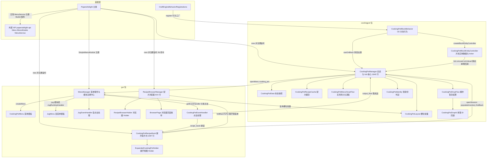
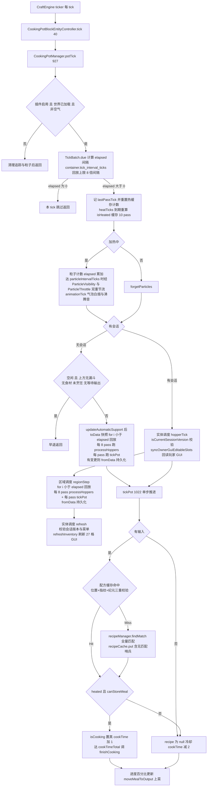
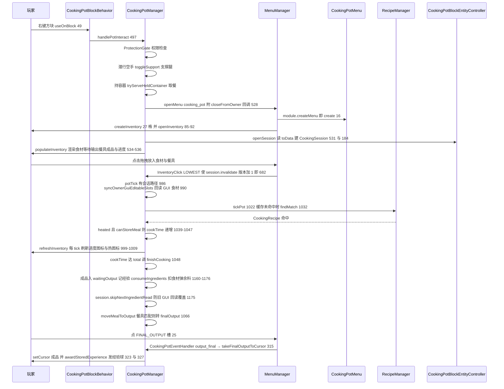
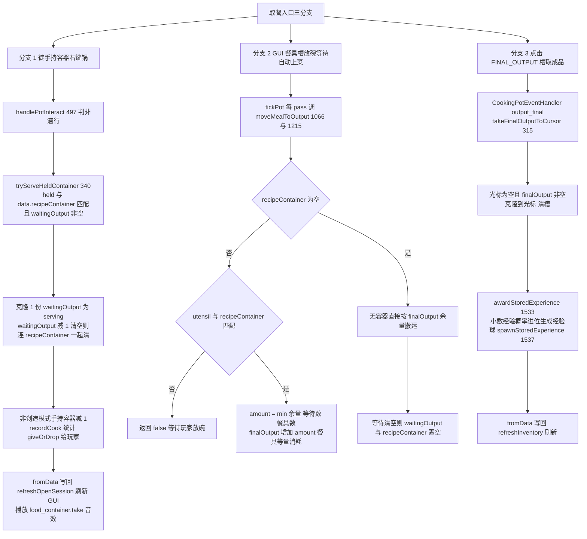
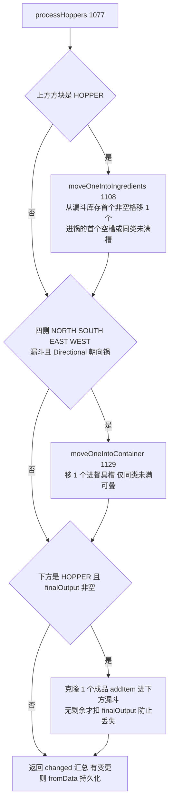

# 烹饪锅与 GUI 模块

> 管理 CraftEngine 自定义方块「烹饪锅」的完整生命周期（放置 / 交互 / tick 烹饪 / 取餐上菜 / 漏斗自动化 / 爆炸掉落 / 区块持久化），并提供通用 GUI 框架（菜单服务注册中心、锅内展开配方书、全服配方浏览器、壶菜单）。
> 20 个文件 / 4785 行

---

## 1. 模块概览

### 1.1 上游依赖（本项目内 import）

| 依赖包 | 被谁使用 | 用途 |
| --- | --- | --- |
| `config`（ConfigManager / CookingPotConfig） | cookingpot 全部、gui 全部 | GUI 物品/音效/文案构建、热源定义、锁定槽位、粒子与节流参数、`container.tick_interval_ticks` 批处理间隔（经 TickBatch） |
| `recipe`（RecipeManager / CookingRecipe / IngredientDef / CustomRecipeManager / CustomRecipe） | CookingPotManager、CookingPotRecipeBook、RecipeBrowserManager | 配方列表、`findMatch` 配方匹配、`snapshotEpoch` 缓存纪元、原料匹配、tag 展开 |
| `heat`（HeatSourceService） | CookingPotManager | `isHeated` 加热判定、热源方块定义匹配 |
| `common`（TickBatch / ExplosionSettleFlow / ExplosionStaging） | CookingPotManager、CookingPotDropFlow | tick 批处理到期计算、爆炸暂存与结算 |
| `ce`（CraftEngineUtil） | cookingpot、gui | CE 物品创建/识别、自定义方块属性读写、CraftRemainder |
| `util`（ItemMetaUtil / MealLoreUtil / ParticleVisibility / ParticleThrottle / TextUtil / WorldLookup） | cookingpot、gui | 物品名/Lore、餐食 Lore 与堆叠上限、粒子可见性、粒子音效节流、MiniMessage 解析 |
| `stats`（StatsManager） | CookingPotManager.recordCook | `COOKING_POT_COOK` 烹饪统计 |
| `api.protection`（ProtectionGate，外部 API） | CookingPotManager.handlePotInteract | 保护区交互权限门 |
| `support`（FeatureSupport） | CookingPotRecipeBook、RecipeBrowserManager | 配方书控件 / 配方浏览器功能开关 |
| `jug`（JugManager / JugLayout） | gui/module/jug | 壶菜单模板与输出取件 |
| `mechanic.cutting`（CuttingBoardManager / CuttingRecipe） | RecipeBrowserManager | 砧板配方浏览数据源 |
| `registration`（CraftEngineBehaviorRegistrations / AdvancedTagParser） | CookingPotBlockBehavior 注册入口、两处 tag 展开 | CE 行为工厂注册、高级 tag 解析 |
| `gui`（MenuManager） | CookingPotManager（反向依赖） | `openMenu("cooking_pot")` 打开菜单 |
| 外部依赖 `dev.tako:papersdelight-api`（`api.menu.Menu / MenuItem / MenuModule / MenuService / ActionMapEventHandler / SimpleMenuModule`） | gui 包 | GUI 框架契约；MenuManager 实现 MenuService |
| 外部库：CraftEngine、CCScheduler、Paper/Folia threadedregions 调度器、adventure-text | 全模块 | 自定义方块、跨 Folia 线程调度、文本组件 |

### 1.2 被谁装配（`PapersDelight.java`）

| 装配点 | 行号 | 内容 |
| --- | --- | --- |
| PapersDelight.java:201-204 | 201 | `MenuManager.getInstance()` 单例；注册事件监听；以 `ServicePriority.Normal` 注册为 Bukkit 服务 `dev.tako.papersdelight.api.menu.MenuService`（对外 API） |
| PapersDelight.java:207-208 | 207 | `new CookingPotManager(client, recipeManager)` 并注册监听 |
| PapersDelight.java:209-210 | 209 | `new CookingPotRecipeBook(client, recipeManager, menuManager, cookingPotManager)` 并注册监听 |
| PapersDelight.java:306-313 | 312 | `SimpleMenuModule.Builder().id("cooking_pot").menu(CookingPotMenu::create).handler(new CookingPotEventHandler(...))` 构建并 `menuManager.registerModule` |
| PapersDelight.java:355-387 | 355 | `new RecipeBrowserManager(...)` 注册监听；注册 `/farmersdelight`（别名 `/fd`）命令打开浏览器；`PapersDelightCommand.setRecipeBrowser` |
| PapersDelight.java:412 | 412 | 关服时 `MenuManager.getInstance().closeAll()` |
| registration/CraftEngineBehaviorRegistrations.java:106 | 106 | 调 `CookingPotBlockBehavior.register()` 把行为工厂注册到 CraftEngine（key `papersdelight:cooking_pot`） |
| jug/JugRuntimeInstaller.java:91 | 91 | 壶菜单模块经安装器注册到 MenuManager；JugManager.java:304 用 `openMenu(player, "jug", ...)` 打开 |

### 1.3 模块内部结构

关键结构性事实：

- CookingPotManager 通过 `volatile` 静态单例（CookingPotManager.java:67、110）被 CraftEngine 的 ticker / 行为回调（CookingPotBlockEntityController.java:41-43、CookingPotBlockBehavior.java:58-61）反向寻回，形成 CE → Manager 的静态耦合。
- 普通锅菜单（27 格）走 MenuManager 模块框架；展开配方书（54 格）与配方浏览器走「InventoryHolder 标记 + 自带 @EventHandler」的第二套 GUI 体系。
- CookingPotManager 与 gui 包互相依赖（Manager.openMenu → MenuManager；MenuManager 模块 handler → Manager）。

---

## 2. 类与函数目录

### 2.1 CookingPotManager（`cookingpot/CookingPotManager.java`，1649 行）

**职责**：模块核心。持有锅位置追踪、玩家会话（GUI 打开状态）、tick 烹饪循环、漏斗自动化、爆炸/破坏掉落、区块加载卸载持久化、GUI 内容渲染与图标缓存。
**继承/接口**：`final class CookingPotManager implements Listener`（Bukkit 事件监听器，共 11 个 @EventHandler）。
**关键字段**：`instance` 静态单例（67）；`trackedLocations` 追踪锅位置集（75）；`recipeCache` 配方缓存（76）；`particlePots` / `chunkParticleCount` 粒子节流（77、81）；`heatIcons` / `progressIcons` GUI 图标缓存（78、79）；`activeSessions` 位置→会话 / `playerSessions` 玩家→位置（82、83）；`pendingUnloads` 挂起卸载快照（84）；`sessionStateLock` / `pendingGeneration`（86、87）；`recentlyPlaced` 放置去抖（88）；`pendingExplosions` 爆炸暂存（90）；`potIdentity` 锅身份判定器（91）；`carriedMealKey` / `carriedContainerKey` 状态锅 PDC 键（103、104）；`sessionGeneration` 会话代数（105）；`WAITING_OUTPUT_CAPACITY=64`（65）；`HEAT_CACHE_TICKS=10`（925）；`FALLBACK_POT_ID`（61）。

#### 方法清单（全部）

| 方法 | 签名 | 行号 | 行为说明 |
| --- | --- | --- | --- |
| 构造器 | CookingPotManager(JavaPlugin, RecipeManager) | 107 | 注入插件与配方管理器；写静态单例 instance；加载 CookingPotConfig；创建 carriedMealKey/carriedContainerKey |
| shutdown | void shutdown() | 120 | 关服清理：清空粒子、追踪、缓存、全部会话集合 |
| reload | void reload() | 130 | 重载：清空粒子与图标缓存，重新加载 CookingPotConfig |
| markPlaced | void markPlaced(Location) | 138 | 标记「刚放置」，区域调度 2 tick 后自动移除（交互去抖） |
| activatePot | void activatePot(Block) | 144 | 位置加入 trackedLocations |
| initPotLater | void initPotLater(Block) | 148 | 延迟 1 tick 调 updateAutomaticSupport（放置后自检支撑） |
| isRecentlyPlaced | boolean isRecentlyPlaced(Location) | 152 | 是否处于放置去抖窗口 |
| hasPersistedData | boolean hasPersistedData(Block) | 156 | 被追踪或存在控制器（判断手持锅方块是否为二次放置） |
| getController | CookingPotBlockEntityController getController(Block) | 160 | Bukkit Block → CE BlockEntity → 控制器；异常吞掉返回 null |
| getController | private CookingPotBlockEntityController getController(BlockEntity) | 172 | 经 `be.controller.let` 借出控制器（ControllerRef 回填） |
| ControllerRef | private static final class | 183 | let 回调引用载体，set 方法在 181 |
| openSession | CookingPotData openSession(Block, Player) | 188 | 建会话：读控制器数据、登记 playerSessions/activeSessions；旧锅会话 handoffSession；顶掉同锅其他玩家（清其输出槽并异步 closeInventory）；代数自增 |
| handoffSession | private void handoffSession(Location, CookingSession) | 227 | 玩家换锅：实体调度关旧菜单 → 读 EditableSnapshot → 区域调度写回并释放；owner 无效走保守释放 |
| stopCooking | void stopCooking(Block) | 264 | 移除会话并把数据写回控制器 |
| stopCookingIfOwner | void stopCookingIfOwner(Block, Player) | 274 | 仅会话所有者执行 stopCooking |
| isSessionOwner | boolean isSessionOwner(Block, Player) | 285 | 会话存在且 UUID 匹配 |
| getSessionData | CookingPotData getSessionData(Block) | 290 | 返回会话数据，无会话返回 null |
| isPlayerCooking | boolean isPlayerCooking(Player) | 295 | 会话存在且 data.isCooking |
| syncFromInventory | void syncFromInventory(Block, Inventory) | 300 | 无会话时把 GUI 可编辑槽同步进控制器数据（配方书翻页等场景） |
| startCooking | boolean startCooking(Player, Inventory) | 308 | 找到会话并 syncEditableSlots；真正烹饪由 tick 判定 |
| cancelCooking | boolean cancelCooking(Player, Inventory) | 315 | 恒返回 false 的占位实现 |
| takeFinalOutputToCursor | boolean takeFinalOutputToCursor(Player, InventoryClickEvent) | 319 | FINAL_OUTPUT 槽取成品到光标：会话 invalidate → 克隆输出并清槽 → awardStoredExperience → fromData 写回 → refreshInventory → setCursor → recordCook 统计 |
| recordCook | private static void recordCook(Player, ItemStack) | 336 | StatsManager 记录 COOKING_POT_COOK（CE 物品标识 + 数量） |
| tryServeHeldContainer | boolean tryServeHeldContainer(Player, Block, ItemStack) | 344 | 徒手持容器取餐：容器匹配 recipeContainer → 克隆 1 份 waitingOutput → 扣 waitingOutput 与手持（创造免扣）→ recordCook → giveOrDrop → fromData → refreshOpenSession → 取餐音效（详见 3.3） |
| toggleSupport | boolean toggleSupport(Block) | 370 | 潜行空手切换支撑腿：support 2 ↔（托盘源 1 / 无 0），播放灯笼放置音 |
| populateInventory | void populateInventory(Inventory, CookingPotData) | 379 | 刷新食材槽、等待输出渲染、餐具槽、最终输出槽、进度指示 |
| renderedWaitingOutput | private ItemStack renderedWaitingOutput(CookingPotData) | 393 | 生成带「盛装于 X」lore、堆叠上限 64 的等待输出图标（源/容器一致则复用渲染缓存） |
| hasProgress | static boolean hasProgress(int, int) | 418 | cookTime 与 cookTimeTotal 均 > 0 |
| updateHeatIndicator | void updateHeatIndicator(Inventory, Block) | 422 | 以 isHeated 刷新 STATUS 槽（公开重载） |
| updateHeatIndicator | private void updateHeatIndicator(Inventory, boolean) | 426 | 写热图标（heatIcons computeIfAbsent 缓存） |
| buildHeatIcon | private ItemStack buildHeatIcon(String) | 431 | ConfigManager.buildGuiItem 构造 heated/unheated 图标（语言键 + 图片字体） |
| updateProgressIndicator | void updateProgressIndicator(Inventory, CookingPotData) | 440 | 无进度写空白边框图标；有进度算 pct → 22 级 stage，按「烹饪/冷却 + 百分比」键取 progressIcons 缓存写入 PROGRESS[0] |
| buildProgressIcon | private static ItemStack buildProgressIcon(boolean, int) | 459 | 纸质图标 + 百分比名 + cook/cool lore + CustomModelData 325001+stage |
| onBlockPlace | @EventHandler(ignoreCancelled=true) void onBlockPlace(BlockPlaceEvent) | 473 | 监听方块放置：markPlaced + trackedLocations + updateAutomaticSupport；区域调度 1 tick 后跑一次 processHoppers；从手中物品 PDC 恢复 carriedMeal/carriedContainer 到控制器（状态锅迁移） |
| handlePotInteract | InteractionResult handlePotInteract(Player, Block) | 497 | 右键总入口：ProtectionGate 权限 → 潜行空手 toggleSupport → 持容器 tryServeHeldContainer → recentlyPlaced/同 ID 手持防误开 → MenuManager.openMenu("cooking_pot", closeFromOwner) → openSession → populateInventory + 进度 + 热图标（详见 3.2） |
| closeFromOwner | private void closeFromOwner(Player, Block, Inventory) | 544 | openMenu 的 onClose 回调：构造 CookingPotMenuCloseFlow.Scheduler 适配器（entity/region 调度 + retired 回退），交给 captureAndPersist：快照写回 applyEditableSnapshot → releaseSession，失败走 stageRetiredPending/conservativeRelease |
| stageRetiredPending | private void stageRetiredPending(Location, CookingSession, EditableSnapshot) | 590 | 实体退休（玩家失效/插件禁用）时挂起待持久化快照 |
| registerPending | private PendingUnload registerPending(Location, CookingSession, EditableSnapshot, boolean) | 595 | sessionStateLock 下以自增 token 登记/复用 PendingUnload，写 session.unloadGeneration |
| isCurrentSession | private boolean isCurrentSession(Location, CookingSession) | 611 | activeSessions 仍是该会话且 generation > 0 |
| isCurrentSessionVersion | private boolean isCurrentSessionVersion(Location, CookingSession, long) | 615 | 会话当前且 operationVersion 未变（防并发写覆盖，GUI 点击即 invalidate） |
| applyEditableSnapshot | private void applyEditableSnapshot(CookingSession, EditableSnapshot) | 619 | 快照食材/餐具克隆写回 session.data，再 fromData 持久化到控制器 |
| releaseSession | private void releaseSession(Location, CookingSession) | 627 | activeSessions.remove(key, session) 成功则清 playerSessions |
| submitCloseSnapshot | private void submitCloseSnapshot(Location, CookingSession, EditableSnapshot) | 631 | registerPending 后区域调度：双重校验（会话当前 + pending 一致 + token 一致）→ applyEditableSnapshot → 移除 pending → releaseSession；调度失败保留 pending |
| retryPending | private void retryPending(Location, CookingSession) | 649 | 该会话存在挂起卸载时重试提交 |
| submitPendingUnload | private void submitPendingUnload(Location, PendingUnload) | 656 | 与 submitCloseSnapshot 同体的通用提交（供 retry 复用） |
| conservativeRelease | private void conservativeRelease(Location, CookingSession) | 672 | 保守路径：区域调度直接把 session.data 写回控制器后释放（不读 GUI 快照） |
| onCookingPotInventoryClick | @EventHandler(priority=LOWEST) void onCookingPotInventoryClick(InventoryClickEvent) | 686 | 玩家点击烹饪锅 GUI（会话菜单）时 session.invalidate()，使在途异步任务作废 |
| onCookingPotInventoryDrag | @EventHandler(priority=LOWEST) void onCookingPotInventoryDrag(InventoryDragEvent) | 695 | 拖拽同样 invalidate |
| onCookingPotInventoryClose | @EventHandler(priority=LOWEST) void onCookingPotInventoryClose(InventoryCloseEvent) | 704 | 关闭时 invalidate |
| onBlockBreak | @EventHandler(ignoreCancelled=true) void onBlockBreak(BlockBreakEvent) | 713 | 监听破坏：有会话 → 取消事件 + 异步关菜单 + submitCloseSnapshot（失败回滚重试）；无会话 → dropStatefulPot 掉落状态锅（成功则 setDropItems(false)）→ 清追踪/粒子/缓存 |
| onBlockExplode | @EventHandler(priority=LOWEST, ignoreCancelled=true) void onBlockExplode(BlockExplodeEvent) | 758 | 方块爆炸：把锅从 blockList 摘除并 pendingExplosions.stage |
| onEntityExplode | @EventHandler(priority=LOWEST, ignoreCancelled=true) void onEntityExplode(EntityExplodeEvent) | 763 | 实体爆炸同上 |
| settleBlockExplosion | @EventHandler(priority=MONITOR) void settleBlockExplosion(BlockExplodeEvent) | 768 | MONITOR 结算：settleExplosion（爆炸半径按版本适配） |
| settleEntityExplosion | @EventHandler(priority=MONITOR) void settleEntityExplosion(EntityExplodeEvent) | 773 | 实体爆炸 MONITOR 结算 |
| stageExplosion | private void stageExplosion(Event, List<Block>) | 777 | 遍历爆炸方块：isCookingPotIdentity → 移出列表 → 暂存（避免 CE 方块被原版炸毁丢状态） |
| settleExplosion | private void settleExplosion(Event, boolean, float) | 787 | drain 暂存：GUI 占用的锅跳过；其余按 ExplosionSettleFlow.survives 存活几率 dropStatefulPot 后 CraftEngineBlocks.remove |
| explosionRadius | private float explosionRadius(BlockExplodeEvent) | 806 | 1.21 前后的爆炸半径计算（yield / explosionResult） |
| explosionRadius | private float explosionRadius(EntityExplodeEvent) | 812 | 同上 |
| onChunkLoad | @EventHandler void onChunkLoad(ChunkLoadEvent) | 819 | 区块加载 1 tick 后 retryPendingUnloads（补写挂起快照） |
| onChunkUnload | @EventHandler void onChunkUnload(ChunkUnloadEvent) | 824 | 区块卸载：有会话 persistSessionBeforeUnload，否则清追踪/粒子/缓存 |
| persistSessionBeforeUnload | private void persistSessionBeforeUnload(CookingSession) | 844 | 卸载前：实体调度读 GUI 快照 → registerPending → 区域任务写回 + 释放 + 清追踪/粒子；owner 失效走 conservativeRelease |
| retryPendingUnloads | private void retryPendingUnloads(World, int, int) | 889 | 遍历 pendingUnloads，匹配区块且会话仍有效则区域调度重放写回 |
| registerPot | void registerPot(CookingPotBlockEntityController) | 906 | CE onLoad 回调：位置入 trackedLocations |
| forgetPot | void forgetPot(CookingPotBlockEntityController) | 911 | CE onUnload 回调：清配方缓存与粒子计数；方块为空气则取消追踪 |
| locationOf | private static Location locationOf(CookingPotBlockEntityController) | 920 | CE 世界名 + BlockPos → Bukkit BlockLocation |
| potTick | void potTick(CookingPotBlockEntityController, CEWorld, BlockPos) | 931 | tick 主循环（详见 3.1）：批处理到期判定、热缓存 10 pass、粒子节流播放、空闲早退、无会话路径（漏斗 + tickPot 批量回放）、有会话路径（实体调度同步 GUI → 区域调度推进 → 刷新 GUI） |
| tickPot | private boolean tickPot(Location, Block, CookingPotData, CookingSession, boolean) | 1030 | 单次烹饪推进（详见 3.1/3.2）：配方缓存查找 → canCook → 加热 cookTime++/finishCooking 或冷却 cookTime-2 → 进度百分比 → moveMealToOutput |
| updateAutomaticSupport | void updateAutomaticSupport(Block) | 1078 | support 非 2 时按 isTraySource 自动设 0/1（手动 2 不覆盖）；R3 起由 potTick 挂到热源刷新同窗（每 10 个补偿 tick 一次），放置/交互事件路径仍即时 |
| processHoppers | private boolean processHoppers(Block, CookingPotData) | 1085 | 漏斗自动化（详见 3.4）：上方漏斗 moveOneIntoIngredients、四侧朝锅漏斗 moveOneIntoContainer（静态数组 SIDE_HOPPER_FACES，R3 前为每次 List.of 组包）、下方漏斗取 finalOutput |
| moveOneIntoIngredients | private boolean moveOneIntoIngredients(Inventory, CookingPotData) | 1116 | 从漏斗库存移 1 个进首个空/可叠食材槽 |
| moveOneIntoContainer | private boolean moveOneIntoContainer(Inventory, CookingPotData) | 1137 | 移 1 个进餐具槽（同类且未满才叠） |
| resolveContainer | private String resolveContainer(CookingRecipe) | 1156 | 配方容器优先；否则取成品 CraftRemainder ID（containerFallbackCache 永久缓存，空串表无） |
| finishCooking | private void finishCooking(Block, CookingPotData, CookingRecipe, CookingSession) | 1168 | 烹饪完成：createItem 成品 → 容量校验（waitingOutput 同类 ≤ 64）→ 叠加 waitingOutput → 记 recipeContainer → storedExperience 累积 → consumeIngredients → 复位 cookTime/progress → session.skipNextIngredientRead=true |
| consumeIngredients | private void consumeIngredients(Block, CookingPotData) | 1186 | 每个非空食材扣 1，余料 ingredientRemainder → ejectRemainder 弹出 |
| ingredientRemainder | private ItemStack ingredientRemainder(ItemStack) | 1197 | 原版桶类→BUCKET、汤类→BOWL、药水/瓶类→GLASS_BOTTLE；FD milk_bottle→瓶、tomato_sauce→碗 |
| ejectRemainder | private void ejectRemainder(Block, ItemStack) | 1212 | 按 facing 四向速度弹射余料实体 |
| moveMealToOutput | private boolean moveMealToOutput(CookingPotData) | 1223 | 上菜核心：waitingOutput → finalOutput。无容器直接按余量搬；有容器要求 utensil 与 recipeContainer 匹配，按 min（余量, 等待数, 餐具数）转移并消耗等量餐具；搬空清 recipeContainer |
| canStoreMeal | private boolean canStoreMeal(CookingPotData, CookingRecipe) | 1255 | 成品可创建且 waitingOutput 为空或同类不超 64；R3 起产物实例取自 RecipeManager.resultPrototype 共享只读原型（替代逐 tick CraftEngine createItem） |
| syncOwnerGuiEditableSlots | private boolean syncOwnerGuiEditableSlots(CookingSession, CookingPotData) | 1264 | 会话玩家顶栏仍是本菜单时同步可编辑槽 |
| syncEditableSlots | private boolean syncEditableSlots(CookingSession, CookingPotData, Inventory) | 1270 | GUI→数据回读食材/餐具；skipNextIngredientRead 时反向 refresh（finishCooking 后防止把旧 GUI 内容读回覆盖） |
| refreshInventory | private void refreshInventory(Inventory, CookingPotData, CookingSession, boolean) | 1292 | 全量刷新：食材槽 + populateInventory + 热图标 |
| refreshOpenSession | private void refreshOpenSession(Block, CookingPotData) | 1298 | 有打开会话则刷新其 GUI（取餐后等场景） |
| refreshIngredientSlots | private static void refreshIngredientSlots(Inventory, CookingPotData) | 1305 | 数据→GUI 食材槽 |
| refreshIngredientSlots | private static void refreshIngredientSlots(Inventory, CookingPotData, CookingSession) | 1311 | 上者 + 清 skipNextIngredientRead |
| refreshSlot | private static void refreshSlot(Inventory, int, ItemStack) | 1316 | 写单槽（空写 null，否则 clone） |
| writeSlot | private static void writeSlot(Inventory, int, ItemStack) | 1320 | 差异写入：itemsEqual 才 setItem（减少发包） |
| itemTranslationKey | private String itemTranslationKey(ItemStack) | 1324 | CE 物品翻译键，回退原版 type 键 |
| translAtable | private Component translAtable(String) | 1331 | 物品 ID → 灰色非斜体 translatable 组件 |
| animationTick | private void animationTick(Block, boolean, CookingPotConfig) | 1344 | 加热粒子：20% 气泡、5% 白烟、1/10 概率沸腾音（有餐 boil_soup / 无餐 boil），音效经 shouldThrottleSound 节流 |
| shouldThrottleSound | private boolean shouldThrottleSound(Block, CookingPotConfig) | 1363 | 依据同区块粒子任务数与阈值判定跳过音效 |
| playSound | private void playSound(Block, SoundConfig) | 1369 | ConfigManager 音效：Folia 区域调度 / 非 Folia 主线程或全局调度，播放前检查区块已加载 |
| playSound | private void playSound(Block, Sound, float, float) | 1386 | 原版 Sound 版本（同调度策略） |
| playSound | private void playSound(Block, String, float, float) | 1403 | 字符串音效版本（同调度策略） |
| forgetParticles | private void forgetParticles(Location) | 1420 | 移出粒子集合并下调区块计数 |
| adjustChunkParticleCount | private void adjustChunkParticleCount(Location, int) | 1424 | 区块粒子任务计数增减，归零移除条目 |
| countNearbyParticleTasks | private int countNearbyParticleTasks(Location) | 1435 | 读取同区块粒子任务数 |
| chunkKey | private static long chunkKey(Location) | 1440 | 世界 UUID 低 16 位混入的区块 long 键 |
| load | CookingPotData load(Block) | 1446 | 读控制器数据，无控制器返回空 CookingPotData |
| save | void save(Block, CookingPotData) | 1451 | fromData 写回控制器并确保 trackedLocations |
| remove | void remove(Block) | 1457 | 取消追踪并清配方缓存 |
| isHeated | boolean isHeated(Block) | 1463 | 委托 HeatSourceService.isHeated |
| isTraySource | boolean isTraySource(Block) | 1467 | 下方为托盘热源；或下方是导热体且再下方一格为托盘热源 |
| isMatchingHeatSource | private boolean isMatchingHeatSource(Block, HeatSourceDef) | 1485 | 定义匹配且 checkLit（当前模块内无调用，保留给热源联动） |
| matchesBlockDef | private boolean matchesBlockDef(Block, HeatSourceDef) | 1489 | 委托 HeatSourceService.matchesBlockDef |
| isCookingPot | private boolean isCookingPot(Block) | 1493 | 存在控制器即锅 |
| isCookingPotIdentity | private boolean isCookingPotIdentity(Block) | 1497 | potIdentity.isPotBehavior：CE 行为是 CookingPotBlockBehavior |
| isCurrentCookingPot | private boolean isCurrentCookingPot(Block) | 1501 | 行为匹配且控制器存在（爆炸结算用） |
| dropStatefulPot | private boolean dropStatefulPot(Block, CookingPotData, boolean, boolean) | 1505 | 掉落内容物（食材/餐具/成品/经验）；生成携带餐食的状态锅物品：MealLoreUtil 餐食 Lore + PDC 写入序列化 waitingOutput 与容器；无同 ID CE 物品时回退 FALLBACK_POT_ID 并告警；dropBlock=false（爆炸无掉落）时只掉内容物清经验 |
| hasInput | private static boolean hasInput(CookingPotData) | 1537 | 任一食材非空 |
| awardStoredExperience | private void awardStoredExperience(Player, CookingPotData) | 1542 | 在玩家位置释放存储经验 |
| spawnStoredExperience | private void spawnStoredExperience(World, Location, CookingPotData) | 1546 | 小数部分按概率进位，生成 ExperienceOrb 并清零 storedExperience |
| findSession | private CookingSession findSession(Player) | 1556 | playerSessions → activeSessions，校验所有者一致 |
| findSessionLocation | Location findSessionLocation(Player) | 1564 | 玩家当前会话锅位置（供 GUI 层定位锅） |
| openCookingPotInventory | private Inventory openCookingPotInventory(Player) | 1570 | 顶栏尺寸为 27 或 54 才视为锅 GUI |
| giveOrDrop | private void giveOrDrop(Player, ItemStack) | 1577 | 优先进背包，溢出自然掉落 |
| dropIfPresent | private static void dropIfPresent(World, Location, ItemStack) | 1582 | 非空自然掉落 |
| take | private static ItemStack take(ItemStack) | 1586 | 空→null，否则 clone |
| shrink | private static void shrink(ItemStack, int) | 1590 | 减数量，下限 0 |
| isEmpty | private static boolean isEmpty(ItemStack) | 1594 | null 或 empty |
| itemsEqual | private static boolean itemsEqual(ItemStack, ItemStack) | 1598 | 双方空等价；否则数量一致且 isSimilar |
| blockKey | static Location blockKey(Block) | 1603 | 归一化方块 Location 键 |
| blockKey | static Location blockKey(Location) | 1607 | toBlockLocation |
| PendingUnload | private static final class PendingUnload | 1611 | 挂起卸载记录：session + snapshot + token |
| CookingSession | private static final class CookingSession | 1622 | 会话：block/data/player/generation/menu + closeRequested/unloadGeneration/operationVersion(volatile)/skipNextIngredientRead |

#### 核心方法调用链展开

- **tick 主循环 `potTick`（CookingPotManager.java:927）**
  - 前置：`plugin.isEnabled`（928）→ 世界查找/方块为空则清理返回（929-937）
  - 批处理：`TickBatch.due(ctrl.lastPassTick, now, TickBatch.interval())`（940），`elapsed==0` 直接返回（941），否则记 `lastPassTick=now`（942）。`TickBatch.interval()` 读 `container.tick_interval_ticks`（common/TickBatch.java:14-16），`due` 把一次补跑的上限钳到 `interval*8`（common/TickBatch.java:22-23）
  - 热缓存：`heatTicks<=0` 时重算 `isHeated` 并重置 10 pass（944-948）
  - 粒子：加热则 `particlePots` 计数 + `ctrl.particleTicks += elapsed`，达 `particleIntervalTicks` 时经 `ParticleVisibility.hasNearbyViewer` + `ParticleThrottle.shouldSkip(countNearbyParticleTasks)` 双重节流后 `animationTick`（951-962）；未加热 `forgetParticles`（964）
  - 空闲早退：无会话且无任何内容且上方非漏斗 → 返回（967-969）
  - 无会话路径：`ctrl.toData()` 快照 → `for i<elapsed` 循环回放：`(++ctrl.hopperTicks % 8)==0` 时 `processHoppers`，`tickPot` → 有变更 `ctrl.fromData`；支撑属性维护挂热源刷新窗（heatRefreshed，每 10 个补偿 tick 一次，R3 节流）
  - 有会话路径（986-1019）：记录 `session.version()` → 实体调度 `hopperTick`：`syncOwnerGuiEditableSlots` 回读玩家 GUI（990）→ 区域调度 `regionStep`：`for i<elapsed` 回放（漏斗 + tickPot）（994-997）→ `ctrl.fromData`（998）→ 实体调度 `refresh` 刷新菜单（999-1009）。全程以 `isCurrentSessionVersion` 双重校验（989、992），GUI 一被点击即作废在途任务
- **烹饪推进 `tickPot`（:1025）**：`hasInput` → 缓存查找 `recipeCache.get(loc, ingredients, recipeManager.snapshotEpoch())`，Miss 则 `recipeManager.findMatch` + `recipeCache.put`→ `canCook = recipe != null && canStoreMeal`（1036）→ 加热且可烹饪：置 isCooking/结果/容器/cookTimeTotal，`cookTime++`，达 total 调 `finishCooking`（1039-1050）；否则冷却 `cookTime -= 2`（1051-1058）→ 进度百分比变更标记（1060-1065）→ `moveMealToOutput`（1066）
- **完成 `finishCooking`（:1160）** → `consumeIngredients`（:1178）→ `ingredientRemainder`（:1189）→ `ejectRemainder`（:1204）
- **上菜 `moveMealToOutput`（:1215）** 与 **取餐 `tryServeHeldContainer`（:340）**、**取成品 `takeFinalOutputToCursor`（:315）** 详见 3.3
- **漏斗 `processHoppers`（:1077）** → `moveOneIntoIngredients`（:1108）/ `moveOneIntoContainer`（:1129），详见 3.4
- **右键 `handlePotInteract`（:497）** → `MenuManager.getInstance().openMenu(player,"cooking_pot", closeFromOwner)`（:528）→ `openSession`（:531）→ `populateInventory`（:534）→ `updateProgressIndicator`（:535）→ `updateHeatIndicator`（:536），详见 3.2
- **关闭持久化 `closeFromOwner`（:540）** → `CookingPotMenuCloseFlow.captureAndPersist`（:574-583）→ `applyEditableSnapshot`（:615）→ `releaseSession`（:623）；失败链 `stageRetiredPending`（:586）/`registerPending`（:591）/`submitPendingUnload`（:652）/`retryPending`（:645）/`conservativeRelease`（:668）
- **爆炸链 `stageExplosion`（:773）→ `settleExplosion`（:783）→ `dropStatefulPot`（:1496）**，半径计算 `explosionRadius`（:802/:808）
- **区块链 `onChunkUnload`（:820）→ `persistSessionBeforeUnload`（:840）→ `retryPendingUnloads`（:885，由 onChunkLoad :815 触发）**

### 2.2 CookingPotBlockEntityController（`cookingpot/CookingPotBlockEntityController.java`，225 行）

**职责**：CraftEngine 方块实体控制器，保存锅的全部持久化状态，创建 ticker，提供 Bukkit 快照读写（toData/fromData）与 NBT 序列化。
**继承/接口**：`final class CookingPotBlockEntityController extends BlockEntityController`（CraftEngine）。
**关键字段**：`INGREDIENT_SLOTS=6`（15）；`ingredients[6]`、`waitingOutput`、`finalOutput`、`utensil`、`recipeContainer`、`cookTime`、`cookTimeTotal`、`storedExperience`（17-24）；包私有 tick 计数 `particleTicks`/`hopperTicks`/`lastPassTick`（25-27）；`heated`/`heatTicks` 热缓存（28-29）。

| 方法 | 签名 | 行号 | 行为说明 |
| --- | --- | --- | --- |
| 构造器 | CookingPotBlockEntityController(BlockEntity) | 31 | 调 super 绑定方块实体 |
| createBlockEntityTicker | BlockEntityTicker createBlockEntityTicker(CEWorld, ImmutableBlockState) | 36 | @Override；createTickerHelper 绑定静态 tick → 每 tick 驱动 potTick |
| tick | static void tick(CEWorld, BlockPos, ImmutableBlockState, CookingPotBlockEntityController) | 40 | 静态 ticker 入口：经单例转调 CookingPotManager.potTick |
| onLoad | void onLoad() | 46 | @Override；CE 加载回调 → manager.registerPot |
| onUnload | void onUnload() | 52 | @Override；CE 卸载回调 → manager.forgetPot |
| ingredient | ItemStack ingredient(int) | 57 | 越界返回 null |
| ingredient | void ingredient(int, ItemStack) | 61 | 写食材槽并 normalize + markUnsaved |
| allIngredients | ItemStack[] allIngredients() | 67 | 返回内部数组引用 |
| waitingOutput | ItemStack waitingOutput() | 69 | 读等待输出 |
| waitingOutput | void waitingOutput(ItemStack) | 70 | 写 + markUnsaved |
| finalOutput | ItemStack finalOutput() | 75 | 读最终输出 |
| finalOutput | void finalOutput(ItemStack) | 76 | 写 + markUnsaved |
| utensil | ItemStack utensil() | 81 | 读餐具 |
| utensil | void utensil(ItemStack) | 82 | 写 + markUnsaved |
| recipeContainer | String recipeContainer() | 87 | 读配方容器 ID |
| recipeContainer | void recipeContainer(String) | 88 | 空串归一 null + markUnsaved |
| cookTime | int cookTime() | 93 | 读 |
| cookTime | void cookTime(int) | 94 | 写 + markUnsaved |
| cookTimeTotal | int cookTimeTotal() | 95 | 读 |
| cookTimeTotal | void cookTimeTotal(int) | 96 | 写 + markUnsaved |
| storedExperience | float storedExperience() | 97 | 读 |
| storedExperience | void storedExperience(float) | 98 | 写 + markUnsaved |
| isCooking | boolean isCooking() | 100 | 0 < cookTime < cookTimeTotal |
| heated | boolean heated() | 101 | 读热缓存 |
| heated | void heated(boolean) | 103 | 写热缓存（不 markUnsaved） |
| heatTicks | int heatTicks() | 105 | 读缓存计数 |
| heatTicks | void heatTicks(int) | 107 | 写缓存计数 |
| hasWaitingOutput | boolean hasWaitingOutput() | 109 | 等待输出非空 |
| hasFinalOutput | boolean hasFinalOutput() | 110 | 最终输出非空 |
| hasUtensil | boolean hasUtensil() | 111 | 餐具非空 |
| hasAnyIngredient | boolean hasAnyIngredient() | 112 | 任一食材非空 |
| toData | CookingPotData toData() | 117 | 深拷贝到 CookingPotData（含 progress 百分比换算） |
| fromData | void fromData(CookingPotData) | 136 | 数据深拷贝写回全部字段 + markUnsaved |
| saveCustomData | void saveCustomData(CompoundTag) | 151 | @Override；每槽 pot_ing_N + pot_waiting/pot_final/pot_utensil + pot_container/pot_cook_time/pot_cook_total/pot_exp |
| loadCustomData | void loadCustomData(CompoundTag) | 165 | @Override；读回上表键（容器空串归 null） |
| saveItem | private static void saveItem(CompoundTag, String, ItemStack) | 179 | 序列化字节 + 附 `_id`/`_count` 冗余键（防反序列化失败） |
| loadItem | private static ItemStack loadItem(CompoundTag, String) | 191 | 优先字节反序列化，失败回退 `_id`+`_count` 重建 CE 物品 |
| normalize | private static ItemStack normalize(ItemStack) | 209 | 空→null 否则 clone（防御性拷贝） |
| isEmpty | private static boolean isEmpty(ItemStack) | 213 | null 或 empty |
| markUnsaved | private void markUnsaved() | 217 | 置 CE 区块 setUnsaved 保证落盘 |

### 2.3 CookingPotBlockBehavior（`cookingpot/CookingPotBlockBehavior.java`，116 行）

**职责**：CraftEngine 自定义方块行为（key `papersdelight:cooking_pot`）：创建方块实体控制器、转发右键交互、注册放置、提供比较器红石模拟输出。
**继承/接口**：`final class CookingPotBlockBehavior extends BukkitBlockBehavior implements EntityBlock`（CraftEngine）。
**关键字段**：`FACTORY` 行为工厂（26）；`controllerId`（32）。

| 方法 | 签名 | 行号 | 行为说明 |
| --- | --- | --- | --- |
| register | static void register() | 28 | BlockBehaviors.register 注册 papersdelight:cooking_pot 工厂（由 CraftEngineBehaviorRegistrations.java:106 调用） |
| 构造器 | CookingPotBlockBehavior(BlockDefinition) | 34 | super 保存方块定义 |
| createBlockEntityController | BlockEntityController createBlockEntityController(BlockEntity) | 39 | @Override；返回新 CookingPotBlockEntityController |
| initControllerId | void initControllerId(int) | 44 | @Override；记录控制器类型 ID（比较器用） |
| useOnBlock | InteractionResult useOnBlock(UseOnContext, ImmutableBlockState) | 49 | @Override；玩家右键 → 转 Bukkit Player/Block → CookingPotManager.handlePotInteract；无玩家或无 Manager 返回 FAIL |
| useWithoutItem | InteractionResult useWithoutItem(UseOnContext, ImmutableBlockState) | 65 | @Override；恒 PASS |
| isCookingPot | static boolean isCookingPot(Block) | 69 | 经单例 getController 判定（供配方书等外部使用） |
| onPlace | void onPlace(Object, Object[]) | 75 | @Override；CE 放置回调：位置加入 trackedLocations |
| hasAnalogOutputSignal | boolean hasAnalogOutputSignal(Object, Object[]) | 88 | @Override；true，支持比较器 |
| getAnalogOutputSignal | int getAnalogOutputSignal(Object, Object[]) | 93 | @Override；有等待输出（数量>0）输出 15，否则 0 |
| Factory | private static class Factory implements BlockBehaviorFactory | 110 | create（112）按定义实例化行为 |

### 2.4 CookingPotMenuCloseFlow（`cookingpot/CookingPotMenuCloseFlow.java`，81 行）

**职责**：把「关闭烹饪锅 GUI 时把玩家可编辑槽（6 食材 + 餐具）安全写回方块实体」的跨线程流程抽象为可复用的静态工具；包私有。
**继承/接口**：包私有 final 工具类 + 内嵌 `record EditableSnapshot` 与 `interface Scheduler`。
**关键字段**：无实例字段。

| 方法 | 签名 | 行号 | 行为说明 |
| --- | --- | --- | --- |
| 构造器 | private CookingPotMenuCloseFlow() | 10 | 禁实例化 |
| EditableSnapshot | record EditableSnapshot(ItemStack[] ingredients, ItemStack utensil) | 12 | 紧凑构造器（13）防御拷贝 ingredients |
| EditableSnapshot.read | static EditableSnapshot read(Inventory) | 16 | 从 GUI 的 INGREDIENTS/UTENSIL 槽克隆快照 |
| EditableSnapshot.copy | private static ItemStack copy(ItemStack) | 24 | 空→null 否则 clone |
| Scheduler.entity | void entity(Runnable) | 28 | 接口方法：在实体线程执行 |
| Scheduler.region | void region(Runnable) | 29 | 接口方法：在区域线程执行 |
| Scheduler.entity | default void entity(Runnable, Runnable retired) | 30 | 带退休回退的实体调度 |
| Scheduler.region | default void region(Runnable, Runnable retired) | 31 | 带退休回退的区域调度 |
| requestClose | static void requestClose(Scheduler, BooleanSupplier, BooleanSupplier, Runnable) | 34 | 实体线程上校验 current+ownsTop 后执行 close |
| captureAndPersist | static void captureAndPersist(Scheduler, BooleanSupplier, Inventory, Consumer<EditableSnapshot>, Runnable) | 41 | 4 参重载：release 兼作 retired/regionRetired |
| captureAndPersist | static void captureAndPersist(Scheduler, BooleanSupplier, Inventory, Consumer<EditableSnapshot>, Runnable, Runnable) | 47 | 5 参重载：补 entityRetired |
| captureAndPersist | static void captureAndPersist(Scheduler, BooleanSupplier, Inventory, Consumer<EditableSnapshot>, Runnable, Runnable, Consumer<EditableSnapshot>) | 53 | 完整版：实体线程读快照（读失败 entityRetired）→ 区域线程写回+release（失败或调度异常 regionRetired 携快照） |

### 2.5 CookingPotData（`cookingpot/CookingPotData.java`，48 行）

**职责**：锅状态的可序列化快照 DTO，在控制器、会话、GUI 渲染之间传递。
**继承/接口**：`public class CookingPotData`（POJO）。
**关键字段**：`ingredients[6]`（7）、`waitingOutput`（9）、`utensil`（11）、`finalOutput`（13）、`progress`（15）、`cookTime`（16）、`cookTimeTotal=200`（17）、`lastSaveTick`（19）、`cookDurationTicks=200`（21）、`isCooking`（23）、`recipeResult`/`recipeResultCount=1`/`recipeContainer`（26-30）、`storedExperience`（32）、transient 渲染缓存 `progressStage`/`renderedWaitingOutput`/`renderedWaitingSource`/`renderedWaitingContainer`（34-38）。

| 方法 | 签名 | 行号 | 行为说明 |
| --- | --- | --- | --- |
| isEmpty | boolean isEmpty() | 40 | 无食材、无等待输出、无餐具、无成品时 true |

### 2.6 CookingPotLayout（`cookingpot/CookingPotLayout.java`，45 行）

**职责**：锅 GUI 与展开配方书的槽位坐标常量表；两套 GUI（MenuManager 锅菜单、ExpandedCookingPotHolder 展开视图、RecipeBrowserManager 详情页）共用。
**继承/接口**：final 常量类（私有构造器 5）。
**关键字段/常量**：`SIZE=27`、`EXPANDED_SIZE=54`（7-8）；`STATUS=20`、`WAITING_OUTPUT=7`、`UTENSIL=23`、`FINAL_OUTPUT=25`（10-13）；`START_BUTTON=14`、`RECIPE_BOOK_BUTTON=9`、`CLOSE_BUTTON=-1`（15-17）；`INGREDIENTS={1,2,3,10,11,12}`（19）；`PROGRESS={5}`（20）；`FLOW_ARROWS={}`（21）；`LOCKED_DECORATION` 15 格（22-24）；配方书列表区 `RECIPE_LIST_PREVIOUS_PAGE=27`、`PAGE_INFO=31`、`HEAT_ICON=32`、`FILTER_TOGGLE=33`、`NEXT_PAGE=35`、`RECIPE_LIST_START=36`、`RECIPES_PER_PAGE=18`、`RECIPE_LIST_BORDER={28,29,30,34}`（26-35）；详情区 `RECIPE_DETAIL_BACK=27`、`AUTO_FILL=29`、`BORDER_ROW3`、`INGREDIENTS={37,38,39,46,47,48}`、`COOK_INFO=41`、`RESULT=43`、`CONTAINER=50`、`BORDER_ROW45`（37-44）。

| 方法 | 签名 | 行号 | 行为说明 |
| --- | --- | --- | --- |
| 构造器 | private CookingPotLayout() | 5 | 禁实例化（纯常量类，无方法） |

### 2.7 CookingPotRecipeCache（`cookingpot/CookingPotRecipeCache.java`，78 行）

**职责**：按锅位置缓存「当前食材组合 → 匹配配方」的结果，配合 RecipeManager.snapshotEpoch 纪元在配方重载后自动失效；未命中也用哨兵缓存（负缓存）。
**继承/接口**：`public final class`；内嵌 `sealed interface CacheResult`。
**关键字段**：`NO_MATCH_SENTINEL` 无匹配哨兵配方（27）；`entries: Map<Location, Entry>`（32）。

| 方法 | 签名 | 行号 | 行为说明 |
| --- | --- | --- | --- |
| CacheResult.MISS | static final CacheResult MISS | 17 | sealed 接口内常量 |
| CacheResult.hit | static CacheResult hit(CookingRecipe) | 19 | 构造 Hit |
| CacheResult.Hit | record Hit(CookingRecipe) | 23 | 命中记录（recipe 可 null 表示已知无匹配） |
| CacheResult.Miss | enum Miss implements CacheResult | 24 | 未命中单例 |
| Entry | private record Entry(long fingerprint, long epoch, CookingRecipe) | 30 | 缓存条目：指纹 + 纪元 + 配方 |
| get | CacheResult get(Location, ItemStack[], long) | 34 | 计算指纹后委托 lookup（R3 拆分，零行为差异） |
| lookup | CacheResult lookup(Location, long, long) | 39 | 三重校验（条目存在 / epoch 相同 / 指纹相同）才命中；哨兵转 null 配方；包私有（指纹预算好的入口，基准直测缓存门成本） |
| put | void put(Location, ItemStack[], long, CookingRecipe) | 48 | 计算指纹后委托 insert |
| insert | void insert(Location, long, long, CookingRecipe) | 54 | 写入（null 配方存哨兵）；包私有 |
| remove | void remove(Location) | 60 | 移除单锅缓存 |
| clear | void clear() | 64 | 清空（关服/重载） |
| fingerprint | static long fingerprint(ItemStack[]) | 68 | 6 槽指纹：Material.ordinal*127 + amount + 槽位*8191 滚动哈希（已知局限：不区分同基材质的不同 CE 自定义物品——预存在行为，见报告 03） |

### 2.8 CookingPotDropFlow（`cookingpot/CookingPotDropFlow.java`，36 行）

**职责**：爆炸掉落流程的泛型化封装：LOWEST 阶段暂存方块、MONITOR 阶段结算掉落；包私有。
**继承/接口**：`final class CookingPotDropFlow<E, B>` + 内嵌 `interface Drops<B>`。
**关键字段**：`staging: ExplosionStaging<E,B>`（12）。

| 方法 | 签名 | 行号 | 行为说明 |
| --- | --- | --- | --- |
| Drops.drop | void drop(B block, boolean contents, boolean body) | 10 | 接口方法：按标记掉落内容物与锅体 |
| stage | void stage(E, B) | 14 | 暂存方块 |
| stageIf | boolean stageIf(E, B, Predicate<B>) | 15 | 身份匹配才暂存 |
| settle | void settle(E, boolean, Predicate<B>, Predicate<B>, Drops<B>, Consumer<B>) | 21 | 6 参重载：valid 恒真 |
| settle | void settle(E, boolean, Predicate<B>, Predicate<B>, Predicate<B>, Drops<B>, Consumer<B>) | 26 | drain 后 ExplosionSettleFlow.settleStaged：valid 失败或 GUI 占用跳过；survives 决定 contents/body；最后 remove |

### 2.9 CookingPotIdentity（`cookingpot/CookingPotIdentity.java`，26 行）

**职责**：锅身份判定的策略三元组（CE 行为查找 / 行为匹配 / 控制器存在），区分「行为上是锅」与「当前数据仍是锅」；包私有。
**继承/接口**：`final class CookingPotIdentity<B, H>`。
**关键字段**：`behaviorLookup` / `behaviorMatch` / `controllerPresent`（7-9）。

| 方法 | 签名 | 行号 | 行为说明 |
| --- | --- | --- | --- |
| 构造器 | CookingPotIdentity(Function<B,H>, Predicate<H>, Predicate<B>) | 11 | 注入三策略 |
| isPotBehavior | boolean isPotBehavior(B) | 18 | 行为存在且匹配（破坏/爆炸识别用） |
| isCurrentPot | boolean isCurrentPot(B) | 23 | 行为匹配且控制器仍存在（爆炸结算用） |

### 2.10 CookingPotDropId（`cookingpot/CookingPotDropId.java`，18 行）

**职责**：掉落物品 ID 解析与回退的小工具；包私有。
**继承/接口**：final 工具类。
**关键字段**：无。

| 方法 | 签名 | 行号 | 行为说明 |
| --- | --- | --- | --- |
| 构造器 | private CookingPotDropId() | 5 | 禁实例化 |
| resolve | static String resolve(String blockId, String fallback) | 8 | blockId trim 非空优先，否则用 fallback |
| trimToNull | private static String trimToNull(String) | 13 | trim 后空串归 null |

### 2.11 MenuManager（`gui/MenuManager.java`，280 行）

**职责**：通用 GUI 框架核心：菜单模块注册中心 + 每玩家会话管理 + 点击/拖拽/关闭事件统一分发（含同 tick 双击防护与 shift 快速移动模拟）；对外实现 `dev.tako.papersdelight.api.menu.MenuService` 并注册为 Bukkit 服务。
**继承/接口**：`public final class MenuManager implements Listener, MenuService`。
**关键字段**：`instance` 单例（33）；`openSessions: UUID→MenuSession`（34）；`registeredModules: String→MenuModule`（35）；`lastClickTick` 双击防护（36）；`messageResolver` 消息解析（38）；内嵌 `record MenuSession(module, menu, inventory, onClose)`（278）。

| 方法 | 签名 | 行号 | 行为说明 |
| --- | --- | --- | --- |
| 构造器 | private MenuManager() | 40 | 私有单例 |
| getInstance | static MenuManager getInstance() | 42 | 懒初始化单例 |
| setMessageResolver | void setMessageResolver(BiFunction<String,String,String>) | 48 | 注入消息解析器（PapersDelight.java:202 传 ConfigManager::getOr），null 回退直通 |
| message | private String message(String, String) | 52 | 解析消息键，异常回退 fallback |
| registerModule | void registerModule(MenuModule) | 62 | 以 module.getId 注册模块 |
| unregisterModule | void unregisterModule(String) | 67 | 按 ID 注销 |
| parseTitle | private static Component parseTitle(String) | 72 | MiniMessage 解析标题，异常回退 Legacy & 号 |
| openMenu | void openMenu(Player, String) | 80 | 2 参重载：无 onClose |
| openMenu | void openMenu(Player, String, Consumer<Inventory>) | 85 | 模块 createMenu → Bukkit.createInventory（MiniMessage 标题）→ 逐槽 setItem → openInventory → 记录 MenuSession（含关闭回调） |
| closeMenu | void closeMenu(Player) | 95 | 移除会话并 closeInventory |
| closeAll | void closeAll() | 101 | 关服：遍历所有会话玩家 closeInventory 并清空 |
| onInventoryClick | @EventHandler void onInventoryClick(InventoryClickEvent) | 110 | 核心点击分发：非玩家/无会话/顶栏不匹配返回；rawSlot<0 返回；同 tick 二次点击直接取消（122-127）；底栏 shift 点击 → 取消 + quickMoveIntoInteractiveSlots（129-133）；COLLECT_TO_CURSOR 取消（134-136）；顶栏：MenuItem 缺失 → 取消（142-145）；interactive → 直接调 handler（148-150）；非 interactive → 取消后调 handler（153-154） |
| tryCallHandler | private void tryCallHandler(MenuSession, Player, MenuItem, InventoryClickEvent) | 157 | 调 module.getEventHandler.handle，异常 SEVERE 日志（含模块/动作 ID） |
| quickMoveIntoInteractiveSlots | private void quickMoveIntoInteractiveSlots(MenuSession, Player, InventoryClickEvent) | 171 | 模拟 shift 移动：按 quickMoveTargetAction 定目标动作；第一轮并入同类未满堆（180-197），第二轮填空槽（199-212），余量写回原格 |
| quickMoveTargetAction | static String quickMoveTargetAction(String, ItemStack) | 217 | jug 模块 → input_slot；碗 → utensil_slot；其余 → ingredient_slot |
| canQuickMoveInto | private boolean canQuickMoveInto(MenuItem, String) | 222 | 目标可交互且 actionId 匹配 |
| onInventoryDrag | @EventHandler void onInventoryDrag(InventoryDragEvent) | 228 | 拖拽分发：涉及顶栏任一非交互槽 → 整体取消；全交互则逐槽 tryCallDragHandler |
| tryCallDragHandler | private void tryCallDragHandler(MenuSession, Player, MenuItem, InventoryDragEvent) | 250 | 调 handleDrag，异常 SEVERE 日志 |
| onInventoryClose | @EventHandler void onInventoryClose(InventoryCloseEvent) | 264 | 会话匹配 → 移除会话与点击记录 → 执行 onClose 回调（CookingPotManager.closeFromOwner） |
| MenuSession | private record MenuSession(MenuModule, Menu, Inventory, Consumer<Inventory>) | 278 | 会话记录 |

### 2.12 CookingPotRecipeBook（`gui/module/cookingpot/CookingPotRecipeBook.java`，1097 行）

**职责**：锅内 54 格展开配方书（上半 27 格复刻锅 GUI、下半 27 格配方列表/详情），支持「可烹饪过滤」「翻页」「详情」「原料 tag 轮播动画」「一键填入食材」与折叠回普通锅菜单。
**继承/接口**：`public final class CookingPotRecipeBook implements Listener`（3 个 @EventHandler）。
**关键字段**：`SCHEDULER`（43）；`SECONDS` 格式器（45）；plugin/recipeManager/menuManager/cookingPotManager（63-66）；`expandedClickTick` 双击防护（68）；`viewTransitions` 视图切换中标记（70）；`tagAnimationTasks` 轮播任务（72）；`expList*`/`expDetail*` 槽位镜像（74-90）；`tagCycleIntervalTicks`（92）。

| 方法 | 签名 | 行号 | 行为说明 |
| --- | --- | --- | --- |
| replacePage | private static List<String> replacePage(List<String>, int) | 47 | lore 模板替换 %page%（空则取默认键） |
| orDefault | private static List<String> orDefault(List<String>, String) | 53 | 空 lore 用 fallback |
| replaceCount | private static List<String> replaceCount(List<String>, int) | 57 | lore 模板替换 %count% |
| 构造器 | CookingPotRecipeBook(JavaPlugin, RecipeManager, MenuManager, CookingPotManager) | 94 | 注入四依赖并 reloadConfig |
| reloadConfig | void reloadConfig() | 103 | 从 CookingPotLayout 镜像槽位到实例字段；读 recipe_book.tag_cycle_interval_ticks（默认 20，下限 1） |
| openExpanded | void openExpanded(Player, Block) | 126 | 公开入口：openExpandedList 第 0 页 |
| openExpandedList | private void openExpandedList(Player, Block, int) | 130 | 3 参重载：filter=false |
| openExpandedList | private void openExpandedList(Player, Block, int, boolean) | 134 | 构建列表视图：按 filter 过滤 canCraftWithInventory → 页码钳制 → ExpandedCookingPotHolder.list → 54 格标题库存 → populateCookingPotArea + renderRecipeList → openExpandedView → cookingPotManager.openSession 重建会话（详见 3.6） |
| openExpandedDetail | private void openExpandedDetail(Player, Block, int, int) | 159 | 4 参重载：filter=false |
| openExpandedDetail | private void openExpandedDetail(Player, Block, int, int, boolean) | 163 | 构建详情视图：索引越界回列表；holder.detail → populateCookingPotArea + renderRecipeDetail → openExpandedView → openSession → startTagAnimation |
| openExpandedView | private void openExpandedView(Player, Inventory) | 191 | viewTransitions 加标记后 openInventory（让 onExpandedClose 跳过切换中的关闭事件） |
| foldBackToPot | private void foldBackToPot(Player, Location) | 201 | 折叠回普通锅菜单：closeInventory → 区域延迟 1 tick 检查区块与锅存在 → 实体调度 menuManager.openMenu + openSession + populateInventory + updateHeatIndicator |
| populateCookingPotArea | private void populateCookingPotArea(Inventory, Block) | 223 | 渲染上半锅区：锁定槽边框、进度槽留空、配方书按钮、热图标、populateInventory 会话数据 |
| renderRecipeList | private void renderRecipeList(Inventory, List<CookingRecipe>, int, int, boolean) | 246 | 列表区渲染：边框 + 热图标占位、过滤开关图标（三态：功能关 null / enabled / disabled）、上一页（首页灰）、页码信息（%current%/%total% + 总数）、下一页（末页灰）、本页 18 个 createRecipeIcon |
| renderRecipeDetail | private void renderRecipeDetail(Inventory, CookingRecipe, int, Player) | 314 | 详情区渲染：第 3 行边框、返回列表按钮、一键填入按钮（可用蓝/不足红/功能关 null）、第 4-5 行边框、6 个原料图标 createIngredientIcon、烹饪信息图标、成品图标、容器图标 |
| onExpandedClick | @EventHandler void onExpandedClick(InventoryClickEvent) | 362 | 展开视图点击：holder 是 ExpandedCookingPotHolder 才处理；同 tick 双击取消（369-374）；底栏 shift → 取消 + manualShiftIntoUpperSlots；COLLECT_TO_CURSOR 取消（376-390）；上半区：配方书按钮 → foldBackToPot（394-399）；食材/餐具槽只禁 COLLECT_TO_CURSOR（402-408）；FINAL_OUTPUT → takeFinalOutputToCursor（410-414）；其余取消（416-417）；下半区：取消后按 LIST/DETAIL 分发（420-429） |
| onExpandedDrag | @EventHandler void onExpandedDrag(InventoryDragEvent) | 433 | 展开视图拖拽：触及下半区任意槽取消；上半区仅食材/餐具槽允许 |
| onExpandedClose | @EventHandler void onExpandedClose(InventoryCloseEvent) | 453 | 关闭：cancelTagAnimation；viewTransitions 中则跳过；否则会话所有者 → syncFromInventory + stopCookingIfOwner |
| handleExpandedListClick | private void handleExpandedListClick(Player, ExpandedCookingPotHolder, int) | 469 | 列表点击分发：上一页/下一页/过滤开关（重开第 0 页取反）/配方格子（算 recipeIndex → 详情）；锅已不存在则直接 closeInventory；一律经 syncAndReopen |
| handleExpandedDetailClick | private void handleExpandedDetailClick(Player, ExpandedCookingPotHolder, int) | 505 | 详情点击分发：返回列表；一键填入（canCraftWithInventory 校验 → autoFillIngredients） |
| canCraftWithInventory | private boolean canCraftWithInventory(Player, CookingRecipe) | 526 | 贪心匹配：背包每格剩余数量数组，逐原料找一个可配格扣 1，任一找不到即 false |
| autoFillIngredients | private void autoFillIngredients(Player, Block, CookingRecipe) | 549 | 一键填充：先把锅中不属于该配方的食材退回背包/掉落（556-577）；统计空槽并对应槽位原料（579-590）；按 sameTypeRemaining（同类型原料份数）把背包匹配堆均分 ceil(total/remaining) 放入各槽（592-621）；最后 syncFromInventory + updateInventory |
| ingredientsSameType | private static boolean ingredientsSameType(IngredientDef, IngredientDef) | 627 | 原料同型：material / tag / ceItem / anyOf 任一相等 |
| syncAndReopen | private void syncAndReopen(Player, Block, Runnable) | 639 | 翻页通用套路：syncFromInventory 保住上半区编辑 → 立即执行新视图构建 |
| startTagAnimation | private void startTagAnimation(Player, Inventory, CookingRecipe, int[]) | 645 | 原料轮播：对多匹配原料建动画栈；实体调度周期任务按 counter 轮换 setItem；玩家离线或换界面自动取消 |
| buildAnimationStacks | private List<ItemStack> buildAnimationStacks(IngredientDef) | 679 | tag 分支（681-701）：tag 物品列表 + `#tag` 与「匹配以下物品」lore；否则 displayExpressions 展开（703-721）；≤1 个不播 |
| cancelTagAnimation | private void cancelTagAnimation(Player) | 724 | 取消并移除轮播任务 |
| isIngredientSlot | private boolean isIngredientSlot(int) | 729 | 是否 INGREDIENTS 槽 |
| isCookingPot | private boolean isCookingPot(Block) | 736 | 委托 CookingPotBlockBehavior.isCookingPot |
| manualShiftIntoUpperSlots | private ItemStack manualShiftIntoUpperSlots(Inventory, ItemStack) | 740 | 展开视图底栏 shift 模拟：碗 → UTENSIL，其余 → INGREDIENTS；先并堆再填空，返回余量 |
| createRecipeIcon | private ItemStack createRecipeIcon(CookingRecipe, int) | 777 | 列表配方图标：成品图标打底 + 编号/成品/原料行（ingredientMiniMessageLines）/容器/耗时秒/经验/热源条件/点击提示 lore |
| createResultIcon | private ItemStack createResultIcon(CookingRecipe) | 803 | CE 创建成品；失败用 BARRIER「未知成品」 |
| createIngredientIcon | private ItemStack createIngredientIcon(IngredientDef) | 811 | 详情原料图标五分支：纯 matcher（displayExpressions 展开取首个，否则多选占位）、anyOf 多选（展开取首个）、material 原版、ceItem CE 物品（失败 PAPER）、tag（单品直接用；多品带匹配列表 lore；全失败 NAME_TAG） |
| expandIngredientExpressions | private List<String> expandIngredientExpressions(List<String>) | 893 | 表达式展开：`#tag` → RecipeManager.getTagItems / expandCeOrBukkitTag；`advtag:` → AdvancedTagParser.resolve；普通 ID 直通 |
| expandCeOrBukkitTag | private List<String> expandCeOrBukkitTag(String) | 910 | 先按 CE 物品定义 is 匹配；空则回退 Bukkit item tag |
| createIdIcon | private ItemStack createIdIcon(String, String, List<String>) | 937 | CE 物品 + 名称前缀 + 翻译键名 + 原始 ID lore（容器图标用） |
| getItemTranslationKey | private String getItemTranslationKey(ItemStack) | 952 | CE 翻译键或原版 translationKey |
| buildRecipeInfoIcon | private ItemStack buildRecipeInfoIcon(CookingRecipe) | 958 | 烹饪信息图标：耗时/经验/热源条件 lore（语言键优先） |
| replaceLorePlaceholders | private List<String> replaceLorePlaceholders(List<String>, CookingRecipe) | 973 | %time% / %exp% 替换 |
| buildGuiItem | private ItemStack buildGuiItem(String, String, String, List<String>) | 980 | 有 langPath 走 ConfigManager.buildGuiItem；否则 buildIconFromConfig 后手写名称/lore |
| applyPlaceholders | private ItemStack applyPlaceholders(ItemStack, Map<String,String>) | 998 | 名称与 lore 逐字面量替换（当前无调用方，保留） |
| applyPlaceholders | private Component applyPlaceholders(Component, Map<String,String>) | 1015 | Component 的字面量替换 |
| createSimpleItem | private ItemStack createSimpleItem(Material, String, List<String>) | 1026 | 原版物品 + MiniMessage 名称/lore |
| ingredientMiniMessageLines | private List<String> ingredientMiniMessageLines(IngredientDef) | 1037 | 原料 → 本地化 ID 行（空则未知原料） |
| sbAppendLine | private void sbAppendLine(List<String>, List<String>) | 1047 | 每 4 个 ID 一行、`/` 分隔的灰字列表 |
| collectLocalizedIds | private List<String> collectLocalizedIds(IngredientDef) | 1066 | displayExpressions 展开结果 |
| ingredientMiniMessage | private String ingredientMiniMessage(IngredientDef) | 1072 | 原料单行内联文案（当前无调用方，保留） |
| localizeItemId | private String localizeItemId(String) | 1085 | CE → `<lang:键>`；minecraft: → 物品翻译键；其余原样 |

#### GUI 构建流程展开（openExpandedList，CookingPotRecipeBook.java:134）

1. 取 `recipeManager.recipes()`（:135），`filterEnabled` 时用 `canCraftWithInventory` 过滤（:136-138）。
2. `maxPage = (size-1)/18`，页码钳制（:139-140）。
3. `ExpandedCookingPotHolder.list(safePage, potLoc, filter)`（:143）→ `Bukkit.createInventory(holder, 54, TextUtil.parse(图片字体标题))`（:144-147），holder 回填 inventory。
4. `populateCookingPotArea(inv, potBlock)`（:150）：锁定槽边框（:229-231）→ 进度槽清空（:233）→ 配方书按钮（:235-236）→ `updateHeatIndicator`（:238）→ 会话数据 `populateInventory`（:240-243）。
5. `renderRecipeList(inv, recipes, page, maxPage, filter)`（:152）：边框 + 热图标占位（:250-254）→ 过滤开关三态图标（:256-268）→ 上一页按钮（首页灰 + 「已经是第一页了」，:270-282）→ 页码信息（%current%/%total% + 已加载配方数，:284-291）→ 下一页按钮（:293-305）→ 第 `start=page*18` 起逐格 `createRecipeIcon`（:307-311）。
6. `openExpandedView(player, inv)`（:154，viewTransitions 防误关）→ `cookingPotManager.openSession(potBlock, player)`（:156，为新 54 格菜单重建会话）。

详情页 `openExpandedDetail`（:163）在 4-5 步之间改用 `renderRecipeDetail`（:183）并追加 `startTagAnimation`（:188）。一键填充 `autoFillIngredients`（:549）：清退非本配方食材 → 空槽规划 → 同类型份数均分放入 → `syncFromInventory`（:623）。

### 2.13 CookingPotMenu（`gui/module/cookingpot/CookingPotMenu.java`，68 行）

**职责**：27 格普通锅菜单的静态模板（Menu 模型，不含运行状态）。
**继承/接口**：final 工具类（私有构造器 14）。
**关键字段**：无。

| 方法 | 签名 | 行号 | 行为说明 |
| --- | --- | --- | --- |
| 构造器 | private CookingPotMenu() | 14 | 禁实例化 |
| create | static Menu create() | 16 | 构建 Menu：图片字体标题 + SIZE 27；锁定槽边框（配置 cooking_pot.locked_slots 可覆盖，默认 15 格）；6 个 ingredient_slot（interactive）；utensil_slot（interactive）；slot5 progress；slot9 recipe_book 按钮（配置 cooking_pot.recipe_book 开关）；slot7 output_waiting（非交互）；slot20 heat_indicator；slot25 output_final（非交互） |

### 2.14 CookingPotEventHandler（`gui/module/cookingpot/CookingPotEventHandler.java`，61 行）

**职责**：锅菜单的动作映射点击处理器（ActionMapEventHandler 子类），把 actionId 绑定到具体行为。
**继承/接口**：`public class CookingPotEventHandler extends ActionMapEventHandler`（外部 API）。
**关键字段**：无（构造器内完成全部 bind）。

| 方法 | 签名 | 行号 | 行为说明 |
| --- | --- | --- | --- |
| 构造器 | CookingPotEventHandler(CookingPotRecipeBook, CookingPotManager) | 14 | bind：progress→取消（16）；ingredient_slot→放行空实现（17-19）；utensil_slot→放行（20）；recipe_book→取消 + 非 shift 且光标空时 findSessionLocation → recipeBook.openExpanded（22-34）；heat_indicator→取消（36）；output_waiting→取消（37）；output_final→取消 + cookingPotManager.takeFinalOutputToCursor（39-42）；close_menu→取消 + closeInventory（44-47）；border→取消（49） |
| handleDrag | void handleDrag(Player, MenuItem, InventoryDragEvent) | 53 | @Override；空实现（食材/餐具槽由 MenuManager 默认逻辑放行，其余槽 MenuManager 已先取消） |
| canQuickMove | boolean canQuickMove(Player, MenuItem, ItemStack) | 58 | @Override；恒 true（目标槽已由 quickMoveTargetAction 限定为 utensil/ingredient） |

### 2.15 ExpandedCookingPotHolder（`gui/module/cookingpot/ExpandedCookingPotHolder.java`，38 行）

**职责**：54 格展开配方书的 InventoryHolder 标记：携带视图类型/页码/配方索引/锅位置/过滤开关，供事件处理器识别与路由；包私有。
**继承/接口**：`final class ExpandedCookingPotHolder implements InventoryHolder` + 内嵌 `enum View {LIST, DETAIL}`。
**关键字段**：`view`/`page`/`recipeIndex`/`potLocation`/`filterEnabled`/`inventory`（10-16）。

| 方法 | 签名 | 行号 | 行为说明 |
| --- | --- | --- | --- |
| 构造器 | private ExpandedCookingPotHolder(View, int, int, Location, boolean) | 18 | 全参私有构造 |
| list | static ExpandedCookingPotHolder list(int, Location, boolean) | 26 | LIST 视图工厂（recipeIndex=-1） |
| detail | static ExpandedCookingPotHolder detail(int, int, Location, boolean) | 30 | DETAIL 视图工厂 |
| getInventory | Inventory getInventory() | 35 | @Override；返回回填的 inventory |

### 2.16 JugMenu（`gui/module/jug/JugMenu.java`，41 行）

**职责**：壶（Jug）菜单静态模板（9 格或按 JugLayout.SIZE）。
**继承/接口**：final 工具类（私有构造器 13）。
**关键字段**：无。

| 方法 | 签名 | 行号 | 行为说明 |
| --- | --- | --- | --- |
| 构造器 | private JugMenu() | 13 | 禁实例化 |
| create | static Menu create() | 16 | 全槽先铺 border，再覆写：INPUT（interactive input_slot）、OUTPUT（output_slot）、FLUID、PROGRESS（border 造型）、CAPACITY_BUCKETS、CAPACITY_BOTTLES |
| emptyDecoration | static ItemStack emptyDecoration() | 34 | 空占位装饰图标 |
| borderDecoration | static ItemStack borderDecoration() | 38 | 边框装饰图标 |

### 2.17 JugEventHandler（`gui/module/jug/JugEventHandler.java`，36 行）

**职责**：壶菜单点击处理器：输入槽放行、输出取件、其余全取消。
**继承/接口**：`final class JugEventHandler extends ActionMapEventHandler`。
**关键字段**：`jugManager`（11）。

| 方法 | 签名 | 行号 | 行为说明 |
| --- | --- | --- | --- |
| 构造器 | JugEventHandler(JugManager) | 13 | 注入 + bind：input_slot 放行（15-17）；output_slot → jugManager.takeOutputToCursor（18）；fluid/progress/capacity_buckets/capacity_bottles/border → 取消（19-23） |
| handleDrag | void handleDrag(Player, MenuItem, InventoryDragEvent) | 27 | @Override；仅 input_slot 允许拖拽，其余取消 |
| canQuickMove | boolean canQuickMove(Player, MenuItem, ItemStack) | 33 | @Override；仅 input_slot 可作为快速移动目标 |

### 2.18 RecipeBrowserManager（`gui/recipebrowser/RecipeBrowserManager.java`，815 行）

**职责**：全服配方浏览器（`/fd` 命令入口）：主页 → 烹饪/砧板/杂项三类列表（45 项/页）→ 详情页，含进度动画、原料 tag 轮播、分解催化物轮播；纯只读展示，不关联任何锅会话。
**继承/接口**：`public final class RecipeBrowserManager implements Listener`（3 个 @EventHandler）。
**关键字段**：`SCHEDULER`（40）；plugin/recipeManager/cuttingBoardManager/customRecipeManager（42-45）；尺寸常量 `HOME_SIZE=27`、`LIST_SIZE=54`、`DETAIL_SIZE=27`、`ITEMS_PER_PAGE=45`（47-50）；导航槽 `NAV_BACK=45`、`NAV_PREV=48`、`NAV_PAGE_INFO=49`、`NAV_NEXT=50`（52-55）；`DETAIL_BACK=18`（57）；`animationTasks`/`tagAnimTasks` 轮播任务（59-61）；`tagExpansionCache` tag 展开缓存（63）。

| 方法 | 签名 | 行号 | 行为说明 |
| --- | --- | --- | --- |
| browserTitle | private static String browserTitle(String, String, String) | 73 | 图片字体 + 语言键标题拼装 |
| openHome | void openHome(Player) | 78 | 主页：27 格全边框 + 三分类图标 slot11 烹饪 / slot13 砧板 / slot15 杂项 |
| openCookingList | private void openCookingList(Player, int) | 103 | 烹饪列表：54 格 holder.list + renderList（IconFactory=createCookingRecipeIcon） |
| openCookingDetail | private void openCookingDetail(Player, int, int) | 117 | 烹饪详情：索引越界回列表；renderCookingDetail + startCookingAnimation + startIngredientTagAnimation |
| openCuttingList | private void openCuttingList(Player, int) | 133 | 砧板列表（数据源 cuttingBoardManager.getRecipes） |
| openCuttingDetail | private void openCuttingDetail(Player, int, int) | 147 | 砧板详情：renderCuttingDetail |
| IconFactory | private interface IconFactory | 160 | 函数式接口：`ItemStack create(int index)`（声明 162） |
| renderList | private void renderList(Inventory, int, int, int, IconFactory) | 165 | 通用列表渲染：0-44 配方图标（空列表 slot22 提示）；45-53 边框；导航行：返回主页（45）、上一页（48，首页灰）、页码（49）、下一页（50，末页灰） |
| renderCookingDetail | private void renderCookingDetail(Inventory, CookingRecipe) | 214 | 烹饪详情：27 格全边框 + 返回（18）；复用 CookingPotLayout：6 原料槽 INGREDIENTS、STATUS 加热图标、WAITING_OUTPUT/FINAL_OUTPUT 成品、UTENSIL 容器 |
| renderCuttingDetail | private void renderCuttingDetail(Inventory, CuttingRecipe) | 236 | 砧板详情：工具（slot2）、输入（slot11）、4 输出槽 {6,7,15,16} 带概率 lore |
| resolveIdOrTag | private ItemStack resolveIdOrTag(String) | 271 | `#tag` 展开取首个可用物品；空/失败 BARRIER |
| cachedTagExpansion | static List<String> cachedTagExpansion(Map, String, Supplier) | 283 | 静态通用缓存工具（computeIfAbsent + List.copyOf） |
| clearTagExpansionCache | void clearTagExpansionCache() | 288 | 清空 tag 展开缓存（重载用） |
| expandTag | private List<String> expandTag(String) | 292 | RecipeManager.getTagItems 优先，空则 expandCeOrBukkitTag；结果进缓存 |
| startCookingAnimation | private void startCookingAnimation(Player, Inventory, CookingRecipe) | 300 | 进度动画：22 帧按 cookingTime/22 分帧；周期任务轮换 buildProgressIcon；玩家离线或离开详情页自动停 |
| buildProgressIcon | private ItemStack buildProgressIcon(int, String, String) | 326 | 帧 0 边框提示；其余 CE `farmersdelight:cooking_progress_N`；名称耗时 + lore 经验 |
| stopAnimation | private void stopAnimation(Player) | 345 | 同时取消进度动画与 tag 轮播任务 |
| startIngredientTagAnimation | private void startIngredientTagAnimation(Player, Inventory, CookingRecipe) | 352 | 原料 tag 轮播：多匹配原料建 `#标签 + 匹配列表` lore 的物品序列，每 20 tick 轮换 |
| resolveIngredientToMultipleIds | private List<String> resolveIngredientToMultipleIds(IngredientDef) | 408 | displayExpressions 展开：#tag / advtag: / 普通 ID |
| expandCeOrBukkitTag | private List<String> expandCeOrBukkitTag(String) | 423 | CE 物品定义匹配（含无命名空间 Key.ce 补全）→ Bukkit item tag 回退 |
| localizeItemId | private String localizeItemId(String) | 456 | CE → `<lang:键>`；minecraft 命名空间区分 block/item 键；其余原样 |
| onClick | @EventHandler void onClick(InventoryClickEvent) | 478 | 浏览器点击：holder 是 RecipeBrowserHolder 才处理；先整体取消；按 holder.page 分发 HOME→handleHomeClick、三种 LIST→handleListClick、四种 DETAIL→handleDetailBack |
| onDrag | @EventHandler void onDrag(InventoryDragEvent) | 497 | 浏览器内拖拽全取消（纯只读） |
| onClose | @EventHandler void onClose(InventoryCloseEvent) | 504 | 关闭时 stopAnimation |
| handleHomeClick | private void handleHomeClick(Player, int) | 512 | slot11 → 烹饪列表 0 页；slot13 → 砧板；slot15 → 杂项 |
| handleListClick | private void handleListClick(Player, RecipeBrowserHolder, int, BrowserPage) | 520 | NAV_BACK → openHome；NAV_PREV/NAV_NEXT 翻页（越界不动）；0-44 格 → MISC 走 openMiscDetail，其余 openDetailByType |
| handleDetailBack | private void handleDetailBack(Player, RecipeBrowserHolder, int) | 546 | DETAIL_BACK=18：按页面类型回对应列表（COOKING/CUTTING/COMPOST+SINGLE→MISC，默认主页） |
| openMiscList | private void openMiscList(Player, int) | 557 | 杂项列表：decompositions + singles 拼接；图标 Decomposition 用 output、Single 用 item；手写导航行（不走 renderList） |
| openMiscDetail | private void openMiscDetail(Player, int, int) | 604 | 杂项索引路由到分解/单品详情 |
| openDecompositionDetail | private void openDecompositionDetail(Player, int, int, CustomRecipe.Decomposition) | 619 | 分解详情：renderDecompositionDetail + startCatalystAnimation |
| openSingleDetail | private void openSingleDetail(Player, int, int, CustomRecipe.Single) | 630 | 单品详情：全边框 + 返回 + slot13 物品（description lore） |
| renderDecompositionDetail | private void renderDecompositionDetail(Inventory, CustomRecipe.Decomposition, Player) | 654 | 分解详情：输入 slot10、输出 slot16、催化物 slot24（动画）、光线/流体/加速器提示 21-23 |
| buildInfoItem | private ItemStack buildInfoItem(String) | 672 | 边框提示图标改显示名 |
| startCatalystAnimation | private void startCatalystAnimation(Player, Inventory, List<String>) | 682 | 催化物每 20 tick 轮播（COMPOST_DETAIL 页守卫） |
| buildCatalystIcon | private ItemStack buildCatalystIcon(List<String>, int) | 699 | 当前催化物图标 + 全列表 lore |
| openListByType | private void openListByType(Player, BrowserPage, int) | 714 | 三类列表路由 |
| openDetailByType | private void openDetailByType(Player, BrowserPage, int, int) | 723 | 两类详情路由（默认回主页） |
| getRecipeCount | private int getRecipeCount(BrowserPage) | 731 | COOKING→recipeManager、CUTTING→cuttingBoardManager、MISC→customRecipeManager.count |
| createCookingRecipeIcon | private ItemStack createCookingRecipeIcon(CookingRecipe) | 740 | 列表烹饪图标 = 成品物品（safeCreateItem 兜底 BARRIER） |
| cuttingListIconSource | static String cuttingListIconSource(CuttingRecipe) | 744 | 砧板列表图标源 = recipe.input（静态可测入口） |
| createCuttingRecipeIcon | private ItemStack createCuttingRecipeIcon(CuttingRecipe) | 748 | resolveIdOrTag 包装 |
| buildCategoryIcon | private ItemStack buildCategoryIcon(String, String, List<String>) | 752 | 配置图标 + 名称/lore 覆写 |
| buildNavIcon | private ItemStack buildNavIcon(String, String, List<String>) | 763 | buildCategoryIcon 别名 |
| buildPageInfo | private ItemStack buildPageInfo(int, int, int) | 767 | 页码图标：`第 %current% / %total% 页` + `共 %count% 个配方` |
| safeCreateItem | private static ItemStack safeCreateItem(String, int) | 783 | CE 创建失败回退 BARRIER |
| createIngredientIcon | private ItemStack createIngredientIcon(IngredientDef) | 788 | 展开取首个可用物品 + applyTagLore；全失败 BARRIER |
| applyTagLore | private ItemStack applyTagLore(ItemStack, IngredientDef) | 797 | 多匹配原料附 `#标签 + 匹配以下物品` lore |

#### 分页浏览流程展开

- 入口 `/fd`（PapersDelight.java:361-380，权限 `papersdelight.recipe`）→ `openHome`（:78）。
- 主页点击（onClick :477 → handleHomeClick :512）：slot11 → `openCookingList(0)`（:103）。
- 列表渲染 `renderList`（:165）：`start = page*45`，逐格 `factory.create(i)` 写 0-44（:180-182）；空列表 slot22 提示（:169-178）；底行 45-53 边框（:185-186），导航槽 45 返回 / 48 上一页 / 49 页码 / 50 下一页（:188-211）。
- 列表点击 `handleListClick`（:520）：`recipeIndex = listPage*45 + slot`（:535）→ `openCookingDetail`（:117）→ `renderCookingDetail`（:214，复用 CookingPotLayout 槽位摆出 6 原料 + 热源 + 成品 + 容器）→ `startCookingAnimation`（:129，22 帧进度动画）+ `startIngredientTagAnimation`（:130，tag 轮播）。
- 详情返回 `handleDetailBack`（:546）→ 对应列表原页。翻页经 `openListByType`（:714）重建整个界面。

### 2.19 RecipeBrowserHolder（`gui/recipebrowser/RecipeBrowserHolder.java`，35 行）

**职责**：浏览器的 InventoryHolder 标记：页面类型 + 列表页码 + 配方索引。
**继承/接口**：`public final class RecipeBrowserHolder implements InventoryHolder`。
**关键字段**：`page`/`listPage`/`recipeIndex`/`inventory`（8-11）。

| 方法 | 签名 | 行号 | 行为说明 |
| --- | --- | --- | --- |
| 构造器 | private RecipeBrowserHolder(BrowserPage, int, int) | 13 | 全参私有构造 |
| home | static RecipeBrowserHolder home() | 19 | 主页工厂（listPage=0, recipeIndex=-1） |
| list | static RecipeBrowserHolder list(BrowserPage, int) | 23 | 列表工厂（recipeIndex=-1） |
| detail | static RecipeBrowserHolder detail(BrowserPage, int, int) | 27 | 详情工厂 |
| getInventory | Inventory getInventory() | 32 | @Override；返回回填 inventory |

### 2.20 BrowserPage（`gui/recipebrowser/BrowserPage.java`，12 行）

**职责**：浏览器页面状态枚举。
**继承/接口**：`public enum BrowserPage`。
**关键字段/常量**：HOME、COOKING_LIST、COOKING_DETAIL、CUTTING_LIST、CUTTING_DETAIL、MISC_LIST、COMPOST_DETAIL、SINGLE_DETAIL（4-11）。

| 方法 | 签名 | 行号 | 行为说明 |
| --- | --- | --- | --- |
| values / valueOf | 枚举隐式方法 | 3-12 | 纯枚举，无自定义方法 |

---

## 3. 核心流程详解

### 3.1 烹饪锅 tick 主循环（批处理与跳 tick 回放）

驱动链：CraftEngine ticker 每 tick 调 `CookingPotBlockEntityController.tick`（CookingPotBlockEntityController.java:40）→ `CookingPotManager.potTick`（CookingPotManager.java:927）。

批处理机制：`TickBatch.interval()` 读配置 `container.tick_interval_ticks`（common/TickBatch.java:14-16，默认 1）；`TickBatch.due`（common/TickBatch.java:18-24）在 `lastPassTick==0` 时按 1 补跑，`elapsed<interval` 返回 0 跳过，否则返回 `min(elapsed, interval*8)` —— 即欠账的 tick 最多按 8 倍间隔一次性回放，防止低频档位下长时间离线后一次性追太多。锅的漏斗在回放循环内每 8 个 pass 才真正执行一次（`++ctrl.hopperTicks % 8`，CookingPotManager.java:978、995）；热源判定结果缓存 10 个 pass（HEAT_CACHE_TICKS，:925、944-948）。

### 3.2 玩家右键 → 打开 GUI → 放食材 → 匹配 → 烹饪 → 完成

### 3.3 用碗取餐 serving 流程

两条取餐路径 + 一条成品直取路径：

### 3.4 漏斗 / 自动化输入输出

触发点：potTick 回放循环内 `(++ctrl.hopperTicks % 8)==0`（无会话 :978、有会话 :995，约每 8 tick 一次）；方块放置后 1 tick 补跑一次（onBlockPlace :477-482）。

配套细节：等待输出 `waitingOutput` 不会被漏斗抽走（只有 finalOutput 可被下方漏斗取走）；食材余料（桶/碗/瓶）经 `ejectRemainder`（:1204）按锅 facing 方向弹出，不影响漏斗通道。

### 3.5 GUI 菜单框架流程（注册 → 创建 → 点击 → 关闭）

```mermaid
flowchart TD
    subgraph 启动注册
        A["PapersDelight 306"] --> A1["SimpleMenuModule Builder<br/>id cooking_pot menu CookingPotMenu create<br/>handler CookingPotEventHandler"]
        A1 --> A2["menuManager.registerModule 312"]
        A0["PapersDelight 201-204"] --> A3["MenuManager 注册监听<br/>并注册为 Bukkit 服务 MenuService 对外 API"]
    end

    subgraph 打开
        B["handlePotInteract 528"] --> B1["MenuManager.openMenu 85"]
        B1 --> B2["module.createMenu 得 Menu 模型"]
        B2 --> B3["Bukkit.createInventory MiniMessage 标题<br/>逐槽 setItem MenuItem"]
        B3 --> B4["player.openInventory 并记录 MenuSession<br/>含 onClose 回调 closeFromOwner"]
    end

    subgraph 点击
        C["InventoryClickEvent"] --> C1["MenuManager.onInventoryClick 111"]
        C1 --> C2{"同 tick 二次点击"}
        C2 -- "是" --> C2a["直接取消 防双击刷物品"]
        C2 -- "否" --> C3{"点击底栏 shift"}
        C3 -- "是" --> C3a["取消并模拟<br/>quickMoveIntoInteractiveSlots 171<br/>目标 quickMoveTargetAction 217<br/>碗去餐具槽 其余去食材槽"]
        C3 -- "否" --> C4{"顶栏槽有 MenuItem 且 interactive"}
        C4 -- "是" --> C5["放行并调 handler"]
        C4 -- "否" --> C5a["取消并仍调 handler"]
        C5 --> C6["CookingPotEventHandler bind 表分发<br/>recipe_book 打开配方书<br/>output_final 取成品 其余取消"]
        C6 --> C7["CookingPotManager LOWEST 监听<br/>session.invalidate 使在途异步任务作废 682"]
    end

    subgraph 关闭
        D["InventoryCloseEvent"] --> D1["MenuManager.onInventoryClose 265<br/>移除会话 执行 onClose"]
        D1 --> D2["closeFromOwner 540"]
        D2 --> D3["CookingPotMenuCloseFlow.captureAndPersist 53<br/>实体线程读 EditableSnapshot"]
        D3 --> D4["区域线程 applyEditableSnapshot 写回控制器 615<br/>releaseSession 释放 623"]
        D4 --> D5["失败或区块卸载<br/>pendingUnloads 挂起 chunkLoad 后重试 885"]
    end
```

### 3.6 配方书 / 配方浏览器浏览流程

两套独立体系：锅内展开配方书（可交互、绑定锅会话）与全服配方浏览器（只读、无会话）。

```mermaid
flowchart TD
    subgraph 锅内配方书 CookingPotRecipeBook
        A["锅菜单 slot9 recipe_book 按钮"] --> A1["CookingPotEventHandler recipe_book 绑定 22"]
        A1 --> A2["非 shift 光标空<br/>findSessionLocation 定位锅"]
        A2 --> A3["openExpanded 126 → openExpandedList 134"]
        A3 --> A4["populateCookingPotArea 上 27 格复刻锅 GUI 223"]
        A4 --> A5["renderRecipeList 246<br/>过滤开关 上一页 页码 下一页 18 个配方图标"]
        A5 --> A6["openSession 重建 54 格会话"]
        A5 --> A7["点击配方图标 syncAndReopen 639"]
        A7 --> A8["openExpandedDetail 163<br/>renderRecipeDetail 314 返回 一键填入 6 原料 信息 成品 容器"]
        A8 --> A9["startTagAnimation 645 多匹配原料轮播"]
        A8 --> A10["点击一键填入 512"]
        A10 --> A11["autoFillIngredients 549<br/>清退非本配方食材 同类型份数均分背包<br/>syncFromInventory 回写"]
        A5 --> A12["点击过滤开关 487<br/>canCraftWithInventory 526 重开第 0 页"]
        A8 --> A13["返回列表 或 点 slot9 foldBackToPot 201<br/>关闭后重开 27 格锅菜单"]
    end

    subgraph 配方浏览器 RecipeBrowserManager
        B["fd 命令 PapersDelight 361"] --> B1["openHome 78<br/>slot11 烹饪 slot13 砧板 slot15 杂项"]
        B1 --> B2["handleHomeClick 512"]
        B2 --> B3["openCookingList 103 45 项每页"]
        B3 --> B4["renderList 165<br/>0-44 图标 45 返回 48 上一页 49 页码 50 下一页"]
        B4 --> B5["handleListClick 520 翻页或进详情"]
        B5 --> B6["openCookingDetail 117<br/>renderCookingDetail 214 复用锅槽位布局"]
        B6 --> B7["startCookingAnimation 300 22 帧进度动画<br/>startIngredientTagAnimation 352 tag 轮播"]
        B2 --> B8["openMiscList 557 分解与单品<br/>openDecompositionDetail 619 催化物轮播"]
        B6 --> B9["handleDetailBack 546 slot18 返回对应列表"]
    end
```

差异要点：展开配方书点击走 `syncAndReopen`（先同步上半区编辑再整页重建），浏览器全程 `event.setCancelled(true)` 只读；浏览器动画任务以「holder.page 仍是详情页」为存活条件自动停止（:315-319、:393-397）。

---

## 4. 与其他模块的关系

| 模块 | 方向 | 接触点 |
| --- | --- | --- |
| `recipe`（RecipeManager / CookingRecipe / IngredientDef / CustomRecipeManager） | 本模块依赖 | tickPot 配方匹配（CookingPotManager.java:1027-1033）；配方书与浏览器数据源（CookingPotRecipeBook.java:135、RecipeBrowserManager.java:104）；tag 展开 RecipeManager.getTagItems；`snapshotEpoch` 驱动缓存失效 |
| `heat`（HeatSourceService） | 本模块依赖 | isHeated（:1454）、托盘/导热判定 isTraySource（:1458） |
| `config`（ConfigManager / CookingPotConfig） | 双向 | GUI 图标/文案/音效构建、热源定义、锁定槽位、`container.tick_interval_ticks`（TickBatch）、`recipe_book.tag_cycle_interval_ticks`；CookingPotManager.reload 重新加载 CookingPotConfig（:126） |
| `common`（TickBatch / ExplosionSettleFlow / ExplosionStaging） | 本模块依赖 | tick 批处理（:940）；爆炸两阶段结算（:753-812、CookingPotDropFlow） |
| `stats`（StatsManager） | 本模块依赖 | recordCook 记录 COOKING_POT_COOK（:332-338） |
| `ce`（CraftEngineUtil）+ CraftEngine 平台 | 本模块依赖 | 方块行为/方块实体/物品创建与识别/自定义属性（support、facing）、NBT（CompoundTag） |
| `util`（MealLoreUtil / ParticleVisibility / ParticleThrottle / ItemMetaUtil / TextUtil / WorldLookup） | 本模块依赖 | 状态锅餐食 Lore 与 64 堆叠（:407、:1515）；粒子可见性与节流（:956-959）；MiniMessage 渲染 |
| `api.protection`（ProtectionGate） | 本模块依赖 | 右键交互权限门（:498） |
| `api.menu`（外部 papersdelight-api） | 本模块实现/消费 | MenuManager 实现 MenuService 并注册 Bukkit 服务（PapersDelight.java:204）；CookingPotMenu/CookingPotEventHandler/JugMenu/JugEventHandler 消费 Menu/MenuItem/ActionMapEventHandler/SimpleMenuModule |
| `jug` | 互相独立、经 gui 相连 | JugManager.openMenu("jug")（JugManager.java:304）；JugRuntimeInstaller 注册菜单模块（JugRuntimeInstaller.java:91）；JugEventHandler 调 takeOutputToCursor |
| `mechanic.cutting` | gui 依赖 | RecipeBrowserManager 砧板分类数据源（:134、:734） |
| `registration` | 装配本模块 | CraftEngineBehaviorRegistrations.java:106 注册 CookingPotBlockBehavior；AdvancedTagParser 供两处 tag 展开 |
| `command`（PapersDelightCommand） | gui 提供入口 | setRecipeBrowser 注入浏览器（PapersDelight.java:387、PapersDelightCommand.java:63、179） |
| `stats`/`compat`/`effect` 等 | 无直接依赖 | 仅经 StatsManager 等间接接触 |

跨模块影响面备注：

- 本模块是全插件唯一向 Bukkit ServicesManager 暴露服务（MenuService）的模块，其他插件可经服务 API 打开注册过的菜单。
- CookingPotManager 的 11 个 @EventHandler 覆盖方块生命周期（放置/破坏/爆炸/区块）与 GUI 事件（点击/拖拽/关闭），其中三个 LOWEST 优先级的 Inventory 事件只做 `session.invalidate()`，真正的交互处理在 MenuManager / CookingPotRecipeBook 各自的监听器中，形成「版本号作废 + 各自处理」的两层事件管线。
