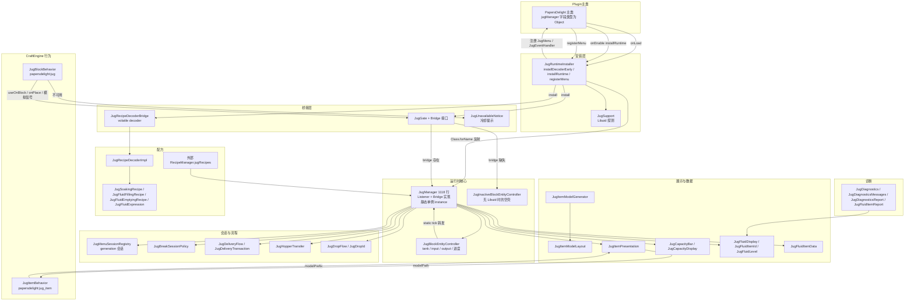
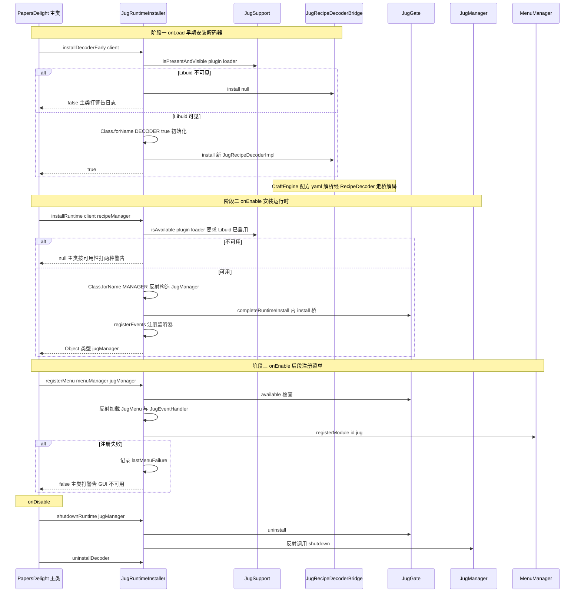
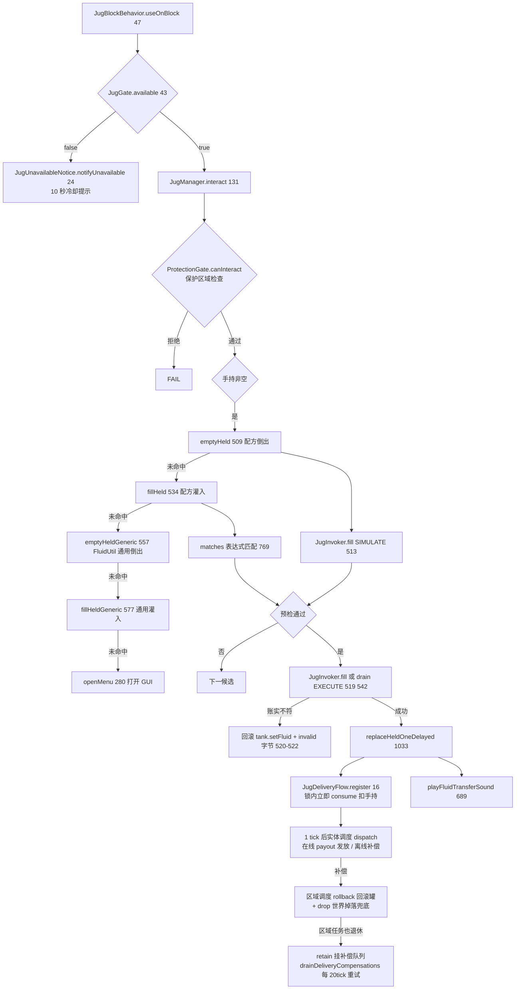
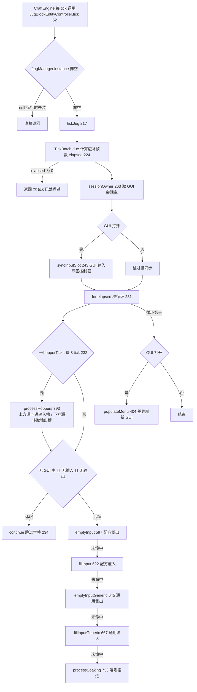
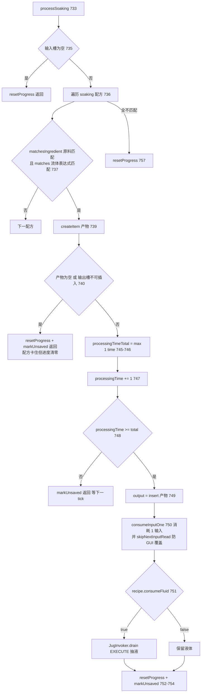
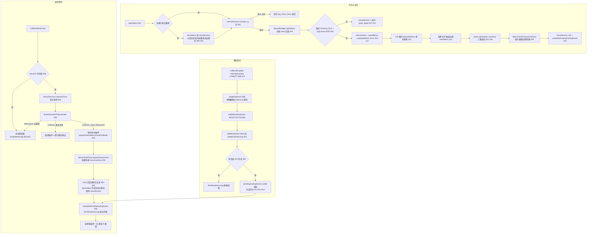
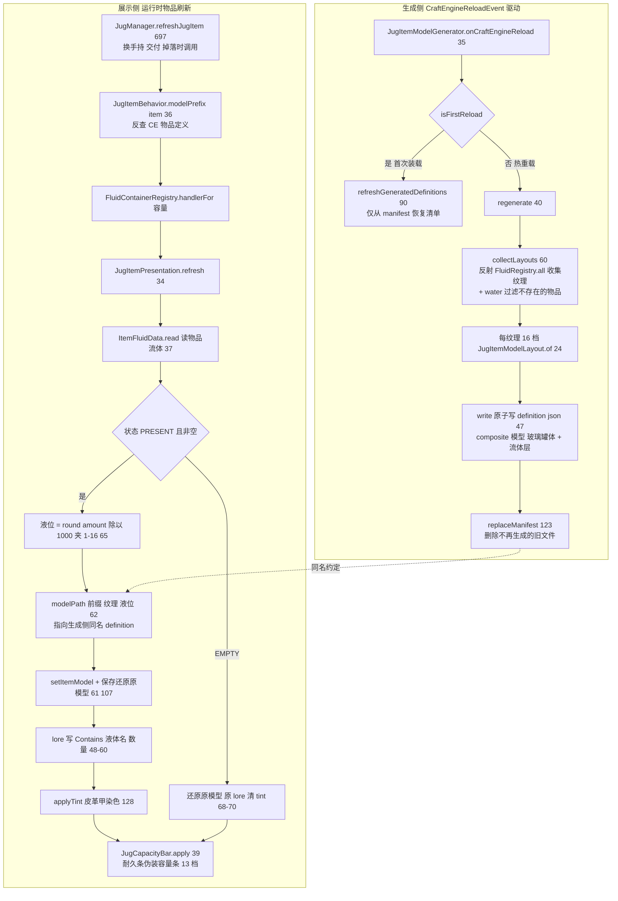

# 陶罐 Jug 模块

> 模块职责一句话：在 CraftEngine 自定义方块「陶罐 Jug」之上，基于可选依赖 Libuid 流体 API 实现流体储存、手持/输入槽的灌排液、浸泡配方 ticking、漏斗转移、GUI 会话保护、破坏/爆炸掉落补偿，以及运行时流体物品模型生成与展示。
> 文件数 38 / 总行数 3686（`src/main/java/dev/tako/papersdelight/jug/` 共 34 个 + `jug/recipe/` 子包 4 个，`wc -l` 实测）

## 1. 模块概览

### 1.1 与 Libuid 的依赖关系与类加载隔离设计

- Libuid（`dev.tako.libuid.api.*`）是**可选**前置插件。`JugManager`、`JugBlockEntityController`、`JugItemPresentation`、`JugFluidItemData`、`JugRecipeDecoderImpl`、`JugInvoker` 等类的源码**直接 import** Libuid API；一旦 Libuid 缺失，这些类的**类初始化**就会抛 `NoClassDefFoundError`。
- 隔离设计的核心：`JugRuntimeInstaller`（以及 `JugGate`、`JugSupport`、`JugRecipeDecoderBridge`、`JugUnavailableNotice`、`JugBlockBehavior`、`JugItemBehavior`、`JugItemModelGenerator` 等外围类）**自身源码零 Libuid import**，其常量池永不链接到 Libuid 类。加载 Libuid 依赖类的动作全部通过 `Class.forName(FQCN, true, runtimeClassLoader())` 反射触发，且仅在 `JugSupport.isAvailable/isPresentAndVisible` 探测通过之后执行。
- 关于「独立 ClassLoader」的准确表述：`JugRuntimeInstaller.runtimeClassLoader()`（JugRuntimeInstaller.java:30）返回的是**插件自身类加载器**（`JugRuntimeInstaller.class.getClassLoader()`），并非新建的隔离 ClassLoader。真正的隔离手段是三层：
  1. **反射式按需初始化**：`Class.forName(..., true, loader)` 仅在 Libuid 可见时才初始化 `JugManager`/`JugRecipeDecoderImpl`，Libuid 缺失时这些类根本不加载；
  2. **主类字段 Object 化**：`PapersDelight.java:53` 中 `private Object jugManager;`，主类与 `JugManager` 类型完全解耦，只能经 `JugRuntimeInstaller` 的反射方法（`ReflectionHandles.callNoArg(manager, "shutdown")`）与其交互；
  3. **门面桥接**：`JugGate.Bridge`（volatile 静态字段）让 CraftEngine 行为类（`JugBlockBehavior`）在无运行时也能工作——桥不存在时回落到 `JugInactiveBlockEntityController`（仅往返保留 NBT，功能停摆但不丢数据）。
- 双通道桥接：
  - `JugGate`：运行时行为桥（交互/控制器创建/模拟信号/放置回调），由 `completeRuntimeInstall`→`JugGate.install` 安装；
  - `JugRecipeDecoderBridge`：配方解码桥（filling/emptying/soaking 三种配方），由 `installDecoderEarly` 在 **onLoad 阶段**提前安装——因为 CraftEngine 配置解析（配方 yaml）发生在 onLoad 里，早于 onEnable 的运行时安装。
- `JugSupport` 探测两档强度：`isPresentAndVisible`（插件存在 + 类可见，不要求 enabled，用于早期解码器安装）与 `isAvailable`（额外要求 `libuid.isEnabled()`，用于运行时安装）。探测方式为 `Class.forName(PROBE_CLASS, false, loader)`（不初始化，仅验证可见性）。
- `JugInvoker` 是 Libuid 调用的**防御性包装**：每个方法都以 try/catch Throwable 包裹并返回安全默认值，避免 Libuid 内部异常击穿 Folia 区域线程。注意它并非反射调用（是直接静态调用），反射仅存在于 Installer/Diagnostics/ModelGenerator 跨类加载器边界处。
- 玩家体验侧的降级：运行时未安装时右键陶罐由 `JugUnavailableNotice` 以 10 秒冷却向玩家提示「Libuid is not available」（JugUnavailableNotice.java:14 `COOLDOWN_MILLIS = 10_000L`）。

### 1.2 模块内部结构

## 2. 类与函数目录

### 2.1 JugRuntimeInstaller（`jug/JugRuntimeInstaller.java`，149 行）

**职责**：Jug 运行时的反射安装器；三个安装阶段（早期解码器、运行时、GUI 菜单）的唯一入口，主类与 Jug 运行时类之间的隔离边界。
**继承/接口**：`final` 类，私有构造器（纯静态工具类）。
**关键字段**：`DECODER`/`MANAGER`（目标类 FQCN 常量，L21-22）、`MENU_FACTORIES: Map<Class, MethodHandle>`（菜单工厂缓存，L23）、`lastMenuFailure: volatile Throwable`（L25）。

| 方法 | 签名 | 行号 | 行为说明 |
|---|---|---|---|
| runtimeClassLoader | `static ClassLoader runtimeClassLoader()` | 30 | 返回插件自身类加载器（Installer 所在类的 loader），是全部反射加载的目标 loader |
| installDecoderEarly | `static boolean installDecoderEarly(Plugin plugin)` | 34 | 第一阶段（onLoad）：Libuid 不可见则 `JugRecipeDecoderBridge.install(null)` 并返回 false；否则反射 new `JugRecipeDecoderImpl` 装入桥；失败警告日志并装入 null |
| installRuntime | `static Object installRuntime(JavaPlugin plugin, RecipeManager recipes)` | 51 | 第二阶段（onEnable）：`JugSupport.isAvailable` 不过则返回 null；反射调用 `JugManager(JavaPlugin, RecipeManager)` 构造器；随后 `completeRuntimeInstall` 装 Gate + 注册事件；任何异常走 `shutdownRuntime` 回收并返回 null |
| registerMenu | `static boolean registerMenu(MenuManager menuManager, Object manager)` | 72 | 第三阶段：经 `JugGate.available()` 前置检查；用 manager 的 loader 反射加载 `gui.module.jug.JugMenu`/`JugEventHandler`，构造 handler 并以 `SimpleMenuModule.Builder` 注册 id="jug" 的菜单模块；失败记录 `lastMenuFailure` 返回 false |
| invokeMenuFactory | `static Menu invokeMenuFactory(Class<?> menuClass)` | 99 | 调用缓存的 MethodHandle 执行 JugMenu 的 public static Menu 工厂方法；非反射异常包装为 ReflectiveOperationException |
| findMenuFactory | `private static MethodHandle findMenuFactory(Class<?> menuClass)` | 110 | 扫描 menuClass 公有静态无参且返回 Menu 的方法，`ReflectionUtils.LOOKUP.unreflect` 转 MethodHandle 并 asType 到 Menu；找不到抛 IllegalStateException |
| lastMenuRegistrationFailure | `static Throwable lastMenuRegistrationFailure()` | 125 | 返回最近一次菜单注册失败原因（供主类打日志） |
| completeRuntimeInstall | `static boolean completeRuntimeInstall(Object manager, Runnable registerEvents, Consumer<Object> shutdown)` | 129 | 安装收尾：`JugGate.install(bridge)` 后执行事件注册；任一步失败调用 shutdown 回调并返回 false |
| shutdownRuntime | `static void shutdownRuntime(Object manager)` | 140 | 卸载：先 `JugGate.uninstall()` 再经 `ReflectionHandles.callNoArg(manager, "shutdown")` 反射调用 JugManager.shutdown |
| uninstallDecoder | `static void uninstallDecoder()` | 146 | 清空解码器桥（`JugRecipeDecoderBridge.install(null)`） |

**双阶段展开**：
- early-install（onLoad，PapersDelight.java:107）：发生在 CraftEngine 配置 parser 注册（`CraftEngineConfigRegistrations.registerAll`，PapersDelight.java:115-117）之前，保证 CraftEngine 解析 jug 配方 yaml 时 `registration/config/RecipeDecoder`（RecipeDecoder.java:126/131）经 `JugRecipeDecoderBridge` 拿到真解码器；Libuid 缺失时桥为 null，配方静默跳过。
- runtime-install（onEnable，PapersDelight.java:212）：构造 `JugManager`（此时其静态/实例 Libuid 引用才被链接校验）→ `JugGate.install` → `registerEvents`。返回对象以 `Object` 持有。之后（PapersDelight.java:314）`registerMenu` 再装 GUI。三个阶段彼此独立失败，任一失败只降级对应能力。

### 2.2 JugSupport（`jug/JugSupport.java`，55 行）

**职责**：Libuid 前置插件探测（存在性 / 启用状态 / 类可见性），Installer 与命令端共用的守门人。
**继承/接口**：`final` 工具类。
**关键字段**：`PROBE_CLASS = "dev.tako.libuid.api.FluidRegistry"`（L8）、`PLUGIN_NAME = "Libuid"`（L9）。

| 方法 | 签名 | 行号 | 行为说明 |
|---|---|---|---|
| isAvailable | `public static boolean isAvailable(Plugin plugin)` | 14 | 单参重载，用插件自身 loader 调双参版本 |
| isAvailable | `public static boolean isAvailable(Plugin plugin, ClassLoader loader)` | 18 | Libuid 插件存在 **且 isEnabled** 且探测类可见；异常一律 false |
| isPresentAndVisible | `public static boolean isPresentAndVisible(Plugin plugin)` | 28 | 单参重载 |
| isPresentAndVisible | `public static boolean isPresentAndVisible(Plugin plugin, ClassLoader loader)` | 32 | 只要求插件存在（不要求 enabled）+ 类可见；供 onLoad 早期安装用 |
| isClassVisible | `public static boolean isClassVisible(ClassLoader loader)` | 42 | 用默认探测类调字符串版本 |
| isClassVisible | `public static boolean isClassVisible(String className, ClassLoader loader)` | 46 | `Class.forName(className, false, loader)` 不初始化仅验证可见性；异常 false |

### 2.3 JugGate（`jug/JugGate.java`，102 行）

**职责**：CraftEngine 方方块行为与 JugManager 之间的静态门面；bridge 缺失时提供无操作/空壳降级。
**继承/接口**：`final` 类；内嵌 `public interface Bridge`（L14-23，方法：`interact`/`createController`/`analogSignal`/`onPlaced`）。
**关键字段**：`volatile Bridge bridge`（L25）。

| 方法 | 签名 | 行号 | 行为说明 |
|---|---|---|---|
| install | `public static void install(Bridge implementation)` | 30 | 装入桥实现（JugManager） |
| uninstall | `public static void uninstall()` | 34 | 清空桥（停机/安装失败） |
| bridge | `public static Bridge bridge()` | 39 | 获取当前桥（可 null） |
| available | `public static boolean available()` | 43 | 桥是否已装（运行时是否可用） |
| interact | `public static InteractionResult interact(Player player, Block block)` | 47 | 转发 bridge.interact；桥/玩家/方块任一为 null 返回 PASS |
| createController | `public static BlockEntityController createController(Object blockEntity)` | 52 | 转发 bridge.createController；结果为 null（或无桥）时回落 `inactiveController`——保证 CraftEngine 永远拿到非 null 控制器 |
| inactiveController | `private static BlockEntityController inactiveController(Object blockEntity)` | 60 | 构造 `JugInactiveBlockEntityController`（blockEntity 非 BlockEntity 时传 null） |
| analogSignal | `public static int analogSignal(Block block)` | 65 | 转发 bridge.analogSignal；无桥返回 0 |
| onPlace | `public static void onPlace(Block block)` | 70 | 转发 bridge.onPlaced；无桥静默 |
| blockFromPlaceArgs | `public static Block blockFromPlaceArgs(Object[] args)` | 76 | 从 CraftEngine onPlace 切面参数数组提取 Block（level 在 0，pos 在 1） |
| blockFromSignalArgs | `public static Block blockFromSignalArgs(Object[] args)` | 81 | 从模拟信号切面参数数组提取 Block（level 在 1，pos 在 2） |
| blockFromArgs | `private static Block blockFromArgs(Object[] args, int levelIndex, int positionIndex)` | 86 | 通用提取：`WorldLookup.worldOf` 取世界，`LocationUtils.fromBlockPos` 转坐标，`world.getBlockAt`；异常返回 null |
| worldOf | `private static World worldOf(Object level)` | 99 | 委托 `WorldLookup.worldOf` |

### 2.4 JugManager（`jug/JugManager.java`，1118 行）

**职责**：模块运行时核心；实现 `JugGate.Bridge` 与 Bukkit `Listener`；持有菜单会话、控制器缓存、爆炸暂存、投递补偿队列；承载交互、GUI 开关、灌排液、浸泡 ticking、漏斗、破坏/爆炸/放置/区块卸载全部事件逻辑。
**继承/接口**：`implements Listener, JugGate.Bridge`（L74）。
**关键字段**：`SCHEDULER`（CCScheduler 单例，L75）、`plugin/javaPlugin/recipeManager`（L77-79）、`openMenus: Map<UUID, Location>` 玩家→打开的罐（L81）、`menuSessions: JugMenuSessionRegistry<Location>`（L83）、`displaySnapshots: Map<UUID, DisplaySnapshot>` GUI 展示缓存（L85）、`controllerCache: Map<Location, JugBlockEntityController>`（L87）、`pendingExplosions: ExplosionStaging<Event, PendingExplosionJug>`（L89）、`pendingGuiExplosions: ExplosionSettleFlow<Location, PendingGuiExplosion>`（L91）、`pendingDeliveryCompensations: Queue<Runnable>` + `compensationTask`（L92-93，全局区域每 20tick 补偿泵）、容量展示 fallback id 常量（L95-96）、`static volatile JugManager instance`（L98，供 BlockEntityController.tick 静态转发）。

**方法清单**（全部 74 个方法/构造器/内部类型，含事件处理器与私有辅助）：

| 方法 | 签名 | 行号 | 行为说明 |
|---|---|---|---|
| 构造器 | `JugManager(JavaPlugin plugin, RecipeManager recipeManager)` | 100 | 保存依赖；启动全局区域每 20tick 的 `drainDeliveryCompensations` 定时任务；设置静态单例 instance |
| drainDeliveryCompensations | `private void drainDeliveryCompensations()` | 108 | 循环 poll 并执行补偿队列（JugDeliveryFlow.retain 挂起的补偿在此重试） |
| shutdown | `public void shutdown()` | 115 | 停机：取消补偿任务、清空队列；对每个 openMenus 会话 `persistSessionBeforeRelease` 后清空全部状态容器 |
| reload | `public void reload()` | 126 | 仅清空 controllerCache（重载后重新解析控制器） |
| interact | `public InteractionResult interact(Player player, Block block)` | 131 | Bridge 实现（右键陶罐入口）：ProtectionGate 保护检查 FAIL→取控制器 PASS→手持非空则依次尝试 emptyHeld/fillHeld/emptyHeldGeneric/fillHeldGeneric，命中则挥手返回 SUCCESS_AND_CANCEL；否则 openMenu |
| createController | `public BlockEntityController createController(Object blockEntity)` | 147 | Bridge 实现：blockEntity 是 BlockEntity 则 new JugBlockEntityController，否则 null |
| analogSignal | `public int analogSignal(Block block)` | 152 | Bridge 实现：经 `JugFluidLevel.comparatorSignal` 把液量映射为比较器信号 0-15 |
| onPlaced | `public void onPlaced(Block block)` | 158 | Bridge 实现：放置时移除 controllerCache 旧键（强制重建控制器） |
| getController | `JugBlockEntityController getController(Block block)` | 162 | 缓存优先取控制器；缓存项 isValid 校验失败即逐出；未命中经 `CraftEngineUtil.getLoadedWorld` + `world.getBlockEntityAtIfLoaded` 现查并回填；全程 Throwable 兜底 |
| getController | `private static JugBlockEntityController getController(BlockEntity entity)` | 191 | 从 BlockEntity 的 controller 单元里借出 JugBlockEntityController（经 ControllerRef 回调容器） |
| onControllerUnloaded | `void onControllerUnloaded(JugBlockEntityController controller)` | 202 | 控制器卸载回调：算出 Location 并从 controllerCache 移除 |
| locationOf | `private static Location locationOf(JugBlockEntityController controller)` | 208 | CEWorld.name → Bukkit World → BlockPos 转 Location（toBlockLocation 归一化坐标） |
| tickJug | `void tickJug(JugBlockEntityController controller, CEWorld ceWorld, BlockPos cePos)` | 217 | tick 主入口（见 3.3 详解）：TickBatch 批量补偿跳帧；每 8 hopperTicks 处理漏斗；无主无槽休眠跳过；否则按 emptyInput→fillInput→emptyInputGeneric→fillInputGeneric→processSoaking 短路链执行 elapsed 次；GUI 打开时前后同步输入槽并 populateMenu |
| syncInputSlot | `private void syncInputSlot(Location location, JugBlockEntityController controller, Inventory inventory)` | 243 | GUI→数据方向同步：若命中 skipNextInputRead 一次性标志则改走 refreshInputSlot（数据→GUI）；否则把玩家看到的输入槽写回 controller.input |
| refreshInputSlot | `private void refreshInputSlot(Location location, Inventory inventory, JugBlockEntityController controller)` | 252 | 数据→GUI 方向：把 controller.input 写回 GUI 槽并清 skipNextInputRead |
| clearMenuInputSlot | `private static void clearMenuInputSlot(Inventory inventory)` | 259 | 清空 GUI 输入槽（持久化会话前调用） |
| sessionOwner | `private Player sessionOwner(Location location)` | 263 | 取该位置的会话拥有者；不在线则持久化输入、关闭会话、补结算 GUI 爆炸，返回 null |
| itemsEqual | `private static boolean itemsEqual(ItemStack left, ItemStack right)` | 274 | 空-空 true、单空 false、否则 equals |
| openMenu | `private boolean openMenu(Player player, Block block, JugBlockEntityController controller)` | 280 | 打开 GUI（见 3.4）：先关闭玩家旧菜单（含 generation 校验与延迟爆炸结算）→ `menuSessions.tryOpen` 占坑（他人占用则提示 busy）→ MenuManager.openMenu 注册 close 回调 → 校验顶层 Inventory 尺寸 JugLayout.SIZE → setInventory/openMenus 登记 → populateMenu(force) |
| closeMenu | `private void closeMenu(Player player, Location location, Inventory inventory, long generation)` | 321 | close 回调：owner/generation/inventory 三重校验；外来 inventory 警告并异步关会话；否则经 `MenuCloseFlow.persistInput` 把输入槽物品落回控制器并关会话、补结算爆炸 |
| persistClosedMenuInput | `private void persistClosedMenuInput(Location location, ItemStack input)` | 346 | 关菜单持久化：控制器存在且未命中 skip 标志且物品不同才写回 controller.input |
| closeFlowScheduler | `private MenuCloseFlow.Scheduler closeFlowScheduler(Location location, Player owner)` | 354 | 构造双调度器：runEntity 用实体调度器（owner 无效则直接跑）、runRegion 用区域调度器；插件禁用时直接同步执行 |
| closeSession | `private void closeSession(Location location, UUID playerId)` | 373 | 关闭会话三连：menuSessions.close + openMenus.remove + displaySnapshots.remove |
| ownerAt | `private UUID ownerAt(Location location)` | 379 | 委托 menuSessions.owner |
| takeOutputToCursor | `public void takeOutputToCursor(Player player, InventoryClickEvent event)` | 383 | GUI 输出槽取物（由 gui.module.jug.JugEventHandler 绑定 output_slot 调用）：取消事件；校验会话/空鼠标/控制器/非空输出；克隆输出、清空控制器输出与 GUI 槽、设到光标 |
| openJugInventory | `private Inventory openJugInventory(Player player)` | 397 | 取玩家当前顶层 Inventory 并验证确属其 Jug 会话（引用相等） |
| populateMenu | `private void populateMenu(Player player, Inventory inventory, JugBlockEntityController controller, boolean force)` | 404 | 刷新 GUI 全部展示槽：输入/输出槽对齐；按 DisplaySnapshot 差异（fluidKey/amount/capacity/progressStage）惰性重建 FLUID、PROGRESS、CAPACITY_BUCKETS、CAPACITY_BOTTLES 槽 |
| createCapacityDisplay | `private ItemStack createCapacityDisplay(String configPath, String fallbackId, int units)` | 437 | 容量刻度物品：ConfigManager.buildGuiItem 失败回落 fallback id；统一盖 translatable 显示名 + 空 lore；amount 设为桶/瓶数 |
| createFluidDisplay | `private ItemStack createFluidDisplay(FluidStack fluid, int capacity)` | 454 | 液体展示物品：空罐用 JugMenu.emptyDecoration + emptyName；非空则按 FluidRegistry 纹理 → JugFluidItemId.candidatesForTexture 候选 id 逐个 CraftEngineUtil.createItem，全部失败回落 water/POTION；套 preservingName 与颜色 tint |
| createProgressDisplay | `private ItemStack createProgressDisplay(int stage, JugBlockEntityController controller)` | 493 | 浸泡进度物品：`farmersdelight:soaking_progress_N`，失败回落空装饰；清名与 lore |
| copyMenuStack | `private static ItemStack copyMenuStack(ItemStack stack)` | 505 | null 安全 clone |
| emptyHeld | `private boolean emptyHeld(Player player, Location jugLocation, JugBlockEntityController controller, ItemStack held)` | 509 | 手持倒出（配方驱动，见 3.2）：遍历 emptying 配方；filledInput 匹配 + 表达式可构造 + SIMULATE 填满额 → EXECUTE 填充（失败回滚 tank 与 invalid 字节）→ `replaceHeldOneDelayed` 延迟换手持 + 播放倒桶音效 |
| fillHeld | `private boolean fillHeld(Player player, Location jugLocation, JugBlockEntityController controller, ItemStack held)` | 534 | 手持灌入（配方驱动）：emptyInput 匹配 + 罐内液体匹配表达式 → drain EXECUTE（失败回滚）→ 延迟换手持 + 灌桶音效 |
| emptyHeldGeneric | `private boolean emptyHeldGeneric(Player player, Location jugLocation, JugBlockEntityController controller, ItemStack held)` | 557 | 手持倒出（Libuid 通用容器）：FluidUtil.tryEmptyContainer SIMULATE 预检 → EXECUTE（失败回滚 tank）→ refreshJugItem 后延迟换手持 |
| fillHeldGeneric | `private boolean fillHeldGeneric(Player player, Location jugLocation, JugBlockEntityController controller, ItemStack held)` | 577 | 手持灌入（通用容器）：tryFillContainer SIMULATE → EXECUTE → refreshJugItem → 延迟换手持 |
| emptyInput | `private boolean emptyInput(Location location, JugBlockEntityController controller)` | 597 | 输入槽倒出（配方驱动）：同 emptyHeld 逻辑但产物经 canInsert/insert 进输出槽，`consumeInputOne` 消耗输入并置 skip 标志 |
| fillInput | `private boolean fillInput(Location location, JugBlockEntityController controller)` | 622 | 输入槽灌入（配方驱动）：同 fillHeld 但产物进输出槽 |
| emptyInputGeneric | `private boolean emptyInputGeneric(Location location, JugBlockEntityController controller)` | 645 | 输入槽倒出（通用容器）：previewTank 上 SIMULATE → predictContainerResult 预测产物可插入 → 真 tank EXECUTE（`acceptGenericExecuteResult` 校验）→ 产物进输出槽 |
| fillInputGeneric | `private boolean fillInputGeneric(Location location, JugBlockEntityController controller)` | 667 | 输入槽灌入（通用容器）：同上，方向为 fill |
| playFluidTransferSound | `private static void playFluidTransferSound(Location location, Sound sound)` | 689 | 世界播放灌/排液音效 |
| acceptGenericExecuteResult | `static boolean acceptGenericExecuteResult(FluidActionResult result)` | 693 | 通用容器 EXECUTE 结果非空且 success 才接受 |
| refreshJugItem | `static void refreshJugItem(ItemStack item)` | 697 | 物品侧展示刷新入口：取 JugItemBehavior.modelPrefix + FluidContainerRegistry.handlerFor 容量 → `JugItemPresentation.refresh`；Throwable 静默 |
| predictContainerResult | `private static ItemStack predictContainerResult(ItemStack input, FluidStack moved, boolean emptying)` | 710 | 在单件副本上 EXECUTE drain/fill 验证 moved 可完整转移，返回 handler.container() 作为预测产物；不匹配返回 null |
| previewTank | `private static FluidTank previewTank(JugBlockEntityController controller)` | 723 | 复制一份等容量同液体的临时 tank 供 SIMULATE（避免污染真 tank） |
| emptyingMaxAmount | `private static int emptyingMaxAmount(JugBlockEntityController controller)` | 729 | 容量 - 当前量，即还能倒进多少 |
| processSoaking | `private void processSoaking(Location location, JugBlockEntityController controller)` | 733 | 浸泡配方推进（见 3.3）：无输入重置进度；匹配 ingredient+fluidExpression 后产出可插入才累计 processingTime；到 total 时输出产物、consumeInputOne、按 consumeFluid 抽液、重置进度；每次 markUnsaved |
| consumeInputOne | `private void consumeInputOne(Location location, JugBlockEntityController controller, ItemStack input)` | 760 | 消耗 1 个输入（consumeOne）并为该位置置 skipNextInputRead（防止下个 tick GUI 同步覆盖） |
| matchesIngredient | `private boolean matchesIngredient(ItemStack stack, String expression)` | 765 | 委托 recipeManager.matchesIngredient（包装 IngredientDef） |
| matches | `private static boolean matches(Object expression, int amount, FluidStack fluid)` | 769 | `FluidIngredient.parseSized(expression, amount).test(fluid)`；Throwable 返回 false |
| expressionStack | `private static FluidStack expressionStack(Object expression, int amount)` | 776 | 把表达式还原为具体 FluidStack：仅接受「纯 fluid id 字符串」或 {fluid, amount} map（无 tag/组件/或选）；否则 EMPTY（保证 EXECUTE 回滚可行） |
| processHoppers | `private void processHoppers(Location location, Block block, JugBlockEntityController controller)` | 793 | 上方漏斗→输入槽（transferOneFromHopper，成功置 skip 标志）；下方漏斗←输出槽（addItem 空返则 consumeOneOutput） |
| transferOneFromHopper | `static boolean transferOneFromHopper(Container source, JugBlockEntityController controller)` | 806 | 静态转发 JugHopperTransfer.transferOne |
| requestOwnerMenuCloseForBreak | `private void requestOwnerMenuCloseForBreak(Location location, UUID ownerId)` | 810 | 破坏前请 GUI 拥有者关界面：无人/不在线直接关会话+结算爆炸；否则 MenuCloseFlow.requestOwnerClose 请其 closeInventory，1 tick 后区域任务复查 generation 与在线状态，异常则关会话/结算爆炸 |
| closeOwnerInventory | `private void closeOwnerInventory(UUID ownerId)` | 833 | 实体调度器上调用 owner.closeInventory（区块卸载路径） |
| onBlockBreak | `@EventHandler(ignoreCancelled=true) public void onBlockBreak(BlockBreakEvent event)` | 844 | 破坏处理（见 3.4）：有 GUI 会话时 requestClose + JugBreakSessionPolicy.decide（cancelBreak 或再请求关闭并取消本次破坏）；无会话则按非创造掉落规则 `dropStatefulJug` |
| onBlockExplode | `@EventHandler(priority=LOWEST, ignoreCancelled=true) public void onBlockExplode(BlockExplodeEvent event)` | 867 | 方块爆炸 LOWEST 阶段：stageExplosion 暂存陶罐 |
| onEntityExplode | `@EventHandler(priority=LOWEST, ignoreCancelled=true) public void onEntityExplode(EntityExplodeEvent event)` | 872 | 实体爆炸 LOWEST 阶段：同上 |
| settleBlockExplosion | `@EventHandler(priority=MONITOR) public void settleBlockExplosion(BlockExplodeEvent event)` | 877 | 方块爆炸 MONITOR 结算：settleExplosion |
| settleEntityExplosion | `@EventHandler(priority=MONITOR) public void settleEntityExplosion(EntityExplodeEvent event)` | 882 | 实体爆炸 MONITOR 结算：settleExplosion |
| stageExplosion | `private void stageExplosion(Event event, List<Block> blocks)` | 886 | 从 blockList 摘除陶罐方块并按事件暂存为 PendingExplosionJug（防止 CraftEngine 默认爆炸处理） |
| settleExplosion | `private void settleExplosion(Event event, boolean cancelled, float radius)` | 896 | drain 该事件的暂存项；未取消才逐个 settleExplosionJug |
| settleExplosionJug | `private void settleExplosionJug(Block block, float radius)` | 902 | 单罐结算：有活跃 GUI 会话则挂入 pendingGuiExplosions 延迟到会话关闭（先 requestOwnerMenuCloseForBreak）；无 GUI 直接关会话 + finishExplosionJug |
| completePendingGuiExplosion | `private void completePendingGuiExplosion(Location location)` | 918 | 会话关闭后的补结算：取出 PendingGuiExplosion 并 finishExplosionJug |
| finishExplosionJug | `private void finishExplosionJug(Block block, JugBlockEntityController controller, float radius)` | 925 | 按半径随机决定是否保留战利品 → dropStatefulJug → CraftEngineBlocks.remove 移除方块 |
| explosionRadius | `private float explosionRadius(BlockExplodeEvent event)` | 931 | 版本感知爆炸半径（1.21+ 用 ExplosionUtils 精确值，否则 yield 近似） |
| explosionRadius | `private float explosionRadius(EntityExplodeEvent event)` | 937 | 同上，实体版 |
| survivesExplosionLoot | `static boolean survivesExplosionLoot(float radius, float randomValue)` | 943 | 委托 ExplosionSettleFlow.survives（半径越大掉落概率越低） |
| dropStatefulJug | `private void dropStatefulJug(Block block, JugBlockEntityController controller, boolean dropContents, boolean dropBlock)` | 947 | 状态化掉落：清缓存；按需掉落 input/output 并清空；dropBlock 时 JugDropId.resolve 解析物品 id（缺失警告并回落 fallback），invalid 字节走 writeOpaqueFluid、正常走 writeTo+refreshJugItem，最后 JugCapacityBar.apply 并自然掉落 |
| onBlockPlace | `@EventHandler(priority=MONITOR, ignoreCancelled=true) public void onBlockPlace(BlockPlaceEvent event)` | 982 | 放置：onPlaced 清缓存；1 tick 后区域任务 readInto 恢复 tank/input/output；INVALID 状态则把原始字节存入 controller.invalidLibuidFluid，否则清空；markUnsaved |
| onChunkUnload | `@EventHandler(ignoreCancelled=true) public void onChunkUnload(ChunkUnloadEvent event)` | 1001 | 区块卸载：清该区块的 controllerCache 键；对落在该区块的 openMenus 会话持久化输入、关会话、丢弃挂起的 GUI 爆炸、请玩家关界面 |
| blockKey | `static Location blockKey(Block block)` | 1024 | Block → 归一化 Location 键 |
| blockKey | `static Location blockKey(Location location)` | 1025 | toBlockLocation 归一化（方块中心整数坐标） |
| isEmpty | `private static boolean isEmpty(ItemStack stack)` | 1026 | null 或空 |
| remainingAfterSingleTransfer | `static int remainingAfterSingleTransfer(int amount)` | 1028 | max(0, amount-1) |
| one | `private static ItemStack one(ItemStack stack)` | 1029 | 克隆并把数量设为 1 |
| canInsert | `private static boolean canInsert(ItemStack current, ItemStack incoming)` | 1030 | 可叠加插入判定（similar 且不超 maxStackSize） |
| insert | `private static ItemStack insert(ItemStack current, ItemStack incoming)` | 1031 | 克隆叠加合并 |
| replaceHeldOneDelayed | `private void replaceHeldOneDelayed(Player player, Location jugLocation, ItemStack held, ItemStack result, Runnable rollback)` | 1033 | 手持交换的事务化投递（见 3.2）：构造匿名 Scheduler（entityLater 用玩家 Paper 调度器延迟任务 + retired 回调、region 用 Bukkit 区域调度器、retain 进补偿队列）与 JugDeliveryFlow（consume 扣手持 / online 检查 / payout 发放 / rollback 回滚 tank / drop 世界掉落兜底）并 register |
| consumeOne | `private static void consumeOne(JugBlockEntityController controller, ItemStack input)` | 1080 | 输入槽数量减 1 或清空 |
| consumeOneOutput | `private static void consumeOneOutput(JugBlockEntityController controller)` | 1081 | 输出槽数量减 1 或清空（漏斗抽取后） |
| decrement | `private static ItemStack decrement(ItemStack stack)` | 1087 | 克隆减 1 |
| dropIfPresent | `private static void dropIfPresent(Block block, Location at, ItemStack item)` | 1092 | 非空则自然掉落 |
| persistSessionBeforeRelease | `private void persistSessionBeforeRelease(UUID playerId, Location location)` | 1094 | 释放会话前：syncInputSlot 把 GUI 输入写回控制器，再清 GUI 输入槽；异常仅警告 |
| ControllerRef | `private static final class ControllerRef`（含 `void set(JugBlockEntityController)`） | 1107 | 从 CE controller 单元借出实例的一次性回调容器 |
| DisplaySnapshot | `private record DisplaySnapshot(String fluidKey, int amount, int capacity, int progressStage)` | 1109 | GUI 展示差异检测快照 |
| PendingExplosionJug | `private record PendingExplosionJug(Block block)` | 1112 | 暂存的待爆炸陶罐 |
| PendingGuiExplosion | `private record PendingGuiExplosion(Block block, float radius)` | 1115 | 等待 GUI 会话关闭的延迟爆炸 |

**核心调用链（file:line）**：
- 右键倒液：`JugBlockBehavior.useOnBlock:47` → `JugGate.interact:47` → `JugManager.interact:131` → `emptyHeld:509`（配方循环）→ `JugInvoker.fill:49`（SIMULATE 513 → EXECUTE 519）→ `replaceHeldOneDelayed:1033` → `JugDeliveryFlow.register:16`（1 tick 后 dispatch 交付）。
- 浸泡 ticking：`JugBlockEntityController.tick:52` → `JugManager.tickJug:217` → `processSoaking:733` →（产出）`insert:1031` + `consumeInputOne:760` + `JugInvoker.drain:58`。
- 漏斗：`tickJug:232`（每 8 tick）→ `processHoppers:793` → `JugHopperTransfer.transferOne:11` / `consumeOneOutput:1081`。
- 破坏会话：`onBlockBreak:844` → `menuSessions.requestClose`（JugMenuSessionRegistry.java:44）→ `JugBreakSessionPolicy.decide:7` → `requestOwnerMenuCloseForBreak:810` →（1 tick 后）`closeSession:373` / 二次破坏 `dropStatefulJug:947`。

### 2.5 JugBlockEntityController（`jug/JugBlockEntityController.java`，230 行）

**职责**：陶罐方块实体控制器（CraftEngine BlockEntityController 子类）；持有 FluidTank、输入/输出槽、浸泡进度、失效流体字节；负责 NBT 持久化与 tick 转发。
**继承/接口**：`extends BlockEntityController`。
**关键字段**：NBT 键常量（L20-24）、`FluidTank tank`（L26，容量 `JugFluidLevel.CAPACITY=16000`，onContentsChanged 里清 invalid 字节并 markUnsaved）、`input/output: ItemStack`（L27-28）、`invalidLibuidFluid: byte[]`（L30）、`processingTime/processingTimeTotal`（L31-32）、包私有 `hopperTicks/lastPassTick`（L33-34，tick 节流计数器）。

| 方法 | 签名 | 行号 | 行为说明 |
|---|---|---|---|
| 构造器 | `public JugBlockEntityController(BlockEntity blockEntity)` | 36 | super 保存实体；构造匿名 FluidTank 子类——内容变化时清 invalid 字节并 markUnsaved |
| createBlockEntityTicker | `public <C> BlockEntityTicker<C> createBlockEntityTicker(CEWorld world, ImmutableBlockState blockState)` | 48 | 返回静态 `tick` 的 ticker helper |
| tick | `public static void tick(CEWorld world, BlockPos pos, ImmutableBlockState state, JugBlockEntityController controller)` | 52 | 静态转发到 `JugManager.instance.tickJug`（instance 为 null 即运行时未装则什么都不做） |
| onUnload | `@Override public void onUnload()` | 58 | 转发 `JugManager.instance.onControllerUnloaded` |
| tank | `public FluidTank tank()` | 63 | 返回流体罐 |
| fluid | `public FluidStack fluid()` | 67 | tank.fluid() |
| fluidAmount | `public int fluidAmount()` | 71 | tank.amount() |
| invalidLibuidFluid | `public byte[] invalidLibuidFluid()` | 76 | 返回失效流体字节防御性副本 |
| invalidLibuidFluid | `public void invalidLibuidFluid(byte[] bytes)` | 80 | 写入副本并 markUnsaved |
| input | `public ItemStack input()` | 86 | 读输入槽 |
| input | `public void input(ItemStack stack)` | 90 | normalize（clone）写入并 markUnsaved |
| output | `public ItemStack output()` | 96 | 读输出槽 |
| output | `public void output(ItemStack stack)` | 100 | 写输出槽并 markUnsaved |
| processingTime | `public int processingTime()` | 105 | 读浸泡已进行 tick |
| processingTime | `public void processingTime(int value)` | 109 | 写浸泡进度（不 markUnsaved，由调用方统一） |
| processingTimeTotal | `public int processingTimeTotal()` | 113 | 读总时长 |
| processingTimeTotal | `public void processingTimeTotal(int value)` | 117 | 写总时长 |
| resetProgress | `public void resetProgress()` | 121 | 进度双清零 |
| hasInput | `public boolean hasInput()` | 126 | 输入槽非空 |
| hasOutput | `public boolean hasOutput()` | 130 | 输出槽非空 |
| saveCustomData | `@Override public void saveCustomData(CompoundTag tag)` | 135 | 写 capacity、FluidStackCodec 二进制液体、invalid 字节、input/output（字节 + CE 物品 id + count 三重冗余） |
| loadCustomData | `@Override public void loadCustomData(CompoundTag tag)` | 145 | 恢复液体（decodePersistedFluid）、tank 空才恢复 invalid 字节、恢复双槽、重置进度 |
| decodePersistedFluid | `static FluidStack decodePersistedFluid(byte[] bytes)` | 153 | 二进制反解 FluidStack；空/未注册流体归 EMPTY；容量上限截断 |
| saveInvalidFluidData | `static void saveInvalidFluidData(CompoundTag tag, byte[] bytes)` | 165 | 非空则写克隆字节 |
| loadInvalidFluidData | `static byte[] loadInvalidFluidData(CompoundTag tag)` | 170 | 读并 copyInvalidFluid |
| copyInvalidFluid | `private static byte[] copyInvalidFluid(byte[] bytes)` | 175 | null/空返回 null 否则 clone |
| saveItem | `private static void saveItem(CompoundTag tag, String key, ItemStack stack)` | 179 | 主路径 serializeAsBytes；异常吞掉后仍写 CE 物品 id 与数量兜底 |
| loadItem | `private static ItemStack loadItem(CompoundTag tag, String key)` | 192 | 优先 deserializeBytes；失败/为空回落 CE id+count 重建 |
| copySlot | `static ItemStack copySlot(ItemStack stack)` | 210 | null 安全 clone（包内共享） |
| normalize | `private static ItemStack normalize(ItemStack stack)` | 215 | 即 copySlot（写入前快照隔离） |
| isEmpty | `private static boolean isEmpty(ItemStack stack)` | 219 | null/空判定 |
| markUnsaved | `public void markUnsaved()` | 223 | 经 blockEntity.world().getChunkAtIfLoaded 把区块置 unsaved（触发持久化） |

### 2.6 JugInactiveBlockEntityController（`jug/JugInactiveBlockEntityController.java`，33 行）

**职责**：Libuid 不可用时的空壳控制器；不实现任何逻辑，只保证陶罐 NBT 数据在加载/保存之间无损往返（旧存档里的液体数据不丢，等 Libuid 回归后可恢复）。
**继承/接口**：`extends BlockEntityController`。
**关键字段**：`CompoundTag retained`（L14，load 时快照）。

| 方法 | 签名 | 行号 | 行为说明 |
|---|---|---|---|
| 构造器 | `public JugInactiveBlockEntityController(BlockEntity blockEntity)` | 16 | super 保存（可 null） |
| loadCustomData | `@Override public void loadCustomData(CompoundTag data)` | 21 | 数据非空则整份拷贝到 retained |
| saveCustomData | `@Override public void saveCustomData(CompoundTag data)` | 26 | 把 retained 每个条目原样写回保存 tag（数据透传） |

### 2.7 JugBlockBehavior（`jug/JugBlockBehavior.java`，90 行）

**职责**：CraftEngine 方块行为 `papersdelight:jug`；把 CraftEngine 的使用/放置/红石信号切面转到 JugGate，无 Libuid 时提示玩家。
**继承/接口**：`extends BukkitBlockBehavior implements EntityBlock`。
**关键字段**：`BEHAVIOR_ID = "papersdelight:jug"`（L22）、`FACTORY`（L23）、`controllerId`（L26，由 CE 注入）。

| 方法 | 签名 | 行号 | 行为说明 |
|---|---|---|---|
| register | `public static void register()` | 28 | 向 `BlockBehaviors.register` 注册工厂（由 registration/CraftEngineBehaviorRegistrations 调用） |
| 构造器 | `public JugBlockBehavior(BlockDefinition blockDefinition)` | 32 | 直接 super |
| createBlockEntityController | `@Override public BlockEntityController createBlockEntityController(BlockEntity blockEntity)` | 37 | 委托 `JugGate.createController`（无桥时得 Inactive 空壳） |
| initControllerId | `@Override public void initControllerId(int id)` | 42 | 记录 CE 分配的控制器 id |
| useOnBlock | `@Override public InteractionResult useOnBlock(UseOnContext context, ImmutableBlockState state)` | 47 | 右键入口：非 Bukkit 玩家 PASS；`JugGate.available()` 为 false 时 `JugUnavailableNotice.notifyUnavailable` 并 SUCCESS_AND_CANCEL；否则从切面上下文取 World+BlockPos 换算 Block 转发 `JugGate.interact` |
| useWithoutItem | `@Override public InteractionResult useWithoutItem(UseOnContext context, ImmutableBlockState state)` | 65 | 空手右键同 useOnBlock |
| onPlace | `@Override public void onPlace(Object thisBlock, Object[] args)` | 70 | CE 放置切面：从参数数组提取 Block 转发 `JugGate.onPlace` |
| hasAnalogOutputSignal | `@Override public boolean hasAnalogOutputSignal(Object thisBlock, Object[] args)` | 75 | 恒 true（陶罐有比较器输出） |
| getAnalogOutputSignal | `@Override public int getAnalogOutputSignal(Object thisBlock, Object[] args)` | 80 | 转发 `JugGate.analogSignal` |
| Factory.create | `public JugBlockBehavior create(BlockDefinition block, ConfigSection section)` | 86 | 私有静态工厂类 Factory 的创建方法 |

### 2.8 JugItemBehavior（`jug/JugItemBehavior.java`，75 行）

**职责**：CraftEngine 物品行为 `papersdelight:jug_item`；携带 model 前缀配置，是物品侧流体模型路由（纹理+液位→item model）的锚点。
**继承/接口**：`extends ItemBehavior`。
**关键字段**：`BEHAVIOR_ID`（L17）、`FACTORY`（L19）、`modelPrefix: String`（L21）。

| 方法 | 签名 | 行号 | 行为说明 |
|---|---|---|---|
| 构造器 | `private JugItemBehavior(String modelPrefix)` | 23 | 保存模型前缀 |
| modelPrefix | `String modelPrefix()` | 27 | 读前缀 |
| register | `public static void register()` | 31 | 注册物品行为工厂 |
| modelPrefix | `public static String modelPrefix(ItemStack item)` | 36 | 从 ItemStack 反查其 CE 物品定义的第一个 JugItemBehavior 并取前缀；非陶罐物品返回 null |
| modelPath | `static String modelPath(String prefix, String texture, int level)` | 44 | 经 `JugItemModelLayout.of(prefix, texture, level).itemDefinition()` 生成物品定义 id |
| fluidModelPath | `static String fluidModelPath(String prefix, String texture, int level)` | 48 | 直接拼 `..._fluid_model_NN` 形式的流体模型 id（前缀格式校验、液位夹到 1-16、纹理空白回落 water） |
| validateModelPrefix | `static void validateModelPrefix(String prefix)` | 61 | 正则校验 `ns:path/model` 形状，不合法抛 IllegalArgumentException |
| Factory.create | `public JugItemBehavior create(Pack pack, Path path, Key itemId, ConfigSection section)` | 69 | 从配置 `model` 字段读前缀、校验并构造实例 |

### 2.9 JugRuntimeInstaller 配方解码三件套之 JugRecipeDecoderBridge（`jug/JugRecipeDecoderBridge.java`，46 行）

**职责**：配方解码的静态桥；volatile 持有解码器实现，让 registration/config/RecipeDecoder（无 Libuid 依赖）能安全调用。
**继承/接口**：`final` 类；内嵌 `interface JugRecipeDecoder`（L39-45，三方法契约）。
**关键字段**：`volatile JugRecipeDecoder decoder`（L12）。

| 方法 | 签名 | 行号 | 行为说明 |
|---|---|---|---|
| install | `public static void install(JugRecipeDecoder implementation)` | 17 | 替换/清空当前解码器 |
| decodeFluidFilling | `public static JugFluidFillingRecipe decodeFluidFilling(String id, String source, ConfigSection section)` | 22 | 转发到已装解码器；未装返回 null（配方跳过） |
| decodeFluidEmptying | `public static JugFluidEmptyingRecipe decodeFluidEmptying(String id, String source, ConfigSection section)` | 28 | 同上，倒空配方 |
| decodeSoaking | `public static JugSoakingRecipe decodeSoaking(String id, String source, ConfigSection section)` | 34 | 同上，浸泡配方 |
| JugRecipeDecoder | `public interface JugRecipeDecoder`（3 个抽象方法 L40-44） | 39 | 解码器契约接口 |

### 2.10 JugRecipeDecoderImpl（`jug/JugRecipeDecoderImpl.java`，112 行）

**职责**：解码器真实现（直接使用 Libuid 的 `FluidIngredient.parseSized` 校验表达式）；三种 jug 配方 yaml → record。
**继承/接口**：`implements JugRecipeDecoderBridge.JugRecipeDecoder`。
**关键字段**：`DEFAULT_AMOUNT = 1000`（L16）、`LOGGER`（L17）。

| 方法 | 签名 | 行号 | 行为说明 |
|---|---|---|---|
| decodeFluidFilling | `@Override public JugFluidFillingRecipe decodeFluidFilling(String id, String source, ConfigSection section)` | 20 | 解码 fluid + 必填 empty_input/filled_result → 构造灌装配方 record |
| decodeFluidEmptying | `@Override public JugFluidEmptyingRecipe decodeFluidEmptying(String id, String source, ConfigSection section)` | 29 | 解码 fluid + filled_input/empty_result；额外要求 `isLosslesslyConstructibleEmptyingFluid`（倒出配方的表达式必须能无损重建 FluidStack，否则警告拒绝） |
| decodeSoaking | `@Override public JugSoakingRecipe decodeSoaking(String id, String source, ConfigSection section)` | 43 | 解码 fluid + ingredient + result + time（不可负） + consume_fluid 默认 true |
| decodeFluid | `private static DecodedFluid decodeFluid(String recipeId, ConfigSection section)` | 58 | 读 `fluid` 表达式（必填非空字符串/非空 map）、`amount`（map 内优先，否则配置默认 1000，必须为正）；用 Libuid parseSized 试解析做语法校验，IllegalArgumentException 则警告拒绝 |
| required | `private static String required(String recipeId, ConfigSection section, String field)` | 79 | 必填字符串字段读取，缺失警告返回 null |
| hasExpression | `private static boolean hasExpression(Object raw)` | 88 | 表达式存在性：非空 String 或非空 Map |
| isLosslesslyConstructibleEmptyingFluid | `private static boolean isLosslesslyConstructibleEmptyingFluid(Object expression)` | 92 | 仅接受纯 fluid id 字符串或键限于 fluid/amount 的 map——与 JugManager.expressionStack:776 的重建规则严格对齐（保证倒出 EXECUTE 后可回滚） |
| amount | `private static int amount(Object raw, int fallback)` | 99 | 从 map 表达式取 amount，否则 fallback |
| warn | `private static void warn(String recipeId, String message)` | 106 | 统一「Skipping jug recipe <id>: <msg>」警告 |
| DecodedFluid | `private record DecodedFluid(Object expression, int amount)` | 110 | 表达式+数量中间结果 |

### 2.11 recipe/JugFluidExpression（`jug/recipe/JugFluidExpression.java`，31 行）

**职责**：配方表达式的防御性快照工具；把 yaml 解析得到的 Map/List 深拷贝为不可变结构，防止配方持有可变共享对象。
**继承/接口**：包私有 `final` 工具类。
**关键字段**：无。

| 方法 | 签名 | 行号 | 行为说明 |
|---|---|---|---|
| snapshot | `static Object snapshot(Object expression)` | 14 | Map → 不可变 LinkedHashMap（值递归快照）；List → 不可变 ArrayList（元素递归）；其他原样返回 |

### 2.12 recipe/JugFluidFillingRecipe（`jug/recipe/JugFluidFillingRecipe.java`，14 行）

**职责**：灌装配方数据（空容器 + 罐内液体 → 满容器）。
**继承/接口**：record。
**关键字段/组件**：`id, fluidExpression, amount, emptyInput, filledResult, source`（L3-10）。

| 方法 | 签名 | 行号 | 行为说明 |
|---|---|---|---|
| 紧凑构造器 | `public JugFluidFillingRecipe {...}` | 11 | 对 fluidExpression 做 JugFluidExpression.snapshot 不可变化 |

### 2.13 recipe/JugFluidEmptyingRecipe（`jug/recipe/JugFluidEmptyingRecipe.java`，14 行）

**职责**：倒空配方数据（满容器 → 空容器 + 液体入罐）。
**继承/接口**：record。
**关键字段/组件**：`id, fluidExpression, amount, filledInput, emptyResult, source`（L3-10）。

| 方法 | 签名 | 行号 | 行为说明 |
|---|---|---|---|
| 紧凑构造器 | `public JugFluidEmptyingRecipe {...}` | 11 | 同上，表达式快照 |

### 2.14 recipe/JugSoakingRecipe（`jug/recipe/JugSoakingRecipe.java`，16 行）

**职责**：浸泡配方数据（原料在罐内液体中浸泡 time tick → 产物，可选消耗液体）。
**继承/接口**：record。
**关键字段/组件**：`id, ingredient, fluidExpression, amount, result, time, consumeFluid, source`（L3-12）。

| 方法 | 签名 | 行号 | 行为说明 |
|---|---|---|---|
| 紧凑构造器 | `public JugSoakingRecipe {...}` | 13 | 表达式快照 |

### 2.15 JugMenuSessionRegistry（`jug/JugMenuSessionRegistry.java`，101 行）

**职责**：泛型键（JugManager 用 Location）的 GUI 会话注册表；「一方块一拥有者」互斥 + 递增 generation 防陈旧回调 + 输入槽跳读标志。
**继承/接口**：包私有 `final` 泛型类。
**关键字段**：`NO_GENERATION = -1L`（L9）、`sessions: ConcurrentHashMap<K, Session>`（L11）、`generations: AtomicLong`（L12）；内嵌 `Session`（playerId/generation/volatile inventory/volatile skipNextInputRead/closeRequested，L89-100）。

| 方法 | 签名 | 行号 | 行为说明 |
|---|---|---|---|
| tryOpen | `UUID tryOpen(K key, UUID playerId)` | 14 | putIfAbsent 占坑；自己已持有视为成功返回 null；他人持有返回其 UUID（调用方提示 busy） |
| generation | `long generation(K key, UUID playerId)` | 20 | 会话属于该玩家则返回代数，否则 NO_GENERATION |
| isCurrentGeneration | `boolean isCurrentGeneration(K key, UUID playerId, long generation)` | 25 | 非 NO_GENERATION 且代数一致（防旧 close 回调误伤新会话） |
| isOwner | `boolean isOwner(K key, UUID playerId)` | 29 | 该位置会话是否属于该玩家 |
| owner | `UUID owner(K key)` | 34 | 取拥有者或 null |
| close | `boolean close(K key, UUID playerId)` | 39 | 仅 owner 本人可 remove（条件删除） |
| requestClose | `boolean requestClose(K key, UUID playerId)` | 44 | 在 session 锁内把 closeRequested 置 true；首次请求返回 true，重复请求返回 false（驱动 BreakSessionPolicy 二段决策） |
| setInventory | `void setInventory(K key, UUID playerId, Inventory inventory)` | 54 | 会话登记 GUI Inventory 引用 |
| inventory | `Inventory inventory(K key, UUID playerId)` | 59 | 取该玩家会话的 Inventory |
| hasInventory | `boolean hasInventory(K key, UUID playerId, Inventory inventory)` | 64 | 引用相等验证（识别外来 inventory） |
| skipNextInputRead | `void skipNextInputRead(K key)` | 68 | 置一次性「下次 tick 不同步 GUI 输入」标志（服务端改写输入后调用） |
| consumeSkipNextInputRead | `boolean consumeSkipNextInputRead(K key)` | 73 | 读并清标志（true 表示本 tick 应数据→GUI 刷新） |
| clearSkipNextInputRead | `void clearSkipNextInputRead(K key)` | 80 | 直接清标志 |
| clear | `void clear()` | 85 | 清空全部会话（shutdown） |
| Session | `private static final class Session`（构造器 L96） | 89 | 会话状态载体 |

### 2.16 JugBreakSessionPolicy（`jug/JugBreakSessionPolicy.java`，33 行）

**职责**：破坏有 GUI 会话的陶罐时的纯函数决策器（无副作用，便于测试）。
**继承/接口**：`final` 工具类；内嵌 `enum Decision`。
**关键字段**：Decision 枚举三值（PROCEED/CANCEL/CANCEL_AND_REQUEST_OWNER_CLOSE，L12-15）携带 cancelBreak/requestOwnerClose 布尔。

| 方法 | 签名 | 行号 | 行为说明 |
|---|---|---|---|
| decide | `static Decision decide(boolean hasOpenMenu, boolean closeAlreadyRequested)` | 7 | 无菜单→PROCEED；有菜单且首次请求关→CANCEL_AND_REQUEST_OWNER_CLOSE（本次取消破坏+异步请拥有者关界面）；重复请求→CANCEL（仍在关闭中，再取消一次） |
| Decision.cancelBreak | `boolean cancelBreak()` | 25 | 枚举访问器 |
| Decision.requestOwnerClose | `boolean requestOwnerClose()` | 29 | 枚举访问器 |

### 2.17 JugLayout（`jug/JugLayout.java`，14 行）

**职责**：陶罐 GUI 的槽位布局常量（36 格 Inventory）。
**继承/接口**：`final` 常量类。
**关键字段**：即下表全部常量。

| 字段/方法 | 签名 | 行号 | 行为说明 |
|---|---|---|---|
| SIZE | `public static final int SIZE = 36` | 7 | GUI 尺寸（openMenu 用它校验 Inventory 真实打开成功） |
| INPUT | `public static final int INPUT = 2` | 8 | 输入槽 |
| PROGRESS | `public static final int PROGRESS = 11` | 9 | 浸泡进度展示槽 |
| FLUID | `public static final int FLUID = 13` | 10 | 液体展示槽 |
| CAPACITY_BUCKETS | `public static final int CAPACITY_BUCKETS = 24` | 11 | 桶数刻度槽 |
| OUTPUT | `public static final int OUTPUT = 29` | 12 | 输出槽 |
| CAPACITY_BOTTLES | `public static final int CAPACITY_BOTTLES = 33` | 13 | 瓶数刻度槽 |

### 2.18 JugHopperTransfer（`jug/JugHopperTransfer.java`，55 行）

**职责**：漏斗→输入槽的单件转移纯逻辑（与 Manager 解耦，便于复用/测试）。
**继承/接口**：包私有 `final` 工具类。
**关键字段**：无。

| 方法 | 签名 | 行号 | 行为说明 |
|---|---|---|---|
| transferOne | `static boolean transferOne(Container source, JugBlockEntityController controller)` | 11 | 遍历漏斗槽位：取非空栈克隆 1 件，canInsert 才并入 controller.input，并把源槽数量减 1（减尽置 null）；转移成功返回 true |
| isEmpty | `static boolean isEmpty(ItemStack stack)` | 28 | null/空 |
| remainingAfterSingleTransfer | `static int remainingAfterSingleTransfer(int amount)` | 32 | max(0, amount-1) |
| one | `static ItemStack one(ItemStack stack)` | 36 | 克隆设数量 1 |
| canInsert | `static boolean canInsert(ItemStack current, ItemStack incoming)` | 42 | 同 Manager 的可插入判定（similar+容量） |
| insert | `static ItemStack insert(ItemStack current, ItemStack incoming)` | 49 | 克隆叠加合并 |

### 2.19 JugDeliveryFlow（`jug/JugDeliveryFlow.java`，43 行）

**职责**：手持物品交换的**事务化延迟投递**状态机（Folia 线程安全，synchronized + 跨线程调度）；被 `JugManager.replaceHeldOneDelayed` 使用。
**继承/接口**：包私有 `final` 类；内嵌 `interface Scheduler`（entityLater/region/retain，L6）与 `interface Handle`（isCancelled，L7）。
**关键字段**：`scheduler/consume/online/payout/rollback/drop`（L8-9）、`int state`（0 待调度 1 已消耗 2 已派发 3 已补偿）、`taskPending/retiredPending/fullCompensation`（L10-11）。

| 方法 | 签名 | 行号 | 行为说明 |
|---|---|---|---|
| 构造器 | `JugDeliveryFlow(Scheduler, Runnable consume, BooleanSupplier online, Runnable payout, Runnable rollback, Runnable drop)` | 13 | 保存六元组 |
| register | `boolean register()` | 16 | 实体调度器 1 tick 后 dispatch（带 retire 回调）；锁内处理「调度前已退休/取消」→ 直接补偿；state=1 后立即 consume（扣手持），异常→补偿；若 dispatch 已抢跑（taskPending）则补派发 |
| dispatch | `private void dispatch()` | 26 | 锁内：state 0 则记 taskPending 返回（等 register 消耗后补发）、state 非 1 直接返回；置 2 后检查 online，离线或 payout 异常→beginCompensation |
| retire | `private void retire()` | 31 | 实体调度器退休回调（玩家下线/插件卸载）：state 0 记 retiredPending；state 1 则置 3 + fullCompensation 并调度全额补偿（rollback+drop） |
| beginCompensation | `private void beginCompensation()` | 39 | 置 3 + fullCompensation 并全额补偿 |
| scheduleCompensation | `private void scheduleCompensation(boolean full)` | 40 | 区域调度器上 rollback（+full 时 drop 世界掉落）；区域任务本身退休则经 retain 挂回 Manager 的补偿队列（20tick 泵重试） |

### 2.20 JugDeliveryTransaction（`jug/JugDeliveryTransaction.java`，37 行）

**职责**：投递事务的 AtomicInteger 无锁变体（与 JugDeliveryFlow 同构的实验性/替代实现）。
**继承/接口**：包私有 `final` 类；内嵌 Scheduler/Handle/Compensation 接口（L6-11）。
**关键字段**：`state: AtomicInteger`（L13）、`scheduler`、`compensation`。
**现状**：**全代码库无任何调用方**（JugManager 实际使用 JugDeliveryFlow），属遗留/备用代码。

| 方法 | 签名 | 行号 | 行为说明 |
|---|---|---|---|
| 构造器 | `JugDeliveryTransaction(Scheduler scheduler, Compensation compensation)` | 17 | 保存依赖 |
| register | `boolean register(Runnable payout, boolean online)` | 22 | 实体调度器 1 tick 后 CAS 1→2：离线则区域调度 rollback+drop；在线执行 payout。retire 回调 CAS 0→2 或 1→2 后区域调度 rollback。调度失败/CAS 失败返回 false |

### 2.21 JugFluidItemData（`jug/JugFluidItemData.java`，179 行）

**职责**：陶罐**物品**（掉落物/手持）上的流体与槽位持久化；PDC 双通道（Libuid ItemFluidData 主通道 + 旧版 papersdelight:jug_fluid 字节遗留通道），以及 Libuid 无法解析时的不透明字节保全。
**继承/接口**：`final` 工具类。
**关键字段**：`KEY_LEGACY_FLUID/KEY_INPUT/KEY_OUTPUT`（NamespacedKey，L17-22）。

| 方法 | 签名 | 行号 | 行为说明 |
|---|---|---|---|
| writeTo | `public static void writeTo(ItemStack item, FluidTank tank, ItemStack input, ItemStack output)` | 27 | 写输入/输出槽到 PDC；ItemFluidData.read 状态非 INVALID 时写 tank.fluid 到 Libuid 数据并移除遗留键 |
| writeOpaqueFluid | `public static void writeOpaqueFluid(ItemStack item, byte[] opaqueFluid, ItemStack input, ItemStack output)` | 44 | Libuid 判 INVALID 的流体：直接把原始字节写进 PDC（KEY_FLUID_STACK）+ 槽位 + 清遗留键——掉落物不丢数据 |
| readInto | `public static ItemFluidDataReadResult.Status readInto(ItemStack item, FluidTank tank, SlotWriter inputWriter, SlotWriter outputWriter)` | 57 | 放置恢复主入口：读 Libuid 流体（restoreFluid）；EMPTY 且无 Libuid 键则尝试遗留字节（restoreLegacyFluid）；恢复双槽（SlotWriter 回调）；返回最终状态（INVALID 由调用方存 invalidLibuidFluid） |
| SlotWriter | `@FunctionalInterface public interface SlotWriter`（`void accept(ItemStack)`） | 80 | 槽位写入回调（controller::input / controller::output） |
| shouldWriteFluid | `static boolean shouldWriteFluid(ItemFluidDataReadResult.Status status)` | 85 | 非 INVALID 才可走 Libuid 正常写 |
| restoreFluid | `static ItemFluidDataReadResult.Status restoreFluid(FluidTank tank, ItemFluidDataReadResult result)` | 89 | EMPTY→清罐；PRESENT→截断容量写入；INVALID→不动罐原样返回状态 |
| restoreLegacyFluid | `static ItemFluidDataReadResult.Status restoreLegacyFluid(FluidTank tank, boolean hasLibuidFluid, byte[] legacyBytes)` | 100 | 无 Libuid 键且有遗留字节则二进制反解并截断写入，返回 PRESENT；异常 EMPTY |
| readInvalidFluidBytes | `static byte[] readInvalidFluidBytes(ItemStack item)` | 114 | 物品处于 INVALID 状态时取其原始流体字节副本（否则 null） |
| copyOpaqueFluidForDrop | `static byte[] copyOpaqueFluidForDrop(byte[] bytes)` | 124 | clone |
| removeLegacyFluid | `private static void removeLegacyFluid(ItemStack item)` | 128 | 迁移完成删除遗留 PDC 键 |
| writeItem | `private static void writeItem(PersistentDataContainer pdc, NamespacedKey key, ItemStack stack)` | 135 | 序列化字节写入；空则删键 |
| isAbsent | `static boolean isAbsent(byte[] bytes)` | 145 | null/length 0 |
| encodeItem | `static byte[] encodeItem(ItemStack stack)` | 150 | 空返回 null 否则 serializeAsBytes |
| readItem | `private static ItemStack readItem(PersistentDataContainer pdc, NamespacedKey key)` | 155 | 取字节 decodeItem |
| decodeItem | `static ItemStack decodeItem(byte[] bytes)` | 160 | 用 Bukkit 反序列化 |
| decodeItem | `static ItemStack decodeItem(byte[] bytes, ItemDecoder decoder)` | 165 | 可插拔解码器版本；空/异常返回 null |
| ItemDecoder | `@FunctionalInterface interface ItemDecoder`（`ItemStack decode(byte[])`） | 175 | 解码器接口（测试注入用） |

### 2.22 JugItemModelGenerator（`jug/JugItemModelGenerator.java`，145 行）

**职责**：监听 CraftEngine 重载，在 CraftEngine 数据目录下生成「运行时流体物品模型」资源包（每个流体纹理 × 16 个液位共一个 item definition json），并以 manifest 做增量清理。
**继承/接口**：`implements Listener`。
**关键字段**：`PACK = "pd_generated_model"`（L23）、`MANIFEST = ".papersdelight-generated-jug-item-models"`（L25）、`plugin`（L27）、`volatile Set<String> generatedDefinitions`（L28）。

| 方法 | 签名 | 行号 | 行为说明 |
|---|---|---|---|
| 构造器 | `public JugItemModelGenerator(Plugin plugin)` | 30 | 保存插件 |
| onCraftEngineReload | `@EventHandler public void onCraftEngineReload(CraftEngineReloadEvent event)` | 35 | 首次重载（启动装载）只读 manifest 恢复 definitions；后续重载执行 regenerate 全量重建 |
| regenerate | `public boolean regenerate()` | 40 | 收集 layouts → 逐个原子写 definition json → replaceManifest 增量清理 → 更新 generatedDefinitions；异常警告并保留旧资源返回 false |
| collectLayouts | `private Set<JugItemModelLayout> collectLayouts()` | 60 | 纹理集合 = water + 反射调用 `FluidRegistry.all()` 收集所有流体 texture（Throwable 静默）；过滤掉 CraftEngine 中不存在 `farmersdelight:jug_fluid_<纹理>` 物品的纹理；每个纹理 × stage 1..16 生成 Layout（前缀固定 `farmersdelight:block/jug_fluid/glass_jug_fluid`） |
| refreshGeneratedDefinitions | `private void refreshGeneratedDefinitions()` | 90 | 从 manifest 行重建 definitions 集合（文件在 `assets/farmersdelight/items/` 下且 .json 结尾） |
| hasDefinition | `public boolean hasDefinition(String definition)` | 107 | 查询某 definition 是否已生成 |
| generatedPackRoot | `private Path generatedPackRoot()` | 111 | 定位 CraftEngine 数据目录 `resources/pd_generated_model`；不存在则创建 `resourcepack/` 目录与 `pack.yml` 描述符（namespace pd_generated_model）；返回 resourcepack 根 |
| replaceManifest | `private static void replaceManifest(Path root, Set<String> generatedFiles)` | 123 | 删除 manifest 中记录但本轮未再生成的文件（增量清理）；再写入排序后的新 manifest |
| write | `private static void write(Path file, String content)` | 135 | 临时文件 + ATOMIC_MOVE（不支持则普通 REPLACE）安全写 |

### 2.23 JugItemModelLayout（`jug/JugItemModelLayout.java`，77 行）

**职责**：单个生成模型的值对象：前缀+纹理+液位 → definition id / 文件路径 / json 内容；内置路径安全校验。
**继承/接口**：包私有 `final` 值类。
**关键字段**：`OUTPUT_NAMESPACE = "farmersdelight"`（L8）、KEY/TEXTURE 正则（L9-10）、`namespace/modelPrefix/texture/stage`（L12-15）。

| 方法 | 签名 | 行号 | 行为说明 |
|---|---|---|---|
| 构造器 | `private JugItemModelLayout(String namespace, String modelPrefix, String texture, int stage)` | 17 | 直接赋值 |
| of | `static JugItemModelLayout of(String modelPrefix, String texture, int stage)` | 24 | 工厂：requireNonNull + KEY 正则 + 禁 `..`/`//` 防路径穿越；纹理规范化（空白→water、小写）+ TEXTURE 正则；stage 夹 1-16；拆 namespace |
| itemDefinition | `String itemDefinition()` | 38 | `farmersdelight:pd_jug/<safePath 纹理>/<NN>` |
| definitionFile | `String definitionFile()` | 42 | `assets/farmersdelight/items/pd_jug/<纹理>/<NN>.json` |
| definitionJson | `String definitionJson()` | 46 | 生成 composite 模型 json：底层 `ns:block/glass_jug` + 上层流体模型 `...glass_jug_fluid_<纹理>_model_NN`（带 dye tint 默认白） |
| fluidTexture | `private String fluidTexture()` | 64 | 纹理 id 规范化（补 namespace/`block/` 前缀与 `_still` 后缀）——**当前类内无调用方**（definitionJson 内联拼接了流体模型 id），疑似遗留私有辅助 |
| stageName | `private String stageName()` | 70 | 两位数字格式化 |
| safePath | `private static String safePath(String value)` | 74 | `:`/`/` 替换为 `_` 以进文件路径 |

### 2.24 JugItemPresentation（`jug/JugItemPresentation.java`，132 行）

**职责**：手持/掉落陶罐物品的**展示刷新**：按 Libuid ItemFluidData 液量切换 item model（16 档液位）、追加/还原流体 lore、皮革甲 tint、容量条。
**继承/接口**：包私有 `final` 工具类。
**关键字段**：`ORIGINAL_MODEL/ORIGINAL_LORE`（PDC 键，保存原始模型/lore 以便还原，L23-26）、`GSON`（L27）。

| 方法 | 签名 | 行号 | 行为说明 |
|---|---|---|---|
| refresh | `static void refresh(ItemStack item, int capacity)` | 30 | 双参重载：自动取 modelPrefix |
| refresh | `static void refresh(ItemStack item, int capacity, String modelPrefix)` | 34 | 核心刷新：无前缀/空物品/数据 INVALID 直接放弃；PRESENT 时构造「Contains: 液体名 mB」双语 lore（保存原 lore）、setItemModel 到 `JugItemBehavior.modelPath(前缀, 纹理, round(amount/1000) 夹 1-16)`、染 tint；EMPTY 时还原原 lore/原模型/清 tint；最后 JugCapacityBar.apply |
| saveOriginalLore | `private static void saveOriginalLore(ItemMeta meta)` | 77 | 首次覆盖前把现有 lore 序列化进 PDC |
| restoreOriginalLore | `private static void restoreOriginalLore(ItemMeta meta)` | 85 | 从 PDC 反序列化还原并删键 |
| serializeLore | `private static String serializeLore(List<Component> lore)` | 94 | 包成单父组件 JSON 序列化 |
| deserializeLore | `private static List<Component> deserializeLore(String stored)` | 98 | 反序列化取 children；异常 null |
| saveOriginalModel | `private static void saveOriginalModel(ItemMeta meta)` | 107 | 首次改模型前存原 item model 键 |
| restoreOriginalModel | `private static void restoreOriginalModel(ItemMeta meta)` | 116 | 还原并删键 |
| setItemModel | `private static void setItemModel(ItemMeta meta, NamespacedKey model)` | 124 | 委托 ItemMetaUtil.setItemModel |
| applyTint | `private static void applyTint(ItemMeta meta, Integer rgb)` | 128 | 仅 LeatherArmorMeta 染色；null 还原默认 |

### 2.25 JugCapacityBar（`jug/JugCapacityBar.java`，181 行）

**职责**：用耐久条（damage bar）伪装液体容量条：13 像素档位 → MAX_DAMAGE 1000 反向映射；1.21.2+ 通过 TooltipDisplay 隐藏耐久提示；失败自动回滚 meta。
**继承/接口**：`final` 工具类；内嵌 `interface Environment`（L108）/`TooltipAccess`（L119）。
**关键字段**：`MAX_DAMAGE = 1000`（L15）、`BAR_PIXELS = 13`（L16）、运行时 Environment 匿名实现（L17-20）、`volatile Environment environment`（L21，测试可替换）。

| 方法 | 签名 | 行号 | 行为说明 |
|---|---|---|---|
| barWidth | `static int barWidth(int amount, int capacity)` | 26 | 液量→1-13 像素档（ceil 线性映射） |
| damage | `public static int damage(int amount, int capacity)` | 32 | 像素档→反向耐久值（满桶 damage 小→条长）；至少 1 |
| apply | `public static void apply(ItemStack item, int amount, int capacity)` | 39 | 入口：非 Damageable meta 返回；barDamage<=0 时 resetDamage+清 maxDamage；否则要求环境支持 tooltip 隐藏才 setMaxDamage(1000)+setDamage；任一步失败 restore 快照；Throwable 兜底 restore |
| setMeta | `private static boolean setMeta(ItemStack item, ItemMeta meta)` | 63 | 安全 setItemMeta |
| restore | `private static void restore(ItemStack item, ItemMeta snapshot)` | 71 | 回滚到快照 meta |
| hideDurabilityTooltip | `private static boolean hideDurabilityTooltip(ItemStack item)` | 81 | 经 CraftEngine BukkitItemManager.wrap 拿 TOOLTIP_DISPLAY 组件，用 TooltipAccess + applyTooltip 把 damage/max_damage 加入 hidden_components 后回写物品 |
| Environment | `interface Environment`（supportsTooltip/hideTooltip） | 108 | 环境抽象（版本能力） |
| installEnvironmentForTest | `static AutoCloseable installEnvironmentForTest(Environment replacement)` | 113 | 测试替换环境并返回还原句柄 |
| TooltipAccess | `interface TooltipAccess`（get/set） | 119 | 组件读写抽象（测试可注入） |
| applyTooltip | `static boolean applyTooltip(TooltipAccess access)` | 128 | 读组件 map → mergeTooltip → 写回；Throwable false |
| mergeTooltip | `static Map<String, Object> mergeTooltip(Map<String, Object> existing)` | 142 | 保留既有 hidden_components 并幂等追加 damage/max_damage |
| addHidden | `private static void addHidden(List<Object> hidden, String key)` | 157 | 去重追加 |
| supportsTooltipDisplay | `private static boolean supportsTooltipDisplay()` | 161 | 解析 `Bukkit.getMinecraftVersion`，≥1.21.2 才支持 |
| versionPart | `private static int versionPart(String[] parts, int index)` | 173 | 安全取版本数字段 |

### 2.26 JugCapacityDisplay（`jug/JugCapacityDisplay.java`，20 行）

**职责**：GUI 容量刻度（桶/瓶数量 → 物品堆叠数展示）。
**继承/接口**：包私有 `final` 工具类。
**关键字段**：`MAX_STACK_SIZE = 99`（L4）。

| 方法 | 签名 | 行号 | 行为说明 |
|---|---|---|---|
| buckets | `static int buckets(int capacity)` | 9 | 液量/1000，上限 99 |
| bottles | `static int bottles(int capacity)` | 13 | 液量/250，上限 99 |
| itemAmount | `static int itemAmount(int displayedAmount)` | 17 | 至少 1（0 液量时物品仍显示 1 个） |

### 2.27 JugFluidDisplay（`jug/JugFluidDisplay.java`，34 行）

**职责**：GUI 液体槽的 Adventure 文本组件构造（翻译键 + 数量）。
**继承/接口**：`final` 工具类。
**关键字段**：无。

| 方法 | 签名 | 行号 | 行为说明 |
|---|---|---|---|
| translatableFluidName | `public static Component translatableFluidName(String key, Component fluidName)` | 10 | 任意翻译键 + 液体名，去斜体 |
| translatableFluidName | `public static Component translatableFluidName(Component fluidName, int amount, int capacity)` | 15 | `container.farmersdelight.jug.fluid` 键 + 「amount/capacity」 |
| translatableFluidName | `public static Component translatableFluidName(String fluidName, int amount, int capacity)` | 21 | 字符串名先 TextUtil.parse 再委托 |
| preservingName | `public static Component preservingName(Component existing, String fluidName, int amount, int capacity)` | 25 | 有流体名则替换，否则保留 existing（空名兜底） |
| emptyName | `public static Component emptyName()` | 30 | `container.farmersdelight.jug.empty` 空罐名 |

### 2.28 JugFluidItemId（`jug/JugFluidItemId.java`，69 行）

**职责**：流体 key/纹理 → 展示物品 id 的候选列表推导（full/short/generic 三级回落）。
**继承/接口**：包私有 `final` 工具类。
**关键字段**：`NAMESPACE`/`PREFIX`/`GENERIC = "farmersdelight:jug_fluid"`（L8-12）。

| 方法 | 签名 | 行号 | 行为说明 |
|---|---|---|---|
| candidates | `static List<String> candidates(String fluidKey)` | 17 | 按 fluidKey 推导：`farmersdelight:jug_fluid_<ns>_<path>`（full）、`farmersdelight:jug_fluid_<path>`（short）、GENERIC 兜底；非法输入只剩 GENERIC |
| candidatesForTexture | `static List<String> candidatesForTexture(String texture)` | 32 | 按纹理推导（无冒号时仅 short+water）；非法只剩 water；被 JugManager.createFluidDisplay 使用 |
| sanitize | `private static String sanitize(String raw)` | 48 | 小写 + 非法字符替换 `_` |
| splitNsPath | `private static String[] splitNsPath(String sanitized)` | 61 | 拆 namespace/path，`/`、多余 `:` 归一为 `_` |

### 2.29 JugFluidLevel（`jug/JugFluidLevel.java`，37 行）

**职责**：液位常量与三组换算（比较器信号、桶/瓶数、进度阶段）。
**继承/接口**：包私有 `final` 常量类。
**关键字段**：`CAPACITY = 16000`（L5，即 16 桶）、`BUCKET_VOLUME = 1000`（L7）、`BOTTLE_VOLUME = 250`（L9）、`PROGRESS_STAGES = 24`（L11，进度物品档数）。

| 方法 | 签名 | 行号 | 行为说明 |
|---|---|---|---|
| comparatorSignal | `static int comparatorSignal(int amount, int capacity)` | 16 | 0→0、满→15、中间 floor(比例*14)+1（1-14 连续映射） |
| buckets | `static int buckets(int amount)` | 22 | amount/1000 |
| bottles | `static int bottles(int amount)` | 26 | amount/250 |
| progressStage | `static int progressStage(int elapsed, int total)` | 30 | elapsed/total → 1-24 档（ceil 线性，边界夹取） |

### 2.30 JugLoreUtil（`jug/JugLoreUtil.java`，58 行）

**职责**：按 lang 模板给陶罐物品写液体 lore（amount/capacity/buckets/bottles 占位符）。
**继承/接口**：`public final` 工具类。
**关键字段**：无。
**现状**：`src/main` 内**无调用方**（JugItemPresentation 内联构造 lore），疑似遗留公共 API 或供外部/测试使用。

| 方法 | 签名 | 行号 | 行为说明 |
|---|---|---|---|
| applyFluidLore | `public static void applyFluidLore(ItemStack item, String fluidKey, int amount, int capacity)` | 17 | buildLore 三模板（空/数量/容器）→ ItemMetaUtil.setLore 写入 |
| buildLore | `static List<String> buildLore(String fluidKey, int amount, int capacity, String emptyTemplate, String amountTemplate, String containersTemplate)` | 35 | 无液体→空模板一行；否则 amount/capacity 行 + buckets/bottles 行（模板 null 跳过） |

### 2.31 JugInvoker（`jug/JugInvoker.java`，75 行）

**职责**：Libuid FluidTank/FluidRegistry 调用的防御性包装（全部 try/catch Throwable + 安全默认值），供 JugManager 的配方路径使用，防止 Libuid 异常沿 Folia 区域线程向上击穿。
**继承/接口**：包私有 `final` 工具类。
**关键字段**：无。
**说明**：方法为**直接调用**（非反射）——反射隔离只存在于 Installer/Diagnostics/ModelGenerator 等跨加载器边界处。

| 方法 | 签名 | 行号 | 行为说明 |
|---|---|---|---|
| keyOf | `static String keyOf(FluidStack stack)` | 16 | 安全取 fluidKey 字符串；空/异常 null |
| amountOf | `static int amountOf(FluidStack stack)` | 25 | 安全取数量；空/异常 0 |
| empty | `static FluidStack empty()` | 34 | FluidStack.EMPTY |
| stackOf | `static FluidStack stackOf(String fluidKey, int amount)` | 38 | FluidRegistry.get + FluidStack.of；非法/异常 EMPTY |
| fill | `static int fill(FluidTank tank, FluidStack stack, FluidAction action)` | 49 | tank.fill 包装；null/空/异常 0（SIMULATE 与 EXECUTE 均经此） |
| drain | `static FluidStack drain(FluidTank tank, int amount, FluidAction action)` | 58 | tank.drain 包装；null/非正/异常 EMPTY |
| isContainerCandidate | `static boolean isContainerCandidate(ItemStack stack)` | 68 | 非空气且数量>0（通用容器预检）；异常 false。注意：模块内当前无调用方（通用路径直接用 FluidUtil），属保留辅助 |

### 2.32 JugSupport 之外的玩家提示 JugUnavailableNotice（`jug/JugUnavailableNotice.java`，54 行）

**职责**：Libuid 缺失时右键陶罐的玩家提示，带每玩家 10 秒冷却与过期清理。
**继承/接口**：`final` 工具类。
**关键字段**：`COOLDOWN_MILLIS = 10_000L`（L14）、`LANG_KEY`/`FALLBACK`（L16-17）、`lastNotified: Map<UUID, Long>`（L19）。

| 方法 | 签名 | 行号 | 行为说明 |
|---|---|---|---|
| notifyUnavailable | `public static void notifyUnavailable(Player player)` | 24 | 冷却允许则发送 lang 提示（ConfigManager.getOr） |
| shouldNotify | `static boolean shouldNotify(UUID playerId, long now)` | 30 | 冷却窗口内拒绝；通过则 prune 后记录时间戳返回 true |
| prune | `private static void prune(long now)` | 40 | 移除未来时间戳与超冷却条目（防 map 膨胀） |
| reset | `static void reset()` | 47 | 清空记录（测试） |
| trackedPlayers | `static int trackedPlayers()` | 51 | 记录数（测试） |

### 2.33 JugDiagnostics（`jug/JugDiagnostics.java`，86 行）

**职责**：`/pd` 诊断数据收集：Libuid 可用性、运行时安装态、配方计数、逐流体展示物品解析（全部反射，不链接 Libuid）。
**继承/接口**：`final` 工具类。
**关键字段**：`FLUID_REGISTRY = "dev.tako.libuid.api.FluidRegistry"`（L15）。

| 方法 | 签名 | 行号 | 行为说明 |
|---|---|---|---|
| collect | `public static JugDiagnosticsReport collect(boolean libuidAvailable, boolean runtimeInstalled, RecipeManager.JugRecipes recipes, List<String> fluidKeys, Predicate<String> itemExists)` | 20 | 汇总报表：每流体 JugFluidItemReport.resolveDisplayItem 得 FluidEntry；missingFluids 列出无专用展示物品的流体；配方计数取自 JugRecipes |
| fluidKeys | `public static List<String> fluidKeys(Plugin plugin)` | 46 | 类可见则反射 `FluidRegistry.all()` 逐个反射 `key()` 收集流体 key；异常返回空表 |
| keyOf | `private static String keyOf(Object fluidType)` | 66 | 反射取 key.toString，空白/异常 null |
| sanitizeKeys | `private static List<String> sanitizeKeys(List<String> fluidKeys)` | 78 | 去 null/空白 |

### 2.34 JugDiagnosticsMessages（`jug/JugDiagnosticsMessages.java`，66 行）

**职责**：把 JugDiagnosticsReport 渲染为 lang 可配置的聊天行列表。
**继承/接口**：`final` 工具类。
**关键字段**：无。

| 方法 | 签名 | 行号 | 行为说明 |
|---|---|---|---|
| lines | `public static List<String> lines(JugDiagnosticsReport report)` | 14 | null→空表；标题行；Libuid 缺失则两行后截断；否则运行时状态行、配方计数行（%total%/%filling%/%emptying%/%soaking%）、逐流体条目（missing 标红）或无流体行、尾部全有/缺失汇总行（%count%/%fluids%） |

### 2.35 JugDiagnosticsReport（`jug/JugDiagnosticsReport.java`，28 行）

**职责**：诊断结果 record 载体。
**继承/接口**：record。
**关键字段/组件**：`libuidAvailable, runtimeInstalled, filling, emptying, soaking, fluids: List<FluidEntry>, missingFluids: List<String>`。

| 方法 | 签名 | 行号 | 行为说明 |
|---|---|---|---|
| 紧凑构造器 | `public JugDiagnosticsReport {...}` | 17 | fluids/missingFluids null 安全 + 不可变化 |
| totalRecipes | `public int totalRecipes()` | 22 | 三类配方之和 |
| FluidEntry | `public record FluidEntry(String fluidKey, String displayItemId)` | 26 | 单流体条目（displayItemId 可 null 表示缺失） |

### 2.36 JugFluidItemReport（`jug/JugFluidItemReport.java`，39 行）

**职责**：诊断用的流体展示物品解析（复用 JugFluidItemId 候选逻辑）。
**继承/接口**：包私有 `final` 工具类。
**关键字段**：无。

| 方法 | 签名 | 行号 | 行为说明 |
|---|---|---|---|
| resolveDisplayItem | `static String resolveDisplayItem(String fluidKey, Predicate<String> exists)` | 15 | 按 candidates 顺序返回第一个存在的物品 id；全无则 null |
| missingFluids | `static List<String> missingFluids(List<String> fluidKeys, Predicate<String> exists)` | 22 | 排除末位 GENERIC 兜底候选后仍无专用物品（full/short 都不存在）的流体列表 |

### 2.37 JugDropId（`jug/JugDropId.java`，24 行）

**职责**：破坏掉落物品 id 解析（方块 id → 物品 id 回落）。
**继承/接口**：包私有 `final` 工具类。
**关键字段**：`FALLBACK_JUG_ID = "farmersdelight:jug"`（L7）。

| 方法 | 签名 | 行号 | 行为说明 |
|---|---|---|---|
| resolve | `static String resolve(String blockId, String fallback)` | 13 | blockId trim 非空优先，否则 fallback（再 trimToNull，可 null） |
| trimToNull | `private static String trimToNull(String value)` | 19 | trim 后空串归 null |

### 2.38 JugDropFlow（`jug/JugDropFlow.java`，14 行）

**职责**：破坏/爆炸时罐内容物掉落与清空的小型编排（纯函数化便于测试）。
**继承/接口**：包私有 `final` 工具类。
**关键字段**：无。

| 方法 | 签名 | 行号 | 行为说明 |
|---|---|---|---|
| settleContents | `static void settleContents(boolean dropContents, Runnable dropInput, Runnable dropOutput, Runnable clearContents)` | 7 | dropContents 为 true 时先掉输入/输出，随后无条件清空内容物（false 也不留数据） |

## 3. 核心流程详解

### 3.1 Libuid 探测与运行时安装流程

三阶段安装时序（对应 PapersDelight.java:107 / 212 / 314）：

要点：
- 阶段一必须在 CraftEngine 配置解析（onLoad 的 `CraftEngineConfigRegistrations.registerAll`，PapersDelight.java:115-117）**之前**完成，否则 `registration/config/RecipeDecoder` 拿不到解码器，jug 配方全部被跳过；`isPresentAndVisible` 不要求 Libuid 已 enable，只要类可见即可（onLoad 阶段 Libuid 可能尚未 enabled）。
- 阶段二失败与阶段一失败独立：解码器已装但运行时构造失败时，配方仍能解析（进入 RecipeManager），只是方块无交互能力。
- `JugManager` 构造器（JugManager.java:100）同时启动补偿泵任务并设置静态 `instance`——`JugBlockEntityController.tick`（JugBlockEntityController.java:52）正是靠该静态单例反查 Manager，从而控制器类不必持有 Manager 引用。

### 3.2 陶罐流体注入/排出流程

右键交互链（JugManager.interact:131）内四条短路路径按「配方优先、通用容器兜底」排序；每条都是 SIMULATE 预检 + EXECUTE 落账 + 失败回滚 + 事务化延迟交付：

要点：
- 配方路径的倒出（emptyHeld/emptyInput）要求表达式「可无损重建」（JugManager.expressionStack:776 只接受纯 fluid id 或 fluid+amount map），与解码端 `isLosslesslyConstructibleEmptyingFluid`（JugRecipeDecoderImpl.java:92）形成两端契约；这是为了 EXECUTE 结果与预期不符时能用 `before` 快照完整回滚（JugManager.java:517-522）。
- 通用容器路径（emptyHeldGeneric 等）不依赖配方，直接 `FluidUtil.tryEmptyContainer/tryFillContainer`；输入槽版本（emptyInputGeneric:645）多一步 `previewTank`（723）上 SIMULATE + `predictContainerResult`（710）预测产物必须可插入输出槽才执行。
- 交付不是同步换手持，而是「立即扣、下一 tick 给」，中间经 JugDeliveryFlow 状态机（state 0/1/2/3）覆盖玩家下线、实体调度退休、区域调度失败三类异常，最终兜底是世界掉落 + 罐体回滚，杜绝刷液/丢物。

### 3.3 浸泡配方 SoakingRecipe 的 tick 处理流程

`JugBlockEntityController.tick`（52）→ `JugManager.tickJug`（217）。tick 有三层节流：TickBatch 批量补偿（卡顿后一次 tick 补多帧）、hopper 每 8 tick、休眠跳过（无 GUI 主且无输入无输出时 continue，JugManager.java:233-234）：

processSoaking（733）内部：

要点：浸泡每 tick 只 +1 进度但 elapsed 补帧让高负载服务器不掉配方总时长；每次状态变化 `markUnsaved`（JugBlockEntityController.java:223）把区块标记为待保存。

### 3.4 陶罐 GUI 会话与破坏保护流程

会话生命周期以 `JugMenuSessionRegistry` 的 generation 为轴；破坏与爆炸都必须先让会话干净落地：

要点：
- generation（JugMenuSessionRegistry.java:20-27）解决「旧 close 回调 vs 玩家秒开新菜单」的竞态：回调携带打开时的代数，代数不符直接忽略（JugManager.java:325）。
- `skipNextInputRead`（Registry 68-83 + Manager 243-257）解决「服务端 tick 与玩家点击对输入槽的双向写」竞态：服务端消耗/漏斗送入后置标志，下一 tick 改为数据→GUI 刷新而不是把 GUI 旧值读回。
- 爆炸被降为两段式：LOWEST 先把陶罐从爆炸列表摘除（避免 CraftEngine 默认处理丢状态），MONITOR 结算；有 GUI 的罐挂起等会话关闭，期间玩家再破坏会被 CANCEL（提示 closing），最终由 `completePendingGuiExplosion` 补齐 `finishExplosionJug`（925）——按半径随机决定掉落（`ExplosionSettleFlow.survives`）后 `dropStatefulJug` + `CraftEngineBlocks.remove`。
- 区块卸载（onChunkUnload:1001）同链路：持久化输入→关会话→丢弃挂起爆炸→请玩家关界面。

### 3.5 流体物品模型生成与展示管线

生成侧（资源包）与展示侧（运行时物品 meta）两条线共用「前缀 + 纹理 + 液位 1-16」的模型命名约定：

要点：
- 生成产物落在 CraftEngine 数据目录 `resources/pd_generated_model/resourcepack/`（JugItemModelGenerator.java:111-121），由 CraftEngine 自己作为额外资源包装载，因此热重载即对客户端生效；manifest 保证改名/删除流体后旧 json 被清理。
- `JugItemBehavior.modelPath`（44）委托 `JugItemModelLayout.itemDefinition()`，把「前缀/纹理/液位」编成 `farmersdelight:pd_jug/<纹理>/<NN>`——与生成侧 definitionFile 一一对应，两端只共享这一命名约定，无直接耦合。
- `JugItemPresentation` 用 PDC 保存并还原原始 model/lore（23-26），保证液体倒空后物品完全回到初始外观；`JugCapacityBar` 在 1.21.2+ 上隐藏耐久 tooltip 使耐久条纯视觉（39-61 + 161-171），旧版本则放弃画条（避免玩家看到误导性耐久提示）。
- GUI 侧另有一条独立展示线：`JugManager.createFluidDisplay`（454）按 FluidRegistry 纹理经 `JugFluidItemId.candidatesForTexture` 找现成展示物品（不做模型生成），`populateMenu`（404）用 DisplaySnapshot 只在 fluidKey/amount/capacity/progressStage 变化时重建物品。

## 4. 与其他模块的关系

- **Plugin 主类 `PapersDelight.java`**：唯一的 Jug 装配点。`private Object jugManager`（L53）以 Object 持有 Manager；onLoad 调 `installDecoderEarly`（L107-111）；onEnable 调 `installRuntime`（L212-221，失败按 Libuid 可用性打两种警告）、构造 `JugItemModelGenerator`（L230-233，受 `FeatureSupport.jugFluidItemModels()` 门控注册）；后段 `registerMenu`（L314-319，失败打 `jug_menu_registration_failed`）；onDisable `shutdownRuntime` + `uninstallDecoder`（L417-419）。
- **registration 包**：`CraftEngineBehaviorRegistrations`（CraftEngineBehaviorRegistrations.java:107-108）注册 `JugBlockBehavior.register` 与 `JugItemBehavior.register` 两个 CE 行为；`registration/config/RecipeDecoder`（RecipeDecoder.java:126/131 及 soaking 对应处）经 `JugRecipeDecoderBridge` 静态桥调 jug 配方解码——桥是 registration ↔ jug 的唯一接触面。
- **gui 模块（另一代理负责）**：`gui/MenuManager` 承接 `SimpleMenuModule("jug")` 注册并在 openMenu 时挂 close 回调（JugManager.java:304）；`gui/module/jug/JugMenu`（41 行）提供 36 格布局/边框与空装饰物品、public static 工厂方法（被 `invokeMenuFactory` 反射调用）；`gui/module/jug/JugEventHandler`（36 行）以 `new JugEventHandler(JugManager)` 强类型构造（在运行时已验证后反射 new），把 `output_slot` 点击绑定到 `JugManager.takeOutputToCursor`（JugManager.java:383）。注意 JugEventHandler 持有的是具体 `JugManager` 类型——所以 registerMenu 必须发生在运行时安装成功之后（`JugGate.available()` 前置检查即为此）。
- **recipe 包（RecipeManager）**：`RecipeManager.jugRecipes()` 返回三类 jug 配方快照（RecipeManager.java:83），由 JugManager 在 interact/tick 中遍历；解码在 CraftEngine 配置解析期经桥完成并注入 RecipeManager。
- **common 包**：`ExplosionStaging`（LOWEST→MONITOR 暂存）、`ExplosionSettleFlow`（半径计算/掉落幸存/GUI 挂起结算，JugManager.java:89-91）、`TickBatch`（tick 批量补偿，L224）、`MenuCloseFlow`（close 回调的实体/区域双调度持久化，L335-343 与 818-822）。
- **ce 包（CraftEngineUtil）**：物品/方块的 CE id 解析、createItem、getLoadedWorld——Jug 全部 CE 资源访问的统一出口。
- **api/protection `ProtectionGate`**：interact 前的保护区域检查（JugManager.java:132）。
- **config `ConfigManager`**：全部玩家提示与 GUI 物品文案（jug_menu_busy/open_failed/break_closing、容量按钮、诊断文案）的 lang/配置出口。
- **util 包**：`TextUtil`（MiniMessage/PAPI 解析）、`ItemMetaUtil`（lore/颜色/item model 读写）、`ReflectionHandles`（Installer/Diagnostics 的反射调用）、`WorldLookup`（JugGate 的 CE level→World 转换）。
- **command 包 `PapersDelightCommand`**：`/pd` 诊断子命令调 `JugDiagnostics.collect/fluidKeys` + `JugDiagnosticsMessages.lines`（PapersDelightCommand.java:160-166），与运行时无耦合（全反射）。
- **外部依赖**：CraftEngine（BukkitBlockBehavior/ItemBehavior/BlockEntityController/CompoundTag/ExplosionUtils 等）、Libuid（可选，FluidTank/FluidStack/FluidRegistry/FluidUtil/ItemFluidData 等，仅运行时核心类直接引用）、CCScheduler + Folia 区域/实体调度器（线程模型）、 kyori Adventure（文本）。

## 附：覆盖率与实测数据

- 38/38 文件全覆盖；JugManager 74 个方法/构造器/内部类型全部列出；其余 37 类方法全列。
- 行数实测（wc -l）：JugManager 1118、JugBlockEntityController 230、JugCapacityBar 181、JugFluidItemData 179、JugRuntimeInstaller 149、JugItemModelGenerator 145、JugItemPresentation 132、JugRecipeDecoderImpl 112、JugGate 102、JugMenuSessionRegistry 101、JugBlockBehavior 90、JugDiagnostics 86、JugItemModelLayout 77、JugItemBehavior 75、JugInvoker 75、JugFluidItemId 69、JugDiagnosticsMessages 66、JugLoreUtil 58、JugSupport 55、JugHopperTransfer 55、JugUnavailableNotice 54、JugRecipeDecoderBridge 46、JugDeliveryFlow 43、JugFluidItemReport 39、JugFluidLevel 37、JugDeliveryTransaction 37、JugFluidDisplay 34、JugInactiveBlockEntityController 33、JugBreakSessionPolicy 33、recipe/JugFluidExpression 31、JugDiagnosticsReport 28、JugDropId 24、JugCapacityDisplay 20、recipe/JugSoakingRecipe 16、recipe/JugFluidFillingRecipe 14、recipe/JugFluidEmptyingRecipe 14、JugLayout 14、JugDropFlow 14；合计 3686。
