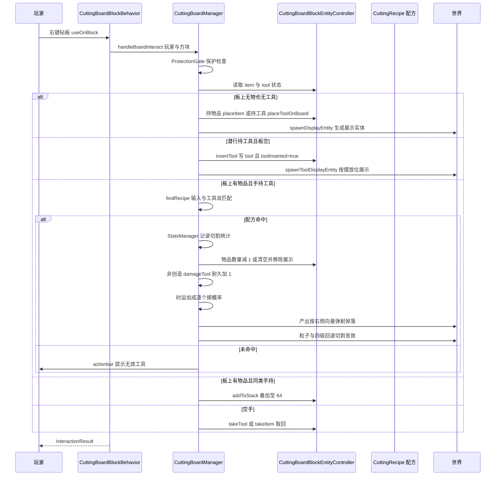
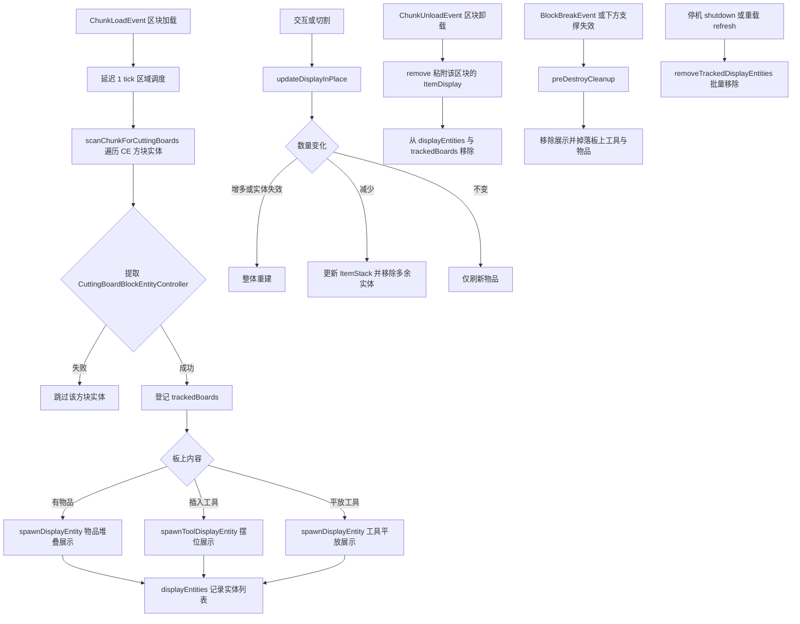
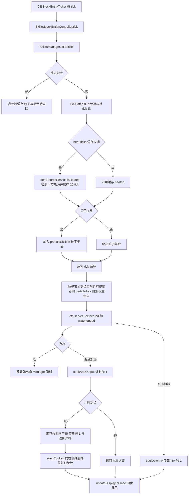
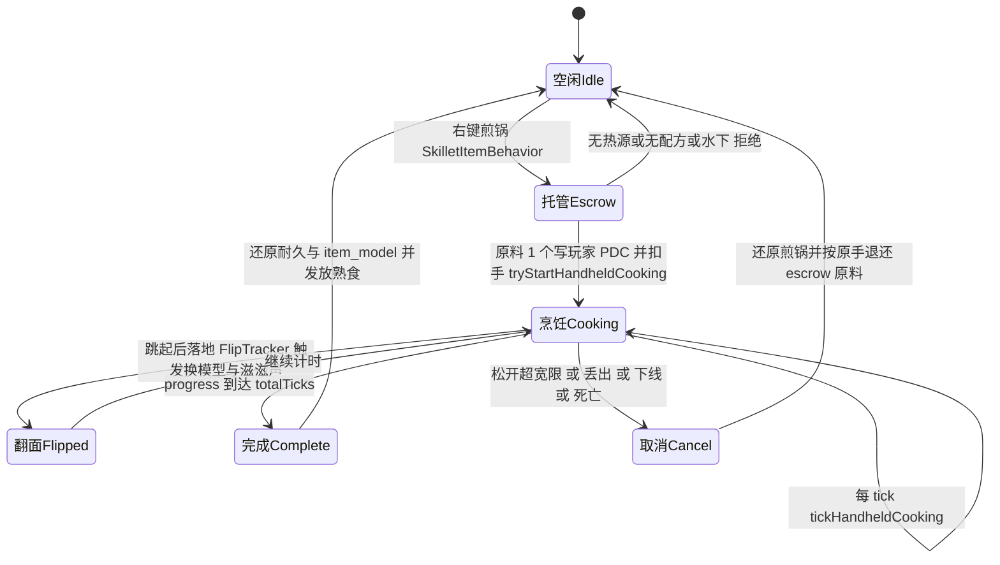
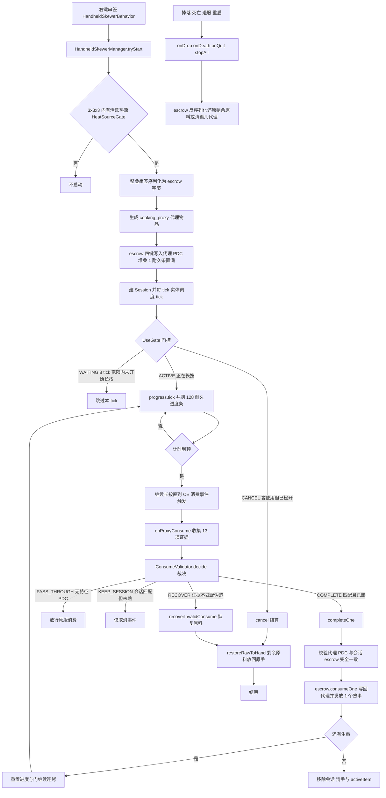
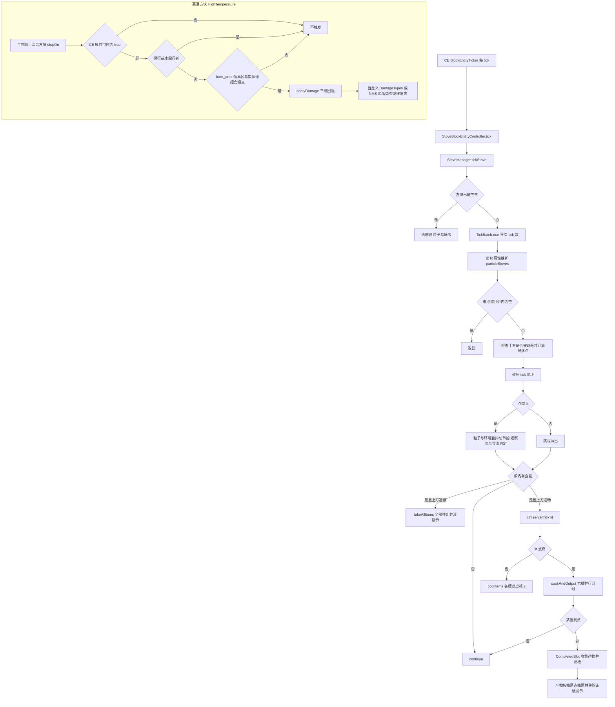

# 砧板、煎锅、串签与烤炉模块

> 砧板 Cutting：放置物品与工具，用工具右键完成配方切割，支持漏斗与发射器自动化，产出向方块右侧弹出。
> 煎锅 Skillet：方块形态为单槽热源烹饪器（复用原版营火配方），手持形态为长按烹饪 + 跳跃翻面 + 耐久进度条。
> 串签 Skewer：手持烹饪代理物品机制，将整叠原料托管进 Escrow，逐串烤熟逐串产出，全程防作弊与断线恢复。
> 烤炉 Stove：六槽营火式烹饪方块，带火焰粒子、环境音、六点物品展示；配套高温方块 HighTemperature 踩踏伤害行为。

> 文件数：34 个 Java 文件（cutting 5 / skillet 12 / skewer 11 / stove 6）
> 总行数：6036 行（cutting 1833 / skillet 2027 / skewer 995 / stove 1181）

---

## 1. 模块概览

四个机制全部构建在 CraftEngine（CE）自定义方块体系之上，共享同一套四层架构模式：

- **BlockBehavior**（继承 `BukkitBlockBehavior`，实现 `EntityBlock`）：通过 `BlockBehaviors.register` 注册到 CE，负责创建方块实体控制器、拦截 CE 层的 `useOnBlock` / `onPlace` / `updateShape` / `neighborChanged` / `stepOn` 等 NMS 钩子，并把调用转交给 Manager 单例。
- **BlockEntityController**（继承 CE `BlockEntityController`）：方块的持久化状态载体（物品槽、烹饪进度），实现 `saveCustomData` / `loadCustomData` NBT 序列化与 `createBlockEntityTicker` 每 tick 回调，tick 回调再委托给 Manager。
- **Manager**（实现 Bukkit `Listener`）：业务大脑。持有 `static volatile instance` 单例供 Behavior 反查；用 `ConcurrentHashMap` 跟踪已知方块位置与 ItemDisplay 展示实体；监听区块加载/卸载、方块放置/破坏、玩家加入/退出等 Bukkit 事件；全部调度经 CCScheduler（Folia 区域/实体调度器）。
- **ItemBehavior**（煎锅 / 串签持有）：注册到 CE 的物品行为，拦截 `use` / `useOnBlock` 触发手持玩法，再委托给对应 Manager。

展示实体（ItemDisplay）统一为非持久化，靠"区块加载扫描 CE 方块实体重建、区块卸载移除"维持生命周期；烹饪计时统一采用 TickBatch 批处理（跳过未到期的 tick）；粒子与音效统一经 ParticleThrottle + ParticleVisibility 限流。

```mermaid
graph TD
    subgraph Cutting cutting 砧板
        CBB[CuttingBoardBlockBehavior]
        CBEC[CuttingBoardBlockEntityController]
        CBM[CuttingBoardManager]
        CR[CuttingRecipe 配方记录]
        TP[ToolPosition 工具摆放位]
        CBB --> CBEC
        CBB --> CBM
        CBM --> CBEC
        CBM --> CR
        CBM --> TP
    end

    subgraph Skillet skillet 煎锅
        SBB[SkilletBlockBehavior]
        SBEC[SkilletBlockEntityController]
        SIB[SkilletItemBehavior]
        SM[SkilletManager]
        IMG[ItemModelGenerator]
        IMAN[ItemModelManifest]
        HSML[HandheldSkilletModelLayout]
        FT[HandheldSkilletFlipTracker]
        HP[HandheldSkilletProgress]
        HPB[HandheldSkilletProgressBar]
        SCT[SkilletCookingTime]
        SH[SkilletHand]
        SBB --> SBEC
        SBB --> SM
        SIB --> SM
        SBEC --> SM
        SM --> FT
        SM --> HP
        SM --> HPB
        SM --> SCT
        SM --> IMG
        SM --> SH
        IMG --> HSML
        IMG --> IMAN
    end

    subgraph Skewer skewer 串签
        HSB[HandheldSkewerBehavior]
        HSM[HandheldSkewerManager]
        UG[HandheldSkewerUseGate]
        ESC[HandheldSkewerEscrow]
        CV[HandheldSkewerConsumeValidator]
        SP[HandheldSkewerProgress]
        SPP[HandheldSkewerSettingsParser]
        SS[HandheldSkewerStackState]
        SPB[HandheldSkewerProgressBar]
        PMG[HandheldSkewerProxyMoveGuard]
        SD[ShutdownDispatch]
        HSB --> HSM
        HSM --> UG
        HSM --> ESC
        HSM --> CV
        HSM --> SP
        HSM --> SPP
        HSM --> SS
        HSM --> SPB
        HSM --> PMG
        HSM --> SD
        ESC --> SS
    end

    subgraph Stove stove 烤炉
        STB[StoveBlockBehavior]
        STC[StoveBlockEntityController]
        STM[StoveManager]
        SBA[StoveBurnArea]
        HTB[HighTemperatureBlockBehavior]
        HDK[HighTemperatureDamageKeys]
        STB --> STC
        STB --> STM
        STC --> STM
        HTB --> SBA
        HTB --> HDK
    end
```

注册入口均在主类 `PapersDelight.java`（L223-243）装配：`CuttingBoardManager` L223、`ItemModelGenerator` L226、`SkilletManager` L234、`HandheldSkewerManager` L238、`StoveManager` L243；四个 BlockBehavior 的静态 `register` 由 CE 加载流程触发。

---

## 2. 类与函数目录

### 2.1 CuttingBoardManager（`mechanic/cutting/CuttingBoardManager.java`，1533 行）

**职责**：砧板机制的全部业务逻辑——交互决策树、切割执行、配方与音效运行时状态、ItemDisplay 展示实体生命周期、漏斗/发射器自动化、区块扫描恢复。

**继承/接口**：`implements Listener`。监听的 Bukkit 事件：
- `PlayerInteractEvent`（`onShiftToolInteract`，HIGH 优先级，潜行+主手右键砧板的兜底路径）
- `BlockBreakEvent`（`onBlockBreak`）
- `ChunkLoadEvent` / `ChunkUnloadEvent`（`onChunkLoad` / `onChunkUnload`，展示实体恢复与清理）
- `BlockDispenseEvent`（`onDispense`，发射器切割）

**关键字段**：
| 字段 | 类型 | 说明 |
| --- | --- | --- |
| SCHEDULER | CCScheduler 静态 | Folia 安全调度入口 |
| plugin | JavaPlugin | 插件实例 |
| hopperScheduler | HopperScheduler | 漏斗任务调度函数接口，可测试注入 |
| runtimeState | volatile CuttingRuntimeState | 配方+设置+默认工具匹配器的不可变快照 |
| displayEntities | Map of Location to List of ItemDisplay | 每个砧板的展示实体（ConcurrentHashMap） |
| instance | static 包私有 | 供 BlockBehavior 反查的单例 |
| trackedBoards | Set of Location | 已知砧板位置，漏斗 tick 遍历用 |
| hopperTask / hopperGeneration / hopperTickRuns | CCTask / long / int | 漏斗定时任务 + 代际失效计数 |
| recentlyPlaced | Set of Location | 刚放置的砧板位置，2 tick 内禁止交互 |

**内部类型**：`RuntimeSettings`（record，L85-121，工具音效/默认工具/工具摆放位/音效/音量音调回退/漏斗开关）；`HopperScheduler`（函数接口，L123-126）；`CuttingRuntimeState`（record，L128-142）；`RuntimeSnapshot`（L144-158，reload 交接快照）；`BlockEntityControllerRef`（L1208-1211，controller.let 回调收容器）；`ToolPositions`（record，L1510-1511）。

**方法清单**：
| 方法 | 签名 | 行号 | 行为说明 |
| --- | --- | --- | --- |
| 构造器 | CuttingBoardManager(JavaPlugin plugin) | 73 | 对外构造器：默认用全局区域调度器每 8 tick 跑一次漏斗任务 |
| 构造器 | CuttingBoardManager(JavaPlugin plugin, HopperScheduler hopperScheduler) | 80 | 测试构造器：注入自定义调度函数 |
| captureRuntimeState | synchronized RuntimeSnapshot captureRuntimeState() | 160 | 捕获当前运行时状态、漏斗任务是否活跃与实例引用，供热重载交接 |
| restoreRuntimeState | synchronized void restoreRuntimeState(RuntimeSnapshot snapshot) | 164 | 按快照恢复：需要时重建/停掉漏斗任务（代际+1 失效旧任务）、回滚 state 与 instance |
| reloadRuntimeSettings | RuntimeSettings reloadRuntimeSettings() | 193 | 从 ConfigManager 读 cutting_board.* 音效、tool_sounds、default_tools、fallback 音量音调、insertable_tools.yml 摆放位与漏斗开关 |
| currentRuntimeSettings | RuntimeSettings currentRuntimeSettings() | 226 | 返回当前生效设置 |
| publishRuntimeConfig | synchronized void publishRuntimeConfig(List of CuttingRecipe, RuntimeSettings) | 230 | 发布新配方与设置：无工具配方补默认工具、构建默认工具匹配器、校验 tag、按需启停漏斗任务（代际保护） |
| withDefaultTools | static CuttingRecipe withDefaultTools(CuttingRecipe, List of String) | 272 | 配方未声明工具时用全局默认工具列表重建配方 |
| cancelHopperTaskBestEffort | void cancelHopperTaskBestEffort(CCTask task) | 279 | 尽力取消旧漏斗任务，失败仅告警（旧代际已失效） |
| validateRecipeTags | void validateRecipeTags(List of CuttingRecipe) | 291 | 检查配方里 #tag 是否在 Bukkit Tag 或 CE 物品中存在，未定义则汇总告警 |
| normalizeToolExpressions | static List of String normalizeToolExpressions(List of String) | 324 | 批量规范化工具表达式 |
| normalizeToolExpression | static String normalizeToolExpression(String) | 329 | 将旧写法 #minecraft:shears 归一为 minecraft:shears |
| countRecipes | int countRecipes() | 336 | 当前配方数 |
| getRecipes | List of CuttingRecipe getRecipes() | 340 | 当前配方列表（含 GUI 配方浏览器消费） |
| runtimeSettingsForTests | RuntimeSettings runtimeSettingsForTests() | 344 | 测试口：读设置 |
| hasHopperTaskForTests | boolean hasHopperTaskForTests() | 348 | 测试口：漏斗任务是否存在 |
| hopperGenerationForTests | long hopperGenerationForTests() | 352 | 测试口：当前代际 |
| hopperTickRunsForTests | int hopperTickRunsForTests() | 356 | 测试口：tick 执行计数 |
| hopperTaskForTests | CCTask hopperTaskForTests() | 360 | 测试口：任务引用 |
| isBukkitTag | static boolean isBukkitTag(String tag) | 364 | 用 Bukkit.getTag 检查物品 tag 是否存在，异常时宽容返回 true |
| isCeTag | static boolean isCeTag(String tag) | 374 | 遍历 CE 已加载物品检查 tag 是否定义，异常/未加载时宽容返回 true |
| markPlaced | void markPlaced(Location location) | 390 | 记录刚放置的砧板并 2 tick 后自动移出 recentlyPlaced |
| isRecentlyPlaced | boolean isRecentlyPlaced(Location location) | 397 | 是否刚放置（防放置瞬间误交互） |
| preDestroyCleanup | void preDestroyCleanup(Location loc) | 401 | 破坏前清理：移除展示实体与追踪、把砧板上的工具/物品掉落到世界上 |
| onShiftToolInteract | void onShiftToolInteract(PlayerInteractEvent event) | 429 | 事件处理器：主手右键+潜行且目标是砧板时走 handleBoardInteract，SUCCESS/FAIL 时取消事件 |
| handleBoardInteract | InteractionResult handleBoardInteract(Player player, Block block) | 448 | 核心交互决策树：保护检查→潜行持配置工具→插工具；板上有物品时持工具切割/同类物品叠放/空手取工具或物品；板上仅有工具时空手取回；空板放工具或物品 |
| onBlockBreak | void onBlockBreak(BlockBreakEvent event) | 523 | 事件处理器：砧板被破坏时执行 preDestroyCleanup |
| onChunkLoad | void onChunkLoad(ChunkLoadEvent event) | 533 | 事件处理器：延迟 1 tick 经区域调度扫描该区块恢复砧板与展示实体 |
| onChunkUnload | void onChunkUnload(ChunkUnloadEvent event) | 543 | 事件处理器：移除该区块内全部砧板展示实体与追踪记录 |
| placeItem | void placeItem(Player, Block, ctrl, ItemStack held) | 561 | 放置物品：整叠克隆进方块实体、触发比较器、生成展示实体、挥手+播放放置音效 |
| addToStack | void addToStack(Player, Block, ctrl, ItemStack held) | 573 | 叠加同类物品至上限 64，更新展示与比较器 |
| placeToolOnBoard | void placeToolOnBoard(Player, Block, ctrl, ItemStack held) | 591 | 工具平放：清空板上内容、数量置 1、toolInserted=false、非创造扣手持 |
| insertTool | void insertTool(Player, Block, ctrl, ItemStack held) | 612 | 潜行插入工具：toolInserted=true、清物品、用 spawnToolDisplayEntity 按摆放位展示、播放插入音效 |
| takeItem | void takeItem(Player, Block, ctrl) | 631 | 空手取走板上物品：清实体、入背包溢出掉落、取物音效 |
| takeTool | void takeTool(Player, Block, ctrl) | 646 | 取回工具：同上，掉落点改为玩家脚下 |
| tryCut | void tryCut(Player, Block, ctrl, ItemStack tool) | 662 | 切割执行：findRecipe 匹配失败发 actionbar 提示；记统计；数量-1 或清空；非创造 damageTool；按朝向计算右侧弹射向量；时运加成逐个掷概率；掉落产出+粒子；四级回退选切割音效（配方音效→工具音效→剪刀/刀默认→方块/木头破坏音） |
| onDispense | void onDispense(BlockDispenseEvent event) | 786 | 事件处理器：dispenser_cutting 开启时，发射器朝向砧板则取消默认发射，匹配配方成功后经区域调度执行 executeDispenserCut |
| executeDispenserCut | void executeDispenserCut(Block, ctrl, Block dispenser, ItemStack toolSnapshot, match, boardItem, state) | 815 | 发射器切割：更新板上数量、在发射器背包中找到该工具扣耐久、掉落产出与音效（无玩家参与） |
| isBlockDisplayItem | boolean isBlockDisplayItem(ItemStack item) | 904 | 按 item_display_overrides / block_display_overrides 判定用方块模型还是物品模型展示 |
| spawnDisplayEntity | void spawnDisplayEntity(Block block, ItemStack item) | 913 | 生成展示实体：先移除旧的；按 display/display_block 配置读位移缩放旋转；按数量用位置哈希种子随机堆叠偏移；逐个 spawn ItemDisplay 并记录；失败回滚并 severe 告警 |
| removeDisplayEntity | void removeDisplayEntity(Location loc) | 993 | 移除记录中的展示实体，并在区块已加载时清除方块附近 0.75 半径内游离的 ItemDisplay（自愈） |
| updateDisplayInPlace | void updateDisplayInPlace(Block block, ItemStack item) | 1016 | 原地更新展示：无有效实体则重建；数量增多重建；否则更新物品、数量减少移除多余实体 |
| spawnToolDisplayEntity | void spawnToolDisplayEntity(Block block, ItemStack tool) | 1048 | 按工具 ID 匹配 toolPositions 摆放位（逐字段三级回退：指定→默认→display 配置），单实体展示插入的工具 |
| getFacing | static String getFacing(Block block) | 1120 | 读 CE 自定义方块 facing 属性，缺省 north |
| getDisplayYaw | static float getDisplayYaw(String facing) | 1133 | 朝向到展示 yaw 角映射 east 270 / south 180 / west 90 / north 0 |
| getModelCount | static int getModelCount(ItemStack stack) | 1142 | 展示模型数 = 1 + ceil(数量/最大堆叠 × 4)，模拟堆叠观感 |
| findRecipe | CuttingRecipe findRecipe(ItemStack boardItem, ItemStack tool, CuttingRuntimeState state) | 1147 | 线性匹配：输入匹配器 + 工具匹配器同时命中 |
| matchesTool | boolean matchesTool(ItemStack stack, CuttingRecipe recipe) | 1157 | 用配方 toolsMatcher 匹配工具 |
| isConfiguredTool | boolean isConfiguredTool(ItemStack stack, CuttingRuntimeState state) | 1161 | 是否为"配置工具"：默认工具、任一配方工具、或 insertable_tools.yml 摆放位工具 |
| isShears | boolean isShears(ItemStack stack) | 1176 | 原版或 CE 剪刀判定 |
| getController | CuttingBoardBlockEntityController getController(Block block) | 1182 | 经 CE 世界读方块实体并提取控制器，异常告警返回 null |
| getController | CuttingBoardBlockEntityController getController(BlockEntity blockEntity) | 1197 | 用 controller.let 反射式提取 CuttingBoardBlockEntityController |
| isVoid | static boolean isVoid(ItemStack stack) | 1213 | null/AIR/空叠判定 |
| damageTool | static void damageTool(ItemStack tool) | 1217 | 工具耐久 +1，达到上限则整叠 -1（损坏），支持自定义 maxDamage |
| playSound | void playSound(Block block, SoundConfig cfg) | 1239 | 在方块中心播放配置音效 |
| getMsg | String getMsg(String key, String fallback) | 1246 | 读配置消息 |
| copyAllJarRecipes | void copyAllJarRecipes(File recipeDir, String resourceDir) | 1250 | 从 jar 内复制默认配方 yml 到数据目录（仅不存在时），失败静默 |
| hopperTick | void hopperTick(long generation) | 1277 | 漏斗周期：代际校验→按区块分组→每组一次区域任务批量处理，避免跨区域跳跃 |
| chunkKey | static long chunkKey(Location loc) | 1294 | 世界 UUID 混入的区块键 |
| isHopperGenerationActive | boolean isHopperGenerationActive(long generation) | 1300 | 代际一致 + 任务存在 + 设置开启 + instance 是自己 |
| processHopperAt | void processHopperAt(Location loc) | 1307 | 单砧板漏斗处理：区块已加载才执行，控制器失效则移除追踪；先推后拉 |
| hopperPushInto | void hopperPushInto(Block board, ctrl) | 1322 | 上方漏斗下推；侧向漏斗需朝向砧板才推；板上有工具时不推 |
| tryPushFrom | boolean tryPushFrom(Block hopperBlock, BlockFace face, ctrl, Block board) | 1341 | 从漏斗容器取一格：同类叠加或首件入板，扣漏斗槽位、更新展示与比较器 |
| hopperPullFrom | void hopperPullFrom(Block board, ctrl) | 1382 | 板下方漏斗拉取板上物品 |
| tryPullTo | boolean tryPullTo(Block hopperBlock, Block board, ctrl) | 1389 | 向漏斗容器添加 1 个板上物品，成功则板上数量 -1 并更新展示 |
| refreshDisplayEntities | void refreshDisplayEntities() | 1417 | 清空全部追踪的展示实体（供重载） |
| shutdown | synchronized void shutdown() | 1421 | 停机：代际+1、清任务、重置状态、清展示实体与全部追踪集合 |
| removeTrackedDisplayEntities | void removeTrackedDisplayEntities() | 1433 | 逐个移除展示实体：插件已禁用时同步 remove，否则经实体调度器 |
| triggerComparatorUpdate | static void triggerComparatorUpdate(Block block) | 1447 | block.getState().update 触发比较器刷新 |
| scanChunkForCuttingBoards | void scanChunkForCuttingBoards(World world, int chunkX, int chunkZ) | 1451 | 遍历区块 CE 方块实体：登记 trackedBoards；有物品生成物品展示，有工具按是否插入选择工具展示 |
| loadDisplayEntitiesForAllLoadedChunks | void loadDisplayEntitiesForAllLoadedChunks() | 1474 | 启动/重载时对所有已加载区块排队扫描 |
| readToolPositions | ToolPositions readToolPositions() | 1484 | 读取/首次释放 insertable_tools.yml，解析默认与逐工具摆放位 |
| parseToolPosition | ToolPosition parseToolPosition(ConfigurationSection sec) | 1513 | 七字段可选解析为 ToolPosition |
| dblIfSet | static Double dblIfSet(ConfigurationSection sec, String key) | 1525 | 键存在才返回 Double 否则 null |
| removeDisplayEntityAt | void removeDisplayEntityAt(Location loc) | 1530 | 对外口：移除指定位置展示实体 |

### 2.2 CuttingBoardBlockBehavior（`mechanic/cutting/CuttingBoardBlockBehavior.java`，136 行）

**职责**：CE 方块行为——注册 papersdelight:cutting_board、创建方块实体控制器、把 CE 交互/放置/形状更新钩子转发给 Manager、提供比较器模拟输出。

**继承/接口**：`extends BukkitBlockBehavior implements EntityBlock`。不直接监听 Bukkit 事件，重写 CE 行为钩子 `useOnBlock` / `useWithoutItem` / `onPlace` / `updateShape` / `hasAnalogOutputSignal` / `getAnalogOutputSignal`。

**关键字段**：`FACTORY`（L26，行为工厂常量）；`hasComparator`（L32，是否提供比较器输出）；`controllerId`（L33，CE 分配的控制器 id）。

**方法清单**：
| 方法 | 签名 | 行号 | 行为说明 |
| --- | --- | --- | --- |
| register | static void register() | 28 | 向 CE BlockBehaviors 注册 papersdelight:cutting_board 工厂 |
| 构造器 | CuttingBoardBlockBehavior(BlockDefinition, boolean hasComparator) | 35 | 存方块定义与比较器开关 |
| createBlockEntityController | BlockEntityController createBlockEntityController(BlockEntity) | 41 | 为每个方块实体创建 CuttingBoardBlockEntityController |
| initControllerId | void initControllerId(int id) | 46 | 记录 CE 控制器 id |
| useOnBlock | InteractionResult useOnBlock(UseOnContext, ImmutableBlockState) | 51 | CE 右键钩子：取 Bukkit Player 与 Block 后转交 CuttingBoardManager.handleBoardInteract |
| useWithoutItem | InteractionResult useWithoutItem(UseOnContext, ImmutableBlockState) | 67 | 空手路径直接 PASS |
| onPlace | void onPlace(Object thisBlock, Object[] args) | 72 | NMS 放置钩子：经 NMSHelper 取世界与坐标，通知 Manager.markPlaced |
| updateShape | Object updateShape(Object thisBlock, Object[] args) | 83 | 下方方块变空/液体时调用 preDestroyCleanup（支撑失效自动清理），再走父类逻辑 |
| hasAnalogOutputSignal | boolean hasAnalogOutputSignal(Object, Object[]) | 103 | 返回 hasComparator |
| getAnalogOutputSignal | int getAnalogOutputSignal(Object, Object[]) | 108 | 比较器输出：物品数量/堆叠上限比例映射为 floor(比例×14)+1 |
| Factory.create | CuttingBoardBlockBehavior create(BlockDefinition, ConfigSection) | 131 | 内部工厂：读 has_comparator 配置（默认 true）构造行为 |

### 2.3 CuttingBoardBlockEntityController（`mechanic/cutting/CuttingBoardBlockEntityController.java`，114 行）

**职责**：砧板方块实体状态——板上物品槽与工具槽的存取、上限约束、NBT 持久化与脏标记。

**继承/接口**：`extends BlockEntityController`（CE）。无 Bukkit 事件。

**关键字段**：`item`（L13，板上物品）；`tool`（L14，板上工具）；`toolInserted`（L15，工具是否为插入姿态）；`SLOT_LIMIT = 64`（L21）。

**方法清单**：
| 方法 | 签名 | 行号 | 行为说明 |
| --- | --- | --- | --- |
| 构造器 | CuttingBoardBlockEntityController(BlockEntity) | 17 | 传方块实体给父类 |
| item | ItemStack item() | 23 | 读板上物品 |
| item | void item(ItemStack itemIn) | 24 | 写物品：空即清 null；克隆并截断到 min(64, 最大堆叠)；标记脏 |
| tool | ItemStack tool() | 38 | 读工具 |
| tool | void tool(ItemStack toolIn) | 39 | 写工具：克隆、数量强制 1；标记脏 |
| isToolInserted | boolean isToolInserted() | 45 | 工具是否插入姿态 |
| setToolInserted | void setToolInserted(boolean inserted) | 46 | 设置姿态并标记脏 |
| hasItem | boolean hasItem() | 51 | 有非空物品 |
| hasTool | boolean hasTool() | 52 | 有非空工具 |
| saveCustomData | void saveCustomData(CompoundTag tag) | 55 | 物品/工具双通道持久化：serializeAsBytes 主通道 + cutting_item_id 等字符串 ID 兜底通道；工具附 inserted 标志 |
| loadCustomData | void loadCustomData(CompoundTag tag) | 76 | 优先字节反序列化，失败用 ID+数量经 CraftEngineUtil.createItem 重建；恢复 inserted |
| markUnsaved | void markUnsaved() | 106 | 将所在 CE 区块标记为未保存，确保落盘 |

### 2.4 ToolPosition（`mechanic/cutting/ToolPosition.java`，26 行）

**职责**：插入工具在砧板上的展示摆放位（7 个可选 Double 分量）。

**继承/接口**：record，无事件。

**关键字段**：translateX / translateY / translateZ / scale / rotationY / rotationPitch / rotationRoll（L4-10，全为 Double 可空）。

**方法清单**：
| 方法 | 签名 | 行号 | 行为说明 |
| --- | --- | --- | --- |
| builder | static Builder builder() | 13 | 创建建造者 |
| Builder.tx / ty / tz / scale / ry / rp / rr | Builder tx(Double) 等 | 17-23 | 链式设置各分量 |
| Builder.build | ToolPosition build() | 24 | 组装不可变 ToolPosition |

### 2.5 CuttingRecipe（`mechanic/cutting/CuttingRecipe.java`，24 行）

**职责**：切割配方记录——输入、工具列表、带概率产出、可选音效与来源。

**继承/接口**：record，无事件。

**关键字段**：input（输入表达式）；tools（工具表达式列表）；results（ItemResult 列表，含 chance/count）；sound（可空 SoundConfig）；source（配方来源描述）；inputMatcher / toolsMatcher（预编译匹配器）。

**方法清单**：
| 方法 | 签名 | 行号 | 行为说明 |
| --- | --- | --- | --- |
| 紧凑构造器 | CuttingRecipe 严格初始化 | 13 | 拷贝列表防改；matcher 为空时由表达式延迟编译（ItemMatcher.of / anyOf） |
| 便捷构造器 | CuttingRecipe(String, List, List, SoundConfig, String) | 20 | 供外部只给表达式、matcher 走默认编译 |

### 2.6 SkilletManager（`mechanic/skillet/SkilletManager.java`，1032 行）

**职责**：煎锅双形态总管——方块煎锅的交互/热源烹饪 tick/展示实体/粒子音效/支架属性维护；手持煎锅的会话建立、escrow 托管、进度条（耐久条）、翻面追踪与产物发放。

**继承/接口**：`implements Listener`。监听事件：
- `PlayerItemConsumeEvent`（`onHandheldSkilletConsume`，禁止吃掉煎锅）
- `PlayerJoinEvent` / `PlayerQuitEvent`（恢复进度与 escrow / 取消会话）
- `PlayerDropItemEvent`（丢弃煎锅即还原并取消）
- `PlayerJumpEvent`（Paper 事件，翻面起跳记录）
- `PlayerDeathEvent`（死亡结算 escrow 与进度还原）
- `ChunkLoadEvent` / `ChunkUnloadEvent`（扫描与清理）
- `BlockPlaceEvent`（必须潜行才允许放置方块煎锅）
- `BlockBreakEvent`（掉落锅内食物与原始煎锅物品）

**关键字段**：
| 字段 | 类型 | 说明 |
| --- | --- | --- |
| instance | static volatile | 单例，供 Behavior/Controller 反查 |
| knownSkillets | Set of Location | 已知方块煎锅 |
| displayEntities | Map of Location to List of ItemDisplay | 食物展示实体 |
| displayedSignatures | Map of Location to ItemStack | R7 显示签名：展示实体当前渲染的存储堆快照（私有克隆）；物品未变时跳过逐实体刷新 |
| particleSkillets | Set of Location | 正在加热（出粒子）的煎锅 |
| restored | Set of Location | 本轮区块扫描已恢复过展示的位置 |
| handheldSessions | Map of UUID to HandheldSession | 每玩家手持会话 |
| handheldIngredientKey / handheldSkilletOriginalDamageKey / handheldSkilletOriginalItemModelKey | NamespacedKey | escrow 与进度还原的 PDC 键 |
| handheldIngredientModels | ItemModelGenerator | 原料模型解析 |
| handheldCookingSupported | volatile boolean | 版本/特性门控 |
| config | volatile SkilletConfig | 煎锅配置快照 |
| HEAT_CACHE_TICKS | static final int = 10 | 热源检测缓存 tick 数 |

**内部类型**：`HandheldSession`（L499-526：skilletHand / ingredientHand / result / progress / 默认与翻转模型 / flip 追踪器 / activeUseGraceTicks / flipped / lastDisplayedStage / task，含 cancelTask L523）；`ControllerRef`（L987-990）。

**方法清单**：
| 方法 | 签名 | 行号 | 行为说明 |
| --- | --- | --- | --- |
| 构造器 | SkilletManager(JavaPlugin, ItemModelGenerator) | 83 | 初始化插件、模型生成器与三个 PDC 键 |
| load | void load() | 91 | 载入 SkilletConfig、判定手持特性支持（FeatureSupport + HandheldSkilletSupport 版本检查）、登记 instance、为在线玩家恢复进度与退还 escrow |
| stopAll | void stopAll() | 112 | 停机：取消全部手持会话、清粒子集合、移除全部展示实体、清空追踪 |
| discoverAllSkillets | void discoverAllSkillets() | 130 | 启动扫描：收集全部已加载区块分批扫描 |
| scanBatch | void scanBatch(List of Chunk, int start) | 137 | 每批 4 个区块经区域调度扫描，2 tick 后续批，完成后置 initialScanDone |
| isHandheldCookingSupported | boolean isHandheldCookingSupported() | 150 | 手持玩法是否可用 |
| tryStartHandheldCooking | boolean tryStartHandheldCooking(Player, EquipmentSlot skilletHand) | 154 | 开启手持烹饪：已有会话返回 true；PDC 有残留 escrow 先退款并拒绝；校验手持是 farmersdelight:skillet、玩家在热源旁；另一手找营火配方，无则提示；水下拒绝；原料 1 个写入 PDC escrow 并从手上扣除；按火焰附加计算烹饪时长；建 HandheldSession；begin 进度条；玩家实体调度器每 tick 跑 tickHandheldCooking |
| tickHandheldCooking | void tickHandheldCooking(Player player) | 217 | 每 tick：校验仍在使用（activeItem+宽限 2 tick+仍是煎锅）；flip.updateLanding 检测跳起落地→播放落盘音、清 activeItem、翻面模型；progress.tick 推进；阶段变化刷耐久进度条；CONTINUE 时翻面后 2 tick 或 1/50 概率滋滋声；CANCEL 取消；COMPLETE 结算——移除会话、还原煎锅、发产物、记统计 |
| cancelHandheldCooking | void cancelHandheldCooking(Player player) | 267 | 取消：移会话、停任务、还原进度、按原手退还 escrow 原料 |
| retireHandheldCooking | void retireHandheldCooking(UUID, HandheldSession) | 275 | 任务退役回调：仅移除映射 |
| cancelAllHandheldSessions | void cancelAllHandheldSessions() | 279 | 停机批量取消 |
| beginHandheldSkilletProgress | void beginHandheldSkilletProgress(ItemStack, session, NamespacedKey ingredientModel) | 286 | 开始进度：先还原旧状态；必须是可损耗物品；PDC 存原始 damage 与原始 item_model；把煎锅 item_model 切到原料模型；刷第 0 阶段 |
| showHandheldSkilletProgress | void showHandheldSkilletProgress(ItemStack, session, int stage) | 304 | 用 HandheldSkilletProgressBar.damageFor 把阶段映射为耐久值写入物品，实现 13 段进度条 |
| flipHandheldIngredientModel | void flipHandheldIngredientModel(ItemStack, session) | 318 | 翻面：在默认/翻转原料模型间切换 item_model，成功则翻转 session.flipped |
| restoreHandheldSkilletProgress | boolean restoreHandheldSkilletProgress(ItemStack stack) | 329 | 还原单个物品：PDC 里的原始 item_model 与原始 damage 写回并清键 |
| restoreHandheldSkilletProgress | void restoreHandheldSkilletProgress(Player player) | 355 | 还原玩家整个背包 |
| getHandheldSkilletItemModel | static NamespacedKey getHandheldSkilletItemModel(ItemMeta) | 361 | 委托 ItemMetaUtil 读 item_model |
| setHandheldSkilletItemModel | static boolean setHandheldSkilletItemModel(ItemMeta, NamespacedKey) | 365 | 委托 ItemMetaUtil 写 item_model |
| setEscrowedIngredient | void setEscrowedIngredient(Player, ItemStack) | 369 | 原料序列化进玩家 PDC |
| getEscrowedIngredient | ItemStack getEscrowedIngredient(Player) | 377 | 读 PDC 反序列化；损坏则告警并清除 |
| clearEscrowedIngredient | void clearEscrowedIngredient(Player) | 396 | 清 escrow 键 |
| refundEscrowedIngredient | void refundEscrowedIngredient(Player) | 400 | 无偏好手退款重载 |
| refundEscrowedIngredient | void refundEscrowedIngredient(Player, EquipmentSlot preferredHand) | 404 | 退款：优先放回原手（空/可叠满），否则 giveOrDrop |
| giveOrDrop | static void giveOrDrop(Player, ItemStack) | 425 | 入背包溢出掉地 |
| isPlayerNearHeatSource | static boolean isPlayerNearHeatSource(Player) | 432 | 着火或周围 3x3x3 有活跃热源（HeatSourceService） |
| onHandheldSkilletConsume | void onHandheldSkilletConsume(PlayerItemConsumeEvent) | 445 | 事件：吃 farmersdelight:skillet 直接取消 |
| onHandheldSkilletJoin | void onHandheldSkilletJoin(PlayerJoinEvent) | 452 | 事件：加入时还原进度与 escrow |
| onHandheldSkilletDrop | void onHandheldSkilletDrop(PlayerDropItemEvent) | 458 | 事件：丢弃煎锅即还原该物品并取消会话 |
| onHandheldSkilletQuit | void onHandheldSkilletQuit(PlayerQuitEvent) | 464 | 事件：退出取消会话 |
| onHandheldSkilletJump | void onHandheldSkilletJump(PlayerJumpEvent) | 469 | 事件：记录翻面起跳 |
| onHandheldSkilletDeath | void onHandheldSkilletDeath(PlayerDeathEvent) | 475 | 事件：移会话停任务；保留背包则还原进度否则逐掉落物还原；escrow 原料退还背包或加入掉落 |
| ejectCooked | void ejectCooked(SkilletBlockEntityController, Block, ItemStack result) | 528 | 方块煎锅出菜：向右侧弹射掉落；按 placerUuid 记统计 |
| tickSkillet | void tickSkillet(ctrl, CEWorld, BlockPos) | 546 | 方块煎锅每 tick：空锅清粒子与展示即返回；TickBatch.due 计算应补 tick 数；热源 10 tick 缓存；粒子集合增删；逐补 tick——粒子节拍到点且附近有观察者才 particleTick、serverTick 出菜即弹射；最后同步展示实体（R7 起直取存储堆内部引用，省每 tick 防御性克隆） |
| forgetSkillet | void forgetSkillet(ctrl) | 596 | 方块卸载回调：清 knownSkillets/restored/粒子/展示 |
| blockLocation | static Location blockLocation(ctrl) | 605 | 由控制器还原 Bukkit Location |
| bukkitBlock | static Block bukkitBlock(CEWorld, BlockPos) | 614 | CE 坐标转 Bukkit 方块 |
| ejectToRightSide | void ejectToRightSide(Block block, ItemStack item) | 619 | 按朝向右侧 0.15 速度 + 0.1 向上弹射，拾取延迟 10 tick |
| onChunkLoad | void onChunkLoad(ChunkLoadEvent) | 626 | 事件：延迟 1 tick 且区块仍加载才扫描 |
| onChunkUnload | void onChunkUnload(ChunkUnloadEvent) | 636 | 事件：清该区块的煎锅追踪、粒子与展示 |
| scanChunk | void scanChunk(World, int, int) | 651 | 扫描重载（默认 1 次重试） |
| scanChunk | void scanChunk(World, int, int, int retries) | 655 | 遍历 CE 方块实体：登记 knownSkillets、updateAutomaticSupport；有存货且未恢复过才生成展示；CE 区块未就绪时 40 tick 后重试 |
| onBlockPlace | void onBlockPlace(BlockPlaceEvent) | 684 | 事件：目标是煎锅且玩家未潜行则取消（让非潜行右键保留给手持烹饪）；潜行放置则登记位置、同步支架属性并把手中煎锅物品存入控制器 |
| handleSkilletInteract | InteractionResult handleSkilletInteract(cePlayer, Block clicked, InteractionHand hand) | 704 | 交互：保护检查、登记位置；空手取菜；水淹提示；非食材提示；addItemToCook 余量不变提示失败；否则换余量、刷展示、按是否加热播放冷/热加料音 |
| onBlockBreak | void onBlockBreak(BlockBreakEvent) | 760 | 事件：清追踪；掉落锅内食物；isDropItems 时用控制器保存的原始煎锅物品替换默认掉落 |
| isMatchingHeatSource | boolean isMatchingHeatSource(Block, HeatSourceDef) | 789 | 匹配定义且点燃 |
| matchesBlockDef | boolean matchesBlockDef(Block, HeatSourceDef) | 793 | 委托 HeatSourceService.matchesBlockDef |
| isTraySource | boolean isTraySource(Block block) | 797 | 判断下方是 tray 热源，或经 conductor 传导的隔层 tray 热源（烤盘支撑判定） |
| updateAutomaticSupport | void updateAutomaticSupport(Block block) | 815 | 比对并刷新 CE 方块 support 属性（自动支架模型切换） |
| getModelCount | static int getModelCount(ItemStack stack) | 823 | 展示模型数公式（同砧板） |
| spawnDisplayEntity | void spawnDisplayEntity(Block, ItemStack item) | 836 | 生成锅内食物展示：按数量确定性随机堆叠、按朝向 yaw 与配置 pitch/scale 变换；R7 起记录显示签名 |
| updateDisplayInPlace | void updateDisplayInPlace(Block, ItemStack item) | 882 | 原地更新展示（重建/更新/裁剪）；R7 起显示签名 diff 门：物品未变（含数量）且实体齐全时跳过逐实体 clone+setItemStack（稳态每 tick 省 N 次克隆与元数据包），有效性扫描由 stream 改为普通循环零分配 |
| removeAllDisplayEntities | void removeAllDisplayEntities(Location loc) | 931 | 移除该位置全部展示并清显示签名 |
| stopParticleTask | void stopParticleTask(Location loc) | 914 | 从粒子集合移除 |
| particleTick | void particleTick(Block block) | 918 | 粒子节拍：仍加热且锅内有物才出——白烟 20% 概率；火焰附加等级触发附魔粒子；10% 概率滋滋声且经节流 |
| getController | SkilletBlockEntityController getController(Block) | 964 | 方块→控制器 |
| getController | SkilletBlockEntityController getController(BlockEntity) | 976 | controller.let 提取 |
| getDisplayYaw | static float getDisplayYaw(String facing) | 992 | 朝向转 yaw |
| shouldThrottleSound | boolean shouldThrottleSound(Block, SkilletConfig) | 1001 | 统计同区块活跃煎锅数交给 ParticleThrottle 判定是否跳过音效 |
| playSound | void playSound(Block, SoundConfig) | 1013 | 方块中心播放 |
| playSound | void playSound(Location, SoundConfig) | 1018 | 按 Folia 与否选择主线程/全局/区域调度播放，且区块已加载才播 |

### 2.7 SkilletBlockEntityController（`mechanic/skillet/SkilletBlockEntityController.java`，270 行）

**职责**：方块煎锅实体状态——单槽存货、烹饪计时、放置者、原始煎锅物品与火焰附加等级；含水强制弹出。

**继承/接口**：`extends BlockEntityController`。无 Bukkit 事件（经 ticker 驱动）。

**关键字段**：storedStack（L21）；cookingTime / cookingTimeTotal（L22-23）；placerUuid（L26）；skilletStack（L28，放置时的原物品）；fireAspectLevel（L30）；particleTicks / lastPassTick（L31-32，包私有）；heated / heatTicks（L33-34，热源缓存）。

**方法清单**：
| 方法 | 签名 | 行号 | 行为说明 |
| --- | --- | --- | --- |
| heated | boolean heated() | 36 | 读热源缓存 |
| heated | void heated(boolean) | 38 | 写热源缓存 |
| heatTicks | int heatTicks() | 40 | 读缓存剩余 tick |
| heatTicks | void heatTicks(int) | 42 | 写缓存剩余 tick |
| 构造器 | SkilletBlockEntityController(BlockEntity) | 44 | 传父类 |
| createBlockEntityTicker | BlockEntityTicker createBlockEntityTicker(CEWorld, ImmutableBlockState) | 49 | 创建指向静态 tick 的 ticker |
| tick | static void tick(CEWorld, BlockPos, ImmutableBlockState, ctrl) | 53 | ticker 入口：转发 SkilletManager.tickSkillet |
| onUnload | void onUnload() | 59 | 卸载回调：转发 forgetSkillet |
| getStoredStack | ItemStack getStoredStack() | 64 | 克隆读存货 |
| storedStackDirect | ItemStack storedStackDirect() | 69 | 包私有只读直取（R7）：仅供同包 tick 路径，调用方不得修改，快照自行 clone |
| hasStoredStack | boolean hasStoredStack() | 68 | 有存货 |
| isEmpty | boolean isEmpty() | 72 | 无存货 |
| addItemToCook | ItemStack addItemToCook(ItemStack) | 76 | 无放置者重载 |
| addItemToCook | ItemStack addItemToCook(ItemStack, UUID placer) | 80 | 入锅：已有存货或无配方则原样退回；最多 64 入锅、重置计时（SkilletCookingTime 按火焰附加缩短）、记录放置者；返回余量 |
| getPlacerUuid | UUID getPlacerUuid() | 102 | 读放置者（统计用） |
| removeItem | ItemStack removeItem() | 107 | 取出全部存货并重置计时与放置者 |
| takeItem | ItemStack takeItem() | 118 | removeItem 别名 |
| setSkilletItem | void setSkilletItem(ItemStack stack) | 122 | 保存放置时的煎锅物品并提取火焰附加等级 |
| getSkilletAsItem | ItemStack getSkilletAsItem() | 129 | 取原物品，为空则现做 farmersdelight:skillet |
| getFireAspectLevel | int getFireAspectLevel() | 136 | 读火焰附加等级 |
| serverTick | ItemStack serverTick(boolean heated, boolean waterlogged) | 140 | 逻辑 tick：空返回 null；含水整叠弹出；加热 cookAndOutput 否则 coolDown |
| cookAndOutput | private ItemStack cookAndOutput() | 161 | 烹饪：totalTime 未定先查配方（无配方弹出）；计时 +1；到点取配方产物、存货 -1、清零计时；返回产物（可 null） |
| coolDown | private void coolDown() | 195 | 不加热时每 tick 进度 -2（最低 0） |
| markUnsaved | void markUnsaved() | 200 | 标记 CE 区块未保存 |
| saveCustomData | void saveCustomData(CompoundTag tag) | 210 | 存货双通道 + cook_time/cook_time_total + placer_uuid + 原始煎锅物品字节 + fire_aspect |
| loadCustomData | void loadCustomData(CompoundTag tag) | 231 | 对称恢复；fire_aspect 为 0 且有原物品时从附魔重读 |

### 2.8 SkilletBlockBehavior（`mechanic/skillet/SkilletBlockBehavior.java`，107 行）

**职责**：CE 煎锅方块行为——注册、控制器创建、交互转发、放置/邻居变化时维护 support 属性、水淹与朝向读取。

**继承/接口**：`extends BukkitBlockBehavior implements EntityBlock`。重写 CE 钩子 `useOnBlock` / `useWithoutItem` / `onPlace` / `neighborChanged`。

**关键字段**：`FACTORY`（L24）；`controllerId`（L30）。

**方法清单**：
| 方法 | 签名 | 行号 | 行为说明 |
| --- | --- | --- | --- |
| register | static void register() | 26 | 注册 papersdelight:skillet |
| 构造器 | SkilletBlockBehavior(BlockDefinition) | 32 | 传父类 |
| createBlockEntityController | BlockEntityController createBlockEntityController(BlockEntity) | 36 | 创建 SkilletBlockEntityController |
| initControllerId | void initControllerId(int id) | 41 | 记录控制器 id |
| useOnBlock | InteractionResult useOnBlock(UseOnContext, ImmutableBlockState) | 46 | 转发 SkilletManager.handleSkilletInteract（含 InteractionHand） |
| useWithoutItem | InteractionResult useWithoutItem(UseOnContext, ImmutableBlockState) | 61 | PASS |
| onPlace | void onPlace(Object, Object[] args) | 66 | 放置钩子：登记 knownSkillets 并 updateAutomaticSupport |
| neighborChanged | void neighborChanged(Object, Object[] args) | 80 | 邻居变化钩子：重新计算 support 支架属性 |
| isWaterlogged | static boolean isWaterlogged(Block block) | 91 | 读 CE waterlogged 属性 |
| getFacing | static String getFacing(Block block) | 96 | 读 CE facing 属性，缺省 north |
| Factory.create | SkilletBlockBehavior create(BlockDefinition, ConfigSection) | 103 | 工厂构造 |

### 2.9 SkilletItemBehavior（`mechanic/skillet/SkilletItemBehavior.java`，79 行）

**职责**：CE 煎锅物品行为——非潜行使用触发手持烹饪，潜行使用保留原版放方块路径。

**继承/接口**：`extends BlockItemBehavior`。重写 CE 物品钩子 `useOnBlock` / `use`。

**关键字段**：`FACTORY`（L25）。

**方法清单**：
| 方法 | 签名 | 行号 | 行为说明 |
| --- | --- | --- | --- |
| 构造器 | private SkilletItemBehavior(Key blockId) | 27 | 传方块 id 给 BlockItemBehavior |
| useOnBlock | InteractionResult useOnBlock(UseOnContext context) | 32 | 对着方块右键：手持玩法不支持或玩家潜行→走父类放方块；否则 startCooking |
| use | InteractionResult use(World, Player, InteractionHand) | 47 | 空处右键：startCooking |
| startCooking | static InteractionResult startCooking(Player, InteractionHand hand) | 52 | 转 Bukkit Player 与 EquipmentSlot，调 tryStartHandheldCooking，成功 SUCCESS 否则 PASS |
| register | static void register() | 63 | 注册 papersdelight:skillet_item 物品行为 |
| Factory.create | SkilletItemBehavior create(Pack, Path, Key, ConfigSection section) | 69 | 工厂：block 配置为内联 section 时挂 pending 配置，否则按 identifier 构造 |

### 2.10 ItemModelGenerator（`mechanic/skillet/ItemModelGenerator.java`，252 行）

**职责**：为手持煎锅动态生成原料/翻面原料的 CE 资源包模型（composite 模型叠加），并维护生成清单 manifest 以便增量清理与重启恢复。

**继承/接口**：`implements Listener`。监听 `CraftEngineReloadEvent`（`onCraftEngineReload`）。

**关键字段**：NAMESPACE 等 7 个静态常量（L30-36，含新旧 manifest 与包名）；plugin（L38）；generatedDefinitions（L39，volatile，已生成定义集合）。

**方法清单**：
| 方法 | 签名 | 行号 | 行为说明 |
| --- | --- | --- | --- |
| 构造器 | ItemModelGenerator(Plugin plugin) | 41 | 存插件 |
| onCraftEngineReload | void onCraftEngineReload(CraftEngineReloadEvent event) | 45 | 事件：首次 reload 只从 manifest 恢复定义集合，非首次执行完整重建 |
| refreshGeneratedDefinitions | synchronized void refreshGeneratedDefinitions() | 51 | 读 CraftEngine resources 下新旧 manifest 恢复 generatedDefinitions，失败降级为空集合并告警 |
| regenerate | synchronized boolean regenerate() | 70 | 版本支持检查→删除旧 pd_skillet_model 包→建 pd_generated_model 包与 pack.yml→写 fallback.json→对每个 layout 写 4 个 json→replaceManifest→更新定义集合；异常保留旧资源并告警 |
| itemDefinitionFor | NamespacedKey itemDefinitionFor(ItemStack stack) | 106 | 原料物品→原料 item 定义键 |
| flippedItemDefinitionFor | NamespacedKey flippedItemDefinitionFor(ItemStack stack) | 110 | 原料物品→翻面定义键 |
| definitionFor | private NamespacedKey definitionFor(ItemStack, boolean flipped) | 114 | 由 item_model 解析 layout；未生成或非法时回退 fallback 定义 |
| collectLayouts | private Set of HandheldSkilletModelLayout collectLayouts() | 128 | 遍历 Bukkit 营火配方收集候选原料（ExactChoice/MaterialChoice），再叠加 CE 自定义物品中能命中配方的候选；逐个解析为 layout，非法键告警跳过 |
| addChoiceCandidates | static void addChoiceCandidates(RecipeChoice, Collection of ItemStack) | 160 | 把配方选择器展开为候选物品 |
| legacyGeneratedPackExists | boolean legacyGeneratedPackExists() | 168 | 旧生成包是否存在 |
| deleteLegacyGeneratedPack | void deleteLegacyGeneratedPack() | 173 | 递归删除旧包目录 |
| generatedPackRoot | Path generatedPackRoot() | 191 | 确保生成包目录与 pack.yml 存在，返回 resourcepack 根 |
| itemModel | static String itemModel(ItemStack stack) | 210 | 取 item_model 组件键，无则用材质键 |
| replaceManifest | static void replaceManifest(Path root, Set of String generatedFiles) | 216 | 对比新旧 manifest 删除不再生成的 farmersdelight 前缀文件、迁除旧 manifest、原子写新 manifest |
| write | static void write(Path file, String content) | 231 | 临时文件 + ATOMIC_MOVE 原子写 |
| fallbackJson | static String fallbackJson() | 242 | 兜底 composite 模型 JSON 文本 |

### 2.11 ItemModelManifest（`mechanic/skillet/ItemModelManifest.java`，42 行）

**职责**：manifest 行（生成文件相对路径）与 CE item 定义键之间的纯函数转换。

**继承/接口**：包私有工具类，无事件。

**关键字段**：NAMESPACE / ASSET_PREFIX / DEFINITION_ROOT 常量（L13-15）。

**方法清单**：
| 方法 | 签名 | 行号 | 行为说明 |
| --- | --- | --- | --- |
| definitionFromManifestFile | static Optional of String definitionFromManifestFile(String generatedFile) | 20 | 校验前缀与 .json 后缀后裁剪出 farmersdelight:handheld_skillet/... 定义键 |
| restoreDefinitions | static Set of String restoreDefinitions(List of Path manifests) | 32 | 读多个 manifest 文件汇总定义集合（不可变） |

### 2.12 HandheldSkilletModelLayout（`mechanic/skillet/HandheldSkilletModelLayout.java`，127 行）

**职责**：由原料 item model 键推导生成文件的路径与模型 JSON（含安全校验），是生成器的布局计算单元。

**继承/接口**：包私有类，无事件。

**关键字段**：OUTPUT_NAMESPACE / NAMESPACE / PATH 正则（L7-9）；sourceNamespace / sourcePath（L11-12）。

**方法清单**：
| 方法 | 签名 | 行号 | 行为说明 |
| --- | --- | --- | --- |
| fromItemModel | static HandheldSkilletModelLayout fromItemModel(String itemModel) | 19 | 解析 ns:path：冒号唯一、命名空间与路径字符白名单、拒绝 // 与 ..（防路径穿越），去掉 item/ 前缀 |
| parentModel | String parentModel() | 34 | 原料父模型键 |
| itemDefinition | String itemDefinition() | 38 | 原料 item 定义键 |
| flippedItemDefinition | String flippedItemDefinition() | 42 | 翻面 item 定义键 |
| derivedModel | String derivedModel() | 46 | 派生模型键（原料） |
| flippedDerivedModel | String flippedDerivedModel() | 50 | 派生模型键（翻面） |
| modelFile | String modelFile() | 54 | 模型文件相对路径 |
| flippedModelFile | String flippedModelFile() | 58 | 翻面模型文件路径 |
| definitionFile | String definitionFile() | 62 | 定义文件路径 |
| flippedDefinitionFile | String flippedDefinitionFile() | 66 | 翻面定义文件路径 |
| modelJson | String modelJson() | 70 | 生成元素模型 JSON：父模型 + 16x16 平面元素 + 七种展示变换（手/地面/GUI/头/展示框） |
| flippedModelJson | String flippedModelJson() | 102 | 删除 y 轴 180 度旋转变换得到翻面版 |
| definitionJson | String definitionJson() | 106 | composite 定义 JSON（煎锅 + 原料叠加） |
| flippedDefinitionJson | String flippedDefinitionJson() | 110 | 翻面定义 JSON |
| definitionJson | static String definitionJson(String model) | 114 | composite 模板 |

### 2.13 HandheldSkilletFlipTracker（`mechanic/skillet/HandheldSkilletFlipTracker.java`，32 行）

**职责**：手持煎锅翻面状态机——记录起跳，落地瞬间判定一次翻面并给出短暂滋滋声突发。

**继承/接口**：包私有类，无事件。

**关键字段**：jumpPending / airborne / sizzleBurstTicks（L5-7）。

**方法清单**：
| 方法 | 签名 | 行号 | 行为说明 |
| --- | --- | --- | --- |
| onJump | void onJump() | 9 | 记录一次起跳意图 |
| updateLanding | boolean updateLanding(boolean onGround) | 13 | 起跳后离地置 airborne；落地瞬间返回 true 并置 2 tick 滋滋突发；其余 false |
| consumeSizzleBurst | boolean consumeSizzleBurst() | 27 | 翻面后 2 tick 内每 tick 返回 true 一次 |

### 2.14 HandheldSkilletProgress（`mechanic/skillet/HandheldSkilletProgress.java`，30 行）

**职责**：手持煎锅烹饪计时器。

**继承/接口**：包私有类，无事件。

**关键字段**：totalTicks / elapsedTicks（L10-11）；内部枚举 Result = CONTINUE / COMPLETE / CANCEL（L4-8）。

**方法清单**：
| 方法 | 签名 | 行号 | 行为说明 |
| --- | --- | --- | --- |
| 构造器 | HandheldSkilletProgress(int totalTicks) | 13 | 最小 1 |
| tick | Result tick(boolean stillUsing) | 17 | 未在使用返回 CANCEL；否则 +1，达到 total 返回 COMPLETE |
| totalTicks | int totalTicks() | 23 | 读总时长 |
| elapsedTicks | int elapsedTicks() | 27 | 读已耗时 |

### 2.15 HandheldSkilletProgressBar（`mechanic/skillet/HandheldSkilletProgressBar.java`，19 行）

**职责**：把烹饪进度映射为耐久条 13 段显示。

**继承/接口**：包私有工具类，无事件。

**关键字段**：STAGES = 13（L4）。

**方法清单**：
| 方法 | 签名 | 行号 | 行为说明 |
| --- | --- | --- | --- |
| stageFor | static int stageFor(int elapsedTicks, int totalTicks) | 9 | 进度→阶段 0..13 |
| damageFor | static int damageFor(int maxDamage, int stage) | 15 | 阶段→耐久值 maxDamage - maxDamage×stage/13（阶段越大损伤越小，条越满） |

### 2.16 SkilletCookingTime（`mechanic/skillet/SkilletCookingTime.java`，24 行）

**职责**：煎锅烹饪时长公式：在原时长基础上按 1/5 基准比例缩短，火焰附加每级再减 5%，下限 60 tick。

**继承/接口**：公共工具类，无事件。

**关键字段**：MINIMUM_COOKING_TIME = 60（L6）。

**方法清单**：
| 方法 | 签名 | 行号 | 行为说明 |
| --- | --- | --- | --- |
| calculate | static int calculate(int originalCookingTime, int fireAspectLevel) | 11 | 用配置 skillet.cooking.default_cook_time 默认 600 的重载 |
| calculate | static int calculate(int, int, int defaultCookingTime) | 16 | 非法时长用默认；reduction = 0.2 - level×0.05；按 20 tick 对齐；夹在 60..original |

### 2.17 SkilletHand（`mechanic/skillet/SkilletHand.java`，13 行）

**职责**：CE InteractionHand 到 Bukkit EquipmentSlot 的一行映射。

**继承/接口**：包私有工具类，无事件。

**方法清单**：
| 方法 | 签名 | 行号 | 行为说明 |
| --- | --- | --- | --- |
| toEquipmentSlot | static EquipmentSlot toEquipmentSlot(InteractionHand hand) | 10 | OFF_HAND→OFF_HAND，其余→HAND |

### 2.18 HandheldSkewerManager（`mechanic/skewer/HandheldSkewerManager.java`，617 行）

**职责**：手持串签机制总管——把整叠串签替换为带 escrow 的代理物品，逐串烤熟逐串产出；防背包搬运、防作弊消费校验、掉落/死亡/退服/重启全路径恢复。

**继承/接口**：`implements Listener`。监听事件：
- `PlayerItemConsumeEvent`（`onProxyConsume`，消费校验核心）
- `InventoryClickEvent` / `InventoryDragEvent` / `PlayerSwapHandItemsEvent`（HIGHEST 优先级，禁止搬动代理物品）
- `PlayerDropItemEvent`（`onDrop`，掉落即结算）
- `PlayerQuitEvent` / `PlayerJoinEvent`（结算 / 清孤儿代理）
- `PlayerDeathEvent`（`onDeath`，掉落物中还原原料）

**关键字段**：
| 字段 | 类型 | 说明 |
| --- | --- | --- |
| instance | static 包私有 | 单例 |
| sessionKey / sourceKey / originalKey / rawKey | NamespacedKey | escrow 四键：会话 ID、原料字节、原始数量、剩余数量 |
| sessions | Map of UUID to Session | 每玩家会话 |
| warnedProxyDurations | Set of String | 已告警的 proxy+时长组合去重 |

**内部类型**：`Session`（L594-616：id / hand / settings / escrow（可变，逐串更新）/ progress / useGate / lastWrittenDamage / task，cancelTask L613）。

**方法清单**：
| 方法 | 签名 | 行号 | 行为说明 |
| --- | --- | --- | --- |
| 构造器 | HandheldSkewerManager(JavaPlugin) | 49 | 初始化插件与四个 PDC 键 |
| load | void load() | 57 | 登记 instance；为在线玩家经实体调度清孤儿代理 |
| stopAll | void stopAll() | 64 | 停机：对在线玩家按插件是否启用选择同步/派发结算（ShutdownDispatch），取消全部任务并清会话 |
| tryStart | boolean tryStart(Player, EquipmentSlot hand, Settings settings) | 77 | 开烤：告警 proxy 消费时长配置；已有会话返回 true；必须在热源旁（HeatSourceGate 3x3x3）；把手中整叠替换为 cooking_proxy 物品：escrow（会话 ID+原料字节+数量状态）写入 PDC、堆叠 1、耐久条满（BAR_MAX_DAMAGE）；建 Session 并每 tick 实体调度跑 tick |
| warnIfProxyDurationMayBeTooShort | void warnIfProxyDurationMayBeTooShort(Settings) | 112 | 提示 CE consumable consume_seconds 必须 ≥ cook_ticks/20，每种组合只告警一次 |
| tick | void tick(Player, Session) | 122 | 每 tick：会话仍匹配、在线未死、手上仍是本会话代理，否则 cancel；计算 activeUsing（activeItem 且是本代理）；UseGate.tick 得 WAITING/ACTIVE/CANCEL；ACTIVE 才推进 progress 并刷耐久进度条 |
| completeOne | boolean completeOne(Player, Session) | 145 | 完成一串：进度完成且代理 PDC 与会话 escrow 完全一致（防伪造）才继续；escrow.consumeOne 写回代理；发 1 个 result；原料耗尽则移除会话、清手、清 activeItem；否则重置进度与门、继续烤下一串 |
| deliverOneCooked | void deliverOneCooked(Player, ItemStack result) | 183 | giveOrDrop 发放熟串 |
| writeEscrow | boolean writeEscrow(ItemStack proxy, HandheldSkewerEscrow escrow) | 187 | 把 escrow 四键写回代理物品 PDC |
| settle | boolean settle(Player player) | 195 | 结算：无会话则清孤儿代理并清 activeItem；有会话则移除、停任务、restoreRawToHand、清 activeItem |
| restoreRawToHand | void restoreRawToHand(Player, Session) | 209 | 原料耗尽则清掉代理；反序列化原料按剩余数量放回原手，原手被占则 giveOrDrop，反序列化失败仅清代理标记 |
| cancel | void cancel(Player player) | 229 | settle 别名 |
| settleOrphanedProxies | void settleOrphanedProxies(Player player) | 233 | 全背包扫描：escrow 代理（非本会话）→还原原料或清空；只有计数键无完整 escrow→告警并清除（损坏数据）；有 legacy source 键→还原；有标记→清标记 |
| onProxyConsume | void onProxyConsume(PlayerItemConsumeEvent event) | 265 | 事件：收集会话与被吃/手持物品的 13 项证据交给 ConsumeValidator.decide；PASS_THROUGH 放行；KEEP_SESSION 仅取消事件；COMPLETE 取消并 completeOne；RECOVER 取消并 recoverInvalidConsume |
| onInventoryClick | void onInventoryClick(InventoryClickEvent) | 295 | 事件 HIGHEST：会话中点击涉及代理物品（当前槽/光标/快捷栏换位/副手换位）一律取消 |
| onInventoryDrag | void onInventoryDrag(InventoryDragEvent) | 318 | 事件 HIGHEST：拖拽涉及代理取消 |
| onSwapHands | void onSwapHands(PlayerSwapHandItemsEvent) | 332 | 事件 HIGHEST：主副手交换涉及代理取消 |
| onDrop | void onDrop(PlayerDropItemEvent event) | 345 | 事件：掉落 escrow 代理→替换掉落物为剩余原料（无法还原则移除实体）；损坏 escrow→移除并告警；legacy source→替换；随后结束对应会话并清孤儿 |
| finishDroppedSession | void finishDroppedSession(Player, UUID droppedSessionId) | 369 | 移除与掉落物匹配的会话、停任务、清孤儿代理与 activeItem |
| onQuit | void onQuit(PlayerQuitEvent) | 379 | 事件：退出即结算 |
| onJoin | void onJoin(PlayerJoinEvent) | 384 | 事件：加入清孤儿 |
| onDeath | void onDeath(PlayerDeathEvent event) | 389 | 事件：保留背包直接 settle；否则遍历掉落物：本会话代理按 escrow 还原原料或移除；其他代理/损坏 escrow/legacy 同样还原；兜底把剩余原料追加进掉落；清 activeItem |
| restoreDroppedProxy | ItemStack restoreDroppedProxy(ItemStack dropped, escrow) | 431 | 掉落代理→剩余原料物品（无原料返回 null 表示应移除，反序列化失败清标记保留原物） |
| restoreDeathDrop | ItemStack restoreDeathDrop(Player, ItemStack drop) | 442 | 死亡掉落单件还原：escrow 代理→原料；损坏→null；legacy→原料；其他原样 |
| warnCorruptEscrow | void warnCorruptEscrow(Player player) | 453 | 告警丢弃损坏 escrow |
| sourceOf | ItemStack sourceOf(ItemStack stack) | 458 | 从物品 PDC 读原料字节重载 |
| sourceOf | ItemStack sourceOf(byte[] encoded) | 462 | 字节反序列化原料，空/异常返回 null |
| escrowOf | HandheldSkewerEscrow escrowOf(ItemStack stack) | 472 | 从物品 PDC 四键解码 escrow，不完整返回 null |
| sourceBytes | byte[] sourceBytes(ItemStack stack) | 480 | 读原料字节键 |
| sessionId | UUID sessionId(ItemStack stack) | 485 | 读会话 ID 键 |
| itemIdOrNull | String itemIdOrNull(ItemStack, Session) | 496 | 物品是本会话 proxy 才返回 proxy id |
| recoverInvalidConsume | void recoverInvalidConsume(Player, Session, EquipmentSlot hand, ItemStack consumed) | 501 | 非法消费恢复：有会话先 settle；无手则清标记；尝试从手上或被吃物还原原料，失败清两侧标记 |
| rawOf | ItemStack rawOf(ItemStack stack) | 523 | 物品→应还原的剩余原料（escrow 优先，legacy 次之，损坏返回 null） |
| hasEscrowCounters | boolean hasEscrowCounters(ItemStack stack) | 532 | 是否只有 original/raw 计数键（损坏特征） |
| hasProxyMarkers | boolean hasProxyMarkers(ItemStack stack) | 539 | 是否带任意 escrow 键 |
| clearProxyMarkers | void clearProxyMarkers(ItemStack stack) | 548 | 移除四键还原为普通物品 |
| isSessionProxy | boolean isSessionProxy(ItemStack, UUID id, String proxyId) | 559 | 会话 ID 一致且是 proxy 物品 |
| nearHeatSource | static boolean nearHeatSource(Player player) | 563 | 3x3x3 活跃热源检测（HeatSourceGate API） |
| giveOrDrop | static void giveOrDrop(Player, ItemStack) | 575 | 入包溢出掉地 |
| showProgress | static void showProgress(ItemStack, HandheldSkewerProgress, Session) | 581 | 耐久 128 的进度条：damageFor 映射，重复值跳过写 meta |
| Session 构造器 | private Session(UUID, EquipmentSlot, Settings, escrow, progress) | 604 | 组装会话 |
| Session.cancelTask | private void cancelTask() | 613 | 取消实体调度任务 |

### 2.19 HandheldSkewerBehavior（`mechanic/skewer/HandheldSkewerBehavior.java`，76 行）

**职责**：CE 串签物品行为——右键/对方块右键尝试开烤，并定义 Settings 配置记录与工厂解析。

**继承/接口**：`extends ItemBehavior`。重写 CE 物品钩子 `useOnBlock` / `use`。

**关键字段**：`FACTORY`（L21）；settings（L23）。

**方法清单**：
| 方法 | 签名 | 行号 | 行为说明 |
| --- | --- | --- | --- |
| 构造器 | private HandheldSkewerBehavior(Settings settings) | 25 | 存设置 |
| useOnBlock | InteractionResult useOnBlock(UseOnContext context) | 30 | 有玩家则 start |
| use | InteractionResult use(World, Player, InteractionHand) | 36 | 有玩家则 start |
| start | private InteractionResult start(Player, InteractionHand hand) | 40 | 转 Bukkit Player 与槽位，manager.tryStart 成功返回 SUCCESS_AND_CANCEL |
| register | static void register() | 49 | 注册 papersdelight:skewer_item |
| Settings | record Settings(String cookingProxy, String result, int cookTicks) | 53 | 紧凑构造器校验 proxy/result 非空、cookTicks 最小 1 |
| Factory.create | HandheldSkewerBehavior create(Pack, Path, Key, ConfigSection section) | 67 | 工厂：读 cooking_proxy / result / cook_ticks 默认 120，经 SettingsParser 构造 |

### 2.20 HandheldSkewerConsumeValidator（`mechanic/skewer/HandheldSkewerConsumeValidator.java`，62 行）

**职责**：消费事件的纯函数裁决器——输入 13 项证据，输出四种决策之一，杜绝把判定逻辑散落 Manager。

**继承/接口**：包私有工具类，无事件。

**关键字段**：内部枚举 Decision = PASS_THROUGH / KEEP_SESSION / COMPLETE / RECOVER（L40-61，携带 cancelsEvent / producesResult 两个布尔）。

**方法清单**：
| 方法 | 签名 | 行号 | 行为说明 |
| --- | --- | --- | --- |
| decide | static Decision decide(UUID sessionId, EquipmentSlot sessionHand, String cookingProxy, byte[] sessionSource, UUID eventId, EquipmentSlot eventHand, String eventItemId, byte[] eventSource, UUID heldId, String heldItemId, byte[] heldSource, int elapsedTicks, int totalTicks, boolean carriesFeaturePdc) | 12 | 无特征 PDC 放行；会话/手/proxy/原料字节任一不匹配判 RECOVER；匹配且进度达标判 COMPLETE 否则 KEEP_SESSION |
| matches | private static boolean matches(...) | 24 | 会话 ID 双向一致、手一致、proxy id 双向一致、原料字节双向一致 |
| Decision 构造器 | private Decision(boolean, boolean) | 49 | 记录两个行为位 |
| Decision.cancelsEvent | boolean cancelsEvent() | 54 | 是否需要取消事件 |
| Decision.producesResult | boolean producesResult() | 58 | 是否产出熟串 |

### 2.21 HandheldSkewerEscrow（`mechanic/skewer/HandheldSkewerEscrow.java`，42 行）

**职责**：托管记录——会话 ID、原料序列化字节与数量状态，可写入/读出物品 PDC。

**继承/接口**：record，无事件。

**关键字段**：sessionId（UUID）；sourceBytes（byte 数组，构造时防御性拷贝）；state（HandheldSkewerStackState）。

**方法清单**：
| 方法 | 签名 | 行号 | 行为说明 |
| --- | --- | --- | --- |
| 紧凑构造器 | HandheldSkewerEscrow | 12 | sourceBytes 防御拷贝 |
| decode | static HandheldSkewerEscrow decode(UUID, byte[], Integer remainingRaw, Integer originalAmount) | 16 | 任一键缺失或计数非法（负数、original<1、original<remaining）返回 null |
| consumeOne | HandheldSkewerEscrow consumeOne() | 25 | 派生剩余数量 -1 的新 escrow（不可变） |
| writeTo | void writeTo(ItemMeta, NamespacedKey sessionKey, NamespacedKey sourceKey, NamespacedKey originalKey, NamespacedKey rawKey) | 29 | 四键写入物品 PDC |
| sourceBytes | byte[] sourceBytes() | 39 | 读时再拷贝 |

### 2.22 HandheldSkewerUseGate（`mechanic/skewer/HandheldSkewerUseGate.java`，39 行）

**职责**：使用门控状态机——代理物品替换后允许 8 tick 宽限期等玩家开始长按，一旦观察到使用则必须持续，否则取消会话。

**继承/接口**：包私有类，无事件。

**关键字段**：PROXY_ACTIVATION_WAIT_TICKS = 8（L4）；Result 枚举 WAITING / ACTIVE / CANCEL（L6-10）；waitTicks / remainingWaitTicks / activeUseObserved（L12-14）。

**方法清单**：
| 方法 | 签名 | 行号 | 行为说明 |
| --- | --- | --- | --- |
| 构造器 | HandheldSkewerUseGate() | 16 | 默认 8 tick 等待 |
| 构造器 | HandheldSkewerUseGate(int waitTicks) | 20 | 自定义等待（最小 0）并 reset |
| tick | Result tick(boolean activeUsing) | 25 | 使用中→ACTIVE 并置观察位；未使用且已观察过或宽限耗尽→CANCEL；宽限内→WAITING |
| reset | void reset() | 35 | 重置宽限与观察位（烤下一串） |

### 2.23 HandheldSkewerProgress（`mechanic/skewer/HandheldSkewerProgress.java`，38 行）

**职责**：串签单串烹饪计时器（到顶停表等待消费触发 completeOne，可 reset 连烤）。

**继承/接口**：包私有类，无事件。

**关键字段**：totalTicks / elapsedTicks（L10-11）；Result = CONTINUE / COMPLETE / CANCEL（L4-8）。

**方法清单**：
| 方法 | 签名 | 行号 | 行为说明 |
| --- | --- | --- | --- |
| 构造器 | HandheldSkewerProgress(int totalTicks) | 13 | 最小 1 |
| tick | Result tick(boolean stillUsing) | 17 | 未使用 CANCEL；未到顶才 +1；返回 COMPLETE/CONTINUE |
| isComplete | boolean isComplete() | 23 | 是否到顶 |
| totalTicks | int totalTicks() | 27 | 读总长 |
| elapsedTicks | int elapsedTicks() | 31 | 读已耗 |
| reset | void reset() | 35 | 归零连烤 |

### 2.24 HandheldSkewerSettingsParser（`mechanic/skewer/HandheldSkewerSettingsParser.java`，35 行）

**职责**：Settings 的两种解析入口（Map 型与显式参数型）与校验。

**继承/接口**：包私有工具类，无事件。

**关键字段**：DEFAULT_COOK_TICKS = 120（L6）。

**方法清单**：
| 方法 | 签名 | 行号 | 行为说明 |
| --- | --- | --- | --- |
| parse | static Settings parse(Map of String and ? values) | 11 | Map 版：必填 cooking_proxy / result，cook_ticks 默认 120 |
| parse | static Settings parse(String cookingProxy, String result, int cookTicks) | 16 | 显式参数版 |
| requiredString | private static String requiredString(Map, String key) | 20 | 非空字符串否则抛 IllegalArgumentException |
| optionalPositiveInt | private static int optionalPositiveInt(Object value, int fallback) | 28 | 非数字抛异常，最小 1 |

### 2.25 HandheldSkewerStackState（`mechanic/skewer/HandheldSkewerStackState.java`，28 行）

**职责**：不可变数量状态——原始数量与剩余原料数量，带不变式校验。

**继承/接口**：record，无事件。

**关键字段**：originalAmount / remainingRawAmount（L3）。

**方法清单**：
| 方法 | 签名 | 行号 | 行为说明 |
| --- | --- | --- | --- |
| 紧凑构造器 | HandheldSkewerStackState | 5 | 校验 original ≥ 1、remaining ∈ 0..original |
| start | static HandheldSkewerStackState start(int sourceAmount) | 11 | 开烤状态：两者相等 |
| consumeOne | HandheldSkewerStackState consumeOne() | 15 | 无原料抛 IllegalStateException；剩余 -1 |
| deliveredAmount | int deliveredAmount() | 20 | 已烤熟数量 |
| hasRaw | boolean hasRaw() | 24 | 还有生串 |

### 2.26 HandheldSkewerProgressBar（`mechanic/skewer/HandheldSkewerProgressBar.java`，15 行）

**职责**：串签代理物品的耐久进度条（128 耐久，从满损伤到零损伤表示进度推进）。

**继承/接口**：包私有工具类，无事件。

**关键字段**：BAR_MAX_DAMAGE = 128（L4）。

**方法清单**：
| 方法 | 签名 | 行号 | 行为说明 |
| --- | --- | --- | --- |
| damageFor | static int damageFor(int maxDamage, int elapsedTicks, int totalTicks) | 9 | 起点满损伤、终点 0、线性递减且夹 0..max |

### 2.27 HandheldSkewerProxyMoveGuard（`mechanic/skewer/HandheldSkewerProxyMoveGuard.java`，19 行）

**职责**：代理物品搬运守卫的纯函数集合——会话活跃时任一涉及代理的点击/拖拽/换手都阻断。

**继承/接口**：包私有工具类，无事件。

**关键字段**：无。

**方法清单**：
| 方法 | 签名 | 行号 | 行为说明 |
| --- | --- | --- | --- |
| blocksClick | static boolean blocksClick(boolean sessionActive, boolean currentIsProxy, boolean cursorIsProxy, boolean hotbarOrOffhandIsProxy) | 7 | 会话活跃且三处任一是代理 |
| blocksDrag | static boolean blocksDrag(boolean sessionActive, boolean oldCursorIsProxy, boolean draggedItemIsProxy) | 12 | 会话活跃且光标或拖入物是代理 |
| blocksSwap | static boolean blocksSwap(boolean sessionActive, boolean mainHandIsProxy, boolean offHandIsProxy) | 16 | 会话活跃且任一手是代理 |

### 2.28 ShutdownDispatch（`mechanic/skewer/ShutdownDispatch.java`，24 行）

**职责**：停机路径分派——插件已禁用时同步执行（吞异常），否则走实体调度器派发。

**继承/接口**：包私有工具类，无事件。

**关键字段**：无。

**方法清单**：
| 方法 | 签名 | 行号 | 行为说明 |
| --- | --- | --- | --- |
| settle | static boolean settle(boolean pluginEnabled, T target, Consumer of T synchronous, Consumer of T dispatched) | 10 | 禁用→同步执行返回 true；否则派发返回 false |

### 2.29 StoveManager（`mechanic/stove/StoveManager.java`，515 行）

**职责**：烤炉总管——已知烤炉追踪、六槽烹饪 tick（含 TickBatch 补偿、遮蔽弹出、粒子/环境音节拍）、六点展示实体、区块扫描恢复与高温燃烧区外的全部生命周期管理。

**继承/接口**：`implements Listener`。监听事件：
- `ChunkLoadEvent` / `ChunkUnloadEvent`（`onChunkLoad` / `onChunkUnload`）
- `BlockPlaceEvent`（`onBlockPlace`，登记位置）
- `BlockBreakEvent`（`onBlockBreak`，弹出全部食物）

**关键字段**：
| 字段 | 类型 | 说明 |
| --- | --- | --- |
| instance | static volatile | 单例 |
| ambientSound | static volatile AmbientSound | 环境音配置（由 StoveBlockBehavior 工厂写入） |
| knownStoves / particleStoves / restored | Set of Location | 追踪/粒子/已恢复集合 |
| displayEntities | Map of Location to ItemDisplay 数组长 6 | 每槽一个展示实体 |
| config | volatile StoveConfig | 配置快照 |
| FD_OFFSETS | static final float 二维数组 | 六槽 2x3 网格的局部偏移（前两行 0.3/0/-0.3 × 0.2/-0.2） |

**内部类型**：`ControllerRef`（L446-449）。

**方法清单**：
| 方法 | 签名 | 行号 | 行为说明 |
| --- | --- | --- | --- |
| 构造器 | StoveManager(JavaPlugin plugin) | 60 | 存插件 |
| load | void load() | 64 | synchronized 读 StoveConfig（沿用 ambientSound）、登记 instance、重置扫描标记 |
| stopAll | void stopAll() | 73 | 停机：移除全部展示（禁用时同步 remove）、清四个集合 |
| discoverAllStoves | void discoverAllStoves() | 90 | 启动全量分批扫描 |
| scanBatch | void scanBatch(List of Chunk, int start) | 100 | 每批 4 区块区域调度扫描，2 tick 续批 |
| tickStove | void tickStove(ctrl, CEWorld, BlockPos) | 113 | 每 tick：方块已空则清追踪；TickBatch.due 补偿；lit 状态维护粒子集合；未点燃且空则返回；逐补偿 tick——点燃时节拍触发 particleTickActive 与 ambientSoundTick；非空且上方被遮蔽（isBlockedAbove）则全部弹出食物并清展示；serverTick 返回完成槽逐个弹落并移除对应展示。R7 起掉落点 dropLoc 惰性分配（仅真正产生掉落物时）、遮蔽检查仅在非空时执行——点燃但空的炉子不再每 tick 付 getRelative+getType+Location 克隆 |
| jitteredInterval | static long jitteredInterval(long intervalTicks) | 180 | ±interval/2 抖动，最小 1 |
| isBlockedAbove | static boolean isBlockedAbove(Block) | 174（R7 提取） | 上方方块非三类空气即被遮蔽 |
| ambientDelay | static long ambientDelay(AmbientSound sound) | 185 | 区间内均匀随机下次环境音延迟 |
| forgetStove | void forgetStove(ctrl) | 184 | 卸载回调：清四类记录 |
| bukkitBlock | static Block bukkitBlock(CEWorld, BlockPos) | 197 | CE→Bukkit 方块 |
| onChunkLoad | void onChunkLoad(ChunkLoadEvent) | 202 | 事件：延迟 1 tick 且仍加载才扫描 |
| onChunkUnload | void onChunkUnload(ChunkUnloadEvent) | 213 | 事件：清该区块记录与展示 |
| scanChunk | void scanChunk(World, int, int) | 228 | 遍历 CE 方块实体：新位置登记 knownStoves；未恢复过的按六槽重建展示 |
| restoreDisplayEntities | void restoreDisplayEntities(ctrl, Block) | 247 | 对非空槽逐个 spawnDisplayEntity |
| onBlockPlace | void onBlockPlace(BlockPlaceEvent) | 254 | 事件：是烤炉则登记位置 |
| onBlockBreak | void onBlockBreak(BlockBreakEvent) | 261 | 事件：清记录；takeAllItems 逐个自然掉落；移除展示 |
| spawnDisplayEntity | void spawnDisplayEntity(Block, int slot, ItemStack) | 280 | 槽位展示：先移除旧实体；getSlotWorldPosition 定位；按朝向 yaw 与配置 pitch/scale 生成非持久 ItemDisplay 并登记 |
| removeDisplayEntity | void removeDisplayEntity(Location, int slot) | 309 | 移除单槽展示 |
| removeAllDisplayEntities | void removeAllDisplayEntities(Location) | 316 | 移除该位置全部展示 |
| getSlotWorldPosition | Location getSlotWorldPosition(Block, int slot, StoveConfig cfg) | 323 | 六槽局部偏移按 facing 做坐标交换与朝向修正映射到世界坐标，Y 用 displayBaseY |
| activateStove | void activateStove(Block block) | 348 | 外部登记（点燃时调用） |
| countNearbyParticleTasks | int countNearbyParticleTasks(Location loc) | 352 | 同区块活跃粒子烤炉计数 |
| particleTickActive | void particleTickActive(Block, Location, StoveConfig) | 362 | 粒子节拍：未点燃返回；同区块节流；正面未遮蔽时在正面 0.52 偏移随机出烟/火粒子；锅内每槽按 itemSmokeChance 出食物烟 |
| isFrontBlocked | static boolean isFrontBlocked(Block, String facing) | 408 | 正面方块是否遮光 |
| getFrontBlock | static Block getFrontBlock(Block, String facing) | 413 | 朝向→正面方块 |
| getController | StoveBlockEntityController getController(Block) | 423 | 方块→控制器 |
| getController | StoveBlockEntityController getController(BlockEntity) | 435 | controller.let 提取 |
| getDisplayYaw | static float getDisplayYaw(String facing) | 451 | 朝向转 yaw |
| soundPlaceFood | ConfigManager.SoundConfig soundPlaceFood() | 460 | 放食物音效配置 |
| playSound | void playSound(Block, ConfigManager.SoundConfig) | 464 | 方块中心播放 |
| setAmbientSoundConfig | static void setAmbientSoundConfig(String, float iMin, float iMax, float vMin, float vMax, float pMin, float pMax) | 471 | 由 BlockBehavior 工厂写入静态环境音配置并热替换当前实例配置 |
| ambientSoundTick | void ambientSoundTick(Block, Location, StoveConfig) | 485 | 环境音节拍：同区块节流后随机音量音调播放 |
| playAmbientSoundNMS | void playAmbientSoundNMS(Block, AmbientSound, float vol, float pit) | 495 | 优先 NMSHelper.playSoundByKey，失败回退 Bukkit playSound |
| randRange | static float randRange(float min, float max) | 505 | 区间随机 |

### 2.30 StoveBlockEntityController（`mechanic/stove/StoveBlockEntityController.java`，223 行）

**职责**：烤炉实体状态——六个物品槽与各自烹饪进度/总时长，营火配方桥接，NBT 持久化。

**继承/接口**：`extends BlockEntityController`。无 Bukkit 事件（经 ticker 驱动）。

**关键字段**：SLOT_COUNT = 6（L20）；slots / cookingProgress / cookingTotalTime 三个数组（L22-26）；particleCountdown / ambientCountdown / lastPassTick（L27-29，包私有节拍字段）。

**方法清单**：
| 方法 | 签名 | 行号 | 行为说明 |
| --- | --- | --- | --- |
| 构造器 | StoveBlockEntityController(BlockEntity) | 31 | 初始化六槽为空 |
| createBlockEntityTicker | BlockEntityTicker createBlockEntityTicker(CEWorld, ImmutableBlockState) | 39 | 指向静态 tick |
| tick | static void tick(CEWorld, BlockPos, ImmutableBlockState, ctrl) | 43 | 转发 StoveManager.tickStove |
| onUnload | void onUnload() | 49 | 转发 forgetStove |
| getSlotItem | ItemStack getSlotItem(int slot) | 54 | 越界返回空，返回克隆 |
| setSlotItem | void setSlotItem(int slot, ItemStack item) | 58 | 空则清槽重置进度；否则克隆、数量置 1、查营火烹饪时长 |
| getNextEmptySlot | int getNextEmptySlot() | 73 | 找空槽，无则 -1 |
| placeItem | boolean placeItem(ItemStack item) | 80 | 放入第一个空槽 |
| takeItem | ItemStack takeItem(int slot) | 87 | 取单槽并重置 |
| isEmpty | boolean isEmpty() | 96 | 全空判定 |
| isFull | boolean isFull() | 101 | 全满判定 |
| getItems | ItemStack[] getItems() | 106 | 六槽数组克隆 |
| serverTick | List of CompletedSlot serverTick(boolean lit) | 108 | 空→空列表；点燃 cookAndOutput 否则 coolItems |
| cookAndOutput | private List of CompletedSlot cookAndOutput() | 118 | 六槽并行：totalTime 未定补查配方；进度 +1；到点查产物非空则收集 CompletedSlot，清槽重置 |
| coolItems | private void coolItems() | 140 | 每槽进度 -2 至 0 |
| takeAllItems | List of ItemStack takeAllItems() | 147 | 全部取出并重置（破坏/遮蔽弹出用） |
| getCampfireCookingTime | static int getCampfireCookingTime(ItemStack input) | 160 | CampfireRecipeUtil.getCookingTime，默认 stove.cooking.default_cook_time 600 |
| getCampfireResult | static ItemStack getCampfireResult(ItemStack input) | 165 | CampfireRecipeUtil.getResult |
| isCampfireIngredient | static boolean isCampfireIngredient(ItemStack input) | 169 | CampfireRecipeUtil.isIngredient |
| saveCustomData | void saveCustomData(CompoundTag tag) | 174 | 每槽 bytes+id+count 双通道 + cooking_progress / cooking_total_time 两个整型数组 |
| loadCustomData | void loadCustomData(CompoundTag tag) | 193 | 对称恢复，数组长度足够才拷贝 |
| CompletedSlot | record CompletedSlot(int slot, ItemStack result) | 222 | 完成槽记录 |

### 2.31 StoveBlockBehavior（`mechanic/stove/StoveBlockBehavior.java`，166 行）

**职责**：CE 烤炉方块行为——注册、控制器创建、右键放食材（含保护/上方遮蔽/空槽检查）、放置登记、lit 与 facing 读取、环境音配置解析并注入 Manager。

**继承/接口**：`extends BukkitBlockBehavior implements EntityBlock`。重写 CE 钩子 `useOnBlock` / `useWithoutItem` / `onPlace`。

**关键字段**：`FACTORY`（L31）；controllerId（L37）。

**方法清单**：
| 方法 | 签名 | 行号 | 行为说明 |
| --- | --- | --- | --- |
| register | static void register() | 33 | 注册 papersdelight:stove |
| 构造器 | StoveBlockBehavior(BlockDefinition) | 39 | 传父类 |
| createBlockEntityController | BlockEntityController createBlockEntityController(BlockEntity) | 44 | 创建 StoveBlockEntityController |
| initControllerId | void initControllerId(int id) | 49 | 记录控制器 id |
| useOnBlock | InteractionResult useOnBlock(UseOnContext, ImmutableBlockState) | 54 | 保护检查；空手 PASS；非营火食材 PASS；上方非空气 PASS；取控制器后：找空槽失败 PASS，成功则 placeItem、非创造扣手持、生成槽位展示、登记位置、挥手并播放放食物音效 |
| useWithoutItem | InteractionResult useWithoutItem(UseOnContext, ImmutableBlockState) | 100 | PASS |
| onPlace | void onPlace(Object, Object[] args) | 105 | 放置登记 knownStoves |
| isLit | static boolean isLit(Block block) | 117 | 读 CE lit 属性 |
| getFacing | static String getFacing(Block block) | 122 | 读 CE facing 属性，缺省 north |
| Factory.create | StoveBlockBehavior create(BlockDefinition, ConfigSection section) | 134 | 工厂：解析 sound/interval/volume/pitch（单值或区间）并把环境音配置经 setAmbientSoundConfig 写入 Manager；默认 interval 60-100、pitch 0.9-1.1 |
| Factory.parseRange | static FRange parseRange(ConfigSection, String[] keys, float fallback) | 148 | 先按单值解析，失败按二元列表区间 |
| Factory.FRange | private record FRange(float lo, float hi) | 164 | 区间记录 |

### 2.32 StoveBurnArea（`mechanic/stove/StoveBurnArea.java`，108 行）

**职责**：高温方块踩踏判定的像素级燃烧区 AABB——4 或 6 个 0-16 像素值定义方块上表面的局部矩形/长方体，与实体碰撞盒求交。

**继承/接口**：包私有类，无事件。

**关键字段**：minX..maxZ 六个 double 比例值（L12-17）；PIXELS_PER_BLOCK = 16 与默认 Y 像素 0..1（L7-10）。

**方法清单**：
| 方法 | 签名 | 行号 | 行为说明 |
| --- | --- | --- | --- |
| 构造器 | private StoveBurnArea(double×6) | 19 | 存比例值 |
| fromPixels | static StoveBurnArea fromPixels(List of ? pixels) | 29 | 4 值 [minX,minZ,maxX,maxZ] 或 6 值含 Y；逐项 toPixel 校验数字与 0-16 范围、min<max 不变式，违规抛带本地化消息的 IllegalArgumentException；换算为方块比例 |
| toRatio | static double toRatio(int pixel) | 68 | 像素/16 |
| toPixel | static int toPixel(Object value) | 72 | 类型与范围校验 |
| intersects | boolean intersects(double entityX, double entityY, double entityZ, double entityWidth, double entityHeight, int blockX, int blockY, int blockZ) | 85 | 实体 AABB 与（方块上方一格为基准的）燃烧区 AABB 的严格相交判定 |

### 2.33 HighTemperatureBlockBehavior（`mechanic/stove/HighTemperatureBlockBehavior.java`，139 行）

**职责**：通用高温方块行为——踩踏时对生物施加可配置伤害与伤害类型，支持 CE 布尔属性门控、潜行免疫、冰霜行者免疫、像素级 burn_area 限定。

**继承/接口**：`extends BukkitBlockBehavior`。重写 CE 钩子 `stepOn`（不实现 EntityBlock，无方块实体）。

**关键字段**：damageAmount（L20）；damageType（L21）；fallbackKey（L23，兜底伤害类型键）；stateProperty（L25，可选 Boolean 属性门控）；burnArea（L27，可选燃烧区）。

**方法清单**：
| 方法 | 签名 | 行号 | 行为说明 |
| --- | --- | --- | --- |
| register | static void register() | 43 | 注册 papersdelight:high_temperature |
| stepOn | void stepOn(Object thisBlock, Object[] args) | 48 | NMS 踩踏钩子：配置了 stateProperty 时要求该 CE 属性为 true；只对 LivingEntity；潜行 careful 免疫；冰霜行者靴免疫；burnArea 存在时实体碰撞盒必须与燃烧区相交；最后 applyDamage |
| isWithinBurnArea | private boolean isWithinBurnArea(Object nmsPos, Object nmsEntity) | 70 | 取 Bukkit LivingEntity 位置与碰撞盒做相交判定，取不到实体时宽容返回 true |
| isSteppingCarefully | private static boolean isSteppingCarefully(Object nmsEntity) | 83 | 委托 NMSHelper 潜行判定 |
| hasFrostWalker | private static boolean hasFrostWalker(Object nmsEntity) | 87 | 委托 NMSHelper 冰霜行者靴判定 |
| applyDamage | private void applyDamage(Object level, Object nmsEntity) | 91 | 三级回退：自定义伤害类型键非 minecraft 命名空间→DamageTypes.damage 自定义类型；否则 NMSHelper.damageEntity 原版类型；再失败 damageBukkitEntity 裸伤害 |
| Factory.create | HighTemperatureBlockBehavior create(BlockDefinition, ConfigSection section) | 114 | 工厂：读 damage 默认 1.0 / damage_type 默认 minecraft:on_fire / fallback_type / property 布尔属性 / burn_area 像素列表（解析失败告警降级整面） |

### 2.34 HighTemperatureDamageKeys（`mechanic/stove/HighTemperatureDamageKeys.java`，36 行）

**职责**：伤害类型键的工具——判定自定义伤害键与解析兜底键。

**继承/接口**：包私有工具类，无事件。

**关键字段**：DEFAULT_FALLBACK = minecraft:on_fire（L9）。

**方法清单**：
| 方法 | 签名 | 行号 | 行为说明 |
| --- | --- | --- | --- |
| 构造器 | private HighTemperatureDamageKeys() | 11 | 抛 UnsupportedOperationException 的工具类构造 |
| customDamageKey | static Key customDamageKey(String damageType) | 16 | 空白或解析失败返回 null；minecraft 命名空间返回 null（走原版路径）；其余返回自定义键 |
| parseFallbackKey | static Key parseFallbackKey(String fallbackType) | 28 | 空白或非法回退 minecraft:on_fire |

---

## 3. 核心流程详解

### 3.1 砧板切割流程

发射器路径：`onDispense`（L786）在 dispenser_cutting 开启时取消默认发射，朝向砧板且配方匹配后经区域调度执行 `executeDispenserCut`（L815）——无玩家参与，工具损耗直接作用于发射器背包内对应槽位。

### 3.2 砧板展示实体生命周期

展示实体均为 `setPersistent(false)`，不进存档；重载后靠 `loadDisplayEntitiesForAllLoadedChunks`（L1474）重扫全量恢复。

### 3.3 方块煎锅烹饪 tick 流程

交互入锅由 `handleSkilletInteract`（L704）处理：空手取菜、水淹/非食材提示、`addItemToCook` 入锅并按加热状态播放冷/热加料音。

### 3.4 手持煎锅状态图

进度条实现：`beginHandheldSkilletProgress`（L286）把原始耐久与 item_model 存进煎锅 PDC，随后 `showHandheldSkilletProgress`（L304）用 `HandheldSkilletProgressBar.damageFor` 把 13 段阶段写进耐久值；完成后 `restoreHandheldSkilletProgress`（L329）全部还原。潜行右键才放方块（`onBlockPlace` L684 非潜行取消），两条路径互不冲突。

### 3.5 手持串签使用流程

搬运守卫：`onInventoryClick` / `onInventoryDrag` / `onSwapHands`（HIGHEST 优先级）在会话活跃时对任何涉及代理物品的操作直接取消，防止 escrow 物品被塞进容器绕过校验。

### 3.6 烤炉六槽烹饪与高温伤害流程

放食材入口在 `StoveBlockBehavior.useOnBlock`（L54）：保护检查、必须是营火食材、上方必须为空气、有空槽才入炉并生成槽位展示。

---

## 4. 与其他模块的关系

| 依赖模块 | 消费点 | 说明 |
| --- | --- | --- |
| recipe 配方 | CuttingBoardManager / SkilletManager / SkilletBlockEntityController / StoveBlockEntityController | 砧板消费 `CuttingRecipe` + `ItemMatcher` / `ItemResult` / `DefaultItemMatcherResolver`（自建配方体系，由 RuntimeConfigHandoff 经 publishRuntimeConfig 注入）；煎锅与烤炉统一复用原版 `CampfireRecipe`——`CampfireRecipeUtil.findRecipe / getResult / isIngredient / getCookingTime` |
| heat 热源 | SkilletManager / HandheldSkewerManager | 方块煎锅与手持煎锅用 `HeatSourceService.isHeated / isActiveHeatSource / matchesBlockDef / checkLit` 与 `ConfigManager.HeatSourceDef`（tray 烤盘 / conductor 导体传导判定 support 属性）；串签用 API 层 `HeatSourceGate.isActiveHeatSource`（主类 L101 用 HeatSourceService 注册实现，实现解耦） |
| damage 伤害 | HighTemperatureBlockBehavior | 自定义伤害类型经 `DamageTypes.damage(LivingEntity, amount, customKey, fallbackKey)`；NMS 层经 `NMSHelper.damageEntity / damageBukkitEntity / isLivingEntity / isSteppingCarefully / hasFrostWalkerBoots / playSoundByKey`；键合法性由 `HighTemperatureDamageKeys` 把关 |
| config 配置 | 全部 Manager 与 Behavior | `ConfigManager`（cutting_board.* 音效/时运加成/漏斗/发射器/展示覆盖、stove.cooking.default_cook_time、消息模板）、`SkilletConfig` / `StoveConfig`（粒子间距/视距/节流/展示变换/环境音区间）；运行时交接经 `RuntimeSnapshot` 的 capture/restore/publish（registration.RuntimeConfigHandoff 与 /reload 流程） |
| stats 统计 | CuttingBoardManager / SkilletManager | `StatsManager.record` 记录 `cutting_board_cut`（玩家维度）与 `skillet_cook`（方块按 placerUuid、手持按玩家 UUID） |
| common 调度 | SkilletManager / StoveManager / CuttingBoardManager | `TickBatch.interval / due` 把 tick 逻辑批处理为低频执行；一切任务经 `CCScheduler`（ccscheduler 库）的区域/实体/全局调度器，Folia 与 Paper 双兼容；砧板漏斗任务额外用代际计数防旧任务复活 |
| ce CraftEngine | 四个模块全部 | `CraftEngineUtil` 提供自定义方块状态/属性读写、物品 ID、物品构建；BlockBehavior / BlockEntityController / ItemBehavior 全部挂在 CE 扩展点上；`ItemModelGenerator` 直接在 CraftEngine resources 目录生成资源包并监听 `CraftEngineReloadEvent` |
| protection 保护 | CuttingBoardManager / SkilletManager / StoveBlockBehavior | `ProtectionGate.canInteract` 在三处交互入口统一做领地/权限拦截 |
| util 工具 | Managers | `ParticleVisibility.hasNearbyViewer`（观察者裁剪）、`ParticleThrottle.shouldSkip`（同区块限流）、`TextUtil.parse`（lang actionbar）、`ItemMetaUtil.getItemModel / setItemModel`（1.20.5+ item_model 组件）、`ParticleThrottle` 同款用于音效节流 |
| support 特性开关 | SkilletManager / ItemModelGenerator | `FeatureSupport.handheldSkillet` + `HandheldSkilletSupport.isSupported` 按版本门控手持煎锅与模型生成 |
| gui / command | RecipeBrowserManager / PapersDelightCommand | 配方浏览器与命令只读消费 Manager 的 getRecipes 等查询口 |

### 值得注意的设计点

1. **单例反查模式**：四个 Manager 的包私有 static instance 让 CE Behavior（无法注入依赖）能零成本回查业务层；instance 均在 load/shutdown 时登记与置空，reload 经 RuntimeSnapshot 交接避免半初始化窗口。
2. **展示实体不持久化 + 扫描重建**：所有 ItemDisplay setPersistent false，靠 ChunkLoad 扫描 CE 方块实体重建，ChunkUnload 移除；砧板 removeDisplayEntity 还会清扫半径 0.75 内游离实体实现自愈。
3. **tick 批处理与热源缓存**：煎锅/烤炉每 tick 只做 TickBatch.due 判断与 10 tick 热源缓存，重活按补偿 tick 批量执行，把区域线程压力摊平。
4. **escrow 双实现**：煎锅把单件原料托管进玩家 PDC（服务端侧），串签把整叠原料托管进代理物品 PDC（物品侧，可跨掉落/死亡/重启存活），两者都具备完整退款语义。
5. **耐久条即进度条**：手持煎锅 13 段、手持串签 128 点，都借用 Damageable 组件渲染进度，并在开始/结束备份还原原始耐久。
6. **防作弊纵深**：串签消费裁决把 13 项证据交给纯函数 Validator；completeOne 前再次比对代理 PDC 与会话 escrow 的字节级一致性；HIGHEST 优先级搬运守卫封死容器路径。
7. **自动化兼容**：砧板支持漏斗推拉（8 tick 周期、按区块分组的区域任务）与发射器切割；煎锅/烤炉产出统一向右侧或上方弹射，保证自动化收集姿势与 Farmer's Delight 原版一致。
