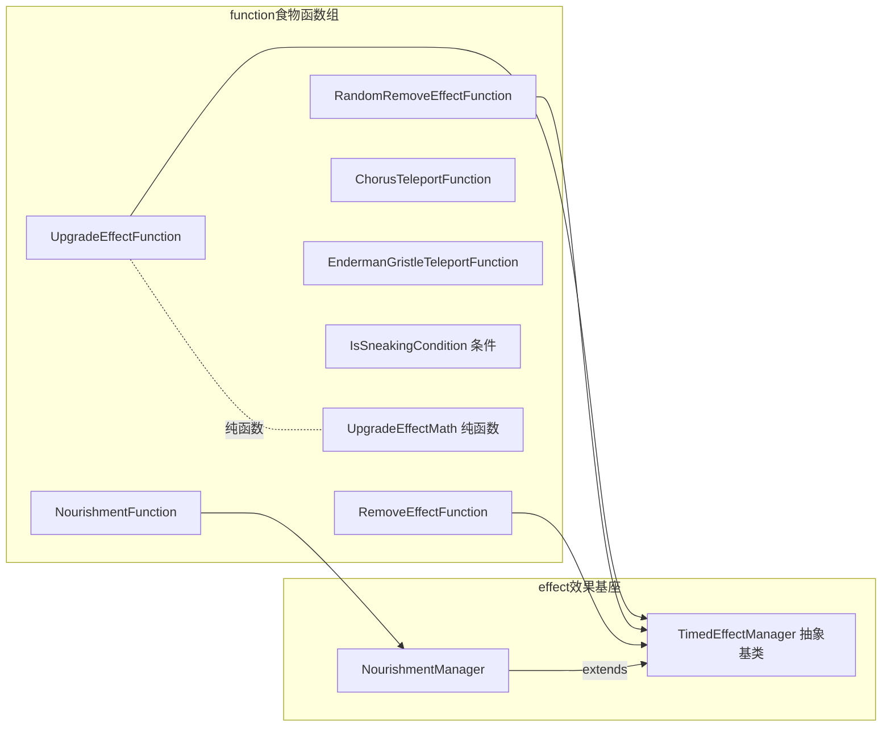
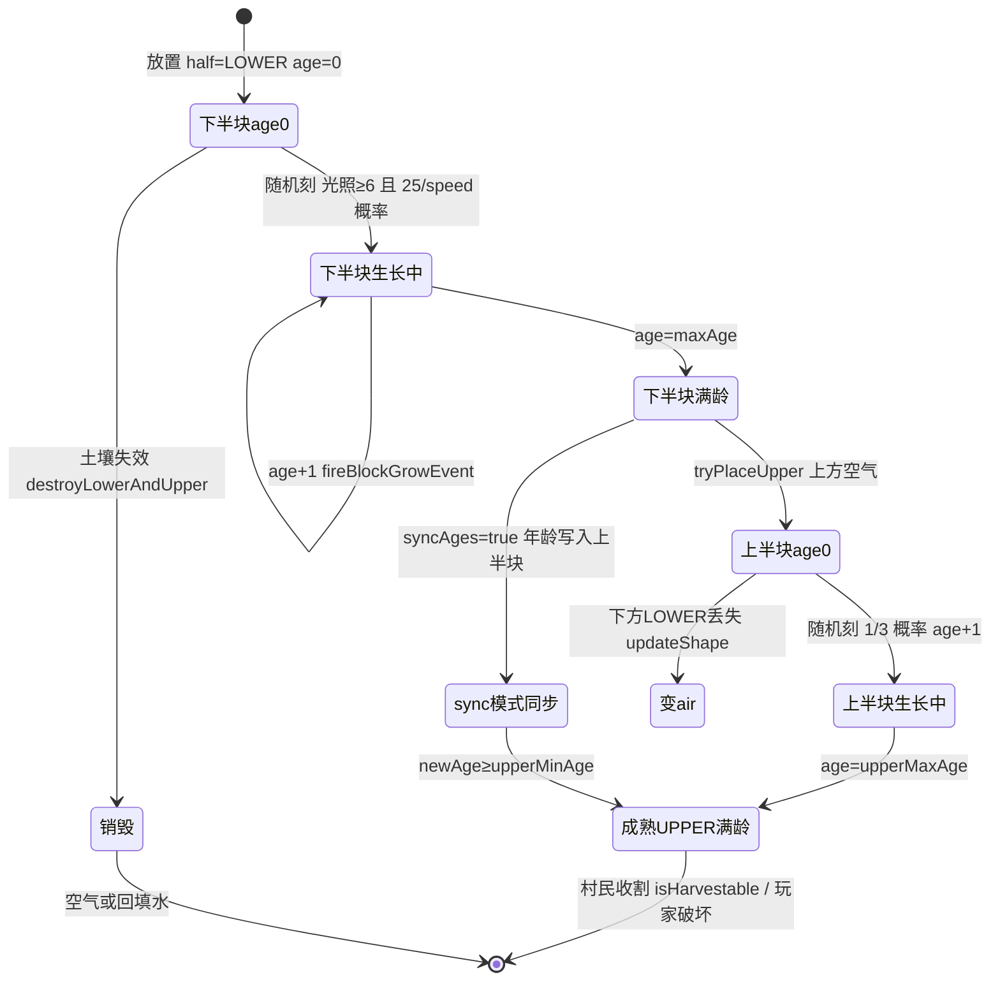
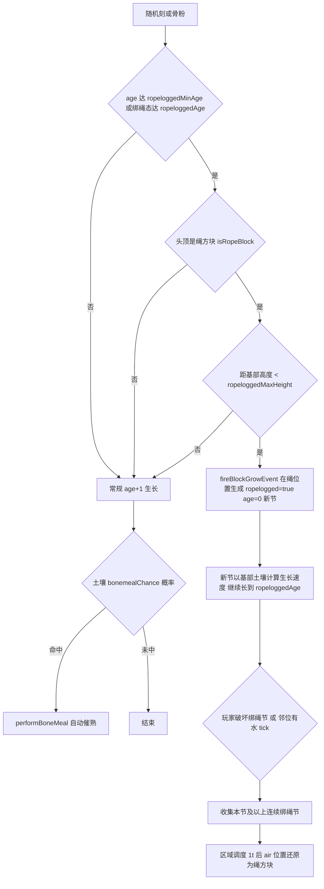
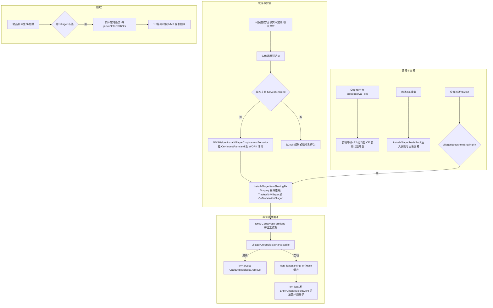
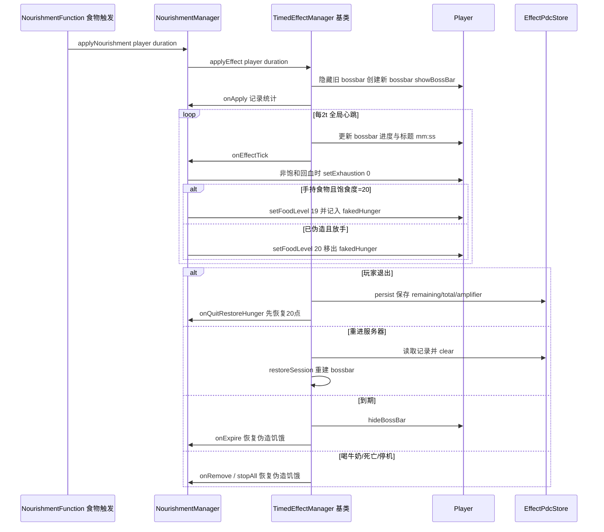
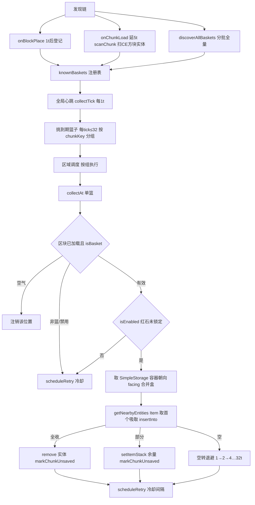
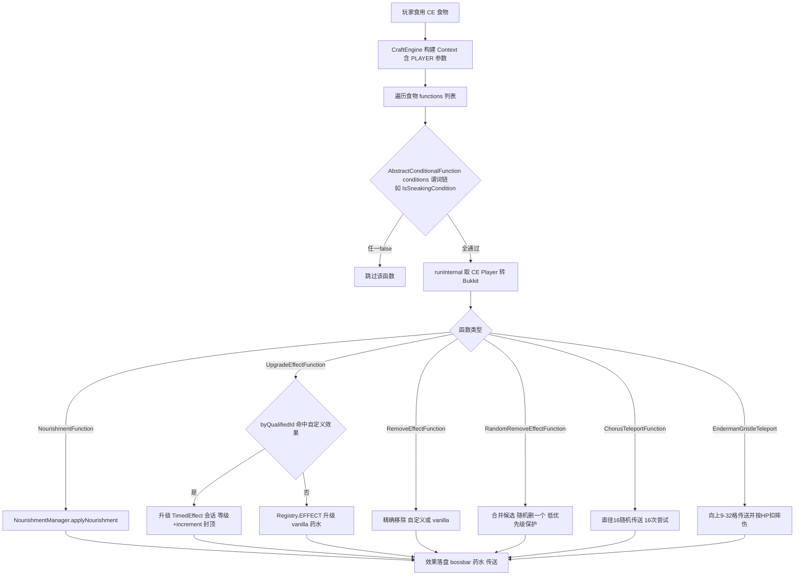

# 农业、村民、杂项方块与食物效果模块
> 模块职责：基于 CraftEngine 方块行为体系实现 Farmer's Delight 风格的自定义作物（双段/绑绳/高级/野生稻）、耕地与堆肥土壤链；通过 NMS 大脑手术扩展村民 AI（收割/补种/拾取/繁殖/交易）；提供绳/配对方块/比较器等杂项方块行为；实现营养（Nourishment）计时效果、篮子自动收集、宠物食品监听以及一组 CraftEngine 物品功能函数（食物效果管线）。
> 文件数：35（farm 8 / villager 7 / misc 7 / nourishment 2 / basket 2 / petfood 1 / function 8）；总行数：约 7126（farm 3781 / villager 978 / misc 956 / nourishment 212 / basket 421 / petfood 166 / function 612）

## 1. 模块概览

### 1.1 CraftEngine BlockBehavior / ItemFunction 扩展体系的组织方式

本项目对 CraftEngine 的扩展分四类接入点，全部通过静态 `register()` 方法挂载：

1. **方块行为 BlockBehavior**：继承 CraftEngine 的 `net.momirealms.craftengine.bukkit.block.behavior.BukkitBlockBehavior`，并按需实现 `BonemealableBlock`（骨粉）、`RandomTickBlock`（随机刻）、`PrioritizedFallOnHandler`（实体坠落）等能力接口。每个类暴露 `BlockBehaviorFactory` 静态内部类 `FACTORY`，由 `BlockBehaviors.register(Key, FACTORY)` 以 `papersdelight:xxx` 键注册；YAML 配置中 `behavior: papersdelight:double_crop` 即触发 `Factory.create(BlockDefinition, ConfigSection)` 构造实例。注册中心为 `registration/CraftEngineBehaviorRegistrations`（farm 7 个行为 + misc 5 个行为 + basket 1 个行为均在此挂载）。
2. **物品行为 ItemBehavior**：继承 `BlockItemBehavior`（RopeItemBehavior、HorizontalDoubleBlockItemBehavior），经 `ItemBehaviors.register` 注册，Factory 支持内联 `block:` 配置节自动转挂起方块配置（PendingConfigSection）。
3. **物品功能函数 ItemFunction**：function 包下各类继承 CraftEngine 的 `AbstractConditionalFunction<CTX>`（带前置 Condition 谓词的上下文函数），`IsSneakingCondition` 实现 `Condition<CTX>`。由 `registration/CraftEngineContextRegistrations` 通过 `CommonFunctions.register / CommonConditions.register` 挂载，绑定 `CommonConditions::fromConfig` 谓词工厂；食物物品配置中 `functions:` 列表在食用时被 CraftEngine 触发。
4. **Bukkit 监听器/管理器**：CropBonemealFix、Villager 四管理器、BasketManager、PetFoodListener、NourishmentManager（继承本项目 effect 包的 `TimedEffectManager`），由主类 `PapersDelight.java` 按特性开关（`support.FeatureSupport`）装配，并统一使用 Folia 友好的 CCScheduler（region/entity/global 调度器）。

NMS 访问一律经 `dev.tako.papersdelight.bridge.NMSHelper` 门面转发到 NMS-Bridge 的版本实现（v1_21_1 ~ v1_21_11），方块状态的读写使用 CraftEngine 的 `BlockStateUtils` 双轨（NMS state ↔ CE ImmutableBlockState）。

### 1.2 作物行为继承体系与村民管理器分组

```mermaid
graph TB
    subgraph CraftEngine基类
        BB[BukkitBlockBehavior]
        CB[CropBlockBehavior 静态工具引用]
        BIB[BlockItemBehavior]
        ACF[AbstractConditionalFunction]
        COND[Condition 接口]
    end

    subgraph farm作物行为
        DC[DoubleCropBlockBehavior<br/>double_crop]
        RC[RopedCropBlockBehavior<br/>roped_crop]
        AC[AdvancedCropBlockBehavior<br/>advanced_crop]
        WR[WildRiceBlockBehavior<br/>wild_rice]
        FM[FarmlandBlockBehavior<br/>farmland]
        OC[OrganicCompostBlockBehavior<br/>organic_compost]
        RS[RichSoilBlockBehavior<br/>rich_soil]
    end

    subgraph misc杂项
        RB[RopeBlockBehavior<br/>rope_block]
        HD[HorizontalDoubleBlockBlockBehavior<br/>horizontal_double_block]
        PB[PairableBlockBehavior<br/>pairable_block]
        CMP[RedstoneComparatorBlockBehavior<br/>comparator_signal]
        RI[RopeItemBehavior<br/>物品行为 rope]
        HI[HorizontalDoubleBlockItemBehavior<br/>物品行为]
    end

    subgraph basket篮子
        BK[BasketBlockBehavior<br/>basket]
        BM[BasketManager 监听器]
    end

    BB --> DC
    BB --> RC
    BB --> AC
    BB --> WR
    BB --> FM
    BB --> OC
    BB --> RS
    BB --> RB
    BB --> HD
    BB --> PB
    BB --> CMP
    BB --> BK
    BIB --> RI
    BIB --> HI
    DC -. 骨粉加成依赖 .-> CB
    RC -. 骨粉加成依赖 .-> CB
    AC -. 骨粉加成依赖 .-> CB
    BK --- BM

    subgraph villager村民管理器组
        VH[VillagerHarvestManager<br/>实现 VillagerCropRules]
        VP[VillagerPickupManager]
        VT[VillagerTradeManager]
        VB[VillagerBreedManager]
        CFG[VillagerConfig 配置载体]
        SUP[VillagerSupport 工具/追踪集]
        FPS[VillagerFoodPointSetting<br/>CE 物品设置项]
    end

    CFG -.被读取.- VH
    CFG -.被读取.- VP
    CFG -.被读取.- VT
    CFG -.被读取.- VB
    SUP -.追踪集共享.- VT
    SUP -.追踪集共享.- VB
    FPS -.食物点数.- VB
    VH -.查询作物属性.- DC
    VH -.查询作物属性.- RC
    VH -.查询作物属性.- AC
```

## 2. 类与函数目录（35 个类全覆盖）

### 2.1 DoubleCropBlockBehavior（`farm/DoubleCropBlockBehavior.java`，1080 行）
**职责**：双段（上下半块）作物行为。下半块在土壤上按 vanilla CropBlock 语义随机生长，长满后向上生成上半块；支持上下半块年龄同步模式、水中种植、骨粉（含溢出转上半块）、破坏联动与村民收割/补种标记。
**继承/接口**：`extends BukkitBlockBehavior implements BonemealableBlock, RandomTickBlock`；内部 `Factory implements BlockBehaviorFactory<DoubleCropBlockBehavior>`。
**关键字段**：`halfProperty`（DoubleBlockHalf）、`ageProperty`（IntegerProperty）、`supportingProperty`（可选 supporting 布尔属性，标记下半块是否挂着上半块）、`maxAge/upperMaxAge/upperMinAge`、`plantInWater`、`upperIndependent`、`syncAges`、`growSpeed/minGrowLight/minSpawnLight`、`isBoneMealTarget`、`boneMealBonus`（NumberProvider）、`canHarvestByVillagers/canReplantByVillagers`、`soils`（List of SoilEntry record：vanillaStates/customBlockIds/blockTags + growthModifier + bonemealChance）。

| 方法 | 签名 | 行号 | 行为说明 |
| --- | --- | --- | --- |
| DoubleCropBlockBehavior | 私有构造器（BlockDefinition, 8 个属性参数…, List<SoilEntry>） | 73-111 | 全字段赋值，soils 做不可变拷贝 |
| getAge | int getAge(ImmutableBlockState) | 113-115 | 读取 age 属性当前值 |
| isMaxAge | boolean isMaxAge(ImmutableBlockState) | 117-119 | age 是否等于 ageProperty.max（下半块满龄） |
| getBlockStateNMS | static Object getBlockStateNMS(Object, Object) | 121-123 | NMSHelper 读取 NMS 方块状态 |
| setBlockNMS | static void setBlockNMS(Object, Object, Object) | 125-127 | NMSHelper 以 flag=3 写入方块状态 |
| airState | static Object airState() | 129-131 | 获取 NMS air 状态单例 |
| waterState | static Object waterState() | 133-140 | Bukkit WATER BlockData 转 NMS 状态，异常返回 null |
| isFullWaterSource | static boolean isFullWaterSource(Object, Object) | 142-144 | 该位置是否为完整静水水源 |
| getBukkitPlayer | static Player getBukkitPlayer(Object) | 146-148 | NMS 玩家转 Bukkit 玩家 |
| hasEnoughLight | static boolean hasEnoughLight(Object, Object) | 150-153 | 原始亮度≥8 或可见天空 |
| isYAxis | static boolean isYAxis(Object) | 155-157 | NMS 方向是否为纵轴 |
| isUp | static boolean isUp(Object) | 159-161 | NMS 方向是否 UP |
| isDown | static boolean isDown(Object) | 163-165 | NMS 方向是否 DOWN |
| updateStateForPlacement | ImmutableBlockState updateStateForPlacement(BlockPlaceContext, ImmutableBlockState) | 178-197 | 校验高度上限与上方空气（水中模式要求水源且上方空气），通过则返回带默认值的状态否则 null |
| withPlacementDefaults | ImmutableBlockState withPlacementDefaults(ImmutableBlockState) | 199-206 | 置 half=LOWER、age=0、supporting=false |
| canPlaceMultistate | boolean canPlaceMultistate(WorldAccessor, BlockPos, ImmutableBlockState) | 208-211 | 恒 false：本行为自管上半块 |
| hasMultiState | boolean hasMultiState(ImmutableBlockState) | 213-216 | 恒 false |
| placeMultistate | void placeMultistate(Object, Object[]) | 218-221 | 空实现 |
| canSurvive | boolean canSurvive(Object, Object[]) | 223-226 | 分发到 canSurviveNMS |
| canSurviveNMS | boolean canSurviveNMS(Object, Object, Object, Object) | 228-238 | 按 half 分发：上半块查 canUpperSurvive，下半块查土壤 |
| canUpperSurvive | boolean canUpperSurvive(ImmutableBlockState, Object, Object) | 240-254 | syncAges 恒可活；否则要求光照充足且下方是同定义 LOWER 半块 |
| canLowerSurvive | boolean canLowerSurvive(ImmutableBlockState, Object, Object) | 256-258 | 下方方块命中任一 SoilEntry |
| getBelowStateNMS | Object getBelowStateNMS(Object, Object) | 260-263 | 取下方 NMS 状态 |
| findSoilEntryFor | SoilEntry findSoilEntryFor(Object, Object) | 265-268 | 对下方状态解析 SoilEntry |
| isSupportedSoil | boolean isSupportedSoil(Block) | 270-272 | 供村民模块查询土壤是否可用 |
| isSupportedSoilState | boolean isSupportedSoilState(Object) | 274-276 | NMS 状态级土壤判定 |
| findSoilEntryForState | SoilEntry findSoilEntryForState(Object) | 278-309 | 依次匹配：方块标签→vanilla 状态集合→CE 自定义方块 id |
| isInTag | static boolean isInTag(Object, Key) | 311-313 | NMS 状态是否在标签内 |
| isAirBlock | static boolean isAirBlock(Object) | 315-317 | NMS 状态是否 air |
| getGrowthSpeed | float getGrowthSpeed(Object, Object, BlockPos) | 319-367 | vanilla 生长速度公式：1+中心土壤修正 + 同土壤邻居加成 修正/4，十字或四角同作物则减半 |
| isSameCropType | static boolean isSameCropType(Object, Object) | 369-371 | NMS 状态 owner 是否同一 NMS block 对象 |
| getRawBrightness | static int getRawBrightness(Object, Object) | 373-375 | 委托 CropBlockBehavior.getRawBrightness |
| hasLightAbove | boolean hasLightAbove(Object, Object, int) | 377-379 | 上方一格亮度是否达阈值 |
| canRandomlyTick | boolean canRandomlyTick(ImmutableBlockState) | 381-389 | LOWER 恒可；UPPER 在 syncAges 时不可、否则 age<upperMaxAge 才可 |
| randomTick | void randomTick(Object, Object[]) | 391-435 | 核心生长：LOWER 需上方光照≥minGrowLight 且通过 25/speed 概率检定后 age+1 并 fireBlockGrowEvent，满龄则 tryPlaceUpper；UPPER 以 1/3 概率 age+1 |
| fireBlockGrowEvent | boolean fireBlockGrowEvent(Object, Object, Object) | 437-439 | 触发 Bukkit BlockGrowEvent，返回是否未被取消 |
| tryPlaceUpper | void tryPlaceUpper(ImmutableBlockState, Object, Object) | 441-472 | 上方为空气且通过 canUpperSurvive 时放置 UPPER 半块（syncAges 时用 lower 年龄、需≥upperMinAge），并回写 supporting=true |
| syncUpperIfNeeded | void syncUpperIfNeeded(Object, Object, ImmutableBlockState, int) | 474-511 | syncAges 模式下把新年龄同步到已有 UPPER，或顺带生成新 UPPER |
| isBonemealSuccess | boolean isBonemealSuccess(Object, Object[]) | 513-516 | 恒 true（骨粉必成功） |
| isValidBonemealTarget | boolean isValidBonemealTarget(Object, Object[]) | 518-552 | isBoneMealTarget 开关 + 按半块/年龄判断是否还可骨粉 |
| performBonemeal | void performBonemeal(Object, Object[]) | 554-558 | 骨粉入口，转发 performBoneMeal |
| performBoneMeal | void performBoneMeal(Object, Object, Object) | 560-592 | 分流：UPPER→growUpperHalf；syncAges→growLowerSync；普通 LOWER→已有上半块则催上半块否则 growLowerWithOverflow |
| growUpperHalf | void growUpperHalf(Object, Object, ImmutableBlockState) | 594-619 | 以 NumberProvider 取骨粉增量催熟上半块（上限 upperMaxAge），成功则 HAPPY_VILLAGER 粒子 |
| growLowerSync | void growLowerSync(Object, Object, ImmutableBlockState) | 621-649 | syncAges 模式催熟下半块并 syncUpperIfNeeded |
| growLowerWithOverflow | void growLowerWithOverflow(Object, Object, ImmutableBlockState, Object) | 651-710 | 总年龄=lower+bonus 封顶 max+upperMaxAge；溢出部分写入/生成 UPPER 半块，supporting 随上方是否可放置 |
| useOnBlock | InteractionResult useOnBlock(UseOnContext, ImmutableBlockState) | 712-755 | 骨粉右键预检：冒险/潜行/非骨粉 PASS；判定可催熟则挥手 SUCCESS（由 CE 触发实际骨粉） |
| updateShape | Object updateShape(Object, Object[]) | 757-805 | 邻居变化：UPPER 下方失效（非 syncAges）→air；LOWER 上方变化→刷新 supporting；下方土壤失效→destroyLowerAndUpper 并返回 air/水 |
| onPlace | void onPlace(Object, Object[]) | 807-810 | 放置后 2t 调度 tick 复查存活 |
| tick | void tick(Object, Object[]) | 812-821 | 不能存活则连坐销毁上下半块 |
| playerWillDestroy | Object playerWillDestroy(Object, Object[]) | 823-853 | 玩家破坏 LOWER 且非正确工具/创造→顺带清上半块；破坏 UPPER 且非 upperIndependent→清下半块 |
| destroyUpperHalf | void destroyUpperHalf(Object, Object) | 855-864 | 置上方同定义 UPPER 为 air |
| destroyLowerHalf | void destroyLowerHalf(Object, Object) | 866-875 | 置下方同定义 LOWER 为 air |
| destroyLowerAndUpper | void destroyLowerAndUpper(Object, Object, ImmutableBlockState) | 877-893 | 播放破坏音效后连坐清除，水中种植回填水 |
| affectNeighborsAfterRemoval | void affectNeighborsAfterRemoval(Object, Object[]) | 895-906 | 水中模式下移除后回填水 |
| getBukkitWorld | static World getBukkitWorld(Object) | 908-910 | NMS level→Bukkit World |
| getCEWorld | static World getCEWorld(Object) | 912-916 | NMS level→CE World（经 BukkitAdaptor） |
| register | static void register() | 918-920 | 注册行为键 papersdelight:double_crop |
| Factory.create | DoubleCropBlockBehavior create(BlockDefinition, ConfigSection) | 936-979 | 校验 soils 非空；解析全部配置项（含 supporting 可选属性、sync_ages、max_age 等）并注册 CropBonemealFix 作物 id |
| Factory.getOptionalProperty | static Property<?> getOptionalProperty(String, BlockDefinition, String, Class) | 981-988 | 属性解析失败时返回 null 的容错包装 |
| Factory.parseSoils | static List<SoilEntry> parseSoils(ConfigSection) | 990-1019 | 解析 soils 列表：growth_modifier≥0、bonemeal_chance∈[0,1] 校验后构 SoilEntry |
| Factory.parseBlockDescriptor | static void parseBlockDescriptor(String, Set, Set, Set) | 1021-1078 | 解析单个土壤描述：#tag→blockTags；vanilla id（可带[]）→具体状态集合；CE 自定义 id→customIds |

### 2.2 RopedCropBlockBehavior（`farm/RopedCropBlockBehavior.java`，962 行）
**职责**：绑绳作物（如番茄）行为。单格 age 生长至"绑绳年龄"后沿上方绳方块攀爬生成 ropelogged=true 的新节；ropelogged 节可继续生长但受 max_height 限制；被破坏/水淹时绳位自动还原为绳方块；支持土壤概率性自动骨粉（bonemeal_chance）。
**继承/接口**：`extends BukkitBlockBehavior implements BonemealableBlock, RandomTickBlock`；内部 `Factory implements BlockBehaviorFactory<RopedCropBlockBehavior>`。
**关键字段**：`SCHEDULER`（CCScheduler 单例）、`BLOCK_IDS`（静态并发集合，登记所有绑绳作物 id）、`ageProperty`、`growSpeed/minGrowLight/minSpawnLight/isBoneMealTarget/boneMealBonus`、`canHarvestByVillagers/canReplantByVillagers`、`soils`、`ropeloggedAge`（绑绳态满龄）、`ropeloggedMinAge`（可攀爬最小年龄）、`ropeloggedRopeBlock`（绳方块 Key，默认 farmersdelight:rope）、`ropeloggedMaxHeight`、`ropeloggedProperty`、`cachedRopeNmsState`（绳 NMS 状态懒缓存）。

| 方法 | 签名 | 行号 | 行为说明 |
| --- | --- | --- | --- |
| RopedCropBlockBehavior | 私有构造器（BlockDefinition, …, Property<Boolean>） | 83-115 | 全字段赋值 |
| getAge | int getAge(ImmutableBlockState) | 117-119 | 读取 age |
| isMaxAge | boolean isMaxAge(ImmutableBlockState) | 121-123 | age≥有效满龄（绑绳态取 ropeloggedAge） |
| getEffectiveMaxAge | int getEffectiveMaxAge(ImmutableBlockState) | 125-130 | 绑绳态满龄=ropeloggedAge，常态=ageProperty.max |
| hasRopelogged | boolean hasRopelogged(ImmutableBlockState) | 132-136 | ropelogged 属性是否为 true |
| canClimb | boolean canClimb(ImmutableBlockState) | 138-146 | 绑绳态需 age≥ropeloggedAge；常态需 age≥ropeloggedMinAge 才可攀爬 |
| findBaseTomatoPos | BlockPos findBaseTomatoPos(Object, BlockPos) | 148-168 | 向下最多 ropeloggedMaxHeight+1 格寻找首个非绑绳同作物节（基部），用于土壤查询与高度计算 |
| getRawBrightness | static int getRawBrightness(Object, Object) | 170-172 | 委托 CropBlockBehavior |
| hasSufficientLightForGrow | boolean hasSufficientLightForGrow(Object, Object) | 174-176 | 亮度≥minGrowLight |
| hasSufficientLightForSpawn | boolean hasSufficientLightForSpawn(Object, Object) | 178-180 | 亮度≥minSpawnLight（世界生成期用） |
| isWorldGenRegion | static boolean isWorldGenRegion(Object) | 182-184 | 是否处于世界生成区域 |
| getBlockStateNMS | static Object getBlockStateNMS(Object, Object) | 186-188 | NMSHelper 读状态 |
| getBukkitWorld | static World getBukkitWorld(Object) | 190-194 | NMS level→Bukkit World，失败抛异常 |
| fireBlockGrowEvent | static boolean fireBlockGrowEvent(Object, Object, Object) | 196-198 | 触发 BlockGrowEvent |
| getBelowStateNMS | Object getBelowStateNMS(Object, Object) | 200-203 | 取下方状态 |
| findGrowthModifier | float findGrowthModifier(Object, Object) | 205-208 | 取土壤 growthModifier，无土壤 -1 |
| findSoilEntryFor | SoilEntry findSoilEntryFor(Object, Object) | 210-213 | 位置级土壤解析 |
| isSupportedSoil | boolean isSupportedSoil(Block) | 215-217 | 供村民补种查询 |
| isSupportedSoilState | boolean isSupportedSoilState(Object) | 219-221 | NMS 状态级土壤判定 |
| findSoilEntryForState | SoilEntry findSoilEntryForState(Object) | 223-253 | 标签→vanilla 状态→CE id 三级匹配（与双段作物同构） |
| isWaterAt | static boolean isWaterAt(Object, Object) | 255-257 | 该位是否水流体 |
| isWaterAdjacent | boolean isWaterAdjacent(Object, Object) | 259-266 | 六邻位任一为水则 true（水淹检测） |
| isInTag | static boolean isInTag(Object, Key) | 268-270 | 标签匹配 |
| getGrowthSpeed | float getGrowthSpeed(Object, Object, BlockPos) | 272-321 | vanilla 生长公式（邻居按各自 SoilEntry 修正值加成，四邻/四角同作物减半） |
| isSameCropType | static boolean isSameCropType(Object, Object) | 323-325 | 同一 NMS block 判定 |
| canSurvive | boolean canSurvive(Object, Object[]) | 327-357 | 世界生成区只查光照；绑绳态下方为同作物即可活；常态需光照+下方土壤 |
| updateShape | Object updateShape(Object, Object[]) | 359-383 | 仅 DOWN 方向：不可存活时绑绳态先 scheduleRopeReplacement 再返回 air |
| scheduleRopeReplacement | void scheduleRopeReplacement(Object, Object) | 385-403 | Folia 区域调度 1t 后若该位仍是 air 则还原为绳方块 |
| getAirNMSState | static Object getAirNMSState() | 405-407 | NMS air 状态 |
| canRandomlyTick | boolean canRandomlyTick(ImmutableBlockState) | 409-413 | 未满龄可随机刻；绑绳态即使满龄也可（用于攀爬） |
| randomTick | void randomTick(Object, Object[]) | 415-474 | 光照检定→绑绳态先定位基部再算生长速度→概率通过则 age+1（fireBlockGrowEvent 失败回滚）→尝试攀爬 tryClimbRope→按土壤 bonemeal_chance 概率自动骨粉 |
| isBonemealSuccess | boolean isBonemealSuccess(Object, Object[]) | 476-479 | 恒 true |
| isValidBonemealTarget | boolean isValidBonemealTarget(Object, Object[]) | 481-487 | 开关开启且未满有效龄 |
| performBonemeal | void performBonemeal(Object, Object[]) | 489-493 | 骨粉入口转发 |
| useOnBlock | InteractionResult useOnBlock(UseOnContext, ImmutableBlockState) | 495-517 | 骨粉右键预检；满龄但绑绳态仍返回 SUCCESS（可催上部其他节） |
| performBoneMeal | void performBoneMeal(Object, Object, Object, Object) | 519-580 | 满龄绑绳态→向上找未满龄节递归骨粉后返回；否则 age+boneMealBonus（封顶有效满龄）+粒子+攀爬尝试 |
| playerWillDestroy | Object playerWillDestroy(Object, Object[]) | 587-653 | 玩家破坏绑绳节：收集本节及以上连续绑绳节，区域调度下一并把仍为 air 的位置还原为绳，并返回 air 状态（吞掉掉落） |
| neighborChanged | void neighborChanged(Object, Object[]) | 655-669 | 绑绳节邻位有水时 1t 调度 tick |
| tick | void tick(Object, Object[]) | 671-684 | 绑绳节邻水则直接置 air（触发绳还原链） |
| affectNeighborsAfterRemoval | void affectNeighborsAfterRemoval(Object, Object[]) | 686-737 | 绑绳节被移除后，把本节及以上连续绑绳节调度还原为绳方块 |
| tryClimbRope | void tryClimbRope(Object, Object, Object, ImmutableBlockState) | 739-774 | canClimb 且上方是绳方块且未超 ropeloggedMaxHeight 时，fireBlockGrowEvent 在绳位置生成 ropelogged=true、age=0 的新作物节 |
| isRopeBlock | boolean isRopeBlock(Object) | 776-788 | CE 自定义状态 owner 或 vanilla owner 等于 ropeloggedRopeBlock |
| getRopeNmsState | Object getRopeNmsState() | 790-809 | 优先从 CraftEngine blockManager 取默认态，兜底 Bukkit.createBlockData |
| setBlockNMS | static void setBlockNMS(Object, Object, Object) | 811-813 | flag=3 写状态 |
| scheduleTick | static void scheduleTick(Object, Object, Object, int) | 815-817 | 经 LevelAccessorProxy 调度方块刻 |
| register | static void register() | 819-821 | 注册行为键 papersdelight:roped_crop |
| Factory.create | RopedCropBlockBehavior create(BlockDefinition, ConfigSection) | 839-874 | 解析 soils 与 ropelogged.* 配置（默认绳 farmersdelight:rope、max_height 3），并把作物 id 加入 BLOCK_IDS |
| Factory.parseSoils | static List<SoilEntry> parseSoils(ConfigSection) | 876-904 | 与双段作物同构，growth_modifier 允许 ≥-1（可为减速土壤） |
| Factory.parseBlockDescriptor | static void parseBlockDescriptor(String, Set, Set, Set) | 906-960 | 与双段作物同构的描述符解析 |

### 2.3 AdvancedCropBlockBehavior（`farm/AdvancedCropBlockBehavior.java`，541 行）
**职责**：单格高级作物行为（对应 FD 洋葱/大米苗等）。土壤驱动的 vanilla 生长公式 + 光照门槛 + 骨粉催熟 + 土壤概率性自动骨粉 + 村民收割/补种标记。是三个作物行为中"基线实现"。
**继承/接口**：`extends BukkitBlockBehavior implements BonemealableBlock, RandomTickBlock`；内部 `Factory implements BlockBehaviorFactory<AdvancedCropBlockBehavior>`。
**关键字段**：`ageProperty`、`growSpeed/minGrowLight/minSpawnLight/isBoneMealTarget/boneMealBonus`、`canHarvestByVillagers/canReplantByVillagers`、`soils`、静态 `AIR_NMS_STATE`（双重检查锁懒加载的 air 状态）。

| 方法 | 签名 | 行号 | 行为说明 |
| --- | --- | --- | --- |
| AdvancedCropBlockBehavior | 私有构造器（BlockDefinition, …, List<SoilEntry>） | 63-85 | 全字段赋值 |
| getAge | int getAge(ImmutableBlockState) | 87-89 | 读取 age |
| isMaxAge | boolean isMaxAge(ImmutableBlockState) | 91-93 | age==ageProperty.max |
| getRawBrightness | static int getRawBrightness(Object, Object) | 95-97 | 委托 CropBlockBehavior |
| hasSufficientLightForGrow | boolean hasSufficientLightForGrow(Object, Object) | 99-101 | 亮度≥minGrowLight |
| hasSufficientLightForSpawn | boolean hasSufficientLightForSpawn(Object, Object) | 103-105 | 亮度≥minSpawnLight |
| isWorldGenRegion | static boolean isWorldGenRegion(Object) | 107-109 | 世界生成区域判定 |
| getBlockStateNMS | static Object getBlockStateNMS(Object, Object) | 111-113 | NMSHelper 读状态 |
| getBukkitWorld | static World getBukkitWorld(Object) | 115-119 | NMS level→Bukkit World |
| fireBlockGrowEvent | static boolean fireBlockGrowEvent(Object, Object, Object) | 121-123 | 触发 BlockGrowEvent |
| getBelowStateNMS | Object getBelowStateNMS(Object, Object) | 125-128 | 取下方状态 |
| findGrowthModifier | float findGrowthModifier(Object, Object) | 130-133 | 土壤修正值或 -1 |
| findSoilEntryFor | SoilEntry findSoilEntryFor(Object, Object) | 135-138 | 位置级土壤解析 |
| isSupportedSoil | boolean isSupportedSoil(Block) | 140-142 | 村民模块查询入口 |
| isSupportedSoilState | boolean isSupportedSoilState(Object) | 144-146 | 状态级土壤判定 |
| findSoilEntryForState | SoilEntry findSoilEntryForState(Object) | 148-179 | 标签→vanilla→CE id 三级匹配 |
| isInTag | static boolean isInTag(Object, Key) | 181-183 | 标签匹配 |
| getGrowthSpeed | float getGrowthSpeed(Object, Object, BlockPos) | 185-235 | vanilla 生长公式（邻居土壤按各自 modifier 加成、同作物排布减半） |
| isSameCropType | static boolean isSameCropType(Object, Object) | 237-239 | 同作物判定 |
| canSurvive | boolean canSurvive(Object, Object[]) | 241-255 | 世界生成区查 spawn 光照；否则需 grow 光照+下方土壤 |
| updateShape | Object updateShape(Object, Object[]) | 257-275 | DOWN 方向不可存活→air |
| getAirNMSState | static Object getAirNMSState() | 277-288 | 双检锁懒加载静态 air NMS 状态 |
| canRandomlyTick | boolean canRandomlyTick(ImmutableBlockState) | 293-296 | 未满龄才可随机刻 |
| randomTick | void randomTick(Object, Object[]) | 298-337 | 光照→生长速度→概率检定→age+1；随后按土壤 bonemeal_chance 概率额外骨粉 |
| isBonemealSuccess | boolean isBonemealSuccess(Object, Object[]) | 339-342 | 恒 true |
| isValidBonemealTarget | boolean isValidBonemealTarget(Object, Object[]) | 344-350 | 开关开启且未满龄 |
| performBonemeal | void performBonemeal(Object, Object[]) | 352-356 | 骨粉入口转发 |
| useOnBlock | InteractionResult useOnBlock(UseOnContext, ImmutableBlockState) | 358-374 | 骨粉右键预检，可催熟则挥手 SUCCESS |
| performBoneMeal | void performBoneMeal(Object, Object, Object) | 376-407 | age+boneMealBonus（NumberProvider 上下文求值）封顶 max，成功后 HAPPY_VILLAGER 粒子 |
| register | static void register() | 409-411 | 注册行为键 papersdelight:advanced_crop |
| Factory.create | AdvancedCropBlockBehavior create(BlockDefinition, ConfigSection) | 425-446 | 解析配置并注册 CropBonemealFix 作物 id；soils 为空抛异常 |
| Factory.parseSoils | static List<SoilEntry> parseSoils(ConfigSection) | 448-476 | 校验 growth_modifier≥-1、bonemeal_chance∈[0,1] |
| Factory.parseBlockDescriptor | static void parseBlockDescriptor(String, Set, Set, Set) | 478-539 | 同双段作物描述符解析 |

### 2.4 WildRiceBlockBehavior（`farm/WildRiceBlockBehavior.java`，442 行）
**职责**：野生稻（水中双段方块，可堆叠成柱）。LOWER 半块须在静水水源中且底面在白/黑名单内；UPPER 半块依附 LOWER；可配置 stackable+max_height 允许稻柱堆叠；破坏下半块回填水。
**继承/接口**：`extends BukkitBlockBehavior`（无随机刻/骨粉能力接口）；内部 `Factory implements BlockBehaviorFactory<WildRiceBlockBehavior>`。
**关键字段**：`halfProperty`、`bottomTags`（底部方块标签）、`bottomBlockStates`（LazyReference<Set<Object>>，延迟物化底部方块状态集合）、`blacklistMode`、`stackable`、`maxHeight`；Args 索引常量 US$/PWD$/PMS$。

| 方法 | 签名 | 行号 | 行为说明 |
| --- | --- | --- | --- |
| WildRiceBlockBehavior | 私有构造器（BlockDefinition, …, LazyReference） | 40-56 | 全字段赋值 |
| isFullWaterSource | static boolean isFullWaterSource(Object, Object) | 58-60 | 完整水源判定 |
| getBlockStateNMS | static Object getBlockStateNMS(Object, Object) | 62-64 | NMSHelper 读状态 |
| setBlockNMS | static void setBlockNMS(Object, Object, Object) | 66-68 | flag=3 写状态 |
| isInTag | static boolean isInTag(Object, Key) | 70-72 | 标签匹配 |
| airState | static Object airState() | 74-76 | NMS air |
| waterState | static Object waterState() | 78-80 | minecraft:water 默认态 |
| getBukkitPlayer | static Player getBukkitPlayer(Object) | 82-84 | NMS→Bukkit 玩家 |
| getWorldFromLevel | static World getWorldFromLevel(Object) | 86-89 | NMS level→CE World |
| levelEvent | static void levelEvent(Object, Object, int) | 91-93 | 广播方块 levelEvent（破坏效果） |
| isYAxis | static boolean isYAxis(Object) | 95-98 | 纵轴方向判定 |
| isUp | static boolean isUp(Object) | 100-102 | UP 判定 |
| isDown | static boolean isDown(Object) | 104-106 | DOWN 判定 |
| nmsDown | static Object nmsDown() | 108-110 | DOWN 转 NMS 方向 |
| updateStateForPlacement | ImmutableBlockState updateStateForPlacement(BlockPlaceContext, ImmutableBlockState) | 127-138 | 在水源、高度足够且上方为空气时可放，返回 LOWER 态 |
| canPlaceMultistate | boolean canPlaceMultistate(WorldAccessor, BlockPos, ImmutableBlockState) | 140-144 | 高度足够且上方为空气 |
| hasMultiState | boolean hasMultiState(ImmutableBlockState) | 146-149 | LOWER 态拥有多态上半块 |
| placeMultistate | void placeMultistate(Object, Object[]) | 151-163 | 放置时在上方写入 UPPER 半块 |
| canSurvive | boolean canSurvive(Object, Object[]) | 165-171 | 分发 canSurviveNMS |
| canSurviveNMS | boolean canSurviveNMS(Object, Object, Object, Object) | 173-192 | UPPER 需下方同定义；LOWER 需本格为水源且底面 mayPlaceOn |
| mayPlaceOn | boolean mayPlaceOn(Object, Object, Object) | 194-219 | 标签命中→按黑/白名单返回；底面状态集合命中→同上；底面是同作物时按 stackable/maxHeight 决定可否堆叠 |
| mayStackOn | boolean mayStackOn(Object, Object) | 221-236 | 向下数同作物柱高，count<maxHeight 才可继续堆 |
| updateShape | Object updateShape(Object, Object[]) | 238-274 | 纵轴向伴侣半块缺失时转换 half 或变 air（含 CE 行为对偶校验）；LOWER 下方失效时播破坏音效+levelEvent 后 air |
| onPlace | void onPlace(Object, Object[]) | 276-279 | 放置后 2t 调度 tick 复查 |
| tick | void tick(Object, Object[]) | 281-298 | 不能存活则播破坏音效并置 air |
| playerWillDestroy | Object playerWillDestroy(Object, Object[]) | 300-321 | 创造或非正确工具破坏 UPPER 时防止下半块掉落（preventDropFromBottomPart） |
| preventDropFromBottomPart | void preventDropFromBottomPart(Object, Object, ImmutableBlockState, Object) | 323-340 | 把下方 LOWER 置为水并广播破坏效果 |
| affectNeighborsAfterRemoval | void affectNeighborsAfterRemoval(Object, Object[]) | 342-355 | LOWER 被移除后本位回填水 |
| register | static void register() | 357-359 | 注册行为键 papersdelight:wild_rice |
| Factory.create | WildRiceBlockBehavior create(BlockDefinition, ConfigSection) | 364-376 | 读 bottom 标签/方块、blacklist、stackable、max_height |
| readTagsAndState | static TagsAndState readTagsAndState(ConfigSection, String) | 379-439 | 解析前缀化标签与方块列表；vanilla 即时物化、CE 自定义方块经 LazyReference 延迟物化（规避加载顺序） |
| TagsAndState | record TagsAndState(List<Key>, LazyReference<Set<Object>>) | 441 | 标签+懒加载状态集合的载体 record |

### 2.5 FarmlandBlockBehavior（`farm/FarmlandBlockBehavior.java`，312 行）
**职责**：自定义耕地。按 water_range 搜索水/降雨维持湿度 moisture；干旱到 0 且开启 trampling 时退化为 turn_to 方块；上方放置非白名单实体方块时退化；生物坠落践踏判定。
**继承/接口**：`extends BukkitBlockBehavior implements RandomTickBlock, PrioritizedFallOnHandler`；内部 `Factory implements BlockBehaviorFactory<FarmlandBlockBehavior>`。
**关键字段**：`maxMoisture`、`moistureProperty`、`waterRange`、`trampling`、`turnToBlock`（退化目标）、`solidAboveWhitelist/solidAboveBlacklist`（上方实体方块白/黑名单，默认白名单含 8 种 vanilla 作物）、`MAINTAINS_FARMLAND_TAG`。

| 方法 | 签名 | 行号 | 行为说明 |
| --- | --- | --- | --- |
| getMaintainsFarmlandTag | static Key getMaintainsFarmlandTag() | 29-31 | 返回 minecraft:maintains_farmland 标签 |
| FarmlandBlockBehavior | 私有构造器（BlockDefinition, …, Set<Key>, Set<Key>） | 41-59 | 全字段赋值 |
| canRandomlyTick | boolean canRandomlyTick(ImmutableBlockState) | 61-64 | 恒 true |
| canSurvive | boolean canSurvive(Object, Object[]) | 66-91 | 上方黑名单命中→false；非实体方块→true；maintains_farmland 标签→true；白名单或 CE 自定义方块→true；其余实体方块→false |
| updateShape | Object updateShape(Object, Object[]) | 93-103 | UP 方向邻居变化后不可存活则 1t 调度 tick |
| tick | void tick(Object, Object[]) | 105-111 | 复查失败即 turnToDirt |
| randomTick | void randomTick(Object, Object[]) | 113-140 | 近水或降雨→补满 moisture；否则递减；归零且 trampling 且上方无 maintains_farmland 标签→退化 |
| fallOn | void fallOn(Object, Object[]) | 142-163 | 践踏判定：坠落距离随机数、活体校验、非玩家需 mobGriefing、体积>0.512 才退化 |
| updateEntityMovementAfterFallOn | void updateEntityMovementAfterFallOn(Object, Object[]) | 165-168 | 归零实体纵向速度（耕地不弹起） |
| isNearWater | boolean isNearWater(Object, Object) | 170-180 | waterRange 立方 + 上下 1 格内搜水 |
| isRainingAt | boolean isRainingAt(Object, Object) | 182-184 | 该位置是否正在降雨 |
| isSolidBlock | static boolean isSolidBlock(Object) | 186-188 | NMS 状态是否实体方块 |
| isInTag | static boolean isInTag(Object, Key) | 190-192 | 标签匹配 |
| turnToDirt | void turnToDirt(Object, Object) | 194-211 | 优先 CE 注册表解析 turn_to 目标，兜底 Bukkit BlockData；失败抛异常 |
| setMoisture | void setMoisture(Object, Object, ImmutableBlockState, int) | 213-217 | 写新 moisture 状态 |
| getBlockStateNMS | static Object getBlockStateNMS(Object, Object) | 219-221 | NMSHelper 读状态 |
| setBlockNMS | static void setBlockNMS(Object, Object, Object) | 223-225 | flag=3 写状态 |
| getCustomState | static Optional<ImmutableBlockState> getCustomState(Object) | 227-229 | NMS→CE 状态转换 |
| above | static Object above(Object) | 231-233 | 上方坐标 |
| offset | static Object offset(Object, int, int, int) | 235-237 | 偏移坐标 |
| scheduleTick | static void scheduleTick(Object, Object, Object, int) | 239-241 | 经 LevelAccessorProxy 调度刻 |
| isServerLevel | static boolean isServerLevel(Object) | 243-245 | 是否服务端 level |
| getFallDistance | static double getFallDistance(Object) | 247-252 | 兼容 Double/Float/Number 的坠落距离提取 |
| register | static void register() | 254-256 | 注册行为键 papersdelight:farmland |
| DEFAULT_SOLID_ABOVE_WHITELIST | 静态字段 | 265-275 | 默认白名单：西瓜/南瓜茎、小麦、甜菜根、胡萝卜、土豆、火把花、瓶子草 |
| Factory.create | FarmlandBlockBehavior create(BlockDefinition, ConfigSection) | 278-310 | 解析 moisture 属性、max_moisture=7、water_range=4、trampling、turn_to=dirt、白/黑名单 |

### 2.6 OrganicCompostBlockBehavior（`farm/OrganicCompostBlockBehavior.java`，220 行）
**职责**：有机堆肥。随机刻按"激活剂邻居 + 光照档位 + 含水"计算升级概率，逐级推进 composting 属性，满级转换为 result 方块（默认 farmersdelight:rich_soil）；提供比较器模拟输出。
**继承/接口**：`extends BukkitBlockBehavior implements RandomTickBlock`；内部 `Factory implements BlockBehaviorFactory<OrganicCompostBlockBehavior>`。
**关键字段**：`compostingProperty`（IntegerProperty）、`maxStage`、`resultBlock`、`activatorMultiplier`、`lightBonusHigh/lightBonusLow`、`waterBonus`、`lightThreshold`、`activators`（Set<Key>）、`hasComparator`。

| 方法 | 签名 | 行号 | 行为说明 |
| --- | --- | --- | --- |
| OrganicCompostBlockBehavior | 私有构造器（BlockDefinition, …, boolean） | 37-59 | 全字段赋值，activators 不可变拷贝 |
| canRandomlyTick | boolean canRandomlyTick(ImmutableBlockState) | 61-64 | 恒 true |
| randomTick | void randomTick(Object, Object[]) | 66-93 | 未满级时按 calculateChance 概率：下一级即满级→convertToResult，否则 composting+1 |
| hasAnalogOutputSignal | boolean hasAnalogOutputSignal(Object, Object[]) | 95-98 | 返回 hasComparator |
| getAnalogOutputSignal | int getAnalogOutputSignal(Object, Object[]) | 100-109 | 信号=(maxStage+1)-stage（剩余 composting 级数） |
| calculateChance | double calculateChance(Object, Object) | 111-154 | 3x3x3 邻域统计激活剂（每个 +activatorMultiplier）与含水（+waterBonus），正上方天光>阈值取 lightBonusHigh 否则 Low |
| getComposting | int getComposting(ImmutableBlockState) | 156-159 | 读 composting 属性值 |
| hasWaterAt | boolean hasWaterAt(Object, Object, Object) | 161-163 | NMSHelper 含水判定 |
| setBlockState | void setBlockState(Object, Object, ImmutableBlockState) | 165-167 | CE 状态转 NMS 后 flag=3 写入 |
| convertToResult | void convertToResult(Object, Object) | 169-174 | BlockStateParser 反序列化 result 后整块替换 |
| register | static void register() | 176-178 | 注册行为键 papersdelight:organic_compost |
| Factory.create | OrganicCompostBlockBehavior create(BlockDefinition, ConfigSection) | 192-218 | 从 composting 属性取 max；默认 result=farmersdelight:rich_soil、activator_multiplier 0.02、光加成 0.1/0.05、水加成 0.1、阈值 12 |

### 2.7 RichSoilBlockBehavior（`farm/RichSoilBlockBehavior.java`，175 行）
**职责**：沃土。随机刻先尝试把上方匹配 conversions 的作物整块转换（如洋葱苗→洋葱），否则按 boost_chance 概率对上方/下方作物施加一次"免费骨粉"（CE BonemealableBlock 优先，兜底 NMS tryBonemeal）。
**继承/接口**：`extends BukkitBlockBehavior implements RandomTickBlock`；内部 `Factory implements BlockBehaviorFactory<RichSoilBlockBehavior>`。
**关键字段**：`boostChance`、`boostParticle`、`particleCount`、`conversions`（List<ConversionEntry> record：source Key + targetRaw 字符串）。

| 方法 | 签名 | 行号 | 行为说明 |
| --- | --- | --- | --- |
| RichSoilBlockBehavior | 私有构造器（BlockDefinition, float, Particle, int, List<ConversionEntry>） | 37-44 | 全字段赋值 |
| canRandomlyTick | boolean canRandomlyTick(ImmutableBlockState) | 46-49 | 恒 true |
| randomTick | void randomTick(Object, Object[]) | 51-70 | 先 tryConvert；未转换则按 boostChance 概率先试上方再试下方 tryBoostPlant |
| tryConvert | boolean tryConvert(Object, Object) | 72-96 | 上方块 owner 匹配 conversions.source 则反序列化 target 整块替换 |
| tryBoostPlant | boolean tryBoostPlant(Object, Object, Object, boolean) | 98-124 | 目标位 CE 状态带 BonemealableBlock 且 isValidBonemealTarget 则 performBonemeal；否则 NMSHelper.tryBonemeal；成功播粒子 |
| spawnBoostParticles | void spawnBoostParticles(Object, Object) | 126-133 | 在目标位播放 boostParticle |
| register | static void register() | 135-137 | 注册行为键 papersdelight:rich_soil |
| Factory.create | RichSoilBlockBehavior create(BlockDefinition, ConfigSection) | 146-173 | 校验 boost_chance∈[0,1]、解析粒子名/数量、解析 conversions 列表 |

### 2.8 CropBonemealFix（`farm/CropBonemealFix.java`，49 行）
**职责**：Bukkit 监听器，修复"潜行 + 骨粉右键自定义作物会误触原版骨粉逻辑"的问题：对已登记的自定义作物方块，潜行手持骨粉右键时拒绝物品使用（DENY），让位置交互/骨粉修复链路接管。
**继承/接口**：`implements Listener`。
**关键字段**：`CROP_BLOCK_IDS`（并发字符串集合，由三个作物 Factory 调 registerCropBlockId 填充）。

| 方法 | 签名 | 行号 | 行为说明 |
| --- | --- | --- | --- |
| registerCropBlockId | static void registerCropBlockId(String) | 22-24 | 登记一个自定义作物方块 id |
| getCropBlockIds | static Set<String> getCropBlockIds() | 26-28 | 暴露集合（供外部查询） |
| onInteract | void onInteract(PlayerInteractEvent) | 30-48 | LOWEST 优先级：主手 + 潜行 + 骨粉 + 点击方块是已登记作物 → setUseItemInHand DENY |

### 2.9 VillagerHarvestManager（`villager/VillagerHarvestManager.java`，272 行）
**职责**：村民收割/补种管理器，同时是注入 NMS 村民大脑的自定义收割行为的规则回调（实现 VillagerCropRules）。负责农夫职业村民的发现与安装（spawn/区块加载/职业变更），维护"种子→可补种作物"的倒排索引与按 tick 缓存的补种决策 memo。
**继承/接口**：`implements Listener, VillagerCropRules`（NMS-Bridge api 接口：isHarvestable/tryHarvest/canPlant/tryPlant）。
**关键字段**：`plugin`、`config`（volatile VillagerConfig）、`replantIndex`（volatile 懒构建 种子id→作物id 列表）、`plantingMemos`（UUID→PlantingMemo 按 tick 失效缓存）、`plantingMemoTick`；record `PlantingMemo(tick, soilState, planting)`、`Planting(slot, seedId, cropId)`。

| 方法 | 签名 | 行号 | 行为说明 |
| --- | --- | --- | --- |
| VillagerHarvestManager | 构造器（JavaPlugin） | 52-55 | 加载配置 |
| start | void start() | 57-59 | 对已加载区块的农夫村民调度安装 |
| reload | void reload() | 61-65 | 重载配置、清空 replantIndex 缓存并重扫村民 |
| onSpawn | void onSpawn(CreatureSpawnEvent) | 67-72 | MONITOR：农夫村民生成→scheduleInstall |
| onEntitiesLoad | void onEntitiesLoad(EntitiesLoadEvent) | 74-81 | 实体批量加载→逐个 scheduleInstall |
| onCareerChange | void onCareerChange(VillagerCareerChangeEvent) | 83-86 | 职业变更→重装（可能失去收割行为） |
| refreshLoadedFarmers | private void refreshLoadedFarmers() | 88-101 | 遍历所有已加载区块，Folia 区域调度内对农夫 scheduleInstall |
| scheduleInstall | private void scheduleInstall(Villager) | 103-112 | 实体调度延迟 1t：存活且启用收割且是农夫时 NMSHelper.installVillagerCropHarvestBehavior 以 this 为规则，否则装 null 卸载 |
| isHarvestable | boolean isHarvestable(Block) | 114-140 | 覆写：按行为类型分派——RopedCrop 排除绑绳节且需满龄；DoubleCrop 需 UPPER 且 age≥upperMaxAge；AdvancedCrop 需满龄；均要求 canHarvestByVillagers |
| tryHarvest | boolean tryHarvest(Block, Villager) | 142-145 | isHarvestable 后 CraftEngineBlocks.remove 整块移除（掉落） |
| canPlant | boolean canPlant(Block, Villager) | 147-151 | 目标为空气且下方土壤能匹配出 Planting |
| tryPlant | boolean tryPlant(Block, Villager) | 153-176 | 找 Planting→解析作物定义→先发 EntityChangeBlockEvent→校验种子→CraftEngineUtil.placeCustomBlock 放置并扣种子 1 个 |
| isSupportedSoil | static boolean isSupportedSoil(String, Object) | 178-196 | 按作物类型转发到对应 Behavior.isSupportedSoilState |
| plantingFor | private Planting plantingFor(Villager, Block) | 198-212 | 按 tick+soilState 的 memo 缓存包装 findPlanting，避免重复扫描背包 |
| replantIndex | private Map<String, List<String>> replantIndex() | 214-243 | 懒构建倒排索引：遍历 CE 已加载方块，取 settings().itemId 作种子键，仅收录 canReplant 的作物 |
| canReplant | static boolean canReplant(ImmutableBlockState) | 245-252 | 按行为类型读 canReplantByVillagers |
| findPlanting | static Planting findPlanting(Inventory, Map, Object) | 254-269 | 遍历村民背包槽位，种子经 VillagerSupport.resolveSeedId 解析后匹配索引且土壤支持即返回 Planting |
| Planting | record Planting(int slot, String seedId, String cropId) | 271 | 补种决策载体 |

### 2.10 VillagerPickupManager（`villager/VillagerPickupManager.java`，172 行）
**职责**：村民拾取自定义物品。对带有 minecraft:villager_picks_up / villager_plantable_seeds 标签的 CE 物品掉落实体建立逐实体定时扫描任务，靠近村民时经 NMS 强制拾取；同时拦截 vanilla 材质同款自定义物品被原版拾取逻辑忽略的问题。
**继承/接口**：`implements Listener`。
**关键字段**：`PLANTABLE_SEEDS_TAG/VILLAGER_PICKS_UP_TAG`、`VANILLA_VILLAGER_PICKUP_MATERIALS`（面包/小麦/甜菜等 9 种）、`HORIZONTAL_RANGE=1.5 / VERTICAL_RANGE=1.0`、`trackedItems`（UUID 集合）、`itemTasks`（UUID→CCTask）、`config`。

| 方法 | 签名 | 行号 | 行为说明 |
| --- | --- | --- | --- |
| VillagerPickupManager | 构造器（JavaPlugin） | 55-58 | 加载配置 |
| start | void start() | 60-63 | 先 stop 再重扫已加载物品 |
| stop | void stop() | 65-69 | 取消全部扫描任务并清空追踪 |
| reload | void reload() | 71-74 | 重载配置后 start |
| refreshLoadedItems | private void refreshLoadedItems() | 76-90 | pickupEnabled 时遍历已加载区块，区域调度内 trackItem |
| onEntitySpawn | void onEntitySpawn(EntitySpawnEvent) | 92-95 | 物品实体生成→trackItem |
| onChunkLoad | void onChunkLoad(ChunkLoadEvent) | 97-102 | 区块加载→对其中物品 trackItem |
| onEntitiesLoad | void onEntitiesLoad(EntitiesLoadEvent) | 104-109 | 实体批量加载→trackItem |
| shouldTrackItem | static boolean shouldTrackItem(boolean, boolean, boolean) | 111-113 | 纯函数：功能开启且实体有效且带标签才追踪 |
| trackItem | private void trackItem(Item) | 115-128 | 通过校验且未追踪时，按 pickupIntervalTicks 建立实体调度定时任务调 scanNearbyVillagers |
| scanNearbyVillagers | private void scanNearbyVillagers(Item) | 130-145 | 每轮：失效则 untrack；1.5x1x1.5 范围找村民，校验拾取延迟与 Folia 区域所有权后 NMSHelper.villagerPickUpItemEntity 强制拾取 |
| untrackItem | private void untrackItem(UUID) | 147-151 | 移除追踪并取消任务 |
| onEntityPickupItem | void onEntityPickupItem(EntityPickupItemEvent) | 153-163 | HIGHEST：村民拾取 vanilla 可拾取材质的 CE 自定义物品但缺标签时取消事件（防原版逻辑吞掉） |
| hasVillagerPickupTag | private boolean hasVillagerPickupTag(ItemStack) | 165-171 | CE 物品定义是否命中两个标签之一 |

### 2.11 VillagerTradeManager（`villager/VillagerTradeManager.java`，157 行）
**职责**：村民交易管理。把配置的"农夫收购作物/流浪商人出售物品"交易池经 NMSHelper 注入 vanilla 交易表；对所有村民安装"物品分享修复"（用 CeTradeWithVillager 替换原版 TradeWithVillager 行为，使自定义物品可被分享），并以 200t 巡逻兜底重装。
**继承/接口**：`implements Listener`。
**关键字段**：`PATROL_INTERVAL_TICKS=200`、`plugin`、`config`。

| 方法 | 签名 | 行号 | 行为说明 |
| --- | --- | --- | --- |
| VillagerTradeManager | 构造器（JavaPlugin） | 30-33 | 加载配置 |
| start | void start() | 35-39 | 安装交易池 + 重扫村民 + 启动巡逻 |
| onCraftEngineReload | void onCraftEngineReload(CraftEngineReloadEvent) | 41-44 | CE 重载后重装交易池（物品定义可能变化） |
| reload | void reload() | 46-50 | 配置重载 + 交易池重装 + 重扫村民 |
| startSharingFixPatrol | private void startSharingFixPatrol() | 52-69 | 全局区域调度每 200t：遍历 VillagerSupport.tracked，实体调度内 villagerNeedsItemSharingFix 则重装修复 |
| installTradePool | private void installTradePool() | 71-106 | CE 物品就绪后，把 buy/sell 配置（经 VillagerSupport.resolveItem 解析物品）组装 VillagerTradePool.BuyEntry/SellEntry 列表注入 NMS；失败仅告警保留原表 |
| craftEngineItemsReady | private boolean craftEngineItemsReady() | 108-114 | CE loadedItems 非空即就绪（容错） |
| onSpawn | void onSpawn(CreatureSpawnEvent) | 116-119 | 村民生成→scheduleSharingFix |
| onEntitiesLoad | void onEntitiesLoad(EntitiesLoadEvent) | 121-126 | 批量加载→逐个 scheduleSharingFix |
| onCareerChange | void onCareerChange(VillagerCareerChangeEvent) | 128-131 | 职业变更→重装分享修复 |
| refreshLoadedVillagers | private void refreshLoadedVillagers() | 133-148 | 遍历已加载区块区域调度内对村民 scheduleSharingFix |
| scheduleSharingFix | private void scheduleSharingFix(Villager) | 150-156 | VillagerSupport.track 登记 UUID，实体调度延迟 1t 安装分享修复 |

### 2.12 VillagerBreedManager（`villager/VillagerBreedManager.java`，107 行）
**职责**：村民繁殖辅助。按配置间隔全局扫描被追踪村民，食物等级<12 时从其背包中寻找带 villager_food_point 设置的 CE 食物喂食（增加食物点数并消耗 1 个），提高繁殖意愿。
**继承/接口**：无接口（普通管理器，非 Listener）。
**关键字段**：`FOOD_LEVEL_TARGET=12`、`pendingVillagers`（防重入的 UUID 集合）、`config`、`task`（全局定时任务）。

| 方法 | 签名 | 行号 | 行为说明 |
| --- | --- | --- | --- |
| VillagerBreedManager | 构造器（JavaPlugin） | 25-28 | 加载配置 |
| start | void start() | 30-36 | stop 后若 breedEnabled 则按 breedIntervalTicks 启动全局定时扫描 |
| stop | void stop() | 38-43 | 取消任务 |
| reload | void reload() | 45-48 | 重载配置并重启 |
| scanAllWorlds | private void scanAllWorlds() | 50-68 | 遍历追踪集：实体消失移除；世界无玩家跳过；pendingVillagers 防重入后实体调度执行 feedIfHungry |
| feedIfHungry | private void feedIfHungry(Villager) | 70-98 | NMSHelper.getVillagerFoodLevel：<0（不支持）或≥12 跳过；否则扫背包首个有食物点数的 CE 食物，addVillagerFoodLevel 成功后扣 1 个 |
| matchFoodPoints | static Integer matchFoodPoints(ItemStack) | 100-106 | CE 物品定义读取 VillagerFoodPointSetting.foodPoint，>0 才有效 |

### 2.13 VillagerConfig（`villager/VillagerConfig.java`，144 行）
**职责**：村民模块的不可变配置载体。从 ConfigManager 读取总开关、收购/出售交易、收割/拾取/繁殖开关与扫描间隔。
**继承/接口**：无（final 类）。
**关键字段**：record `BuyTrade(level, itemId, amount, maxUses, villagerXp, priceMultiplier)`、record `SellTrade(itemId, emeraldCost, amount, maxUses, villagerXp, priceMultiplier)`；9 个布尔/列表/整数配置字段。

| 方法 | 签名 | 行号 | 行为说明 |
| --- | --- | --- | --- |
| VillagerConfig | 私有构造器（9 参数） | 31-47 | 列表做不可变拷贝 |
| buyEnabled | boolean buyEnabled() | 49 | 农夫收购开关 |
| buyTrades | List<BuyTrade> buyTrades() | 50 | 收购交易列表 |
| sellEnabled | boolean sellEnabled() | 51 | 流浪商人出售开关 |
| sellTrades | List<SellTrade> sellTrades() | 52 | 出售条目列表 |
| harvestEnabled | boolean harvestEnabled() | 53 | 收割开关 |
| pickupEnabled | boolean pickupEnabled() | 54 | 拾取开关 |
| pickupIntervalTicks | int pickupIntervalTicks() | 55 | 拾取扫描间隔 |
| breedEnabled | boolean breedEnabled() | 56 | 繁殖喂养开关 |
| breedIntervalTicks | int breedIntervalTicks() | 57 | 繁殖扫描间隔 |
| load | static VillagerConfig load() | 59-73 | 从 villager.* 配置树构造；各子开关与主开关 villager.enable 相与；间隔下限 1 |
| parseBuyTrades | static List<BuyTrade> parseBuyTrades() | 75-93 | 解析 farmers_buy_crops.trades 列表（Map 条目），字段带默认值与下限 |
| parseSellTrades | static List<SellTrade> parseSellTrades() | 95-117 | 解析 wandering_trader_sells.items；纯字符串条目给默认值；Map 条目全参数解析 |
| asString | static String asString(Object) | 119-123 | 空白安全字符串转换 |
| asInt | static int asInt(Object, int) | 125-133 | Number/字符串/默认值三态整数解析 |
| asDouble | static double asDouble(Object, double) | 135-143 | Number/字符串/默认值三态小数解析 |

### 2.14 VillagerSupport（`villager/VillagerSupport.java`，94 行）
**职责**：村民模块共享工具：全局村民 UUID 追踪集、农夫职业判定、CE/原版物品解析与 id 匹配。
**继承/接口**：无（final 工具类，私有构造）。
**关键字段**：`TRACKED`（并发 UUID 集合）、`FARMER_KEY="farmer"`。

| 方法 | 签名 | 行号 | 行为说明 |
| --- | --- | --- | --- |
| VillagerSupport | 私有构造器 | 11-13 | 禁实例化 |
| track | static void track(UUID) | 16-18 | 登记村民 UUID |
| tracked | static Set<UUID> tracked() | 20-22 | 暴露追踪集（交易/繁殖管理器共用） |
| isFarmer | static boolean isFarmer(Villager) | 26-39 | 职业 Keyed 取 key 或 toString 判 farmer，异常容错 false |
| resolveItem | static ItemStack resolveItem(Plugin, String, int) | 41-66 | 先 CE byId 构建物品，兜底 Material.matchMaterial；均失败记警告返回 null |
| customItemId | static String customItemId(ItemStack) | 68-76 | CE 自定义物品 id（无则 null） |
| resolveSeedId | static String resolveSeedId(ItemStack) | 78-83 | CE id 优先，否则 vanilla namespaced id（作补种索引键） |
| matchesItemId | static boolean matchesItemId(ItemStack, String) | 85-93 | CE id 精确匹配或 vanilla 材质匹配 |

### 2.15 VillagerFoodPointSetting（`villager/VillagerFoodPointSetting.java`，32 行）
**职责**：注册名为 papersdelight:villager_food_point 的 CE 物品设置项（CustomItemSettingType<Integer>），使 CE 物品配置可声明"村民食物点数"，供繁殖管理器读取。
**继承/接口**：无（final 工具类）。
**关键字段**：`SETTING_KEY`（Key）、`TYPE`（CustomItemSettingType.simple()）。

| 方法 | 签名 | 行号 | 行为说明 |
| --- | --- | --- | --- |
| VillagerFoodPointSetting | 私有构造器 | 11-13 | 禁实例化 |
| register | static void register() | 18-20 | 向 ItemSettingsModifiers 注册设置键与解析器 |
| create | static ItemSettingsModifier create(ConfigValue) | 22-25 | 取 int 并 clamp≥0，写入物品自定义数据 |
| foodPoint | static int foodPoint(ItemDefinition) | 27-31 | 读取物品定义上的食物点数，缺省 0 |

### 2.16 RopeBlockBehavior（`misc/RopeBlockBehavior.java`，280 行）
**职责**：绳方块行为。放置/邻居更新时检测上方是否为钟以维护 tied_to_bell 属性；右键时若头顶柱内有钟则摇铃，潜行右键则向下收绳——找到绳柱底端下方第一格，创造直接破坏否则返还绳物品再破坏。
**继承/接口**：`extends BukkitBlockBehavior`；内部 `Factory implements BlockBehaviorFactory<RopeBlockBehavior>`。
**关键字段**：`tiedToBellProperty`（可选布尔属性）、`bellSearchRange`（默认 24）、`reelItemKey`（收绳返还物品，默认取方块自身 id）。

| 方法 | 签名 | 行号 | 行为说明 |
| --- | --- | --- | --- |
| RopeBlockBehavior | 私有构造器（BlockDefinition, Property<Boolean>, int, Key） | 35-45 | 全字段赋值 |
| updateStateForPlacement | ImmutableBlockState updateStateForPlacement(BlockPlaceContext, ImmutableBlockState) | 47-54 | 有 tied 属性时按 checkBellAbove 预置 |
| checkBellAbove | private boolean checkBellAbove(BlockPlaceContext) | 56-63 | 正上方是否 vanilla bell |
| updateShape | Object updateShape(Object, Object[]) | 65-90 | UP 邻居变化时刷新 tied_to_bell 与上方是否钟一致 |
| useOnBlock | InteractionResult useOnBlock(UseOnContext, ImmutableBlockState) | 92-113 | 非潜行走 tryRingBell，潜行走 tryReelRope；成功挥手并返回对应结果 |
| tryRingBell | private boolean tryRingBell(UseOnContext) | 115-151 | 沿绳柱向上最多 bellSearchRange 格，找到钟则 Bukkit Bell.ring；中途非本绳方块即断 |
| tryReelRope | private boolean tryReelRope(UseOnContext) | 153-188 | 从点击位向下扫描绳柱到底，取底端下方目标格：创造直接破坏；否则 giveRopeItem 成功才破坏 |
| getCEBlockOwner | private Key getCEBlockOwner(UseOnContext, BlockPos) | 190-205 | CE 状态 owner 优先的方块 owner 解析，异常返回 minecraft:air |
| giveRopeItem | private boolean giveRopeItem(Player) | 207-242 | 解析返还物品候选（id 本身与去 _block 后缀变体），构建并加入玩家背包（背包满则失败） |
| destroyBlock | private void destroyBlock(UseOnContext, BlockPos) | 244-248 | 置目标格为 air |
| register | static void register() | 252-254 | 注册行为键 papersdelight:rope_block |
| Factory.create | RopeBlockBehavior create(BlockDefinition, ConfigSection) | 258-278 | 解析可选 tied 属性名、搜索范围（<1 回退 24）、收绳物品 id（默认方块 id） |

### 2.17 HorizontalDoubleBlockBlockBehavior（`misc/HorizontalDoubleBlockBlockBehavior.java`，184 行）
**职责**：水平双格方块（如餐桌）行为。head 部件朝 facing 方向生成 foot 部件；邻居更新校验伴侣存在性与（可选）底部支撑，缺失即自毁；可配置 needs_support。
**继承/接口**：`extends BukkitBlockBehavior`；内部 `Factory implements BlockBehaviorFactory<HorizontalDoubleBlockBlockBehavior>`。
**关键字段**：`partProperty`（String：head/foot）、`facingProperty`（Direction）、`needsSupport`。

| 方法 | 签名 | 行号 | 行为说明 |
| --- | --- | --- | --- |
| getBlockStateNMS | static Object getBlockStateNMS(Object, Object) | 39-41 | NMSHelper 读状态 |
| setBlockNMS | static void setBlockNMS(Object, Object, Object, int) | 43-45 | 指定 flag 写状态 |
| HorizontalDoubleBlockBlockBehavior | 私有构造器（BlockDefinition, Property, Property, boolean） | 47-55 | 全字段赋值 |
| register | static void register() | 57-59 | 注册行为键 papersdelight:horizontal_double_block |
| hasMultiState | boolean hasMultiState(ImmutableBlockState) | 61-65 | head 态拥有多态 |
| canPlaceMultistate | boolean canPlaceMultistate(WorldAccessor, BlockPos, ImmutableBlockState) | 67-83 | head 时检查朝向格在高度内、为空气，needsSupport 时其下方非空 |
| updateStateForPlacement | ImmutableBlockState updateStateForPlacement(BlockPlaceContext, ImmutableBlockState) | 85-89 | 以玩家水平朝向为 facing，部件置 head |
| placeMultiState | void placeMultiState(Object, Object[]) | 91-106 | 在 facing 格写入 foot 部件（flag 1\|2） |
| playerWillDestroy | Object playerWillDestroy(Object, Object[]) | 108-112 | 直接返回原状态（伴侣由 updateShape 收拾） |
| updateShape | Object updateShape(Object, Object[]) | 114-146 | 伴侣方向邻居非"同定义且互补部件"→air；needsSupport 时 DOWN 方向下方为空→air |
| canSurvive | boolean canSurvive(Object, Object[]) | 148-158 | needsSupport 时要求下方非 air |
| airState | static Object airState() | 160-162 | NMS air |
| isAir | static boolean isAir(Object) | 164-166 | null 或 air 判定 |
| directionOrdinal | static int directionOrdinal(Object) | 168-170 | NMS 方向枚举序数（比较用） |
| Factory.create | HorizontalDoubleBlockBlockBehavior create(BlockDefinition, ConfigSection) | 172-182 | 解析 part/facing 属性名与 needs_support（默认 true） |

### 2.18 HorizontalDoubleBlockItemBehavior（`misc/HorizontalDoubleBlockItemBehavior.java`，63 行）
**职责**：水平双格方块的物品行为。在标准放置校验之上追加 canPlaceMultistate 检查（确保 foot 位置也可放置）；Factory 支持内联 block 配置节。
**继承/接口**：`extends BlockItemBehavior`；内部 `Factory implements ItemBehaviorFactory<HorizontalDoubleBlockItemBehavior>`。
**关键字段**：`FACTORY`。

| 方法 | 签名 | 行号 | 行为说明 |
| --- | --- | --- | --- |
| HorizontalDoubleBlockItemBehavior | 私有构造器（Key blockId） | 25-27 | 传方块 id 给父类 |
| register | static void register() | 29-31 | 注册物品行为键 papersdelight:horizontal_double_block_item |
| canPlace | protected boolean canPlace(BlockPlaceContext, ImmutableBlockState) | 33-46 | super.canPlace 且方块行为含 HorizontalDoubleBlockBlockBehavior 且其 canPlaceMultistate 通过 |
| Factory.create | HorizontalDoubleBlockItemBehavior create(Pack, Path, Key, ConfigSection) | 50-61 | block 值为节时挂 PendingConfigSection 并以 key 为方块 id，否则按标识符直取 |

### 2.19 PairableBlockBehavior（`misc/PairableBlockBehavior.java`，169 行）
**职责**：可配对方块（面对面成对，如凳子拼接）。放置时朝向取所点面反方向；placeMultiState 中若朝向邻格是同定义未配对块则互设 facing 相对、paired=true；破坏时解除对侧 paired。可配置潜行放置禁用自动配对。
**继承/接口**：`extends BukkitBlockBehavior`；内部 `Factory implements BlockBehaviorFactory<PairableBlockBehavior>`。
**关键字段**：`facingProperty`、`pairedProperty`、`disableWhenSneaking`（默认 true）。

| 方法 | 签名 | 行号 | 行为说明 |
| --- | --- | --- | --- |
| PairableBlockBehavior | 私有构造器（BlockDefinition, Property, Property, boolean） | 35-43 | 全字段赋值 |
| register | static void register() | 45-47 | 注册行为键 papersdelight:pairable_block |
| updateStateForPlacement | ImmutableBlockState updateStateForPlacement(BlockPlaceContext, ImmutableBlockState) | 49-55 | facing=点击面反向，paired=false |
| hasMultiState | boolean hasMultiState(ImmutableBlockState) | 57-61 | 恒 true（借用多态钩子做配对） |
| canPlaceMultiState | boolean canPlaceMultistate(WorldAccessor, BlockPos, ImmutableBlockState) | 63-69 | 恒 true |
| placeMultiState | void placeMultiState(Object, Object[]) | 71-110 | 潜行禁用/已配对跳过；朝向邻格同定义未配对则互相写 facing 相对+paired=true（flag 1\|2） |
| playerWillDestroy | Object playerWillDestroy(Object, Object[]) | 112-142 | 自身已配对且对侧校验通过（同定义、paired、facing 相对）时把对侧 paired 置回 false |
| getBlockStateNMS | static Object getBlockStateNMS(Object, Object) | 144-146 | NMSHelper 读状态 |
| setBlockNMS | static void setBlockNMS(Object, Object, Object, int) | 148-150 | 指定 flag 写状态 |
| isSneaking | static boolean isSneaking(Object) | 152-154 | NMS 玩家 Shift 状态 |
| Factory.create | PairableBlockBehavior create(BlockDefinition, ConfigSection) | 156-167 | 从 properties 节解析 facing/paired 属性名，disable-when-sneaking 默认 true |

### 2.20 RedstoneComparatorBlockBehavior（`misc/RedstoneComparatorBlockBehavior.java`，96 行）
**职责**：比较器信号方块行为。把方块某个 IntegerProperty 值经 signal_map 映射为 0-15 红石模拟信号，供比较器读取。
**继承/接口**：`extends BukkitBlockBehavior`；内部 `Factory implements BlockBehaviorFactory<RedstoneComparatorBlockBehavior>`。
**关键字段**：`hasComparator`、`propertyName`、`property`（IntegerProperty）、`signalMap`（不可变 Map<Integer,Integer>）。

| 方法 | 签名 | 行号 | 行为说明 |
| --- | --- | --- | --- |
| RedstoneComparatorBlockBehavior | 私有构造器（BlockDefinition, boolean, String, IntegerProperty, Map） | 29-39 | 全字段赋值，signalMap 不可变 |
| register | static void register() | 20-22 | 注册行为键 papersdelight:comparator_signal |
| hasAnalogOutputSignal | boolean hasAnalogOutputSignal(Object, Object[]) | 41-44 | 返回 hasComparator |
| getAnalogOutputSignal | int getAnalogOutputSignal(Object, Object[]) | 46-56 | 读方块状态属性值并查 signalMap，缺省 0 |
| Factory.create | RedstoneComparatorBlockBehavior create(BlockDefinition, ConfigSection) | 64-94 | 在方块属性集中按名找 IntegerProperty；解析 signal_map（信号 clamp 0-15，键非整数忽略） |

### 2.21 RopeItemBehavior（`misc/RopeItemBehavior.java`，151 行）
**职责**：绳物品行为。对绳方块使用绳物品时向下（或潜行时按所点面方向）沿绳柱寻找第一个可放置位置并合成新的放置上下文放置，实现"一击连放整列绳"。
**继承/接口**：`extends BlockItemBehavior`；内部 `Factory implements ItemBehaviorFactory<RopeItemBehavior>`。
**关键字段**：`FACTORY`。

| 方法 | 签名 | 行号 | 行为说明 |
| --- | --- | --- | --- |
| RopeItemBehavior | 私有构造器（Key blockId） | 31-33 | 传方块 id 给父类 |
| useOnBlock | InteractionResult useOnBlock(UseOnContext) | 35-75 | 点击目标非本绳方块→走父类常规放置；否则确定延伸方向（潜行=点击面，否则 DOWN），沿柱搜索首个非绳位置，可放置则 placeAt |
| isRopeBlock | private boolean isRopeBlock(UseOnContext, BlockPos, Key) | 77-80 | 目标位 owner 是否本绳方块 |
| getBlockOwner | static Key getBlockOwner(UseOnContext, BlockPos) | 82-99 | CE 状态 owner 优先解析，异常返回 minecraft:air |
| isPlaceable | static boolean isPlaceable(UseOnContext, BlockPos) | 101-116 | air/water 或 isReplaceable 即可放置 |
| placeAt | private InteractionResult placeAt(UseOnContext, BlockPos, Direction) | 118-132 | 构造贴面 BlockHitResult 与新的 BlockPlaceContext 后调用 this.place 完成放置 |
| register | static void register() | 134-136 | 注册物品行为键 papersdelight:rope |
| Factory.create | RopeItemBehavior create(Pack, Path, Key, ConfigSection) | 138-149 | 支持内联 block 节挂 PendingConfigSection 或直接标识符 |

### 2.22 RopeInteractionResult（`misc/RopeInteractionResult.java`，13 行）
**职责**：绳方块交互结果的小工具：收绳成功返回 SUCCESS_AND_CANCEL（取消后续交互），摇铃成功返回 SUCCESS。
**继承/接口**：无（包私有 final 工具类）。
**关键字段**：无。

| 方法 | 签名 | 行号 | 行为说明 |
| --- | --- | --- | --- |
| RopeInteractionResult | 私有构造器 | 7-9 | 禁实例化 |
| afterSuccessfulAction | static InteractionResult afterSuccessfulAction(boolean reeling) | 10-12 | reeling→SUCCESS_AND_CANCEL，否则 SUCCESS |

### 2.23 NourishmentManager（`nourishment/NourishmentManager.java`，193 行）
**职责**：营养（Nourishment）计时效果管理器，继承 TimedEffectManager 获得 boss bar 会话、每 2t 全局心跳、PDC 持久化（退出保存/进入恢复）与注册表能力。效果期内：冻结饱和度以外的体力消耗（exhaustion 清零），并在 always_eat 开启时对"手持食物且饱食度已满"的玩家伪造 19 点饥饿使其能继续进食，放手后恢复 20。
**继承/接口**：`extends TimedEffectManager`（其自身 implements Listener；构造时随 configure 注册事件）。
**关键字段**：`EFFECT_ID="nourishment"`、`QUALIFIED_ID="papersdelight:nourishment_effect"`、`NAME_KEY="effect.farmersdelight.nourishment"`、`INSTANCE`（单例）、`alwaysEatEnabled`、`fakedHunger`（Set<UUID> 已伪造饥饿的玩家）、`MAX_HEALTH_ATTR`（反射兼容新旧 Attribute 枚举）。

| 方法 | 签名 | 行号 | 行为说明 |
| --- | --- | --- | --- |
| NourishmentManager | 构造器（JavaPlugin） | 39-42 | 调父类构造（建 PDC store、登记注册表）并设 INSTANCE |
| getInstance | static NourishmentManager getInstance() | 44-46 | 单例访问（NourishmentFunction 用） |
| load | void load() | 48-54 | 读 enable/bossbar.color/bossbar.style/always_eat 并 configure（启动心跳与事件注册） |
| applyNourishment | void applyNourishment(Player, int) | 56-58 | 转发 applyEffect 注册/刷新会话 |
| removeNourishment | void removeNourishment(Player) | 60-62 | 转发 removeEffect |
| onApply | protected void onApply(Player, int, int) | 64-69 | 覆写：StatsManager 记录效果应用统计 |
| onEffectTick | protected void onEffectTick(Player, int, int) | 71-75 | 覆写：每跳执行 applyExhaustionFreeze + applyAlwaysEat |
| applyExhaustionFreeze | private void applyExhaustionFreeze(Player) | 77-92 | 创造/旁观跳过；仅在"非饱和度自然回血"状态清零 exhaustion（保留饱和回血消耗） |
| applyAlwaysEat | private void applyAlwaysEat(Player) | 94-110 | 按 NourishmentHungerMath 判定进入/退出伪造饥饿状态 |
| isHoldingFood | static boolean isHoldingFood(Player) | 112-115 | 主/副手任一为食物 |
| isFood | static boolean isFood(ItemStack) | 117-122 | ItemMeta.hasFood（CE 食物）或 Material.isEdible |
| restoreFakedHunger | private boolean restoreFakedHunger(Player) | 124-130 | 移出 fakedHunger 并把饱食度补回 20 |
| onMilkBucketConsume | void onMilkBucketConsume(PlayerItemConsumeEvent) | 132-139 | 喝牛奶清除全部 TimedEffectManager 效果 |
| onFoodConsume | void onFoodConsume(PlayerItemConsumeEvent) | 141-149 | 伪造饥饿玩家进食后 1t 恢复饱食度 20（保证吃完仍满） |
| onQuitRestoreHunger | void onQuitRestoreHunger(PlayerQuitEvent) | 151-154 | LOWEST：退出前恢复伪造饥饿（防 PDC 保存 19 点） |
| onExpire | protected void onExpire(Player) | 156-159 | 效果到期恢复饥饿 |
| onRemove | protected void onRemove(Player, RemovalCause) | 161-164 | 效果被移除（含死亡）恢复饥饿 |
| stopAll | void stopAll() | 166-176 | 覆写：全体恢复伪造饥饿后交父类停机 |
| formatDuration | static String formatDuration(int) | 178-180 | 委托父类 mm:ss 格式化 |
| resolveMaxHealth | static Attribute resolveMaxHealth() | 186-192 | 反射取 MAX_HEALTH，失败回退 GENERIC_MAX_HEALTH（跨版本） |

### 2.24 NourishmentHungerMath（`nourishment/NourishmentHungerMath.java`，19 行）
**职责**：营养"始终可进食"的饥饿判定纯函数（包私有，便于单测）。
**继承/接口**：无（final 工具类）。
**关键字段**：`FULL_FOOD_LEVEL=20`、`FAKED_FOOD_LEVEL=19`。

| 方法 | 签名 | 行号 | 行为说明 |
| --- | --- | --- | --- |
| NourishmentHungerMath | 私有构造器 | 9-10 | 禁实例化 |
| shouldFakeHunger | static boolean shouldFakeHunger(boolean holdingFood, int foodLevel, boolean alreadyFaked) | 12-14 | 手持食物、未伪造且已满 20 点→伪造 |
| shouldRestoreHunger | static boolean shouldRestoreHunger(boolean holdingFood, boolean alreadyFaked) | 16-18 | 已伪造且不再持食物→恢复 |

### 2.25 BasketManager（`basket/BasketManager.java`，333 行）
**职责**：篮子自动收集管理器。维护已知篮子位置集（放置/区块扫描发现、卸载移除），全局 1t 心跳把到期篮子按区块分组合并派发到 Folia 区域调度；每篮子朝 facing 方向一格的合并 BoundingBox 内吸取一个物品实体入 CE SimpleStorage 容器；空篮子指数退避（1→32t）降低空转；红石供能经 neighborChanged → enabled 属性锁定。
**继承/接口**：`implements Listener`。
**关键字段**：`MAX_BASKETS_PER_TICK=32`（每 tick 最多处理篮子数）、`MAX_EMPTY_BACKOFF_TICKS=32`、`knownBaskets`（Set<Location>）、`nextAttempts`（Location→下次尝试 tick）、`emptyBackoffs`、`tickTask`、`collectCooldownTicks`（默认 8，取 BasketBlockBehavior 静态配置）、`currentTick`。

| 方法 | 签名 | 行号 | 行为说明 |
| --- | --- | --- | --- |
| BasketManager | 构造器（JavaPlugin） | 46-48 | 保存插件 |
| load | void load() | 50-55 | 取收集间隔（≥1）并启动全局 1t 定时 collectTick |
| stopAll | void stopAll() | 57-63 | 取消任务并清空三张表 |
| collectTick | private void collectTick() | 65-80 | 选出到期篮子（每 tick ≤32）按 chunkKey 分组，组内首个位置派发区域任务逐个 collectAt |
| chunkKey | static long chunkKey(Location) | 82-86 | 世界 UUID 混入的区块坐标合并键（同区块同任务） |
| collectAt | private void collectAt(Location) | 88-144 | 链式校验：区块已载→isBasket（空气则注销，非篮重试）→isEnabled（红石锁定则重试）→取容器→按朝向合并盒吸取一个物品→按是否收集决定下次延迟 |
| onPlayerInteract | void onPlayerInteract(PlayerInteractEvent) | 146-163 | 右键篮子：非潜行或空手潜行时挥手（取消默认交互便于开 GUI 等） |
| updateRedstoneState | static void updateRedstoneState(Block) | 165-172 | 供 BasketBlockBehavior.neighborChanged 调用：按 isBlockPowered 同步 enabled 属性 |
| onBlockPlace | void onBlockPlace(BlockPlaceEvent) | 174-183 | 放置 1t 后若是篮子则 registerBasket |
| onChunkLoad | void onChunkLoad(ChunkLoadEvent) | 185-195 | 非新区块延迟 5t 扫描区块内篮子方块实体 |
| onChunkUnload | void onChunkUnload(ChunkUnloadEvent) | 197-209 | 卸载时移除该区块全部篮子追踪 |
| discoverAllBaskets | void discoverAllBaskets() | 211-216 | 启动/重载时全量扫描（分批） |
| scanBatch | private void scanBatch(List<Chunk>, int) | 218-227 | 每批 4 区块区域调度扫描，剩余延 2t 续扫 |
| scanChunk | private void scanChunk(Chunk) | 229-243 | 经 CEChunk.blockEntities 找注册 id 命中的方块实体并登记 |
| registerBasket | private void registerBasket(Location) | 245-250 | 新登记时清退避状态 |
| scheduleRetry | private void scheduleRetry(Location, int) | 252-254 | 记录下次尝试 tick |
| nextEmptyBackoff | static int nextEmptyBackoff(int) | 256-259 | 纯函数：空转退避翻倍封顶 32t |
| nextCollectionDelay | static int nextCollectionDelay(boolean, int, int) | 261-263 | 纯函数：收集成功→冷却间隔；空转→退避 |
| getInventory | private Inventory getInventory(Block) | 265-278 | 取 CE 方块实体 SimpleStorageBlockEntityController 的 inventory |
| InventoryRef | private static final class InventoryRef | 280-282 | lambda 捕获用的单字段容器 |
| insertInto | static ItemStack insertInto(Inventory, ItemStack) | 284-307 | 先并同类堆叠再填空格，返回剩余（空为 ItemStack.empty） |
| toBlockFace | static BlockFace toBlockFace(String) | 309-318 | facing 字符串→BlockFace（默认 UP） |
| markChunkUnsaved | static void markChunkUnsaved(Block) | 320-332 | 收集后把 CE chunk 标脏确保持久化 |

### 2.26 BasketBlockBehavior（`basket/BasketBlockBehavior.java`，88 行）
**职责**：篮子方块行为定义。维护已注册篮子方块 id 集合与全局收集间隔；红石锁定开启时响应邻居变化同步 enabled 属性；静态工具供 BasketManager 判定篮子/朝向/启用态。
**继承/接口**：`extends BukkitBlockBehavior`；内部 `Factory implements BlockBehaviorFactory<BasketBlockBehavior>`。
**关键字段**：`REGISTERED_BLOCK_IDS`（静态并发集合）、`redstoneLock`、静态 `collectInterval=8`。

| 方法 | 签名 | 行号 | 行为说明 |
| --- | --- | --- | --- |
| register | static void register() | 28-30 | 注册行为键 papersdelight:basket |
| BasketBlockBehavior | 私有构造器（BlockDefinition, boolean） | 32-35 | 保存 redstoneLock |
| isBasket | static boolean isBasket(Block) | 37-40 | CE 自定义 id 命中注册集合 |
| getRegisteredBlockIds | static Set<String> getRegisteredBlockIds() | 42-44 | 暴露 id 集合（区块扫描用） |
| getCollectInterval | static int getCollectInterval() | 46-48 | 全局收集间隔 |
| getFacing | static String getFacing(Block) | 50-53 | 读 facing 属性，缺省 "up" |
| isEnabled | static boolean isEnabled(Block) | 55-59 | 有 enabled 属性按其值；否则按是否被供能 |
| neighborChanged | void neighborChanged(Object, Object[]) | 61-71 | redstoneLock 开启时转 Bukkit Block 调 BasketManager.updateRedstoneState |
| Factory.create | BasketBlockBehavior create(BlockDefinition, ConfigSection) | 77-86 | 登记 id；collect_interval>0 时更新全局间隔；redstone_lock 默认 true |

### 2.27 PetFoodListener（`petfood/PetFoodListener.java`，166 行）
**职责**：宠物食品监听器。右键已驯服狼喂狗粮：满血+速度/力量/抗性 5 分钟+粒子音效+返还碗；右键已驯服马/羊驼/骆驼/行商羊驼喂马食：满血+速度 II/跳跃提升 5 分钟。物品 id 可配置。
**继承/接口**：`implements Listener`。
**关键字段**：`DOG_FOOD_EFFECTS`（速度/力量/抗性 各 6000t 等级 0）、`HORSE_FEED_EFFECTS`（速度 II + 跳跃提升 6000t）、`dogFoodItems/horseFeedItems`（静态 Key 集合，默认 farmersdelight:dog_food / horse_feed）、`MAX_HEALTH_ATTR`。

| 方法 | 签名 | 行号 | 行为说明 |
| --- | --- | --- | --- |
| reload | static void reload() | 42-45 | 从配置重载两组物品 id |
| loadItemIds | static Set<Key> loadItemIds(String, List<String>) | 47-53 | 读配置列表，空则用默认值，转 Key 集合 |
| onInteractEntity | void onInteractEntity(PlayerInteractEntityEvent) | 55-72 | MONITOR：主手 + CE 自定义物品 + id 命中→分派狗粮/马食处理 |
| handleDogFood | private void handleDogFood(PlayerInteractEntityEvent, Player, ItemStack) | 74-91 | 目标须为已驯服活狼；取消事件、挥手、满血、加 3 种药水效果、粒子+进食音效、consumeItem 返还碗 |
| handleHorseFeed | private void handleHorseFeed(PlayerInteractEntityEvent, Player, ItemStack) | 93-112 | 目标通过 isValidHorseFeedTarget；满血+2 种效果+粒子+马进食音效、消耗不返碗 |
| isValidHorseFeedTarget | private boolean isValidHorseFeedTarget(Entity) | 114-118 | 已驯服 AbstractHorse/Llama、或 Camel/TraderLlama |
| spawnHappyParticles | private void spawnHappyParticles(LivingEntity) | 120-124 | 半高处 5 个 HAPPY_VILLAGER 粒子 |
| healToMax | private void healToMax(LivingEntity) | 126-130 | 按 MAX_HEALTH 属性满血 |
| consumeItem | private void consumeItem(Player, ItemStack, boolean returnBowl) | 132-152 | 创造不消耗；扣 1 个；returnBowl 时给出碗（背包满掉落） |
| resolveMaxHealth | static Attribute resolveMaxHealth() | 158-165 | 反射取 MAX_HEALTH，失败回退 GENERIC_MAX_HEALTH |

### 2.28 EndermanGristleTeleportFunction（`function/EndermanGristleTeleportFunction.java`，128 行）
**职责**：末影肉排传送函数（食物效果）：向上 9~32 格、水平 ±4 格内寻找安全落点传送（共 16 次尝试），落地后按当前血量百分比造成摔落伤害（残血时系数 1.5），并校验落点可通过否则回传。
**继承/接口**：`extends AbstractConditionalFunction<CTX>`；内部 `Factory extends AbstractFactory<CTX, EndermanGristleTeleportFunction<CTX>>`。
**关键字段**：`DEFAULT_DAMAGE=0.3`、`MAX_ATTEMPTS=16`、`XZ_RANGE=8.0`、`Y_OFFSET_BASE=9`、`Y_OFFSET_RANGE=24`、`damage`。

| 方法 | 签名 | 行号 | 行为说明 |
| --- | --- | --- | --- |
| EndermanGristleTeleportFunction | 私有构造器（List<Condition<CTX>>, double） | 31-34 | 保存谓词与伤害系数 |
| runInternal | void runInternal(CTX) | 36-81 | 取 CE PLAYER 参数转 Bukkit 玩家：离载具→随机目标→findSafeLanding→传送后校验双脚可通过且不在水/岩浆→applyDamage+音效+清坠落距离；失败回传再试 |
| applyDamage | void applyDamage(Player) | 83-91 | 创造跳过；伤害=当前 HP×系数（HP<30% 上限改 1.5），FALL 伤害类型 |
| findSafeLanding | static Location findSafeLanding(World, double, double, double) | 93-106 | 从 startY 向下找"实体块+上方两格可通过"的落脚点 |
| factory | static FunctionFactory factory(Function<ConfigSection, Condition<CTX>>) | 108-111 | 工厂入口（绑定谓词工厂） |
| Factory.create | EndermanGristleTeleportFunction create(ConfigSection) | 121-126 | 读 damage 配置（默认 0.3） |

### 2.29 UpgradeEffectFunction（`function/UpgradeEffectFunction.java`，107 行）
**职责**：效果升级函数：食用时把指定效果（自定义 TimedEffectManager 或 vanilla 药水）的等级 +increment（封顶 max_amplifier）、时长取 max 现值/配置值（永久 -1 保持）。用于"越吃越强"的增益食物。
**继承/接口**：`extends AbstractConditionalFunction<CTX>`；内部 `Factory extends AbstractFactory`。
**关键字段**：`effectKey`、`increment/maxAmplifier/duration`（NumberProvider）。

| 方法 | 签名 | 行号 | 行为说明 |
| --- | --- | --- | --- |
| UpgradeEffectFunction | 私有构造器（List<Condition<CTX>>, String, NumberProvider×3） | 29-39 | 全字段赋值 |
| runInternal | void runInternal(CTX) | 41-61 | 解析玩家；先查 TimedEffectManager.byQualifiedId 走自定义路径，否则 Registry.EFFECT 查 vanilla 类型 |
| upgradeCustom | static void upgradeCustom(TimedEffectManager, Player, int, int, int) | 63-71 | 效果激活才升级：新等级/时长经 UpgradeEffectMath 计算后 applyEffect 覆写会话 |
| upgradeVanilla | static void upgradeVanilla(Player, PotionEffectType, int, int, int) | 73-82 | 有当前效果才升级：withAmplifier/withDuration 重新添加 |
| factory | static FunctionFactory factory(Function<ConfigSection, Condition<CTX>>) | 84-87 | 工厂入口 |
| Factory.create | UpgradeEffectFunction create(ConfigSection) | 97-105 | 读 effect（必填）、increment 默认 1、max_amplifier 默认 4、duration 默认 0 |

### 2.30 RandomRemoveEffectFunction（`function/RandomRemoveEffectFunction.java`，104 行）
**职责**：随机移除一个效果（牛奶类食物的轻量替代）：合并 vanilla 药水与全部 TimedEffectManager 自定义效果为候选，随机剔除一个；支持 harmful_only 只删负面；若候选全是低优先级效果则不删（保护核心增益）。
**继承/接口**：`extends AbstractConditionalFunction<CTX>`；内部 `Factory extends AbstractFactory`。
**关键字段**：`RANDOM`（共享 Random）、`harmfulOnly`。

| 方法 | 签名 | 行号 | 行为说明 |
| --- | --- | --- | --- |
| RandomRemoveEffectFunction | 私有构造器（List<Condition<CTX>>, boolean） | 28-31 | 保存谓词与 harmfulOnly |
| runInternal | void runInternal(CTX) | 33-67 | 收集 vanilla 活跃效果 id（harmfulOnly 过滤）与活跃自定义效果 id（含低优先级标记）→合并→低优先级保护→随机选一个：自定义走 manager.removeEffect，vanilla 走 CE removePotionEffect |
| applyLowPriority | static List<String> applyLowPriority(List<String>, Set<String>) | 69-73 | 纯函数：存在非低优先级候选→原样；全为低优先级→空（不删） |
| mergeCandidates | static List<String> mergeCandidates(List<String>, List<String>) | 75-82 | 纯函数：vanilla 在前、自定义去重追加 |
| factory | static FunctionFactory factory(Function<ConfigSection, Condition<CTX>>) | 84-87 | 工厂入口 |
| Factory.create | RandomRemoveEffectFunction create(ConfigSection) | 97-102 | 读 harmful_only 默认 false |

### 2.31 ChorusTeleportFunction（`function/ChorusTeleportFunction.java`，99 行）
**职责**：紫颂果风格随机传送函数：在直径 diameter（默认 16）的立方范围内随机取点，向下搜索安全落点传送（16 次尝试），成功后播放传送音效并清坠落距离。
**继承/接口**：`extends AbstractConditionalFunction<CTX>`；内部 `Factory extends AbstractFactory`。
**关键字段**：`DEFAULT_DIAMETER=16.0`、`MAX_ATTEMPTS=16`、`diameter`。

| 方法 | 签名 | 行号 | 行为说明 |
| --- | --- | --- | --- |
| ChorusTeleportFunction | 私有构造器（List<Condition<CTX>>, double） | 26-29 | 保存谓词与直径 |
| runInternal | void runInternal(CTX) | 31-65 | 玩家离载具→三轴随机偏移→clamp 高度→findSafeLanding→传送+音效+清坠落；最多 16 次 |
| findSafeLanding | Location findSafeLanding(World, int, int, int) | 67-77 | 自 startY 向下最多 diameter 格找"支撑块+上方两格可通过" |
| factory | static FunctionFactory factory(Function<ConfigSection, Condition<CTX>>) | 79-82 | 工厂入口 |
| Factory.create | ChorusTeleportFunction create(ConfigSection) | 92-97 | 读 diameter 默认 16.0 |

### 2.32 NourishmentFunction（`function/NourishmentFunction.java`，58 行）
**职责**：营养函数：食物食用时对玩家应用 Nourishment 效果（时长由配置 NumberProvider 决定，默认 20t 常量）。
**继承/接口**：`extends AbstractConditionalFunction<CTX>`；内部 `Factory extends AbstractFactory`。
**关键字段**：`duration`（NumberProvider）。

| 方法 | 签名 | 行号 | 行为说明 |
| --- | --- | --- | --- |
| NourishmentFunction | 私有构造器（List<Condition<CTX>>, NumberProvider） | 21-24 | 保存谓词与时长 |
| runInternal | void runInternal(CTX) | 26-36 | 取玩家单例 NourishmentManager 非 null 则 applyNourishment |
| factory | static FunctionFactory factory(Function<ConfigSection, Condition<CTX>>) | 38-41 | 工厂入口 |
| Factory.create | NourishmentFunction create(ConfigSection) | 51-56 | 读 duration 默认 CONSTANT_TWENTY |

### 2.33 RemoveEffectFunction（`function/RemoveEffectFunction.java`，66 行）
**职责**：精确移除一个效果：effect 键先匹配 TimedEffectManager 自定义效果，否则按 vanilla 药水命名空间移除。
**继承/接口**：`extends AbstractConditionalFunction<CTX>`；内部 `Factory extends AbstractFactory`。
**关键字段**：`effectKey`。

| 方法 | 签名 | 行号 | 行为说明 |
| --- | --- | --- | --- |
| RemoveEffectFunction | 私有构造器（List<Condition<CTX>>, String） | 22-25 | 保存谓词与效果键 |
| runInternal | void runInternal(CTX) | 27-44 | byQualifiedId 命中→manager.removeEffect；Registry.EFFECT 命中→CE removePotionEffect |
| factory | static FunctionFactory factory(Function<ConfigSection, Condition<CTX>>) | 46-49 | 工厂入口 |
| Factory.create | RemoveEffectFunction create(ConfigSection) | 59-64 | 读 effect 必填 |

### 2.34 IsSneakingCondition（`function/IsSneakingCondition.java`，34 行）
**职责**：通用条件——玩家是否潜行。作为 CommonConditions 注册项，可与其他函数组合实现"潜行右键才触发"类语义。
**继承/接口**：`implements Condition<CTX>`；内部 `Factory implements ConditionFactory<CTX, IsSneakingCondition<CTX>>`。
**关键字段**：无。

| 方法 | 签名 | 行号 | 行为说明 |
| --- | --- | --- | --- |
| IsSneakingCondition | 私有构造器 | 14-16 | 禁外部实例化 |
| test | boolean test(CTX) | 17-21 | CE PLAYER 参数存在且 isSneaking，缺参 false |
| factory | static ConditionFactory factory() | 23-25 | 工厂入口 |
| Factory.create | IsSneakingCondition create(ConfigSection) | 30-32 | 无配置项，直接实例 |

### 2.35 UpgradeEffectMath（`function/UpgradeEffectMath.java`，16 行）
**职责**：效果升级的等级/时长纯函数（包私有，便于单测）。
**继承/接口**：无（final 工具类）。
**关键字段**：无。

| 方法 | 签名 | 行号 | 行为说明 |
| --- | --- | --- | --- |
| UpgradeEffectMath | 私有构造器 | 5-7 | 抛 UnsupportedOperationException 禁实例化 |
| upgradedAmplifier | static int upgradedAmplifier(int, int, int) | 9-11 | min 当前+增量, 上限 |
| mergedDuration | static int mergedDuration(int, int) | 13-15 | 当前为 -1 永久保持，否则取 max 当前/配置 |

## 3. 核心流程详解

### 3.1 双段作物生长与收获流程（状态机）

DoubleCropBlockBehavior 的下半块 age 0→maxAge 后转入"生上半块"，上半块 0→upperMaxAge 后成熟（syncAges 模式下两半共享年龄，由下半块驱动）。破坏任意半块触发伴侣清理，土壤失效触发连坐销毁。

骨粉路径：`useOnBlock` 预检（非潜行/非冒险、isBoneMealTarget）→ CE 触发 `isValidBonemealTarget`/`performBonemeal` → `performBoneMeal` 分流 growUpperHalf / growLowerSync / growLowerWithOverflow（溢出生成上半块）；增量来自 `boneMealBonus` NumberProvider（可按上下文求值）。

### 3.2 绑绳作物 RopedCrop 的绳/杆交互流程

RopedCropBlockBehavior 在常规生长之外增加了"攀爬绳柱"维度的状态：普通节（age < ropeloggedMinAge）不可爬；达到 ropeloggedMinAge 后若头顶是绳方块则把绳替换为 ropelogged 作物节；绑绳节的有效满龄降为 ropeloggedAge，且以基部作物节所在土壤计算生长速度。破坏或水淹任一绑绳节都会让整段绑绳柱还原为绳方块（Folia 区域调度延迟回填）。

### 3.3 村民四大管理器调度流程（含 NMS-Bridge VillagerBehaviorSurgery 关系）

四个管理器共享 VillagerSupport.tracked() 追踪集与 VillagerConfig 配置。HarvestManager 实现 NMS-Bridge 的 `VillagerCropRules` 接口，经 `NMSHelper.installVillagerCropHarvestBehavior(villager, rules)` 注入：版本 Bridge（如 BridgeV1_21_11）先 `refreshBrain`，再用 `BrainActivityCompatibility.addActivityWithConditions` 把 `CeHarvestFarmland(rules)` 以优先级 5 挂到 WORK 活动（条件 JOB_SITE 记忆存在）；分享修复则用 `VillagerBehaviorSurgery.removeBehaviors(brain, TradeWithVillager.class)` 反射摘除原版交易分享行为、替换为 CeTradeWithVillager，并 `removeEmptyContainers` 清理空容器。规则回调（isHarvestable/tryPlant 等）回落到本模块的三个作物 Behavior 上判定。

### 3.4 Nourishment 计时效果生命周期

基类 TimedEffectManager 提供会话（TimedEffectSession：boss bar + endTick + 总时长 + 等级）、每 2t 全局心跳、PDC 持久化（玩家退出 persist 保存 remaining/total/amplifier/extra，重进延迟 20t restoreSession）。NourishmentManager 在每跳叠加"exhaustion 冻结"与"always-eat 伪造饥饿"两个副作用，并在到期/移除/退出/停机各路径恢复真实饱食度。

### 3.5 篮子自动收集流程

BasketManager 以"注册表 + 到期队列 + 指数退避"三件套组织收集：发现链（放置事件/区块加载扫描/启动全量扫描）把篮子 Location 加入 knownBaskets；全局 1t 心跳每 tick 最多挑 32 个到期篮子按区块合并派发到区域调度；collectAt 校验通过后朝 facing 一格合并盒内吸一个物品实体入 CE SimpleStorage 容器，并把 CE 区块标脏持久化。红石锁定由 BasketBlockBehavior.neighborChanged → updateRedstoneState 写 enabled 属性，collectAt 见 enabled=false 即跳过。

### 3.6 食物效果 Function 的执行管线

CraftEngine 在玩家吃完配置了 `functions` 的食物时构造上下文（含 PLAYER、可能的 POSITION/CUSTOM_BLOCK_STATE 参数）并依次执行函数。每个函数是 AbstractConditionalFunction：先过 `conditions` 谓词链（含本项目注册的 IsSneakingCondition 等），全部通过才进入 `runInternal`。runInternal 统一从上下文取 CE Player 转 Bukkit Player，再分派到传送/营养/效果升级移除等实现；效果类函数优先对接 TimedEffectManager 注册表（自定义效果），miss 时回落 vanilla Registry.EFFECT。

## 4. 与其他模块的关系

- **NMS-Bridge（多版本桥）**：本模块组所有村民 AI 手术经 `bridge.NMSHelper` 门面进入版本实现（v1_21_1 ~ v1_21_11 的 Bridge）。`VillagerBehaviorSurgery`（反射操作村民大脑 availableBehaviorsByActivity）支撑收割行为注入与物品分享修复；`bridge.api.VillagerCropRules` 是 HarvestManager 与 NMS CeHarvestFarmland 行为之间的回调契约；`bridge.api.VillagerTradePool` 承载交易注入数据。骨粉兜底（RichSoil 的 NMSHelper.tryBonemeal）、村民拾取强制化、食物等级读写均同一桥。
- **effect 效果基座**：NourishmentManager 继承 `effect.TimedEffectManager`（boss bar 会话、2t 心跳、`EffectPdcStore` PDC 持久化、`registered()` 注册表）；function 包的效果类函数（Upgrade/Remove/RandomRemove/Nourishment）全部通过该注册表寻址自定义效果，形成"食物→函数→效果管理器"闭环。StatsManager 在 onApply 中记录统计。
- **registration 注册中心**：`CraftEngineBehaviorRegistrations` 挂载 farm 7 个 + misc 5 个 + basket 1 个方块/物品行为与 VillagerFoodPointSetting；`CraftEngineContextRegistrations` 挂载 function 包 6 函数 + 1 条件（CommonFunctions/CommonConditions，绑定 CommonConditions.fromConfig 谓词工厂）。
- **主类装配（PapersDelight.java）**：BasketManager/CropBonemealFix 常驻注册；村民四管理器按 `support.FeatureSupport.villagerTrade/villagerHarvest/villagerBreed/villagerPickup` 特性开关装配；PetFoodListener 按 petFood 开关；NourishmentManager 常驻（可配置停用）。重载链路统一走各自 reload/load。
- **ce.CraftEngineUtil / CraftEngine Blocks/Items API**：作物/村民/篮子大量使用 CraftEngineUtil（自定义方块 id、属性读写、放置）、CraftEngineBlocks（remove/byId/getBukkitBlockData/loadedBlocks）、CraftEngineItems（自定义物品判定与定义查询）；篮子容器直接对接 CE `SimpleStorageBlockEntityController`。
- **config.ConfigManager**：VillagerConfig、NourishmentManager.load、PetFoodListener.reload、BasketBlockBehavior 间隔等全部读取 ConfigManager 的 YAML 树，并使用其带占位符的本地化消息。
- **模块内闭环**：farm 侧 OrganicCompost 默认产物 rich_soil→RichSoilBlockBehavior 反哺作物（免费骨粉/整块转换）；Farmland/土壤 SoilEntry 是三类作物的共同地基；RopedCrop 与 misc 的 RopeBlockBehavior/RopeItemBehavior 共用"绳"概念（rope_block 行为的收绳与 roped_crop 的绳还原互补）；CropBonemealFix 的 id 登记由三个作物 Factory 在 create 时自动完成。
- **Folia 并发模型**：villager/basket/nourishment 全部使用 CCScheduler 的 entity/region/global-region 调度器与 `Bukkit.isOwnedByCurrentRegion` 校验，RopedCrop 的绳还原等世界写操作统一延后到拥有该区域的线程执行。
