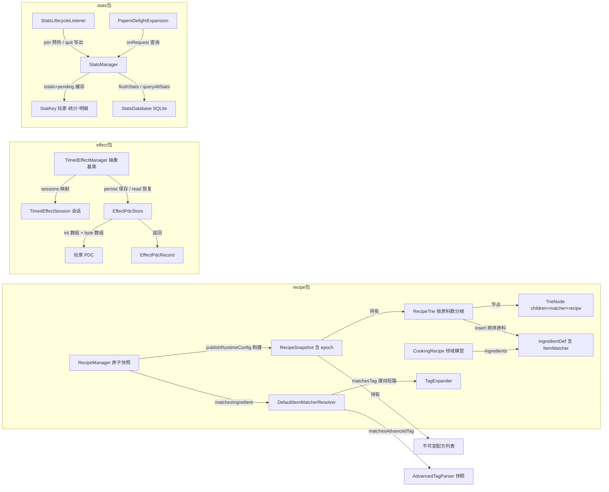
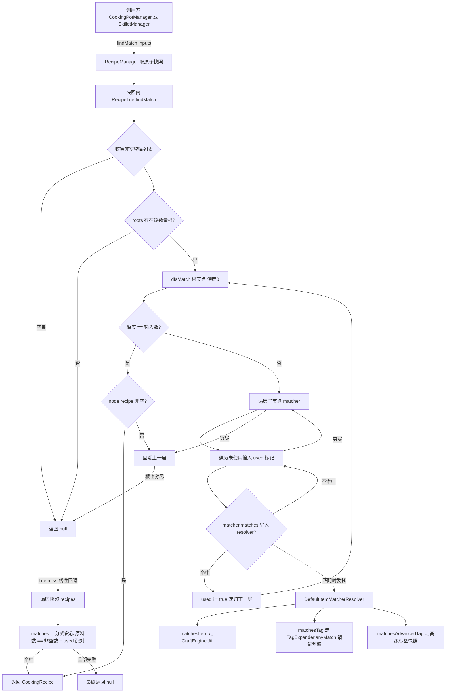
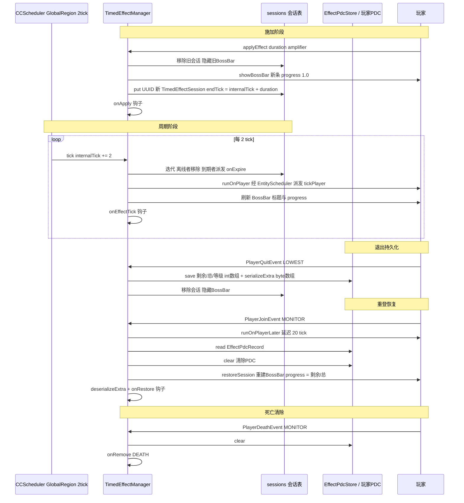
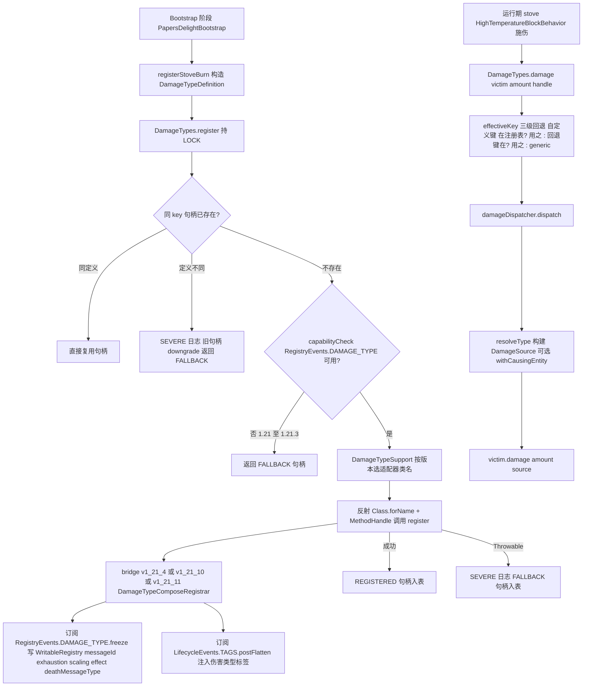
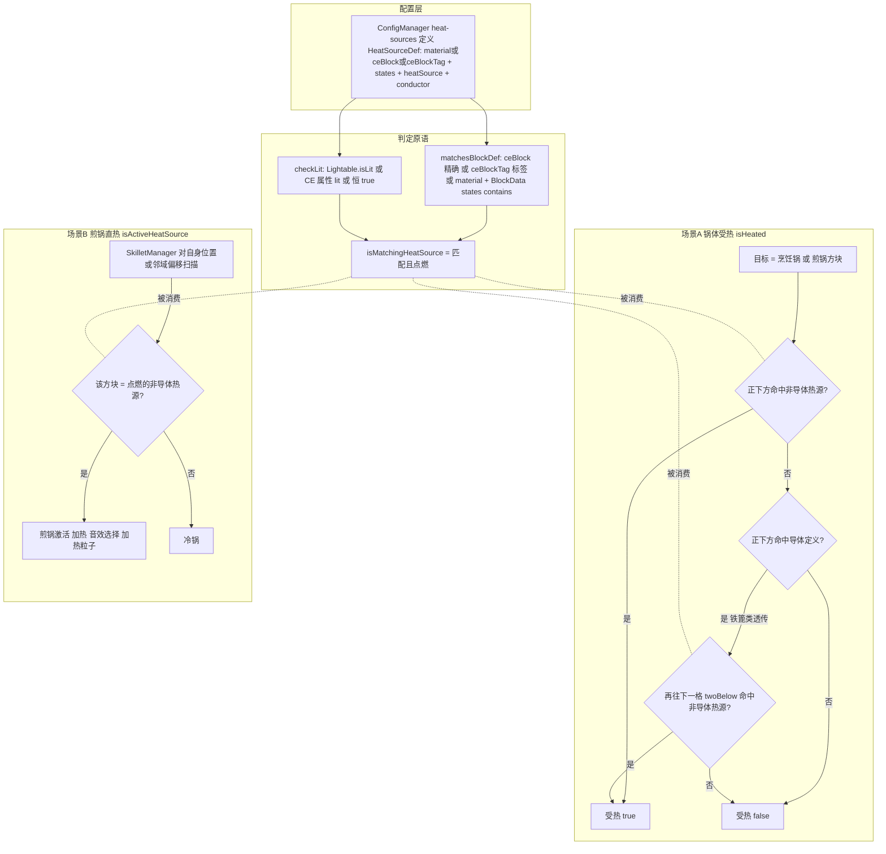

# 配方、效果、伤害、统计与工具模块

> 模块职责：本模块组是 PapersDelight 的「数据与服务中枢」——recipe 包以不可变快照 + 前缀树（Trie）提供多原料无序配方匹配与标签展开；effect 包提供基于 BossBar 的计时效果抽象基类与 PDC 跨重启持久化；damage 包在 bootstrap 阶段注册自定义伤害类型并提供多版本 NMS 桥接与三级回退（自定义→原版回退键→generic）；stats 包提供 SQLite 落盘的玩家烹饪统计、异步预热/落盘生命周期与 PlaceholderAPI 占位符；heat 包提供配置驱动的热源判定（含导体透传）；util 包汇集物品 meta 反射、文本解析、粒子节流等横切工具；common 包提供爆炸结算、菜单关闭等通用流程原语。

> 文件数 / 总行数：35 个文件 / 约 3042 行（recipe 11 个 629 行；effect 4 个 462 行；damage 2 个 343 行；stats 4 个 808 行；heat 1 个 85 行；util 9 个 601 行；common 4 个 114 行。行数以实际源码为准，WorldLookup.java 实测 11 行）

## 1. 模块概览

### 1.1 RecipeTrie 前缀树多原料匹配算法的设计意图

烹饪锅配方的核心查询是「锅中任意槽位的无序物品集合 → 是否命中某配方」。暴力解法是对每个配方做二分图式的逐原料贪心匹配，复杂度为 O(配方数 × 原料数 × 槽位数)。RecipeTrie 的设计意图是利用「原料多重集合的规范化表示」做索引剪枝：

1. **以原料数量为第一级索引**：`roots` 是 `Map<原料数, TrieNode>`，非空输入物品数不同直接判定无配方，天然支持 1~N 原料配方共存。
2. **排序规范化**：`insert` 时把配方的 `IngredientDef` 列表按 `matcher().stableKey()` 字典序排序后逐层插入，使「相同原料集合（多重集合）」的配方无论声明顺序如何都收敛到同一条树路径——这是把无序匹配问题转化为有序路径查找的关键。
3. **DFS + used 数组回溯**：`findMatch` 在每一层尝试「子节点的 ItemMatcher × 尚未使用的输入物品」的组合并递归，等价于在树上做带剪枝的双向匹配；由于树按数量分根且每层只遍历现有子节点，实际配方原料数很小（1~4），匹配代价极低。
4. **Trie 优先 + 线性回退双层保障**：`RecipeManager.findMatch` 先查 Trie，miss 后回退到逐配方贪心 `matches()`。因为 stableKey 相同的多个原料在 Trie 中会坍缩到同一路径节点（首个 insert 的配方胜出），线性回退兜底保证了语义完备——Trie 是快路径而非唯一真相。
5. **无锁读**：整棵 Trie 随 `RecipeSnapshot` 一次性构建并随 AtomicReference 原子发布，读者拿到的永远是完整一致快照，配置重载时新旧 Trie 无缝切换（epoch 递增标识代次）。

标签展开方面，`TagExpander` 不预先物化标签成员列表，而是在 `DefaultItemMatcherResolver.matchesTag` 中以谓词短路方式遍历（`anyMatch`）：先对标签本身做运行时匹配测试（CraftEngine 运行时标签 / 原版 Bukkit Tag），再对成员物品逐个测试，命中即返回，避免大标签的展开开销。

### 1.2 模块关系图



## 2. 类与函数目录（35 个类全覆盖）

### 2.1 RecipeManager（`recipe/RecipeManager.java`，187 行）

**职责**：烹饪配方的运行时仓库。以 AtomicReference 持有不可变 `RecipeSnapshot`（配方列表 + Trie + 代次号），提供原子发布、Trie 优先查询、线性回退匹配、运行时状态快照/恢复，以及 Jug（水壶）三类流体配方的独立发布通道。
**继承/接口**：无继承，`final` 类。
**关键字段**：`EPOCH_COUNTER`（L22，静态 AtomicLong 代次计数）；`SNAPSHOT`（L24，AtomicReference of RecipeSnapshot）；`JUG_RECIPES`（L26，AtomicReference of JugRecipes）；`RESULT_PROTOTYPES`（L31，ConcurrentHashMap&lt;CookingRecipe,Prototype&gt; 产物原型缓存，R3 新增——replaceSnapshot/restoreRuntimeState 整体失效，值经 Prototype 包装以允许 null）.

**方法清单表**：

| 方法 | 签名 | 行号 | 行为说明 |
| --- | --- | --- | --- |
| snapshotEpoch | `public long snapshotEpoch()` | 45 | 返回当前快照代次号，用于诊断/一致性校验 |
| resultPrototype | `public ItemStack resultPrototype(CookingRecipe recipe)` | 36 | R3 新增：产物共享只读原型（CHM 缓存 createItem 结果；调用方禁止修改实例），供烹饪锅逐 tick canStoreMeal 判定 |
| findMatch | `public CookingRecipe findMatch(ItemStack[] inputs)` | 49 | 取当前快照：先 Trie 查找，miss 后逐配方线性回退 `matches`，无命中返回 null |
| count | `public int count()` | 60 | 当前快照配方数量 |
| recipes | `public List<CookingRecipe> recipes()` | 64 | 返回当前快照的不可变配方列表 |
| captureRuntimeState | `public RuntimeSnapshot captureRuntimeState()` | 68 | 同时捕获配方快照与 Jug 配方引用，供 reload 前备份 |
| restoreRuntimeState | `public void restoreRuntimeState(RuntimeSnapshot snapshot)` | 73 | 非空校验后整体回写两个 AtomicReference 并清空产物原型缓存（R3），用于 reload 失败回滚 |
| replaceSnapshot | `void replaceSnapshot(List<CookingRecipe> recipes)` | 90 | 包私有：以新列表构建 RecipeSnapshot 并原子替换 SNAPSHOT；清空产物原型缓存（R3） |
| publishRuntimeConfig | `public void publishRuntimeConfig(List<CookingRecipe> recipes)` | 95 | registration 模块配置解析完成后的正式发布入口，内部调 replaceSnapshot |
| publishJugRecipes | `public void publishJugRecipes(List<JugFluidFillingRecipe>, List<JugFluidEmptyingRecipe>, List<JugSoakingRecipe>)` | 99 | 原子发布 Jug 装液/排液/浸泡三类配方（List.copyOf 防御性拷贝） |
| jugRecipes | `public JugRecipes jugRecipes()` | 107 | 读取当前 Jug 配方集合 |
| matches | `private boolean matches(CookingRecipe recipe, ItemStack[] inputs)` | 127 | 线性回退匹配：非空物品数须等于原料数；≤64 槽走 matchesMasked 位掩码（R1，零分配），否则 used 数组版；均为每个 IngredientDef 贪心取第一个可用槽（保持初版语义） |
| matchesMasked | `private boolean matchesMasked(CookingRecipe, ItemStack[], long usedMask, int defIndex)` | 143 | R1 新增：long 位掩码递归 |
| matchesUsed | `private boolean matchesUsed(CookingRecipe, ItemStack[], boolean[], int)` | 155 | &gt;64 槽回退路径 |
| matchesIngredient | `public boolean matchesIngredient(ItemStack stack, IngredientDef def)` | 168 | 单原料判定：委托 `def.matcher().matches(stack, DefaultItemMatcherResolver.INSTANCE)` |
| getTagItems | `public static List<String> getTagItems(String tagName)` | 172 | 以空标签表调 TagExpander.expand（空表下无定义可展开，保留的兼容入口） |
| RuntimeSnapshot 构造器 | `private RuntimeSnapshot(RecipeSnapshot, JugRecipes)` | 84 | 嵌套不可变快照类（L80-88），两个字段均 Objects.requireNonNull |
| JugRecipes 紧凑构造器 | `public JugRecipes{...}` | 116 | 三列表 null 归一为空表并 List.copyOf；`empty()` 提供空单例 |
| RecipeSnapshot.create | `private static RecipeSnapshot create(List<CookingRecipe>)` | 179 | 嵌套私有记录（L176-188）：拷贝列表→新建 Trie 逐个 insert→epoch 自增，三者原子绑定 |

**注册/查询流程详解**：主类 `PapersDelight.java` L198 实例化 RecipeManager；registration 模块解析配方 YAML 后调用 `publishRuntimeConfig` 一次性构建 Trie 并发布（写少读多，读写均无锁）；烹饪锅/煎锅/砧板管理器在玩家放入物品时调 `findMatch` 拿到一致快照做匹配。reload 时 `captureRuntimeState` → 重解析 → 失败则 `restoreRuntimeState` 回滚，保证线上服务不中断。

### 2.2 RecipeTrie（`recipe/RecipeTrie.java`，274 行）

**职责**：以「原料数量分根 + stableKey 排序路径」的前缀树实现无序多重集合配方索引；R1 起采用**可变建树 + 惰性冻结**双形态：insert 阶段在可变 TrieNode 上构建（LinkedHashMap 保插入序=匹配优先级），首次查询时无锁冻结为数组化 Frozen 结构（FrozenNode: matchers/children 数组），查询全程零装箱零子节点查找开销。
**继承/接口**：无继承，`final` 类；依赖外部 API `ItemMatcherResolver<ItemStack>`。
**关键字段**：`roots`（L29，`Map<Integer, TrieNode>` 原料数→子树根，仅建树期）；`resolver`（匹配解析器）；`frozen`（volatile，@Nullable Frozen——惰性冻结缓存，insert 置 null 失效，benign-race 重建）。

**方法清单表**：

| 方法 | 签名 | 行号 | 行为说明 |
| --- | --- | --- | --- |
| RecipeTrie | `public RecipeTrie()` | 35 | 委托重载构造器，使用 DefaultItemMatcherResolver.INSTANCE |
| RecipeTrie | `RecipeTrie(ItemMatcherResolver<ItemStack> resolver)` | 39 | 包私有：注入自定义解析器（测试/基准直驱） |
| insert | `public void insert(CookingRecipe recipe)` | 43 | 按原料数取/建根；原料按 stableKey 排序后逐层 computeIfAbsent 子节点；沿途补挂 matcher；叶子处仅首个配方生效（first-insert-wins）；置 frozen=null 失效 |
| findMatch | `@Nullable public CookingRecipe findMatch(ItemStack[] inputs)` | 60 | 计数非空并压实为小数组；≤64 槽走位掩码 DFS，否则 used 数组 DFS；无对应数量根返回 null |
| findMatch | `<T> @Nullable CookingRecipe findMatch(List<T> inputs, ItemMatcherResolver<? super T> resolver)` | 95 | 包私有泛型版本：与 ItemStack 解耦（基准直驱入口），掩码/used 双路径同上 |
| frozenOrBuild | `private Frozen frozenOrBuild()` | 128 | 惰性冻结：volatile 读 → 缺则 buildFrozen 写回（benign race，重复构建无害） |
| buildFrozen | `private Frozen buildFrozen()` | 136 | 遍历可变树，按数量根数组化：freeze 递归 + sizes 索引 + recipeCount |
| freeze | `private static FrozenNode freeze(TrieNode node)` | 150 | 保留 LinkedHashMap 插入序转数组（匹配优先级不变）；叶子 recipe 一并迁移 |
| dfsFrozenMask / dfsFrozenListMask | `private static <T> CookingRecipe dfsFrozenMask(FrozenNode, T[], int, resolver, long usedMask)` | 188/208 | R1 核心：long 位掩码标记已用槽，零分配递归；子节点序 × 输入序双循环，失败回溯 |
| dfsFrozenUsed / dfsFrozenListUsed | `private static <T> CookingRecipe dfsFrozenUsed(FrozenNode, T[], int, resolver, boolean[] used)` | 228/252 | &gt;64 输入回退：used 数组版（复用并清零） |
| FrozenNode | `private record FrozenNode(ItemMatcher[] matchers, FrozenNode[] children, @Nullable CookingRecipe recipe)` | 184 | 冻结节点：数组化子结构与匹配器 |
| Frozen | `private static final class Frozen(int[] sizes, FrozenNode[] rootsBySize, int recipeCount)` | L163（紧凑构造器 L169，rootFor L171） | 冻结快照类：sizes→rootsBySize 索引 |
| ingredientKey | `static String ingredientKey(IngredientDef def)` | 102 | 包私有：暴露 `def.matcher().stableKey()` 作为规范化键 |
| size | `public int size()` | 106 | 优先取冻结快照 recipeCount，未冻结则递归统计 |
| countRecipes | `private int countRecipes(TrieNode node)` | 116 | 可变树递归计数辅助 |

**插入/匹配算法（含 TagExpander 标签展开）**：insert 的排序保证 `{A,B}` 与 `{B,A}` 两种声明走向同一路径；冻结后 dfsFrozen* 每层做「子节点 matcher 是否接受某未用物品」的双循环（位掩码版以 usedMask 的位测试替代数组读写），等价于树上二分图匹配，子节点数组序=原 LinkedHashMap 插入序=匹配优先级（行为顺序保持）。matcher 对物品的判定最终落到 `DefaultItemMatcherResolver`：`matchesItem` 走 CraftEngine 物品判定；`matchesTag` 走 `TagExpander.anyMatch`——传入空标签表，tagPredicate 检查 CraftEngine 运行时标签与原版 Bukkit Tag，itemPredicate 检查具体物品 id，任一命中短路返回；`matchesAdvancedTag` 走 AdvancedTagParser 活跃快照的 `containsItem`。

### 2.3 TrieNode（`recipe/TrieNode.java`，15 行）

**职责**：Trie 可变建树节点，包私有数据载体；仅 insert/freeze 阶段使用，查询走冻结结构。
**继承/接口**：无。
**关键字段**：`children`（L10，LinkedHashMap 保插入序）；`matcher`（L11，@Nullable ItemMatcher，插入时沿途补挂供匹配用）；`recipe`（L13，@Nullable CookingRecipe，仅叶子记录首个到达的配方）。

**方法清单表**：

| 方法 | 签名 | 行号 | 行为说明 |
| --- | --- | --- | --- |
| — | 无方法，纯数据类 | — | 三个字段构成；LinkedHashMap 维持子节点确定性遍历顺序，保证 dfsMatch 结果可复现 |

### 2.4 DefaultItemMatcherResolver（`recipe/DefaultItemMatcherResolver.java`，87 行）

**职责**：ItemMatcherResolver 的默认实现——把「物品 id / 标签 / 高级标签」三种匹配意图落到 CraftEngine 与 Bukkit 的实际判定上；单例 INSTANCE 被全项目共享。
**继承/接口**：`implements ItemMatcherResolver<ItemStack>`（外部 dev.tako API），`final` 类。
**关键字段**：`INSTANCE`（L21，静态单例）；`advancedTags`（`Supplier<AdvancedTagSnapshot>`，默认指向 AdvancedTagParser::activeSnapshot，可注入以便测试）；`NS_KEYS`/`CE_KEYS`（L61-62，R1 新增：tagId→NamespacedKey/CE Key 的 ConcurrentHashMap 缓存——NamespacedKey.fromString 每次解析成本被摊销；fromString 返回 null 不入缓存）。

**方法清单表**：

| 方法 | 签名 | 行号 | 行为说明 |
| --- | --- | --- | --- |
| DefaultItemMatcherResolver | `public DefaultItemMatcherResolver()` | 25 | 默认构造：高级标签供应者 = AdvancedTagParser::activeSnapshot |
| DefaultItemMatcherResolver | `DefaultItemMatcherResolver(Supplier<AdvancedTagSnapshot>)` | 29 | 包私有：注入快照供应者 |
| matchesItem | `@Override public boolean matchesItem(ItemStack item, String itemId)` | 33 | 委托 CraftEngineUtil.isItem 做具体物品 id 判定 |
| matchesTag | `@Override public boolean matchesTag(ItemStack item, String tagId)` | 39 | 空值防御后调 TagExpander.anyMatch；tagPredicate=matchesRuntimeTag（R1 起内部直接小写后转发），itemPredicate=matchesItem；支持嵌套 tag 递归短路 |
| matchesAdvancedTag | `@Override public boolean matchesAdvancedTag(ItemStack item, String tagId)` | 49 | 取 CE 物品标识符，查活跃高级标签快照 containsItem；tagId→Key 经 ceKey 进程级缓存（R6，消除每次 Key.of 分配解析）；任何 RuntimeException 视为不匹配（防御性降级） |
| matchesRuntimeTag | `private static boolean matchesRuntimeTag(ItemStack item, String tagId)` | 64 | 先经 CE_KEYS 缓存取 CE Key 试 CraftEngineItems.byItemStack 的运行时标签；CE 自定义物品未命中则直接否；否则经 NS_KEYS 缓存取 NamespacedKey 回落 Bukkit.getTag(REGISTRY_ITEMS) 的 Material 标签；全程 Throwable 吞掉保证不因 CE 异常中断匹配 |
| ceKey | `private static Key ceKey(String tagId)` | 79 | CE Key 缓存包装（R1；R6 起 matchesAdvancedTag 亦复用） |
| cachedKeyForBenchmark | `static Key cachedKeyForBenchmark(String tagId)` | 84 | R6 基准专用：暴露 ceKey 缓存命中路径供离线度量（包私有，见 benchmark IdResolutionBench） |

### 2.5 TagExpander（`recipe/TagExpander.java`，75 行）

**职责**：标签展开/匹配的纯函数工具。支持 `#嵌套标签` 递归展开与防环（visited 集合），既可物化展开为物品 id 列表，也可谓词短路匹配。
**继承/接口**：无，工具类（私有构造器）。
**关键字段**：无实例字段。

**方法清单表**：

| 方法 | 签名 | 行号 | 行为说明 |
| --- | --- | --- | --- |
| TagExpander | `private TagExpander()` | 13 | 禁止实例化 |
| expand | `public static List<String> expand(Map<String, List<String>> tags, String rootTag)` | 16 | 从 rootTag 递归展开：`#` 前缀成员递归下钻，普通成员收集进结果；visited 防环、未知标签静默忽略 |
| anyMatch | `public static boolean anyMatch(Map<String, List<String>>, String, Predicate<String>, Predicate<String>)` | 22 | 短路版展开：**空标签表时直接 tagPredicate 测根标签返回**（R1 快路径，等价于 anyMatch0 空表行为）；非空表先测标签本身再对成员物品测 itemPredicate，命中立即 true；非空路径 HashSet 预容量；防环 |
| expandInto | `private static void expandInto(Map, String tagName, List<String> out, Set<String> visited)` | 31 | expand 的递归实现，小写规范化标签名 |
| anyMatch0 | `private static boolean anyMatch0(Map, String, Predicate, Predicate, Set<String>)` | 49 | anyMatch 的递归实现（空表情形已由 anyMatch 快路径承接） |
| normalizeTag | `private static String normalizeTag(String tagName)` | 67 | Locale.ROOT 小写规范化，保证大小写不敏感的标签寻址 |

### 2.6 CampfireRecipeUtil（`recipe/CampfireRecipeUtil.java`，64 行）

**职责**：查询原版 Bukkit 营火配方（CookingPot 烹饪时间对齐营火、炉灶加热判定等场景），用「正/负双缓存」把 O(全配方表迭代) 摊销为 O(1)。
**继承/接口**：无，静态工具类。
**关键字段**：`recipeCache`（L15，ConcurrentHashMap of Material 名→CampfireRecipe）；`notCampfireIngredient`（L16，确认非营火原料的 Material 名集合）。

**方法清单表**：

| 方法 | 签名 | 行号 | 行为说明 |
| --- | --- | --- | --- |
| CampfireRecipeUtil | `private CampfireRecipeUtil()` | 18 | 禁止实例化 |
| getCookingTime | `public static int getCookingTime(ItemStack input, int fallbackTicks)` | 20 | 查营火配方 cookingTime；空手或无配方返回调用方给的回退 tick |
| getResult | `public static ItemStack getResult(ItemStack input)` | 26 | 查营火配方产物，无则 null |
| isIngredient | `public static boolean isIngredient(ItemStack input)` | 32 | 是否任一营火配方的原料 |
| findRecipe | `public static CampfireRecipe findRecipe(ItemStack input)` | 37 | 双缓存查询：命中缓存后仍用 getInputChoice().test 复验（防 Material 相同但组件不同）；负缓存直接 null；miss 时遍历 Bukkit.recipeIterator 找首个 CampfireRecipe 并写缓存，找不到写入负缓存 |
| clearCache | `public static void clearCache()` | 60 | 清空正负缓存；主类 reload 流程注册为 "campfire-cache" 可重置项（PapersDelight.java L504） |

### 2.7 CustomRecipeManager（`recipe/CustomRecipeManager.java`，42 行）

**职责**：配方书/图鉴展示用的「自定义配方」仓库：Single（单个物品及其描述行）与 Decomposition（分解配方：输入+输出+催化剂列表）两类条目的 volatile 快照发布与读取。
**继承/接口**：无。
**关键字段**：`plugin`（L12）；`snapshot`（L13，volatile CustomRecipeSnapshot）。

**方法清单表**：

| 方法 | 签名 | 行号 | 行为说明 |
| --- | --- | --- | --- |
| CustomRecipeManager | `public CustomRecipeManager(Plugin plugin)` | 15 | 保存插件引用（当前仅持有，预留给日志/调度） |
| publishRecipes | `public void publishRecipes(List<CustomRecipe.Single>, List<CustomRecipe.Decomposition>)` | 19 | 一次性原子替换两类列表（List.copyOf 不可变化） |
| captureRuntimeState | `public RuntimeSnapshot captureRuntimeState()` | 23 | 包装当前快照，供 reload 回滚 |
| restoreRuntimeState | `public void restoreRuntimeState(RuntimeSnapshot)` | 27 | 非空校验后回写快照 |
| decompositions | `public List<CustomRecipe.Decomposition> decompositions()` | 39 | 读取分解配方列表（GUI 配方浏览器消费） |
| singles | `public List<CustomRecipe.Single> singles()` | 40 | 读取单物品条目列表 |
| count | `public int count()` | 41 | 两类条目总数 |
| CustomRecipeSnapshot | `record CustomRecipeSnapshot(List<Decomposition>, List<Single>)` | 10 | 包私有嵌套记录，两个不可变列表 |

### 2.8 IngredientDef（`recipe/IngredientDef.java`，44 行）

**职责**：配方原料定义——记录传统三元组（原版 Material / 标签 / CE 物品）加 anyOf 列表，并在紧凑构造器中把旧式字段统一编译为外部 API 的 `ItemMatcher`（anyOf 语义），实现「旧配置格式零迁移」。
**继承/接口**：Java record。
**关键字段（记录组件）**：`material`（@Nullable Material）；`tag`（@Nullable String）；`ceItem`（@Nullable String）；`anyOf`（List of String）；`matcher`（ItemMatcher，可由紧凑构造器兜底生成）。

**方法清单表**：

| 方法 | 签名 | 行号 | 行为说明 |
| --- | --- | --- | --- |
| 紧凑构造器 | `public IngredientDef{...}` | 13 | anyOf 判空归一；matcher 为 null 时调 legacyMatcher 兜底合成 |
| 构造器 | `public IngredientDef(Material, String, String, List<String> anyOf)` | 18 | 便捷重载：matcher 传 null 触发兜底 |
| 构造器 | `public IngredientDef(Material, String, String)` | 23 | 最简三元组重载，anyOf 为空表 |
| displayExpressions | `public List<String> displayExpressions()` | 27 | GUI 展示用的表达式回退链：anyOf → material key → ceItem → 补 # 前缀的 tag → matcher.expressions() |
| legacyMatcher | `private static ItemMatcher legacyMatcher(Material, String, String, List<String>)` | 35 | 把非空 material/补 # 的 tag/ceItem/anyOf 汇成一个表达式列表，返回 `ItemMatcher.anyOf(expressions)` |

### 2.9 AdvancedTagService（`recipe/AdvancedTagService.java`，25 行）

**职责**：高级标签（advtag 前缀）的门面服务：物品是否带某高级标签、以及把高级标签解析为成员物品 Key 列表。
**继承/接口**：无，静态工具类。
**关键字段**：无。

**方法清单表**：

| 方法 | 签名 | 行号 | 行为说明 |
| --- | --- | --- | --- |
| AdvancedTagService | `private AdvancedTagService()` | 11 | 禁止实例化 |
| isAdvancedTagged | `public static boolean isAdvancedTagged(ItemStack item, String tagId)` | 14 | 转发 DefaultItemMatcherResolver.INSTANCE.matchesAdvancedTag |
| resolveItems | `public static List<String> resolveItems(String tagId)` | 18 | 剥离可选的 `advtag:` 前缀并 trim；空返回空表；否则 AdvancedTagParser.resolve 展开 Key 并映射为 asString 列表 |

### 2.10 CookingRecipe（`recipe/CookingRecipe.java`，27 行）

**职责**：烹饪配方领域模型（公共可变 final 字段的轻量 POJO，注册与查询两侧共用）。
**继承/接口**：普通 public class（非 final）。
**关键字段**：`type`（L7，配方类型字符串）；`result`（L8，产物物品 id）；`resultCount`（L9）；`container`（L10，容器物品 id）；`cookingTime`（L11，烹饪 tick 数）；`experience`（L12，经验浮点）；`ingredients`（L13，List of IngredientDef）；`source`（L14，来源标识，如配置文件名）。

**方法清单表**：

| 方法 | 签名 | 行号 | 行为说明 |
| --- | --- | --- | --- |
| CookingRecipe | `public CookingRecipe(String, String, int, String, int, float, List<IngredientDef>, String)` | 16 | 全字段直接赋值的唯一构造器；ingredients 由调用方保证不可变 |

### 2.11 CustomRecipe（`recipe/CustomRecipe.java`，18 行）

**职责**：配方书展示条目的 sealed 接口，仅允许 Single 与 Decomposition 两种实现。
**继承/接口**：`sealed interface`，permits 两个嵌套 record。
**关键字段**：无。

**方法清单表**：

| 方法 | 签名 | 行号 | 行为说明 |
| --- | --- | --- | --- |
| Decomposition 紧凑构造器 | `public Decomposition{...}` | 8 | 记录 `input/output/catalysts`（L7）；catalysts 判空归一并 copyOf |
| Single 紧凑构造器 | `public Single{...}` | 14 | 记录 `item/description`（L13）；description 判空归一并 copyOf |

### 2.12 TimedEffectManager（`effect/TimedEffectManager.java`，397 行）

**职责**：计时效果抽象基类（模板方法模式）。管理「BossBar 进度条 + 每 2 tick 调度 + 会话表 + PDC 持久化 + 生命周期钩子」，子类只需覆写钩子即可获得一种新的计时效果；同时维护全局静态注册表供效果功能（function）模块按 qualifiedId 查找。
**继承/接口**：`abstract class implements Listener`。
**关键字段**：`RESTORE_DELAY_TICKS`（L27，=20，重登恢复延迟）；`REGISTRY`（L29，qualifiedId→manager 静态并发注册表）；`plugin/effectId/qualifiedId/nameKey`（L31-34，qualifiedId 强制小写）；`pdcStore`（L35）；`sessions`（L37，UUID→TimedEffectSession 并发表）；`enabled/color/overlay`（L40-42，BossBar 外观配置）；`tickTask`（L44，CCScheduler 定时任务）；`internalTick`（L45，内部时钟，每 tick +2）。

**方法清单表**：

| 方法 | 签名 | 行号 | 行为说明 |
| --- | --- | --- | --- |
| TimedEffectManager | `protected TimedEffectManager(JavaPlugin, String effectId, String qualifiedId, String nameKey)` | 48 | 构造 PDC store、规范化 qualifiedId 并把自己注册进 REGISTRY |
| qualifiedId | `public final String qualifiedId()` | 60 | 返回小写全限定 id |
| registered | `public static Collection<TimedEffectManager> registered()` | 65 | 快照式返回注册表全部管理器（RandomRemoveEffectFunction/NourishmentManager 遍历用） |
| byQualifiedId | `public static TimedEffectManager byQualifiedId(String key)` | 70 | 注册表查找（ UpgradeEffectFunction/RemoveEffectFunction 消费） |
| isHarmful | `public boolean isHarmful()` | 75 | 钩子：默认非有害（随机移除效果时排除有害效果的策略依据之一） |
| isLowPriority | `public boolean isLowPriority()` | 80 | 钩子：默认非低优先级 |
| configure | `protected void configure(boolean enabled, String colorName, String styleName)` | 85 | 应用启用开关与 BossBar 颜色/样式（非法值静默保留默认）；首次调用时注册事件监听并启动 2 tick 周期的全局 region 定时任务 |
| mapOverlay | `private static BossBar.Overlay mapOverlay(String styleName)` | 102 | 样式字符串→Overlay 的 switch 映射，兼容 SOLID/PROGRESS 与 NOTCHED_N 双命名 |
| buildTitle | `protected Component buildTitle(int remainingTicks, int amplifier)` | 114 | 组装标题：可翻译效果名 + 罗马数字等级（有等级时）+ mm:ss 剩余时间 |
| romanKey | `static String romanKey(int amplifier)` | 123 | amplifier 1-5 用 `potion.potency.N`，更大用 `enchantment.level.N+1`，0 返回 null |
| isEnabled | `public boolean isEnabled()` | 129 | 读取开关 |
| stopAll | `public void stopAll()` | 134 | 关停流程：全体在线玩家 persist → 取消 tick 任务 → 隐藏全部 BossBar → 清空会话 → 从注册表注销 |
| applyEffect | `public void applyEffect(Player, int durationTicks)` | 149 | 便捷重载：amplifier=0 |
| applyEffect | `public void applyEffect(Player, int durationTicks, int amplifier)` | 154 | 核心施加：开关/参数防御；移除旧会话并隐藏旧条；endTick=internalTick+时长；新建 progress=1.0 的 BossBar 并展示；入会话表；触发 onApply 钩子 |
| applyEffectMerging | `public void applyEffectMerging(Player, int, int)` | 170 | 合并语义：时长取 max（新值 vs 剩余）、等级取 max，再走 applyEffect |
| RemovalCause | `enum RemovalCause: CONSUMED, DEATH` | 179 | 移除原因枚举（食用消耗 / 死亡清除） |
| removeEffect | `public void removeEffect(Player)` | 187 | 便捷重载：CONSUMED |
| removeEffect | `public void removeEffect(Player, RemovalCause)` | 192 | 移除会话并隐藏 BossBar、清 PDC、触发 onRemove（null cause 归一为 CONSUMED） |
| getRemainingTicks | `public int getRemainingTicks(Player)` | 201 | endTick - internalTick，下限 0；无会话 0 |
| isActive | `public boolean isActive(Player)` | 209 | 剩余 tick > 0 即生效中 |
| getTotalTicks | `public int getTotalTicks(Player)` | 214 | 会话总时长（进度条分母） |
| getAmplifier | `public int getAmplifier(Player)` | 221 | 会话等级，无会话返回 -1 |
| restoreSession | `public void restoreSession(Player, int remainingTicks, int totalTicks, int amplifier)` | 228 | 重登恢复：按剩余/总时长计算初始 progress，重建 BossBar 与会话（total 取 max 兜底），触发 onRestore |
| persist | `protected void persist(Player)` | 246 | 剩余<=0 时清 PDC，否则 save(剩余, 总, 等级, serializeExtra) |
| tick | `private void tick()` | 257 | 周期驱动：internalTick+=2；空表快速返回；迭代会话——离线者直接移除；到期者经 runOnPlayer 派发隐藏+onExpire；存活者派发 tickPlayer |
| runOnPlayer | `private void runOnPlayer(Player, Runnable)` | 290 | Folia 线程路由：插件可用时经 CCScheduler EntityScheduler 派发；插件已禁用则当前线程直跑并吞异常 |
| runOnPlayerLater | `private void runOnPlayerLater(Player, Runnable, long delayTicks)` | 302 | 带延迟的实体调度版本，插件禁用时不执行 |
| tickPlayer | `private void tickPlayer(Player, UUID, TimedEffectSession, int now)` | 307 | 单玩家刷新：校验会话身份（防并发错位）→ 再次到期检查 → 重算标题与 progress 更新 BossBar（标题组件相同则不重复写）→ onEffectTick 钩子 |
| onPlayerQuit | `@EventHandler(LOWEST) public void onPlayerQuit(PlayerQuitEvent)` | 333 | 退出：LOWEST 优先级最先 persist 到 PDC，再移除会话隐藏 BossBar |
| onPlayerJoin | `@EventHandler(MONITOR) public void onPlayerJoin(PlayerJoinEvent)` | 342 | 加入：MONITOR 优先级延迟 20 tick 读 PDC 记录，有剩余则清 PDC→restoreSession→deserializeExtra |
| onPlayerDeath | `@EventHandler(MONITOR) public void onPlayerDeath(PlayerDeathEvent)` | 357 | 死亡：以 DEATH 原因移除效果（不落 PDC） |
| onApply | `protected void onApply(Player, int, int)` | 363 | 空钩子：施加后回调（子类施加药水效果等） |
| onRemove | `protected void onRemove(Player, RemovalCause)` | 367 | 空钩子：移除后回调（子类清除药水效果） |
| onRestore | `protected void onRestore(Player, int amplifier)` | 371 | 空钩子：重登恢复后回调 |
| onExpire | `protected void onExpire(Player)` | 375 | 空钩子：自然到期回调 |
| onEffectTick | `protected void onEffectTick(Player, int amplifier, int now)` | 379 | 空钩子：每 2 tick 生效回调 |
| serializeExtra | `protected byte[] serializeExtra(Player)` | 383 | 空实现：子类附加持久化数据（默认空数组） |
| deserializeExtra | `protected void deserializeExtra(Player, byte[] extra)` | 388 | 空实现：恢复附加数据 |
| formatDuration | `public static String formatDuration(int ticks)` | 392 | tick→`分:秒`（秒补零）格式化，供标题与占位符共用 |

**每 tick 调度与 BossBar 详解**：`configure` 首次调用时把本实例注册为 Listener 并在 CCScheduler GlobalRegionScheduler 上以 `runTaskTimer(plugin, 1L, 2L, this::tick)` 启动全局心跳；`internalTick` 以 +2 步进与任务周期严格对齐，endTick 都以该时钟为基准，天然免疫调度抖动。所有触及玩家实体/BossBar 的动作都经 `runOnPlayer` 路由到该玩家的 EntityScheduler（Folia 的 per-entity 线程域），保证线程归属正确；tick 主循环本身只读写并发会话表，离线清理与到期派发在迭代器中安全完成。BossBar 标题随剩余时间刷新、progress=剩余/总时长，只在组件值变化时写入以减少包重发。

### 2.13 EffectPdcStore（`effect/EffectPdcStore.java`，53 行）

**职责**：把计时效果会话状态写入玩家 PDC 的最小键值存取器；每个效果实例持有一对 NamespacedKey。
**继承/接口**：`final` 类，无继承。
**关键字段**：`EMPTY`（L12，空字节数组常量）；`coreKey`（L14，`effect_<id>`）；`extraKey`（L15，`effect_<id>_extra`）。

**方法清单表**：

| 方法 | 签名 | 行号 | 行为说明 |
| --- | --- | --- | --- |
| EffectPdcStore | `public EffectPdcStore(Plugin plugin, String effectId)` | 18 | 以插件命名空间构造 core/extra 两个 NamespacedKey |
| save | `public void save(Player, int remainingTicks, int totalTicks, int amplifier, byte[] extra)` | 24 | remaining<=0 转 clear；否则 coreKey 存 `int[]{剩余, max(总,剩余), max(0,等级)}` 的 INTEGER_ARRAY，extraKey 存 BYTE_ARRAY（null 归一为空数组） |
| read | `public EffectPdcRecord read(Player)` | 37 | 读 core 数组（长度<3 视为无记录返回 null）+ extra 字节数组，组装 EffectPdcRecord |
| clear | `public void clear(Player)` | 47 | 移除两个键，彻底清除持久化痕迹 |

### 2.14 EffectPdcRecord（`effect/EffectPdcRecord.java`，5 行）

**职责**：PDC 读取结果的一次性载体。
**继承/接口**：Java record。
**关键字段（记录组件）**：`remainingTicks`、`totalTicks`、`amplifier`（三个 int）、`extra`（byte[]）。

**方法清单表**：

| 方法 | 签名 | 行号 | 行为说明 |
| --- | --- | --- | --- |
| — | 纯记录，无额外方法 | 4 | 由 EffectPdcStore.read 组装、TimedEffectManager.onPlayerJoin 消费 |

### 2.15 TimedEffectSession（`effect/TimedEffectSession.java`，7 行）

**职责**：单个玩家单个效果的活跃会话快照。
**继承/接口**：Java record。
**关键字段（记录组件）**：`bossBar`（Adventure BossBar）、`endTick`（到期内部时钟）、`totalDurationTicks`（总时长）、`amplifier`（等级）。

**方法清单表**：

| 方法 | 签名 | 行号 | 行为说明 |
| --- | --- | --- | --- |
| — | 纯记录，无额外方法 | 6 | 存于 TimedEffectManager.sessions 并发表；tickPlayer 用引用相等校验会话身份 |

### 2.16 DamageTypes（`damage/DamageTypes.java`，240 行）

**职责**：自定义伤害类型的注册中心与施伤入口。注册阶段在 bootstrap 上下文中经反射调用版本适配器写入 Paper Registry；运行阶段提供「自定义键→回退键→generic」的三级键解析、DamageType 解析与统一施伤。五个包级可替换协作者字段（keyPresence/damageDispatcher/capabilityCheck/adapterInvoker/adapterClassNameResolver）为可测试性而设计。
**继承/接口**：`final` 工具类（私有构造抛异常）。
**关键字段**：`HANDLES`（L31，Key→DamageTypeHandle 并发表）；`LOCK`（L32，注册互斥锁）；`LOGGER`（L33）；`keyPresence/damageDispatcher/capabilityCheck/adapterInvoker/adapterClassNameResolver`（L35-43，可注入协作者）；`GENERIC_KEY`（L46，`minecraft:generic` 兜底键）。

**方法清单表**：

| 方法 | 签名 | 行号 | 行为说明 |
| --- | --- | --- | --- |
| DamageTypes | `private DamageTypes()` | 48 | 抛 UnsupportedOperationException，纯静态工具 |
| invokeAdapter | `private static void invokeAdapter(BootstrapContext, DamageTypeDefinition) throws Throwable` | 52 | 按当前版本解析适配器类名，反射取 `register(BootstrapContext, DamageTypeDefinition)` 方法并 MethodHandle 调用 |
| isKeyInRuntimeRegistry | `private static boolean isKeyInRuntimeRegistry(Key)` | 59 | 查 Registry.DAMAGE_TYPE 是否已有该键，Throwable 一律视为不存在 |
| resolveType | `private static DamageType resolveType(Key)` | 67 | 取运行时 DamageType，缺失或异常回落 DamageType.GENERIC |
| dispatchDamage | `private static void dispatchDamage(LivingEntity, double, Key, Entity)` | 76 | 构建 DamageSource（可选 withCausingEntity）并调 victim.damage(amount, source) |
| register | `@NotNull public static DamageTypeHandle register(BootstrapContext, DamageTypeDefinition)` | 87 | 注册主流程（见 3.4）：同键同定义复用；同键冲突 SEVERE 日志+降级旧句柄+返回 FALLBACK；能力缺失（1.21-1.21.3）直接 FALLBACK；否则经适配器注册，成功 REGISTERED、异常 FALLBACK。全程持 LOCK |
| peek | `static DamageTypeHandle peek(Key)` | 137 | 包私有：无副作用查表（测试用） |
| effectiveKey | `@NotNull public static Key effectiveKey(Key customKey, Key fallback)` | 142 | 三级回退：自定义键在运行时注册表存在→用之；否则回退键存在→用之；否则 GENERIC_KEY |
| effectiveKey | `@NotNull public static Key effectiveKey(DamageTypeHandle handle)` | 156 | 句柄重载：取 handle 的自定义键与回退键再走上一方法 |
| resolve | `@NotNull public static DamageType resolve(Key customKey, Key fallback)` | 163 | 键对→DamageType 实例 |
| resolve | `@NotNull public static DamageType resolve(DamageTypeHandle handle)` | 169 | 句柄重载 |
| damage | `public static void damage(LivingEntity, double, DamageTypeHandle)` | 176 | 无肇事者重载 |
| damage | `public static void damage(LivingEntity, double, DamageTypeHandle, Entity causer)` | 181 | 句柄版施伤：effectiveKey 解析后交 damageDispatcher |
| damage | `public static void damage(LivingEntity, double, Key customKey, Key fallback)` | 192 | 键对便捷重载 |
| damage | `public static void damage(LivingEntity, double, Key, Key, Entity causer)` | 200 | 键对完整版：非空校验后同上派发 |
| resetForTesting | `static void resetForTesting()` | 212 | 包私有：清空句柄表并把五个协作者还原为默认实现（单测隔离） |
| KeyPresence | `@FunctionalInterface interface: boolean isPresent(Key)` | 224 | 键存在性协作者接口（L224-228） |
| DamageDispatcher | `@FunctionalInterface interface: void dispatch(LivingEntity, double, Key, Entity)` | 230 | 施伤派发协作者接口（L230-234） |
| AdapterInvoker | `@FunctionalInterface interface: void invoke(BootstrapContext, DamageTypeDefinition) throws Throwable` | 236 | 适配器调用协作者接口（L236-240） |

**注册与回退机制详解**：注册发生在插件 bootstrap 阶段（Paper 的 RegistryEvents 只在 bootstrap 可订阅）。`register` 的四级分支确保任何环境下都能拿到可用句柄：能力缺失（旧版服务端没有 RegistryEvents.DAMAGE_TYPE 静态字段）返回 FALLBACK 句柄，后续施伤自动走回退键；适配器反射失败同样降级而绝不抛出——「注册失败不影响游戏功能，只影响死亡消息/疲劳等表现精度」。运行期 `effectiveKey` 再做一次实时注册表探测，即使注册句柄显示 REGISTERED 但实际键被 datapack 移除也能正确回退。适配器经反射而非直接类引用，是因为三个 DamageTypeComposeRegistrar 分别编译在 NMS-Bridge 的 v1_21_4/v1_21_10/v1_21_11 子模块，主插件编译期不可见。

### 2.17 DamageTypeSupport（`damage/DamageTypeSupport.java`，103 行）

**职责**：服务端能力探测与版本→适配器类名映射，静态初始化一次完成。
**继承/接口**：`final` 工具类。
**关键字段**：`REGISTRY_EVENTS_CLASS_NAME/DAMAGE_TYPE_FIELD_NAME`（L12-14）；`ADAPTER_V1_21_4/ADAPTER_V1_21_10/ADAPTER_V1_21_11`（L16-21，bridge 包类名常量）；`ADAPTER_CLASS_NAME`（L24，公开默认=v1_21_4）；`REGISTRY_EVENT_CAPABILITY_PRESENT/ADAPTER_CLASS_PRESENT`（L26-27，类加载期计算）。

**方法清单表**：

| 方法 | 签名 | 行号 | 行为说明 |
| --- | --- | --- | --- |
| DamageTypeSupport | `private DamageTypeSupport()` | 28 | 抛异常禁止实例化 |
| isRegistryEventCapabilityPresent | `public static boolean isRegistryEventCapabilityPresent()` | 33 | 返回静态探测结果（RegistryEvents.DAMAGE_TYPE 是否存在且 static） |
| isAdapterClassPresent | `public static boolean isAdapterClassPresent()` | 37 | 默认适配器类是否可加载 |
| currentAdapterClassName | `public static @NotNull String currentAdapterClassName()` | 42 | 按 ServerBuildInfo.buildInfo().minecraftVersionId 实时选择适配器类名 |
| adapterClassName | `public static @NotNull String adapterClassName(String minecraftVersion)` | 47 | 版本解析：`1.21.0~1.21.4`→v1_21_4；`1.21.5~1.21.10`→v1_21_10；`1.21.11`→v1_21_11；`26.1.x/26.2.x`→v1_21_11；其余抛 IllegalStateException；格式非法同样抛 |
| unsupported | `private static IllegalStateException unsupported(String)` | 78 | 构造带支持范围说明（1.21.0～1.21.11、26.1.x～26.2.x）的中文异常 |
| computeRegistryEventCapabilityPresent | `private static boolean computeRegistryEventCapabilityPresent()` | 83 | Class.forName(不初始化)+getField+Modifier.isStatic 探测；任何 ClassNotFoundException/NoSuchFieldException/LinkageError 返回 false |
| computeAdapterClassPresent | `private static boolean computeAdapterClassPresent()` | 94 | 默认适配器类可加载性探测，异常同样返回 false |

### 2.18 StatsManager（`stats/StatsManager.java`，462 行）

**职责**：玩家统计的内存缓存与生命周期管理：totals（全量缓存）+ pending（待落盘增量）双映射、异步预热（warmUp）、定时 flush、关服预算化停机（等待在途写→flush→限时关闭/看门狗交接）。
**继承/接口**：`final` 类；内嵌 `StatsStore`/`AsyncRunner` 接口与 `StoreResult` 记录。
**关键字段**：`SCHEDULER`（L22）；三个统计常量 `COOKING_POT_COOK/SKILLET_COOK/CUTTING_BOARD_CUT`（L24-26）；`EFFECT_TIMES_PREFIX/SUFFIX`（L28-29）；`TOTAL`（L31，空串明细=总计）；停机/IO 等待常量（L33-38）；`instance`（L40）；`database/asyncRunner`（L66-67）；`ioLock`（L73，ReentrantLock 串行化全部 SQLite IO）；`writeBarrier/pendingWrites`（L75-76，在途写计数）；`closeGate/storeClosed/closeRequested`（L78-80，关闭三态）；`totals/pending/warmed`（L82-86）；`flushTask`（L88）；`closing`（L90）；`shutdownDeadlineNanos`（L174，volatile 停机截止期）。

**方法清单表**：

| 方法 | 签名 | 行号 | 行为说明 |
| --- | --- | --- | --- |
| StatsStore | `interface: flushStats / queryAllStats / close` | 42 | 存储抽象（L42-48），StatsDatabase 是唯一实现 |
| AsyncRunner | `@FunctionalInterface interface: submit(Runnable)` | 50 | 异步执行器抽象（L50-53），生产环境为 asyncScheduler 包装 |
| StoreResult | `record StoreResult(boolean executed, T value)` + `executed/refused` 工厂 | 55 | IO 门控结果（L55-63）：executed=真正执行；refused=被拒并带回退值 |
| StatsManager | `private StatsManager(JavaPlugin, StatsStore, AsyncRunner, long, long)` | 92 | 全依赖注入构造；ioWait 经 clampIoWait 夹取到 20~500ms |
| clampIoWait | `private static long clampIoWait(long millis)` | 101 | [MIN,MAX] 区间夹取 |
| start | `public static StatsManager start(JavaPlugin plugin)` | 105 | 启动：先 stop 旧实例；stats.enable 开关（关闭返回 null）；StatsDatabase.open 失败返回 null；读 shutdown_wait/io_wait/flush_interval 配置（flush 间隔最小 5 秒）构造实例并在 asyncScheduler 注册定时 flush；记录 instance 并打启用日志 |
| stop | `public static void stop()` | 138 | 停机：取消 flushTask→beginShutdown 设截止期→awaitPendingWrites 等在途写→flush 落盘（异常仅告警）→closeStore 限时关闭；主类 onDisable（PapersDelight.java L429）调用 |
| beginShutdown | `private long beginShutdown()` | 161 | 幂等设立停机截止期（now + shutdownWaitMillis） |
| beginShutdownWindow | `public static void beginShutdownWindow()` | 169 | 主类 onDisable 早期（L414）提前开启停机窗口，使后续 IO 等待纳入总预算 |
| budgetedWaitMillis | `private long budgetedWaitMillis()` | 176 | 无停机期返回 ioWaitMillis；停机期返回剩余预算（夹取 0~shutdownWaitMillis） |
| awaitPendingWrites | `private void awaitPendingWrites(long deadline)` | 183 | writeBarrier 上 timedWait 直到 pendingWrites==0；超时/中断打「可能丢失部分统计数据」告警后返回 |
| closeStore | `private void closeStore(long deadline)` | 204 | 限时 tryLock ioLock 成功→直接 closeStoreLocked；失败→置 closeRequested 并 startCloseWatchdog 交接后台关闭 |
| startCloseWatchdog | `private void startCloseWatchdog()` | 239 | 启动守护线程 `PapersDelight-stats-close`：阻塞排队 ioLock，拿到后关闭存储，绝不丢失最终关闭 |
| closeStoreLocked | `private void closeStoreLocked()` | 252 | closeGate 双检幂等后 database.close() |
| withStore | `private <T> StoreResult<T> withStore(String action, Supplier<T> io, T refusedValue)` | 261 | 全部存储访问的模板方法：预算内 tryLock→关门前检查 storeClosed→执行 IO→finally 中若 closeRequested 则接管关闭→解锁；任何拒绝路径返回 refused 并告警（含 action 名称） |
| withStore | `private boolean withStore(String action, Runnable io)` | 300 | Runnable 版重载，返回是否真正执行 |
| submitQuitWrite | `public void submitQuitWrite(Runnable write)` | 307 | 退出写登记：closing 时同步直跑；否则 pendingWrites++ 后提交异步任务（完成 finally releaseWrite）；提交失败回退当前线程执行并仍释放计数 |
| releaseWrite | `private void releaseWrite()` | 343 | pendingWrites--，归零 notifyAll 唤醒停机等待者 |
| runGuarded | `private void runGuarded(Runnable write)` | 350 | 执行写任务并捕获一切 Throwable 转 warning |
| warn | `private void warn(String message)` | 359 | 统一告警出口 |
| getInstance | `public static StatsManager getInstance()` | 363 | 单例读取（可为 null——未启用时） |
| record | `public void record(Player, String stat, String itemId, long amount)` | 367 | 玩家重载，转 UUID 版 |
| record | `public void record(UUID, String stat, String itemId, long amount)` | 372 | 记录：总计键 `stat+"_"+TOTAL` 加量；itemId 非空时明细键再加量 |
| recordEffectApply | `public void recordEffectApply(Player, String effect)` | 381 | 效果施加计数：`effect_<id>_times` 总计 +1 |
| add | `private void add(StatKey key, long amount)` | 386 | totals 与 pending 双映射 merge 累加 |
| query | `public long query(UUID, String stat, String detail)` | 391 | 查缓存 totals，miss 时 scheduleWarmUp 排程预热并返回 0（最终一致） |
| scheduleWarmUp | `private void scheduleWarmUp(UUID player)` | 402 | warmed 表 putIfAbsent 单飞；提交异步 warmUpLoaded；提交失败回滚 warmed 标记 |
| queryEffectTimes | `public long queryEffectTimes(UUID, String effect)` | 413 | 效果次数查询的语义封装 |
| effectStat | `private static String effectStat(String effect)` | 417 | 拼 `effect_` 前缀 + `_times` 后缀的统计名 |
| flush | `public void flush()` | 421 | 落盘：把 pending 原子 drain 成批（remove 返回增量）；withStore 执行 database.flushStats；被拒时整批 merge 回 pending 等下轮重试并告警 |
| warmUp | `public void warmUp(UUID player)` | 439 | 同步版预热（单飞），由 StatsLifecycleListener 在异步线程调用 |
| warmUpLoaded | `private void warmUpLoaded(UUID player)` | 444 | withStore 查全量统计写入 totals；执行被拒则回滚 warmed 允许重试 |
| onQuit | `public void onQuit(UUID player)` | 455 | 退出清理：先 flush（抢在删除缓存前把该玩家增量落盘）→移除 warmed→清除该玩家全部 totals 键防泄漏 |

**异步 warmUp/写库/flush 生命周期详解**：正常路径上，玩家加入（StatsLifecycleListener.onPlayerJoin MONITOR）→ asyncScheduler 上 warmUp 全量载入 totals；游戏过程 record 只动内存双表；flushTask 默认每 30 秒把 pending 增量经 withStore 批量 UPSERT 进 SQLite 并清空。占位符查询走 totals 缓存，未预热玩家第一次查询返回 0 并触发一次异步预热——查询永远不阻塞主线程。停机路径见 3.3 图解：关键是「停机总预算（默认 5s）」贯穿等待在途写、flush、关库三个阶段；关库拿不到 IO 锁时绝不硬等，而是交给看门狗线程排队，保证服务器关停不被统计卡死、存储最终一定关闭。

### 2.19 StatsDatabase（`stats/StatsDatabase.java`，147 行）

**职责**：StatsStore 的 SQLite 实现：`plugins/PapersDelight/stats.db` 单文件库，WAL 模式，批量 UPSERT 增量落盘与按玩家全量查询。
**继承/接口**：`implements StatsManager.StatsStore`，`final` 类。
**关键字段**：`CREATE_STATS/UPSERT_STAT/SELECT_PLAYER_STATS`（L19-35，SQL 常量文本块）；`plugin`（L37）；`url`（L38，`jdbc:sqlite:` 绝对路径）；`connection`（L39，单连接，由 StatsManager 的 ioLock 串行保护）。

**方法清单表**：

| 方法 | 签名 | 行号 | 行为说明 |
| --- | --- | --- | --- |
| StatsDatabase | `public StatsDatabase(Plugin plugin)` | 40 | dataFolder 建目录并拼 jdbc:sqlite URL |
| open | `public boolean open()` | 47 | 加载 org.sqlite.JDBC（缺失告警返回 false）；建连接并执行 `PRAGMA journal_mode=WAL`、`PRAGMA synchronous=NORMAL`、CREATE_STATS；失败 closeQuietly 后返回 false |
| close | `@Override public void close()` | 73 | 转发 closeQuietly |
| closeQuietly | `private void closeQuietly()` | 78 | 关连接（SQLException 吞掉），finally 置 null |
| unavailable | `private boolean unavailable()` | 89 | connection == null 判定 |
| flushStats | `@Override public void flushStats(Map<StatKey, Long> deltas)` | 93 | 批量落盘：setAutoCommit(false)→UPSERT_STAT PreparedStatement 逐条 addBatch（player=UUID 字符串/stat/detail/count=增量）→executeBatch→commit；SQLException 告警 + rollback；finally 恢复 autoCommit |
| queryAllStats | `@Override public Map<StatKey, Long> queryAllStats(UUID player)` | 127 | SELECT_PLAYER_STATS 按玩家全量读取（stat, detail, count 三列）组装 StatKey 映射；失败仅 fine 级日志（预热失败可重试，不算错误） |
| StatKey | `record StatKey(UUID player, String stat, String detail)` | 146 | 与表主键一一对应的三元组记录 |

**建表语句与 SQL**：`stats` 表为 `player TEXT NOT NULL, stat TEXT NOT NULL, detail TEXT NOT NULL, count INTEGER NOT NULL DEFAULT 0, PRIMARY KEY(player, stat, detail)`；UPSERT 语句为 `INSERT INTO stats(player, stat, detail, count) VALUES(?,?,?,?) ON CONFLICT(player, stat, detail) DO UPDATE SET count = count + excluded.count`——纯增量累加语义，与 StatsManager 的「pending 增量批」天然对齐，重复 flush 不重复计数；查询语句 `SELECT stat, detail, count FROM stats WHERE player = ?`。WAL + synchronous=NORMAL 在「单连接 + ioLock 串行」的使用模式下兼顾了崩溃安全与写吞吐。

### 2.20 PapersDelightExpansion（`stats/PapersDelightExpansion.java`，157 行）

**职责**：PlaceholderAPI 扩展（identifier=`papersdelight`），把统计与效果状态暴露为占位符；支持「玩家名前缀查他人 + `_of_` 后缀查他人」两种目标语法。
**继承/接口**：`extends PlaceholderExpansion`，`final` 类。
**关键字段**：`EFFECT_MARKER="effect_"`（L12）；`OF_MARKER="_of_"`（L13）；`SUFFIX_TIME/SUFFIX_TIME_FORMATTED/SUFFIX_TIMES`（L15-17）；`plugin`（L19）。

**方法清单表**：

| 方法 | 签名 | 行号 | 行为说明 |
| --- | --- | --- | --- |
| PapersDelightExpansion | `public PapersDelightExpansion(Plugin plugin)` | 21 | 保存插件引用 |
| getIdentifier | `@Override public String getIdentifier()` | 26 | 固定 `papersdelight` |
| getAuthor | `@Override public String getAuthor()` | 31 | 取插件 meta 的作者列表拼接 |
| getVersion | `@Override public String getVersion()` | 36 | 取插件 meta 版本 |
| persist | `@Override public boolean persist()` | 41 | true——插件重载时保持注册不注销 |
| onRequest | `@Override public String onRequest(OfflinePlayer, String params)` | 45 | 解析总入口：空参数或 StatsManager 未启用返回 null；小写化后先试 effect_ 分支（前缀玩家名 + `_` 指定目标），再试 `_of_` 后缀玩家名分支，最后按机制统计处理 |
| handleEffect | `private String handleEffect(StatsManager, OfflinePlayer, String rest)` | 75 | 效果占位符分发（见下方清单）；未知效果 id 一律 null |
| remainingTicks | `private static int remainingTicks(OfflinePlayer, String effect)` | 98 | 目标不在线返回 0；switch 仅支持 NourishmentManager.EFFECT_ID→其实例 getRemainingTicks，其余 0 |
| formatDuration | `private static String formatDuration(String effect, int ticks)` | 111 | 效果专属时长格式化：Nourishment→mm:ss，其余 "0:00" |
| isKnownEffect | `private static boolean isKnownEffect(String effect)` | 118 | 目前仅 `NourishmentManager.EFFECT_ID` 是已知效果 |
| handleMechanic | `private String handleMechanic(StatsManager, OfflinePlayer, String lower, String original)` | 122 | 机制统计分发：精确等于三常量→查总计（detail 传空串）；`stat_` 前缀→剩余部分为 itemId 查明细（空 itemId 返回 null）；均不匹配返回 null |
| strip | `private static String strip(String value, String suffix)` | 142 | 去定长后缀 |
| resolvePlayer | `@SuppressWarnings(deprecation) private static OfflinePlayer resolvePlayer(String name)` | 146 | getPlayerExact 在线精确匹配优先；否则 getOfflinePlayer(name) 且 hasPlayedBefore 才认（避免凭空创建离线档案） |

**占位符清单**（`%papersdelight_<...>%`，`[name]_` 为可选目标前缀）：

| 占位符模式 | 返回 |
| --- | --- |
| `[name]_effect_<effect>` | 效果是否生效 "true"/"false" |
| `[name]_effect_<effect>_time_remaining` | 剩余秒数（tick/20） |
| `[name]_effect_<effect>_time_remaining_formatted` | 剩余 mm:ss |
| `[name]_effect_<effect>_times` | 效果累计施加次数（查 SQLite 统计） |
| `<stat>_of_<name>` | 指定玩家的机制统计 |
| `cooking_pot_cook` / `skillet_cook` / `cutting_board_cut` | 本玩家该机制总次数 |
| 上三常量 + `_<itemId>` | 本玩家该物品的明细分次数 |

注：`<effect>` 当前实际仅支持 `NourishmentManager.EFFECT_ID` 一种（isKnownEffect 白名单），其余效果 id 返回 null。

### 2.21 StatsLifecycleListener（`stats/StatsLifecycleListener.java`，42 行）

**职责**：把玩家加入/退出接入统计生命周期：加入异步预热、退出登记受控写。
**继承/接口**：`final class implements Listener`。
**关键字段**：`SCHEDULER`（L15）；`plugin`（L17，包可见）。

**方法清单表**：

| 方法 | 签名 | 行号 | 行为说明 |
| --- | --- | --- | --- |
| StatsLifecycleListener | `private StatsLifecycleListener(JavaPlugin plugin)` | 19 | 私有构造，只能经 register 创建 |
| register | `public static void register(JavaPlugin plugin)` | 23 | 实例化并注册事件监听（主类装配时调用） |
| onPlayerJoin | `@EventHandler(MONITOR) public void onPlayerJoin(PlayerJoinEvent)` | 27 | StatsManager 存在时 asyncScheduler 上跑 warmUp（全量载入 totals 缓存） |
| onPlayerQuit | `@EventHandler(MONITOR) public void onPlayerQuit(PlayerQuitEvent)` | 35 | 经 submitQuitWrite 登记 `stats.onQuit(uuid)`：flush 后清 warmed 与该玩家 totals 键；写任务计入 pendingWrites 参与停机预算 |

### 2.22 HeatSourceService（`heat/HeatSourceService.java`，85 行）

**职责**：配置驱动的热源判定服务：判断方块是否为「激活的点燃非导体热源」（煎锅直热）与「其上方方块是否受热」（锅体受热，含导体一格透传）。
**继承/接口**：无，静态工具类。
**关键字段**：无实例字段；依赖 `ConfigManager.getHeatSources()` 与 `ConfigManager.HeatSourceDef`。

**方法清单表**：

| 方法 | 签名 | 行号 | 行为说明 |
| --- | --- | --- | --- |
| HeatSourceService | `private HeatSourceService()` | 18 | 禁止实例化 |
| isActiveHeatSource | `public static boolean isActiveHeatSource(Block block)` | 20 | 遍历热源定义：仅取 heatSource 且非 conductor 且 matchesBlockDef 且 checkLit 的定义——「自身就是点燃热源」 |
| isHeated | `public static boolean isHeated(Block block)` | 30 | 受热判定（锅/煎锅体）：第一轮查正下方非导体热源且 lit；第二轮若正下方是导体定义，则再往下两格查非导体热源（热量穿过导体块传递），只处理第一个命中的导体定义后 break |
| isMatchingHeatSource | `private static boolean isMatchingHeatSource(Block, HeatSourceDef)` | 51 | matchesBlockDef && checkLit 组合谓词 |
| matchesBlockDef | `public static boolean matchesBlockDef(Block, HeatSourceDef)` | 55 | 定义匹配三级：ceBlock→CraftEngineUtil.isCustomBlock 精确匹配；ceBlockTag→isCustomBlockTagged；否则 Material 相等后对 BlockData 字符串逐状态做 containsKv 定位匹配（states 空表时仅材质相等即真） |
| isCustomBlockTagged | `public static boolean isCustomBlockTagged(Block, String tagName)` | 69 | CraftEngineBlocks.getCustomBlockState 取不可变状态，检查 settings().tags() 含 Key.of(tagName)；Throwable 一律 false |
| containsKv | `private static boolean containsKv(String data, String key, String value)` | 71 | 零分配 `key=value` 谓词匹配：indexOf 定位 key 后 regionMatches 比对 value（语义与 `data.contains(key+"="+value)` 等价，含 value 为 key 前缀等碰撞场景；key/value 调用方已 toLowerCase） |
| checkLit | `public static boolean checkLit(Block block)` | 95 | 点燃态：BlockData 为 Lightable→isLit；CE 自定义属性 "lit"→Boolean.parseBoolean；两者皆无→true（不可点燃的方块恒视为点燃） |

### 2.23 MealLoreUtil（`util/MealLoreUtil.java`，184 行）

**职责**：餐品容器（碗/盘）lore 与视觉呈现：份数行 + 餐名行（含 CE 图标字形）、隐形耐久条编码份数、覆盖展示堆叠上限。
**继承/接口**：无，静态工具类。
**关键字段**：`SINGLE_SERVING_KEY/MANY_SERVINGS_KEY`（L25-27，FD 风格可翻译 tooltip 键）；`BAR_MAX`（L29，=64，份数条满值）。

**方法清单表**：

| 方法 | 签名 | 行号 | 行为说明 |
| --- | --- | --- | --- |
| MealLoreUtil | `private MealLoreUtil()` | 31 | 禁止实例化 |
| applyMealLore | `public static void applyMealLore(ItemStack container, @Nullable ItemStack meal)` | 34 | 主入口：容器/餐品任一为空直接返回；取 meta 组两行 lore（份数行 + 餐名行）写回；随后 applyServingsBar 编码份数条 |
| buildNameLine | `private static Component buildNameLine(ItemStack meal)` | 53 | 餐名行：CE translationKey 优先的显示组件，白色非斜体；能解析出图标字形则前缀「字形 + 空格 + 名称」 |
| buildServingsLine | `private static Component buildServingsLine(int servings)` | 68 | 份数行：<=1 用 single_serving 可翻译键，否则 many_servings + 数字参数；灰色非斜体 |
| resolveIconGlyph | `@Nullable private static Component resolveIconGlyph(ItemStack meal)` | 76 | 取 CE 物品 id→fontManager.imageById 找字体图→miniMessageAt(0,0) 得 MiniMessage 串→反序列化为字形组件；全程 Throwable 吞掉返回 null |
| itemDisplayComponent | `private static Component itemDisplayComponent(ItemStack meal)` | 96 | CE 物品定义的 translationKey 优先（支持资源包自定义名），否则原版 Material translationKey |
| applyServingsBar | `private static void applyServingsBar(ItemStack container, int servings)` | 109 | 仅 1.21.2+（supportsTooltipDisplay）执行：份数夹取 1~64；Damageable maxDamage=64、damage=64-份数——耐久条即份数进度条；随后 hideDurabilityLine 隐藏数字 |
| hideDurabilityLine | `private static void hideDurabilityLine(ItemStack container)` | 123 | 经 CE BukkitItemManager 写 TOOLTIP_DISPLAY.hidden_components=[DAMAGE, MAX_DAMAGE]，隐藏耐久数字行只留图形条；异常静默 |
| overrideMaxStackSize | `public static void overrideMaxStackSize(ItemStack display, int size)` | 147 | 展示物品堆叠上限覆盖：夹取 1~99，经 CE MAX_STACK_SIZE 组件写入（GUI 展示用） |
| supportsTooltipDisplay | `private static boolean supportsTooltipDisplay()` | 168 | 解析 Bukkit.getMinecraftVersion，>=1.21.2 才支持 TOOLTIP_DISPLAY 组件 |
| versionPart | `private static int versionPart(String[] parts, int index)` | 176 | 版本号分段安全解析，越界/非法返回 0 |

**餐品 lore 生成详解**：烹饪锅取出餐食时，容器物品获得两行 lore——第一行「N 份」用 FD 兼容的可翻译键（资源包可本地化），第二行「图标 + 餐名」，均强制非斜体灰/白色以区别于普通附魔 lore。份数的视觉化用「劫持耐久条」实现：maxDamage 固定 64、damage=64-份数，耐久条越长剩余份数越多；再借 CE 的 TOOLTIP_DISPLAY 组件隐藏 DAMAGE/MAX_DAMAGE 两条文字，玩家只见图形条不见数字——这是 FarmersDelight 系资源包的经典呈现手法在 CE 数据组件时代的等价实现。

### 2.24 CraftEngineSerializationWarmup（`util/CraftEngineSerializationWarmup.java`，94 行）

**职责**：启动期预热序列化路径：预加载 CE NBT 类族、网络代理类与四个方块实体控制器类，并各做一次代表性序列化往返，消除首次真实使用时的类加载/JIT 尖峰。
**继承/接口**：无，静态工具类。
**关键字段**：`CRAFTENGINE_NETWORK_PROXY_CLASS`（L13，CE 重定向的网络代理类名）；`PRELOAD_CLASSES`（L16-33，13 个 NBT Tag 类 + 4 个 BE 控制器全限定名数组）。

**方法清单表**：

| 方法 | 签名 | 行号 | 行为说明 |
| --- | --- | --- | --- |
| CraftEngineSerializationWarmup | `private CraftEngineSerializationWarmup()` | 35 | 禁止实例化 |
| warmNetworkProxy | `public static void warmNetworkProxy(Plugin plugin)` | 38 | 用 CraftEngine 插件的类加载器预热网络代理类（该类 shaded 于 CE 内，必须用 CE 的 loader 才能找到） |
| run | `public static void run(Plugin plugin)` | 42 | 主预热：逐个 preload 本插件 loader 可见的类；构造 CompoundTag 写全 11 种类型再读回 5 种（触发 NBT 序列化路径）；做一次 ItemStack.serializeAsBytes/deserializeBytes 往返；失败均只 fine 级日志 |
| craftEngineClassLoader | `private static ClassLoader craftEngineClassLoader(Plugin plugin)` | 79 | 取 CraftEngine 插件实例的类加载器，CE 未安装时退回自身 loader |
| preload | `private static void preload(Plugin, String className, ClassLoader loader)` | 87 | Class.forName(初始化=true) 强制加载；异常 fine 日志不打断 |

### 2.25 ItemMetaUtil（`util/ItemMetaUtil.java`，90 行）

**职责**：ItemMeta 常用操作集合；item model 读写经 MethodHandle 缓存以兼容缺失该 API 的旧版本。
**继承/接口**：无，静态工具类。
**关键字段**：`ITEM_MODEL_SETTER/ITEM_MODEL_GETTER`（L15-16，静态初始化的 MethodHandle，找不到时为 null 形成安全降级）。

**方法清单表**：

| 方法 | 签名 | 行号 | 行为说明 |
| --- | --- | --- | --- |
| ItemMetaUtil | `private ItemMetaUtil()` | 18 | 禁止实例化 |
| setItemModel | `public static boolean setItemModel(ItemMeta meta, NamespacedKey model)` | 21 | handle 为 null（旧版本）或调用异常返回 false；否则 invokeExact 设置 item model |
| getItemModel | `public static NamespacedKey getItemModel(ItemMeta meta)` | 31 | 对称读取，降级返回 null |
| findItemModelGetter | `private static MethodHandle findItemModelGetter()` | 40 | 反射 ItemMeta.getItemModel，unreflect 后 asType 到标准签名；Throwable 返回 null |
| findItemModelSetter | `private static MethodHandle findItemModelSetter()` | 51 | 同上，针对 setItemModel(NamespacedKey) |
| applyCustomModelData | `public static void applyCustomModelData(ItemMeta meta, int customModelData)` | 62 | 0 视为不设置；否则 meta.setCustomModelData |
| setDisplayName | `public static void setDisplayName(ItemMeta meta, String displayName)` | 67 | 经 TextUtil.parse 解析 MiniMessage/Legacy 后 displayName |
| setLore | `public static void setLore(ItemMeta meta, List<String> lore)` | 72 | 逐行 TextUtil.parseList 后 lore |
| applyColor | `public static boolean applyColor(ItemMeta meta, @Nullable Integer color)` | 77 | RGB 颜色仅对 LeatherArmorMeta 与 PotionMeta 生效，其余类型 false |

### 2.26 TextUtil（`util/TextUtil.java`，124 行）

**职责**：统一文本解析：PlaceholderAPI 变量（可选依赖）→ MiniMessage（检测到标签语法才启用）→ Legacy（& 转 §）的三级回退管线。
**继承/接口**：无，静态工具类。
**关键字段**：`LEGACY/MINI_MESSAGE`（L20-21，序列化器单例）；`PARSE_CACHE/PARSE_CACHE_MAX/PARSE_CACHE_COUNT`（L27-30，R4 新增：解析结果缓存，仅无 PAPI 替换（resolved==text）时启用——此时输出为纯函数，adventure Component 不可变可安全共享；上限 8192，无需失效）；`papiAvailable`（L24，volatile 供应者，默认 false）。原 `MINI_MESSAGE_DETECT` 正则已由零分配扫描 `hasMiniMessageTag` 等价替代（等价性经基准自检构造语料+万例模糊验证）。

**方法清单表**：

| 方法 | 签名 | 行号 | 行为说明 |
| --- | --- | --- | --- |
| setPapiAvailability | `public static void setPapiAvailability(BooleanSupplier supplier)` | 32 | 由主类在启动时注入 PAPI 存在性探测（null 归一为恒 false） |
| isPapiAvailable | `private static boolean isPapiAvailable()` | 36 | 调供应者，Throwable 视为不可用 |
| TextUtil | `private TextUtil()` | 44 | 禁止实例化 |
| parse | `public static Component parse(String text)` | 47 | 无玩家重载 |
| parse | `public static Component parse(Player player, String text)` | 51 | 核心：空串→empty；玩家在场 + PAPI 可用 + 含 % 才做变量替换；无替换（resolved==text）时走解析缓存（R4）；parseUncached：hasMiniMessageTag 命中先 MM 反序列化（异常吞掉），回退 Legacy（&→§） |
| parseUncached | `private static Component parseUncached(String resolved)` | 72 | 实际解析管线（R4 从 parse 拆出） |
| hasMiniMessageTag | `static boolean hasMiniMessageTag(String s)` | 84 | 零分配标签扫描，与原正则 `<[a-zA-Z#][^>]*>` 逐例等价（含 `<!i>` 不单独触发等边角语义，R4） |
| parse | `public static Component parse(CommandSender sender, String text)` | 100 | 发送者是 Player 则带玩家解析，否则按无玩家 |
| parseList | `public static List<Component> parseList(List<String> lines)` | 105 | 无玩家逐行解析；null/空表返回 List.of |
| parseList | `public static List<Component> parseList(Player, List<String>)` | 109 | 带玩家逐行解析 |
| legacy | `@Deprecated public static Component legacy(String text)` | 115 | 旧版直通 Legacy 反序列化 |
| legacyList | `@Deprecated public static List<Component> legacyList(List<String>)` | 120 | 旧版逐行 Legacy |

### 2.27 ReflectionHandles（`util/ReflectionHandles.java`，61 行）

**职责**：无参方法反射调用的 MethodHandle 缓存门面；以 `Optional<MethodHandle>` 做负缓存避免重复查找失败。
**继承/接口**：无，静态工具类；借 CE 的 ReflectionUtils.LOOKUP 做 unreflect。
**关键字段**：`HANDLES`（L17，`Map<Key, Optional<MethodHandle>>` 并发缓存表）；嵌套 `Key` 记录（L14，Class+方法名）。

**方法清单表**：

| 方法 | 签名 | 行号 | 行为说明 |
| --- | --- | --- | --- |
| ReflectionHandles | `private ReflectionHandles()` | 19 | 禁止实例化 |
| callNoArg | `public static Object callNoArg(Object target, String methodName)` | 22 | 实例无参调用：按目标类+方法名查缓存（miss 时 find），invokeExact（asType 到 Object 签名）；handle 缺失或调用异常返回 null |
| callStaticNoArg | `public static Object callStaticNoArg(Class<?> type, String methodName)` | 34 | 静态无参调用，同上策略 |
| find | `private static Optional<MethodHandle> find(Class<?>, String, boolean expectReceiver)` | 46 | 反射 getMethod；要求零参数且 static 与「是否期待接收者」一致；经 CE LOOKUP unreflect 并 asType 泛化签名；Throwable 返回 empty |

### 2.28 ConfigEntryIsolator（`util/ConfigEntryIsolator.java`，31 行）

**职责**：配置列表的逐项隔离执行器：单个条目抛异常只回调 FailureHandler，不中断整轮加载——「一条坏配置不炸整个 reload」。
**继承/接口**：无，静态工具类；嵌套 `ThrowingIndexedConsumer`（L22-25）与 `FailureHandler`（L27-30）两个函数式接口。
**关键字段**：无实例字段。

**方法清单表**：

| 方法 | 签名 | 行号 | 行为说明 |
| --- | --- | --- | --- |
| ConfigEntryIsolator | `private ConfigEntryIsolator()` | 5 | 禁止实例化 |
| forEach | `public static <T> void forEach(Iterable<? extends T>, ThrowingIndexedConsumer<? super T>, FailureHandler<? super T>)` | 8 | 1 起始的索引遍历；每项 try/catch Exception 转 failureHandler.onFailure(entry, index, exception)；消费失败继续下一项 |

### 2.29 ParticleVisibility（`util/ParticleVisibility.java`，28 行）

**职责**：粒子可见性判定：方块附近 rangeBlocks 范围内是否有玩家（无人则跳过粒子发送）。
**继承/接口**：无，静态工具类。
**关键字段**：无（register/clear 为兼容保留的空实现）。

**方法清单表**：

| 方法 | 签名 | 行号 | 行为说明 |
| --- | --- | --- | --- |
| ParticleVisibility | `private ParticleVisibility()` | 10 | 禁止实例化 |
| register | `public static void register(Plugin plugin)` | 12 | 空实现（保留的挂载点，旧订阅跟踪机制移除后不再需要） |
| clear | `public static void clear()` | 14 | 空实现 |
| hasNearbyViewer | `public static boolean hasNearbyViewer(Block block, double rangeBlocks)` | 16 | null/非正范围视为「有观察者」（保守放行）；否则方块中心为圆心 getNearbyPlayers 判空——无人时返回 false 供调用方跳过粒子 |

### 2.30 ParticleThrottle（`util/ParticleThrottle.java`，18 行）

**职责**：粒子密度节流：按附近玩家人数对粒子发送做概率保留，配合 ParticleVisibility 的距离检查构成两级粒子开销控制。
**继承/接口**：无，静态工具类。
**关键字段**：无。

**方法清单表**：

| 方法 | 签名 | 行号 | 行为说明 |
| --- | --- | --- | --- |
| ParticleThrottle | `private ParticleThrottle()` | 7 | 禁止实例化 |
| retentionRate | `public static double retentionRate(int nearby, int threshold, double minimumRate)` | 9 | 人数不超过阈值全保留 1.0；否则 max(minimumRate, threshold/nearby) 的反比保留率 |
| shouldSkip | `public static boolean shouldSkip(int nearby, int threshold, double minimumRate)` | 14 | ThreadLocalRandom.nextDouble > 保留率则本帧跳过（概率丢弃） |

### 2.31 WorldLookup（`util/WorldLookup.java`，11 行）

**职责**：从任意「有 getWorld 方法」的持有者反射取 World 的极简适配器——避免为方块实体/状态等每种类型写重载。
**继承/接口**：无，静态工具类。
**关键字段**：无。

**方法清单表**：

| 方法 | 签名 | 行号 | 行为说明 |
| --- | --- | --- | --- |
| worldOf | `public static World worldOf(Object holder)` | 7 | ReflectionHandles.callNoArg(holder, "getWorld")；结果 instanceof World 才返回，否则 null |

### 2.32 ExplosionSettleFlow（`common/ExplosionSettleFlow.java`，43 行）

**职责**：爆炸事件中「打开着 GUI 的掉落结算」流程原语：有 GUI 时先挂起（等菜单关闭再结算），无 GUI 立即结算；另附爆炸半径与掉落幸存率的纯函数计算。
**继承/接口**：`final` 泛型类 `<K, P>`；嵌套 `FloatSupplier`（L10）。
**关键字段**：`pending`（L11，ConcurrentHashMap of K→P 挂起项）。

**方法清单表**：

| 方法 | 签名 | 行号 | 行为说明 |
| --- | --- | --- | --- |
| settle | `public void settle(boolean cancelled, K key, P value, boolean hasGui, Runnable requestClose, Consumer<P> finish)` | 13 | 结算入口：已取消直接丢弃；有 GUI 时 putIfAbsent 挂起且首次挂起触发 requestClose（关菜单）；无 GUI 直接 finish.accept |
| complete | `public Optional<P> complete(K key, Consumer<P> finish)` | 22 | 菜单关闭回调：取回挂起项执行 finish，返回 Optional 标识是否确有挂起项 |
| discard | `public boolean discard(K key)` | 29 | 丢弃挂起项（如菜单异常关闭不结算） |
| pendingSize | `public int pendingSize()` | 30 | 挂起数量（诊断用） |
| clear | `public void clear()` | 31 | 清空全部挂起 |
| settleStaged | `public static <T> void settleStaged(List<T> staged, boolean cancelled, Consumer<T> settle)` | 33 | 静态：未取消则对每个暂存条目执行 settle（配合 ExplosionStaging.drain） |
| radius | `public static float radius(boolean modern, boolean droppingItems, float yield, FloatSupplier modernRadius)` | 37 | 爆炸半径：旧版 1/yield；新版掉落物场景取 modernRadius 供应者、不掉落（方块全毁）为正无穷 |
| survives | `public static boolean survives(float radius, float randomValue)` | 42 | 幸存判定：randomValue < 1/radius |

### 2.33 MenuCloseFlow（`common/MenuCloseFlow.java`，32 行）

**职责**：Folia 线程模型下的菜单关闭与输入持久化流程：把「校验-动作」组合路由到正确的调度域（entity/region），并以当前会话校验防止关错窗口。
**继承/接口**：无，静态工具类；嵌套 `Scheduler` 接口（L10-13，runEntity/runRegion 两个路由方法）。
**关键字段**：无。

**方法清单表**：

| 方法 | 签名 | 行号 | 行为说明 |
| --- | --- | --- | --- |
| MenuCloseFlow | `private MenuCloseFlow()` | 8 | 禁止实例化 |
| requestOwnerClose | `public static void requestOwnerClose(Scheduler, BooleanSupplier isCurrentSession, BooleanSupplier ownsCurrentTopInventory, Runnable closeInventory)` | 15 | 在 entity 调度域执行：双重校验（仍是本会话 + 顶栏仍是本 GUI）通过才真正 closeInventory，防止异步延迟期间玩家已切换界面 |
| persistInput | `public static <T> void persistInput(Scheduler, BooleanSupplier isCurrentSession, Supplier<T> readInput, Consumer<T> writeController, Runnable releaseSession)` | 23 | 先在当前线程同步读输入（GUI 读取有线程归属约束），再在 region 调度域校验会话后写回控制器并释放会话 |

### 2.34 TickBatch（`common/TickBatch.java`，20 行）

**职责**：容器方块实体 tick 节流的两个纯函数：读取配置间隔、计算本轮到期应补执行的步数。
**继承/接口**：无，静态工具类。
**关键字段**：无。

**方法清单表**：

| 方法 | 签名 | 行号 | 行为说明 |
| --- | --- | --- | --- |
| TickBatch | `private TickBatch()` | 7 | 禁止实例化 |
| interval | `public static int interval()` | 10 | 读 `container.tick_interval_ticks`（默认 1，下限 1） |
| due | `public static int due(int lastPassTick, int now, int interval)` | 13 | 节流核心：lastPassTick==0 视为首次返回 1；未满间隔返回 0；interval==1 恒返回 1；否则返回 min(elapsed, interval*8)——欠账补偿但有 8 倍上限，防长时间未 tick 后爆执行 |

### 2.35 ExplosionStaging（`common/ExplosionStaging.java`，19 行）

**职责**：同一次爆炸事件内多条目（如多个锅被炸）的暂存器：以事件对象为 IdentityHashMap 键收集，drain 一次性取走不可变拷贝。
**继承/接口**：`final` 泛型类 `<E, T>`。
**关键字段**：`entries`（L9，synchronized 保护的 `IdentityHashMap<E, List<T>>`）。

**方法清单表**：

| 方法 | 签名 | 行号 | 行为说明 |
| --- | --- | --- | --- |
| ExplosionStaging | 无显式构造器 | — | 默认构造；并发安全靠方法级 synchronized |
| stage | `public synchronized void stage(E event, T entry)` | 11 | 往事件桶追加条目（computeIfAbsent + add） |
| drain | `public synchronized List<T> drain(E event)` | 15 | 取走并移除事件桶，返回 List.copyOf 不可变快照；无桶返回 List.of |

## 3. 核心流程详解

### 3.1 多原料配方匹配流程（物品集合 → Trie 查找 → 返回 CookingRecipe）



要点：Trie 路径按 stableKey 排序规范化，无序物品集合靠每层「子节点 × 未用输入」的双循环与 used 回溯完成匹配；stableKey 相同的原料在树上坍缩，因此 Trie 命中是快路径，线性 `matches` 是语义兜底，两层共同保证结果正确。

### 3.2 计时效果：tick → PDC 持久化 → 玩家重登恢复



要点：internalTick 以 +2 步进与调度周期对齐，会话 endTick 全部基于该内部时钟；所有实体操作经 CCScheduler EntityScheduler 路由到 Folia 正确线程域；PDC 用 `int[3] + byte[]` 双键最小化存储；死亡走 DEATH 原因直接清除（不保留 PDC），退出才持久化。

### 3.3 统计数据生命周期（加入 warmUp → 缓存 → 定期 flush → SQLite → PlaceholderAPI 读取）

```mermaid
flowchart TD
  subgraph 写路径
    W1[锅 煎锅 砧板管理器 record] --> W2[recordEffectApply NourishmentManager]
    W2 --> W3[totals 与 pending 双映射 merge 累加]
  end
  subgraph 读与预热
    R1[玩家加入 JoinEvent MONITOR] --> R2[StatsLifecycleListener 异步 warmUp]
    R2 --> R3[warmUpLoaded withStore 查全量]
    R3 --> R4[totals.putAll 全量缓存]
    R5[PlaceholderAPI onRequest] --> R6{totals 命中?}
    R6 -->|是| R7[立即返回缓存值]
    R6 -->|否| R8[scheduleWarmUp 单飞预热 返回 0]
  end
  subgraph 定期落盘
    F1[flushTask 默认 30 秒] --> F2[flush 把 pending 原子 drain 成批]
    F2 --> F3[withStore 限时取 ioLock 关门检查]
    F3 -->|执行| F4[StatsDatabase.flushStats 批量 UPSERT 增量]
    F4 --> F5[executeBatch commit]
    F3 -->|拒绝| F6[整批 merge 回 pending 等重试]
  end
  subgraph 停机序列
    S1[主类 onDisable 早期 beginShutdownWindow 设总预算] --> S2[StatsManager.stop 取消flushTask]
    S2 --> S3[awaitPendingWrites 等在途退出写归零]
    S3 --> S4[最后一次 flush]
    S4 --> S5[closeStore 限时取 ioLock]
    S5 -->|成功| S6[关闭 SQLite 连接]
    S5 -->|超时| S7[置 closeRequested 启动看门狗线程排队关闭]
    S7 --> S8[最后一个持锁写入者接管关闭 或 看门狗拿到锁后关闭]
  end
  W3 -.数据.-> F2
  R4 -.totals.-> R6
  F4 -.SQLite stats.db WAL.-> R3
```

要点：查询永不阻塞（缓存 miss 返回 0 + 异步补缓存，最终一致）；写路径纯内存，唯一的 IO 集中在 flush 与 warmUp，都被 `withStore` 的 ioLock + 预算限时 + 关门检查三重门控；关库「拿不到锁就交接」的设计保证关服不被统计 IO 卡死且连接最终必关。

### 3.4 伤害类型注册与 NMS 桥接调用流程



要点：注册只在 bootstrap 窗口发生（Paper Registry 事件限制）；反射桥接使主插件与三个 NMS-Bridge 版本模块解耦；四级注册分支（复用/冲突降级/能力缺失/适配异常）保证任何服务端都能拿到可用句柄；运行期每次施伤都实时探测注册表做三级键回退，datapack 改动也能自适应。

### 3.5 热源判定流程（HeatSourceService 被烹饪锅/煎锅消费的方式）



要点：isHeated 的一/二格双层判定实现了「锅直接架在炉火上」与「隔一层导体块（如铁篦）间接受热」两种摆法；isActiveHeatSource 用于煎锅自身作为热容器的激活态（SkilletManager L438 邻域扫描、L559 heated 状态、L756 冷/热音效分流、L920 未受热则不烹饪）；matchesBlockDef/checkLit 同时被 CookingPotManager（L1477/1481）复用于自己的热源定义匹配——服务无状态、纯函数式，两个消费方共享同一套判定语义。

## 4. 与其他模块的关系

- **recipe ← registration / 配置加载**：`publishRuntimeConfig` 与 `publishJugRecipes` 的唯一生产方是 registration 模块（配方 YAML → List of CookingRecipe）；`captureRuntimeState/restoreRuntimeState` 被 reload 流程（含 JugRuntimeInstaller、JugDiagnostics）用于回滚。
- **recipe → 烹饪机制与 GUI**：`findMatch/matchesIngredient/recipes/count` 被 cookingpot（CookingPotManager）、mechanic/skillet（SkilletManager）、mechanic/cutting（CuttingBoardManager）、gui（CookingPotRecipeBook、RecipeBrowserManager）、command（PapersDelightCommand 诊断）消费；`CampfireRecipeUtil.getCookingTime` 为烹饪时长提供营火对齐基准，`clearCache` 挂在主类 reload 的 "campfire-cache" 重置项上。
- **recipe ↔ 外部 dev.tako API 与 CraftEngine**：IngredientDef/RecipeTrie 依赖 api.item 的 ItemMatcher/ItemMatcherResolver；DefaultItemMatcherResolver 与 AdvancedTagService 桥接 ce.CraftEngineUtil 与 registration.config.AdvancedTagParser；TagExpander 是零依赖纯函数。
- **effect → 滋养与效果功能**：唯一生产子类是 mechanic/nourishment/NourishmentManager（BossBar + 药水效果）；mechanic/function 的 UpgradeEffectFunction/RemoveEffectEffectFunction/RandomRemoveEffectFunction 经静态注册表 `byQualifiedId/registered` 实现餐食效果的动态升级/移除/随机清除；PapersDelightExpansion 的效果占位符也直接读 NourishmentManager 实例。
- **effect ↔ 调度器**：TimedEffectManager 是全项目少数自持 Listener 注册的基类（configure 首调时注册事件 + 启动 CCScheduler 全局定时任务），依赖 cn.chengzhimeow.ccscheduler 提供 Folia 兼容的 global/entity 双调度域。
- **damage ← bootstrap 与炉灶**：client.PapersDelightBootstrap 在引导期注册炉灶灼烧伤害类型；mechanic/stove/HighTemperatureBlockBehavior 在运行期经 `DamageTypes.damage` 施伤；NMS-Bridge 子工程的三个 DamageTypeComposeRegistrar 提供版本化注册实现，与主工程仅以反射字符串耦合。
- **stats ↔ 主类与三方生态**：PapersDelight 主类负责 `start/stop/beginShutdownWindow` 的装配顺序；CookingPotManager/SkilletManager/CuttingBoardManager 调 `record` 记烹饪次数、NourishmentManager 调 `recordEffectApply`；PapersDelightExpansion 把数据暴露给任意 PlaceholderAPI 消费方（计分板/聊天/全息）；StatsDatabase 的 SQLite 驱动来自运行时 classpath（org.sqlite.JDBC）。
- **heat → 烹饪容器**：HeatSourceService 被 cookingpot 与 mechanic/skillet 直接调用（见 3.5），其配置来源 ConfigManager.HeatSourceDef 与热源 YAML 绑定；ce.CraftEngineUtil/CraftEngineBlocks 支撑自定义方块与标签判定。
- **util → 全项目横切**：TextUtil/ItemMetaUtil 被 config、gui、jug、mechanic 等十余个包消费；CraftEngineSerializationWarmup 由主类启动流程调用（异步预热）；ReflectionHandles 服务 WorldLookup 等反射场景；ParticleVisibility/ParticleThrottle 服务烹饪粒子特效的可见性剪枝与密度节流；ConfigEntryIsolator 服务 registration 的配置容错遍历。
- **common → 容器掉落与 GUI 线程安全**：ExplosionSettleFlow/ExplosionStaging/TickBatch/MenuCloseFlow 被 cookingpot（CookingPotBlockBehavior/CookingPotDropFlow/CookingPotManager）与 mechanic/skillet 消费，解决「爆炸时 GUI 打开」「Folia 下关闭他人菜单」「容器 tick 节流」三类共性并发问题。
- **本模块组内部**：stats 记录 effect 的施加次数（recordEffectApply）、PapersDelightExpansion 读取 TimedEffectManager 子类的剩余时间；recipe 的匹配结果驱动 stats 的计数与 effect 的施加（烹饪完成 → 餐食 → 滋养效果 → 统计），四者构成「做菜 → 吃饭 → 记账 → 展示」的业务闭环。
