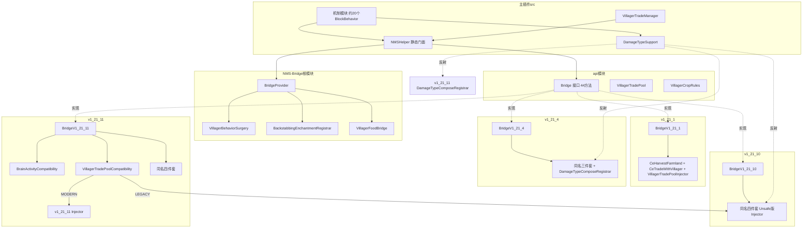
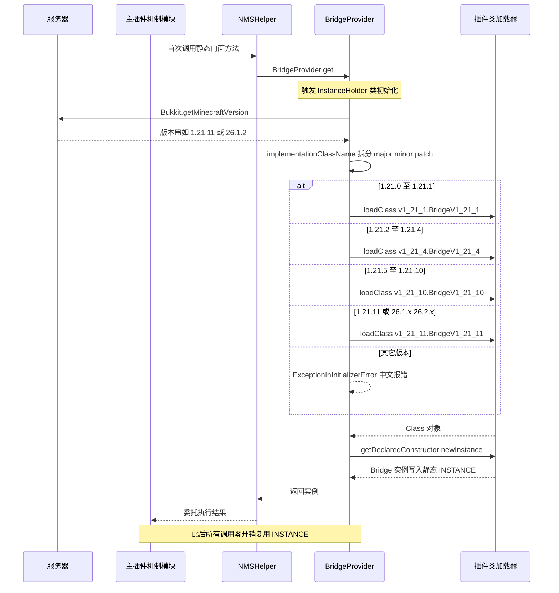
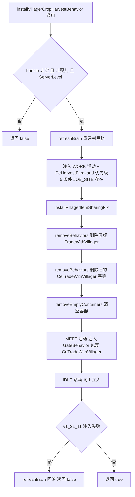
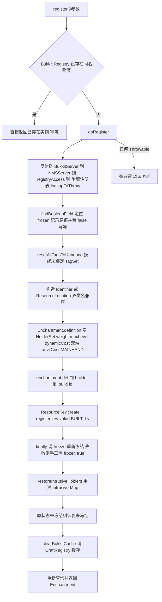

# NMS 桥接层与资源文件

> 模块职责：为 1.21.1/1.21.4/1.21.10/1.21.11（及 26.1.x～26.2.x Folia 新版本线）提供版本隔离的 NMS 操作，包括方块/实体/世界底层操作、村民 AI 脑手术、交易池注入、伤害类型注册与背刺附魔注册；同时承载插件全部 YAML 资源配置
>
> 文件数 / 总行数：NMS-Bridge Java 29 个 / 4487 行（api 4 个 203 行、根模块 4 个 905 行、v1_21_1 4 个 745 行、v1_21_4 5 个 826 行、v1_21_10 5 个 854 行、v1_21_11 7 个 954 行）；Gradle 构建脚本 6 个 / 112 行；资源文件 gui.yml 60 行、insertable_tools.yml 40 行、config.yml 520 行、lang/en_us.yml 317 行、lang/zh_cn.yml 317 行

---

## 1. 模块概览

### 1.1 Gradle 多项目结构

`settings.gradle.kts` 共注册 6 个项目，NMS-Bridge 占 5 个子项目：

| 项目 | 构建插件 | 关键依赖 | 作用 |
|---|---|---|---|
| `:PapersDelight` 根 | java + shadow + runPaper | `implementation` 全部 5 个 NMS-Bridge 项目 | 主插件，shadowJar 把所有桥接实现打进同一个 jar |
| `:NMS-Bridge:api` | java-library | `compileOnly` paper-api 1.21-R0.1 | 纯接口/值对象层，不含任何 NMS 引用 |
| `:NMS-Bridge` | java-library | `api project(":NMS-Bridge:api")`、`compileOnly` paper-api 1.21.4 | 版本无关的反射工具层（脑手术/附魔注册/食物字段），只靠反射碰 NMS |
| `:NMS-Bridge:v1_21_1` | java-library + paperweight-userdev 2.0.0-beta.21 | paperDevBundle 1.21.1、`compileOnly` api + 根模块 | 1.21.0～1.21.1 实现（无 DamageTypeComposeRegistrar） |
| `:NMS-Bridge:v1_21_4` | 同上 | paperDevBundle 1.21.4、额外 `compileOnly` 外部 papersdelight-api 4.0.0 | 1.21.2～1.21.4 实现 |
| `:NMS-Bridge:v1_21_10` | 同上 | paperDevBundle 1.21.10、同上 | 1.21.5～1.21.10 实现 |
| `:NMS-Bridge:v1_21_11` | 同上 | paperDevBundle 1.21.11、额外 `compileOnly project(":NMS-Bridge:v1_21_10")` | 1.21.11 与 26.1/26.2 实现；显式依赖 v1_21_10 以复用其 Injector 作 LEGACY 回退 |

要点：
- 版本子项目通过 paperweight `paperDevBundle` 拿到对应版本的 Mojang 映射 NMS 编译期依赖，编译产物在构建时重映射，与 Paper 运行时的 Mojang 映射一致，因此 shadowJar 无需 relocate NMS 代码。
- 根 build.gradle.kts 的 shadowJar 仅 relocate `org.jetbrains`、`org.intellij`、`cn.chengzhimeow.ccscheduler`；`jar` 任务被禁用，`build` 依赖 shadowJar，产物名 `PapersDelight-<version>.jar`。
- 根项目注册两个 run 任务：Paper 1.21（Java 21）与 Folia 26.1.2（Java 25 工具链，JVM 参数含 `--sun-misc-unsafe-memory-access=allow`——这是 v1_21_10/11 Injector 使用 `sun.misc.Unsafe` 改写静态字段的硬性前提）。
- `libs.versions.toml` 集中管理 4 个 dev bundle 版本与外部依赖（craftEngine 26.8.1、papersDelightApi 4.0.0 来自私有仓库 mvn.hezhongkj.top、ccScheduler 来自 repo-eo.catnies.top）。
- `gradle.properties`：group=dev.tako、version=1.2.1-CE、4G 堆、并行/缓存/配置缓存全开。
- `.gitignore` 额外忽略 ZKM 混淆工具目录、`.narrafork`、`/tools/` 本地脚本。

### 1.2 BridgeProvider 的版本探测与反射加载机制

`BridgeProvider`（api 模块）采用懒加载单例 + 反射实例化：

- 首次调用 `get()` 触发 `InstanceHolder` 类初始化，读取 `Bukkit.getMinecraftVersion()`。
- `implementationClassName` 把版本字符串拆成 major/minor/patch 三个整数，按区间映射实现类全限定名：
  - 1.21.0～1.21.1 → `v1_21_1.BridgeV1_21_1`
  - 1.21.2～1.21.4 → `v1_21_4.BridgeV1_21_4`
  - 1.21.5～1.21.10 → `v1_21_10.BridgeV1_21_10`（注意：patch ≤ 10 的兜底区间）
  - 1.21.11 及 26.1.x/26.2.x → `v1_21_11.BridgeV1_21_11`（Minecraft 26.x 新版本命名线直接复用 1.21.11 实现）
- 通过 `Bridge.class.getClassLoader().loadClass(...).getDeclaredConstructor().newInstance()` 实例化；失败抛 `ExceptionInInitializerError`，错误消息中文提示支持范围为 1.21.0～1.21.11、26.1.x～26.2.x。

主插件侧另有一条独立的版本分发线：`src/main/java/dev/tako/papersdelight/damage/DamageTypeSupport.java` 用几乎相同的区间逻辑（但 1.21.0～1.21.4 统一映射到 v1_21_4 的 `DamageTypeComposeRegistrar`，因为 1.21.1 子项目没有该类），在 Bootstrap 阶段按类名反射选择伤害类型注册适配器，并先用 `Class.forName` 探测 `io.papermc.paper.registry.event.RegistryEvents` 能力是否存在。

### 1.3 模块关系图

---

## 2. 类与函数目录

### 2.1 Bridge（`NMS-Bridge/api/.../api/Bridge.java`，84 行）

**职责**：整个桥接层的唯一抽象接口。所有参数/返回值对 NMS 类型一律使用 `Object` 装箱传递，使 api 模块编译期零 NMS 依赖；语义由各版本实现用强转还原。
**继承/接口**：纯接口，无父接口。**关键字段**：无。

**方法清单表**（44 个方法，每个注明其抽象的 NMS 操作语义）：

| 方法 | 签名 | 行号 | 语义（抽象的 NMS 操作） |
|---|---|---|---|
| getBlockState | Object getBlockState(Object level, Object pos) | 9 | Level.getBlockState(BlockPos) 读方块状态 |
| setBlockState | boolean setBlockState(Object level, Object pos, Object state, int flags) | 10 | Level.setBlock 按更新标志写方块 |
| airStateObj | Object airStateObj() | 11 | Blocks.AIR.defaultBlockState 常量 |
| isStateSolid | boolean isStateSolid(Object state) | 12 | BlockState.isSolid 固体判定 |
| defaultStateFromId | Object defaultStateFromId(String blockId) | 13 | 按 ResourceLocation 从 BuiltInRegistries.BLOCK 取默认状态 |
| offsetPos | Object offsetPos(Object pos, int dx, int dy, int dz) | 14 | BlockPos.offset 三维偏移 |
| blockPosX/Y/Z | int blockPosX/Y/Z(Object pos) | 15-17 | BlockPos 三坐标读取 |
| fireBlockGrowEventObj | boolean fireBlockGrowEventObj(Object level, Object pos, Object state, int flags) | 19 | 触发 Bukkit BlockGrowEvent（CraftEventFactory） |
| levelEventObj | void levelEventObj(Object accessor, Object pos, int eventId, int data) | 20 | 广播 levelEvent（2001 破坏粒子等） |
| playSoundByKey | boolean playSoundByKey(Object level, Object pos, String soundKey, float volume, float pitch) | 21 | 按音效键从注册表解析 SoundEvent 并 playSound |
| isServerLevel | boolean isServerLevel(Object level) | 23 | 是否 ServerLevel（真实世界） |
| isWorldGenRegion | boolean isWorldGenRegion(Object level) | 24 | 是否世界生成区域（禁止副作用） |
| isMobGriefing | boolean isMobGriefing(Object level) | 25 | 读取 mobGriefing 游戏规则 |
| isFluidWater | boolean isFluidWater(Object level, Object pos) | 26 | FluidState 是否 WATER 标签 |
| isFullWaterSource | boolean isFullWaterSource(Object level, Object pos) | 27 | 是否满水源（amount == 8） |
| hasWaterFluidAt | boolean hasWaterFluidAt(Object level, Object pos) | 28 | 是否静水/流水任意水流体 |
| isRainingAtPos | boolean isRainingAtPos(Object level, Object pos) | 29 | 指定坐标是否正在降雨 |
| getSkyBrightnessAt | int getSkyBrightnessAt(Object level, Object pos) | 30 | 天空光照等级（LightLayer.SKY） |
| canSeeSkyAt | boolean canSeeSkyAt(Object level, Object pos) | 31 | 能否看到天空 |
| isLivingEntity | boolean isLivingEntity(Object entity) | 33 | NMS 实体类型判定 |
| isPlayerEntity | boolean isPlayerEntity(Object entity) | 34 | NMS 玩家判定 |
| isSteppingCarefully | boolean isSteppingCarefully(Object entity) | 35 | 潜行慢步判定（绳索类机制用） |
| isShiftKeyDown | boolean isShiftKeyDown(Object entity) | 36 | Shift 按下判定 |
| hasFrostWalkerBoots | boolean hasFrostWalkerBoots(Object entity) | 37 | 经 Bukkit 装备检查冰霜行者 |
| damageBukkitEntity | void damageBukkitEntity(Object entity, float amount) | 38 | 用 generic 伤害源对 NMS 生物 hurt |
| damageEntity | boolean damageEntity(Object level, Object entity, String damageType, float amount) | 39 | 按 damageType 键从注册表取 Holder 构造 DamageSource 后 hurt |
| entityNextFloat | float entityNextFloat(Object entity) | 40 | 实体随机数 nextFloat |
| entityBbWidth/Height | float entityBbWidth/Height(Object entity) | 41-42 | 实体碰撞箱宽/高 |
| zeroEntityDeltaY | void zeroEntityDeltaY(Object entity) | 43 | 清零 Y 轴动量（下落类机制） |
| randomNextInt | int randomNextInt(Object random, int bound) | 45 | RandomSource.nextInt |
| randomNextFloat | float randomNextFloat(Object random) | 46 | RandomSource.nextFloat |
| tryBonemeal | int tryBonemeal(Object level, Object pos, Object state, Object random, boolean isClientSide) | 47 | BonemealableBlock 三段协议：目标校验/成功概率/执行催熟，返回 -1 不支持 / 0 失败 / 1 成功 |
| bukkitWorldOf | World bukkitWorldOf(Object level) | 49 | ServerLevel → Bukkit World |
| nmsLevelOf | Object nmsLevelOf(World world) | 50 | Bukkit World → NMS Level |
| getBukkitPlayer | Player getBukkitPlayer(Object player) | 51 | ServerPlayer → CraftPlayer |
| getBukkitLivingEntity | LivingEntity getBukkitLivingEntity(Object entity) | 53 | NMS LivingEntity → Bukkit |
| getRawBrightness | int getRawBrightness(World world, int x, int y, int z) | 54 | 方块坐标原始光照（作物生长条件） |
| getVillagerFoodLevel | int getVillagerFoodLevel(Villager villager) | 56 | 反射读村民 foodLevel |
| addVillagerFoodLevel | boolean addVillagerFoodLevel(Villager villager, int amount) | 58 | 反射加村民 foodLevel |
| villagerPickUpItemEntity | boolean villagerPickUpItemEntity(Villager villager, Item item) | 60 | 模拟村民拾取地面物品（含事件） |
| installVillagerCropHarvestBehavior | boolean installVillagerCropHarvestBehavior(Villager villager, VillagerCropRules rules) | 62-65 | 向村民 Brain 注入 WORK 活动的收割行为 |
| installVillagerTradePool | boolean installVillagerTradePool(VillagerTradePool pool) | 67 | 向原版交易表注入自定义条目 |
| installVillagerItemSharingFix | boolean installVillagerItemSharingFix(Villager villager) | 69 | 替换原版 TradeWithVillager 行为 |
| villagerNeedsItemSharingFix | boolean villagerNeedsItemSharingFix(Villager villager) | 71 | 检测村民脑内是否仍有原版行为 |
| registerBackstabbingEnchantment | Enchantment registerBackstabbingEnchantment(String namespace, String key, int weight, int maxLevel, int minCostBase, int minCostPerLevel, int maxCostBase, int maxCostPerLevel, int anvilCost) | 73-83 | 向冻结的 NMS 附魔注册表动态注册背刺附魔 |

### 2.2 BridgeProvider（`NMS-Bridge/api/.../api/BridgeProvider.java`，66 行）

**职责**：按服务器 Minecraft 版本选择并缓存 Bridge 实现。**继承/接口**：final 工具类。**关键字段**：`InstanceHolder.INSTANCE`（静态内部类懒加载单例）。

| 方法 | 签名 | 行号 | 行为说明 |
|---|---|---|---|
| （构造） | private BridgeProvider() | 7 | 禁止实例化 |
| get | static Bridge get() | 24-26 | 返回懒加载单例；首次调用触发 InstanceHolder 初始化 |
| implementationClassName | static String implementationClassName(String minecraftVersion) | 28-59 | 解析 major/minor/patch 并按区间映射 4 个实现类全名；26.1/26.2 也映射到 v1_21_11；非法或越界抛 IllegalStateException |
| unsupported | private static IllegalStateException unsupported(String version) | 61-65 | 构造中文错误消息"不支持的 Minecraft 版本" |

### 2.3 VillagerTradePool（`NMS-Bridge/api/.../api/VillagerTradePool.java`，39 行）

**职责**：跨版本交易池注入的值对象载体。**继承/接口**：final 不可变类。**关键字段**：`farmerBuys`、`wanderingTraderSells`（List.copyOf 防御性拷贝）。

| 方法/成员 | 签名 | 行号 | 行为说明 |
|---|---|---|---|
| BuyEntry | record BuyEntry(int level, ItemStack ingredient, int emeraldAmount, int maxUses, int villagerXp, float priceMultiplier) | 9-16 | 农民收购条目：等级/原料/绿宝石数/次数/经验/价格乘数 |
| SellEntry | record SellEntry(ItemStack result, int emeraldCost, int maxUses, int villagerXp, float priceMultiplier) | 18-24 | 流浪商人出售条目 |
| （构造） | VillagerTradePool(List, List) | 29-32 | 拷贝两个列表保证不可变 |
| farmerBuys | List farmerBuys() | 34 | 访问器 |
| wanderingTraderSells | List wanderingTraderSells() | 36 | 访问器 |
| isEmpty | boolean isEmpty() | 38 | 两组均空返回 true（install 前置校验） |

### 2.4 VillagerCropRules（`NMS-Bridge/api/.../api/VillagerCropRules.java`，14 行）

**职责**：村民收割行为的回调接口，把"什么算成熟/怎么收/能不能种/怎么种"交回主插件用 Bukkit API 裁决（CeHarvestFarmland 每次判定都转成 org.bukkit.block.Block 调用）。

| 方法 | 签名 | 行号 | 行为说明 |
|---|---|---|---|
| isHarvestable | boolean isHarvestable(Block block) | 7 | 该方块是否可被村民收割 |
| tryHarvest | boolean tryHarvest(Block block, Villager villager) | 9 | 执行收割（掉落/入袋由实现方决定） |
| canPlant | boolean canPlant(Block block, Villager villager) | 11 | 该空位能否补种 |
| tryPlant | boolean tryPlant(Block block, Villager villager) | 13 | 执行补种 |

### 2.5 NMSHelper（`NMS-Bridge/src/.../bridge/NMSHelper.java`，235 行）

**职责**：主插件使用的静态门面。除 `getItemEnchantability` 外全部是一行转发到 `BridgeProvider.get()`。**继承/接口**：final 类（注意构造器是 public，非典型工具类写法）。

| 方法 | 签名 | 行号 | 行为说明 |
|---|---|---|---|
| bridge | private static Bridge bridge() | 16-18 | 取 BridgeProvider 单例 |
| getBlockState | static Object getBlockState(Object, Object) | 20 | 转发 |
| setBlockState | static boolean setBlockState(Object, Object, Object, int) | 24 | 转发 |
| airStateObj | static Object airStateObj() | 28 | 转发 |
| isStateSolid | static boolean isStateSolid(Object) | 32 | 转发 |
| defaultStateFromId | static Object defaultStateFromId(String) | 36 | 转发 |
| offsetPos | static Object offsetPos(Object, int, int, int) | 40 | 转发 |
| blockPosX/Y/Z | static int blockPosX/Y/Z(Object) | 44/48/52 | 转发 |
| fireBlockGrowEventObj | static boolean fireBlockGrowEventObj(Object, Object, Object, int) | 56 | 转发 |
| levelEventObj | static void levelEventObj(Object, Object, int, int) | 60 | 转发 |
| playSoundByKey | static boolean playSoundByKey(Object, Object, String, float, float) | 64 | 转发 |
| isServerLevel | static boolean isServerLevel(Object) | 68 | 转发 |
| isWorldGenRegion | static boolean isWorldGenRegion(Object) | 72 | 转发 |
| isMobGriefing | static boolean isMobGriefing(Object) | 76 | 转发 |
| isFluidWater | static boolean isFluidWater(Object, Object) | 80 | 转发 |
| isFullWaterSource | static boolean isFullWaterSource(Object, Object) | 84 | 转发 |
| hasWaterFluidAt | static boolean hasWaterFluidAt(Object, Object) | 88 | 转发 |
| isRainingAtPos | static boolean isRainingAtPos(Object, Object) | 92 | 转发 |
| getSkyBrightnessAt | static int getSkyBrightnessAt(Object, Object) | 96 | 转发 |
| canSeeSkyAt | static boolean canSeeSkyAt(Object, Object) | 100 | 转发 |
| isLivingEntity | static boolean isLivingEntity(Object) | 104 | 转发 |
| isPlayerEntity | static boolean isPlayerEntity(Object) | 108 | 转发 |
| isSteppingCarefully | static boolean isSteppingCarefully(Object) | 112 | 转发 |
| isShiftKeyDown | static boolean isShiftKeyDown(Object) | 116 | 转发 |
| hasFrostWalkerBoots | static boolean hasFrostWalkerBoots(Object) | 120 | 转发 |
| damageBukkitEntity | static void damageBukkitEntity(Object, float) | 124 | 转发 |
| damageEntity | static boolean damageEntity(Object, Object, String, float) | 128 | 转发 |
| entityNextFloat | static float entityNextFloat(Object) | 132 | 转发 |
| entityBbWidth/Height | static float entityBbWidth/Height(Object) | 136/140 | 转发 |
| zeroEntityDeltaY | static void zeroEntityDeltaY(Object) | 144 | 转发 |
| randomNextInt/Float | static int/float randomNextInt/Float(Object, ...) | 148/152 | 转发 |
| tryBonemeal | static int tryBonemeal(Object, Object, Object, Object, boolean) | 156 | 转发 |
| bukkitWorldOf | static World bukkitWorldOf(Object) | 160 | 转发 |
| nmsLevelOf | static Object nmsLevelOf(World) | 164 | 转发 |
| getBukkitPlayer | static Player getBukkitPlayer(Object) | 168 | 转发 |
| getBukkitLivingEntity | static LivingEntity getBukkitLivingEntity(Object) | 172 | 转发 |
| getRawBrightness | static int getRawBrightness(World, int, int, int) | 176 | 转发 |
| getItemEnchantability | static int getItemEnchantability(ItemStack item, int fallback) | 180-193 | 本模块唯一自实现方法：反射调 ItemMeta.getEnchantable（Paper 1.21.5+ 新方法），失败或非正数返回 fallback |
| getVillagerFoodLevel | static int getVillagerFoodLevel(Villager) | 195 | 转发 |
| addVillagerFoodLevel | static boolean addVillagerFoodLevel(Villager, int) | 199 | 转发 |
| villagerPickUpItemEntity | static boolean villagerPickUpItemEntity(Villager, Item) | 203 | 转发 |
| installVillagerCropHarvestBehavior | static boolean installVillagerCropHarvestBehavior(Villager, VillagerCropRules) | 207-212 | 转发 |
| installVillagerTradePool | static boolean installVillagerTradePool(VillagerTradePool) | 214-218 | 转发 |
| installVillagerItemSharingFix | static boolean installVillagerItemSharingFix(Villager) | 220 | 转发 |
| villagerNeedsItemSharingFix | static boolean villagerNeedsItemSharingFix(Villager) | 224 | 转发 |
| registerBackstabbingEnchantment | static Enchantment registerBackstabbingEnchantment(String, String, int, int, int, int, int, int, int) | 228-234 | 转发（当前主插件无调用方，见 2.6） |

### 2.6 BackstabbingEnchantmentRegistrar（`NMS-Bridge/src/.../bridge/BackstabbingEnchantmentRegistrar.java`，412 行）

**职责**：在服务器已启动、注册表已冻结的情况下，用纯反射把自定义附魔"塞进"NMS MappedRegistry 附魔注册表。**继承/接口**：final 工具类。**关键字段**：私有 record `Spec`（L400-410）封装 9 个注册参数。整个类零编译期 NMS 依赖（全部 Class.forName/反射），因此可以放在只对 1.21.4 paper-api 编译的根模块、被四个版本共用；同时兼容 `Identifier`（26.x）与 `ResourceLocation`（旧版）两个类名（L255-261）。

**注册步骤（doRegister，L53-91）**：
1. `getEnchantmentRegistry`（L153-170）：Bukkit.getServer → 反射 `getServer` 得 NMS Server → `registryAccess` → 从 `Registries.ENCHANTMENT` 字段取注册表键 → `invokeLookup`（L178-208）在 `lookupOrThrow`/`registryOrThrow` 两个候选名中按返回类型选一个调用。
2. `findBooleanField`（L210-234）：优先找名为 `frozen` 的 boolean 字段（找不到则退化到第一个非 final 非 static 的 boolean 字段），记录原始冻结状态后置 false——解除注册表冻结。
3. `resetAllTagsToUnbound`（L93-130）：找到类型名含 TagSet 的实例字段，反射调其无参静态工厂取得 unbound 实例并回填——避免注册时校验 Holder 绑定关系。
4. `buildEnchantment`（L269-295）：`Enchantment.definition(emptyHolderSet, weight, maxLevel, minCost, maxCost, anvilCost, slots[MAINHAND])` + `dynamicCost` 构造双端成本 + `Enchantment.enchantment(def).build(id)`；三个 finder（L297-332）按参数形状定位版本可能变化的方法句柄。
5. `makeEnchantmentResourceKey`（L334-347）：`ResourceKey.create(Registries.ENCHANTMENT, id)`。
6. `registerMapping`（L349-365）：在注册表类层次中找 3 参 `register(ResourceKey, Object, RegistrationInfo)` 并以 `RegistrationInfo.BUILT_IN` 调用。
7. finally：调 `freeze()` 重新冻结（失败则直接把 frozen 置回 true）；`restoreIntrusiveHolders`（L132-151）把注册表里可能被置 null 的 intrusive Map 换成新 IdentityHashMap；若注册表原本就未冻结则恢复未冻结状态。
8. `clearBukkitCache`（L367-387）：清空 Bukkit CraftRegistry 的缓存 Map，让 `Registry.ENCHANTMENT.get(key)` 能看到新附魔。

| 方法 | 签名 | 行号 | 行为说明 |
|---|---|---|---|
| register | static Enchantment register(String namespace, String key, int weight, int maxLevel, int minCostBase, int minCostPerLevel, int maxCostBase, int maxCostPerLevel, int anvilCost) | 19-42 | 入口：已存在则直接返回；否则 doRegister 后重新查询；任何 Throwable 吞掉返回 null |
| getExisting | private static Enchantment getExisting(NamespacedKey key) | 44-51 | Bukkit Registry.ENCHANTMENT 查询，幂等保护 |
| doRegister | private static void doRegister(Spec spec) | 53-91 | 上述 8 步主流程 |
| resetAllTagsToUnbound | private static void resetAllTagsToUnbound(Object registry) | 93-130 | 找 TagSet 字段与 unbound 工厂方法并替换 |
| restoreIntrusiveHolders | private static void restoreIntrusiveHolders(Object registry) | 132-151 | 恢复被注册过程破坏的 intrusive holder Map |
| getEnchantmentRegistry | private static Object getEnchantmentRegistry() | 153-170 | 反射链取 NMS 附魔注册表 |
| getEnchantmentResourceKey | private static Object getEnchantmentResourceKey() | 172-176 | 读 Registries.ENCHANTMENT 静态字段 |
| invokeLookup | private static Object invokeLookup(Object access, Object key, Class registryInterface) | 178-208 | 兼容 lookupOrThrow/registryOrThrow 两个方法名 |
| findBooleanField | private static Field findBooleanField(Class clazz) | 210-234 | 定位 frozen 字段（含退化策略） |
| findMethod | private static Method findMethod(Class clazz, String name, Class... params) | 236-253 | 声明方法优先、公开方法兜底的查找 |
| resourceIdClass | private static Class resourceIdClass() | 255-261 | Identifier 优先、ResourceLocation 兜底 |
| makeResourceId | private static Object makeResourceId(String namespace, String path) | 263-267 | fromNamespaceAndPath 工厂调用 |
| buildEnchantment | private static Object buildEnchantment(Object resourceId, Spec spec) | 269-295 | definition → enchantment → build 三段构造 |
| findDefinitionMethod | private static Method findDefinitionMethod(...) | 297-310 | 按 7 参形状定位 definition 静态方法 |
| findEnchantmentBuilderMethod | private static Method findEnchantmentBuilderMethod(...) | 312-321 | 定位 enchantment 定义转 builder 方法 |
| findBuildMethod | private static Method findBuildMethod(Class builderClass, Class idClass) | 323-332 | 定位 Builder.build(id) |
| makeEnchantmentResourceKey | private static Object makeEnchantmentResourceKey(Object resourceId) | 334-347 | ResourceKey.create |
| registerMapping | private static Object registerMapping(Object registry, Object resourceKey, Object enchantment) | 349-365 | 3 参 register + BUILT_IN 信息 |
| clearBukkitCache | private static void clearBukkitCache() | 367-387 | 清 Bukkit 层注册表缓存 |
| findFieldByType | private static Field findFieldByType(Class clazz, Class type) | 389-398 | 按类型找字段 |
| Spec | private record Spec(...) | 400-410 | 9 参数记录载体 |

重要现状：`registerBackstabbingEnchantment` 与 `getItemEnchantability` 在主插件 `src/` 中**没有任何调用方**（全仓库 grep 证实）；zh_cn.yml 仍残留 `backstabbing_register_fail` 等 3 个语言键而 en_us.yml 已删。该附魔路径属于**预留/已下线的死代码**，但注册器本身保持可用。

### 2.7 VillagerBehaviorSurgery（`NMS-Bridge/src/.../bridge/VillagerBehaviorSurgery.java`，193 行）

**职责**：对村民 `Brain.availableBehaviors`（结构为 Map&lt;优先级, Map&lt;Activity, Collection&lt;Behavior&gt;&gt;&gt;）做反射"脑手术"：删除指定类型行为、检测行为、清理空容器。零 NMS 编译依赖，靠字段名包含 `availableBehaviors`、嵌套 shuffling 列表字段名包含 `entries`、加权条目经 `getData()` 取包（对应 WeightedList.WeightedWrapper）。**关键字段**：`behaviorsField`（volatile 缓存已解析字段）。

| 方法 | 签名 | 行号 | 行为说明 |
|---|---|---|---|
| removeBehaviors | public static int removeBehaviors(Object brain, Class targetType) | 16-42 | 遍历优先级→Activity→行为集合三层结构，`removeIf(targetType::isInstance)` 删除目标行为并对每个幸存行为递归 removeNested；返回删除数，结构异常返回 -1 |
| removeNested | private static int removeNested(Object container, Class targetType) | 44-60 | 递归进入行为的每个字段，找到 shuffling entries 列表后按 weightedData 删除目标类型，并对剩余条目继续递归（处理 GateBehavior 等组合行为） |
| shufflingEntries | private static List shufflingEntries(Object candidate) | 62-72 | 沿类层次找"名称含 entries 的 List 字段"——识别 ShufflingList |
| weightedData | private static Object weightedData(Object entry) | 74-83 | 反射调 `getData()` 解包加权条目的真实行为 |
| readField | private static Object readField(Object owner, Field field) | 85-92 | setAccessible + 读字段，异常返回 null |
| resolveField | private static Field resolveField(Object brain) | 94-112 | 缓存 + 按类层次找名称含 availableBehaviors 的 Map 字段 |
| hasBehavior | public static boolean hasBehavior(Object brain, Class targetType) | 114-135 | 与 removeBehaviors 同构的只读检测（含嵌套） |
| hasNested | private static boolean hasNested(Object container, Class targetType) | 137-151 | removeNested 的只读版 |
| removeEmptyContainers | public static int removeEmptyContainers(Object brain) | 153-174 | 删除 entries 全空的行为容器，避免手术后留下空 GateBehavior 反复空转 |
| isEmptyContainer | private static boolean isEmptyContainer(Object behavior) | 176-188 | 判定：存在 shuffling 容器且全部为空 |
| containsNone | public static boolean containsNone(Set behaviors, Class targetType) | 190-192 | 工具：集合中不含目标类型实例 |

### 2.8 VillagerFoodBridge（`NMS-Bridge/src/.../bridge/VillagerFoodBridge.java`，65 行）

**职责**：跨版本读写村民 `foodLevel`（int 字段）的反射缓存工具。**关键字段**：`FIELD_CACHE`（Class→Field）、`FAILED`（Class→Boolean 负缓存）。

| 方法 | 签名 | 行号 | 行为说明 |
|---|---|---|---|
| get | public static int get(Object villager) | 16-24 | 读 foodLevel；未解析到字段返回 -1 |
| add | public static boolean add(Object villager, int amount) | 26-37 | amount ≤ 0 或字段缺失返回 false；否则累加 |
| resolve | private static Field resolve(Object villager) | 39-64 | 先查缓存/负缓存；再沿类层次找名为 foodLevel 的 int 字段并 setAccessible 缓存；失败写入负缓存 |

### 2.9 BridgeV1_21_1（`NMS-Bridge/v1_21_1/.../BridgeV1_21_1.java`，391 行）

**职责**：1.21.0～1.21.1 的 Bridge 实现。**继承/接口**：implements Bridge。**关键字段**：无（全部无状态）。

**方法清单表**（全 46 项）：

| 方法 | 签名 | 行号 | 行为说明 |
|---|---|---|---|
| （构造） | public BridgeV1_21_1() | 35 | 空构造供反射调用 |
| villagerHandle | private static Villager villagerHandle(Villager villager) | 38-40 | CraftVillager → NMS Villager，非 Craft 类型返回 null |
| toNms | private Object toNms(World world) | 42-44 | CraftWorld.getHandle |
| getBlockState | Object getBlockState(Object, Object) | 46-49 | 强转后 Level.getBlockState |
| setBlockState | boolean setBlockState(Object, Object, Object, int) | 51-54 | Level.setBlock |
| airStateObj | Object airStateObj() | 56-59 | Blocks.AIR.defaultBlockState |
| isStateSolid | boolean isStateSolid(Object) | 61-65 | BlockState.isSolid（deprecation 压制） |
| defaultStateFromId | Object defaultStateFromId(String) | 67-73 | ResourceLocation.tryParse → BuiltInRegistries.BLOCK.getOptional().orElse(AIR).defaultBlockState() |
| offsetPos | Object offsetPos(Object, int, int, int) | 75-78 | BlockPos.offset |
| blockPosX/Y/Z | int blockPosX/Y/Z(Object) | 80/85/90 | BlockPos 坐标 |
| fireBlockGrowEventObj | boolean fireBlockGrowEventObj(Object, Object, Object, int) | 95-98 | CraftEventFactory.handleBlockGrowEvent 3 参（flags 未用） |
| levelEventObj | void levelEventObj(Object, Object, int, int) | 100-103 | LevelAccessor.levelEvent(null, id, pos, data) |
| playSoundByKey | boolean playSoundByKey(Object, Object, String, float, float) | 105-113 | 解析 SOUND_EVENT 注册表后 playSound |
| isServerLevel | boolean isServerLevel(Object) | 115-118 | instanceof ServerLevel |
| isWorldGenRegion | boolean isWorldGenRegion(Object) | 120-123 | 类 SimpleName 等于 WorldGenRegion |
| isMobGriefing | boolean isMobGriefing(Object) | 125-128 | GameRules.RULE_MOBGRIEFING + getBoolean |
| isFluidWater | boolean isFluidWater(Object, Object) | 130-133 | FluidTags.WATER 判定 |
| isFullWaterSource | boolean isFullWaterSource(Object, Object) | 135-139 | WATER 标签且 amount == 8 |
| hasWaterFluidAt | boolean hasWaterFluidAt(Object, Object) | 141-145 | WATER / FLOWING_WATER 类型 |
| isRainingAtPos | boolean isRainingAtPos(Object, Object) | 147-150 | ServerLevel.isRainingAt 否则 Level.isRaining |
| getSkyBrightnessAt | int getSkyBrightnessAt(Object, Object) | 152-155 | LevelReader.getBrightness(SKY) |
| canSeeSkyAt | boolean canSeeSkyAt(Object, Object) | 157-160 | LevelReader.canSeeSky |
| isLivingEntity | boolean isLivingEntity(Object) | 162-165 | instanceof LivingEntity |
| isPlayerEntity | boolean isPlayerEntity(Object) | 167-170 | instanceof player.Player |
| isSteppingCarefully | boolean isSteppingCarefully(Object) | 172-175 | Entity.isSteppingCarefully |
| isShiftKeyDown | boolean isShiftKeyDown(Object) | 177-180 | Entity.isShiftKeyDown |
| hasFrostWalkerBoots | boolean hasFrostWalkerBoots(Object) | 182-191 | Bukkit 装备取靴子查 FROST_WALKER |
| damageBukkitEntity | void damageBukkitEntity(Object, float) | 193-199 | LivingEntity.hurt(damageSources.generic) |
| damageEntity | boolean damageEntity(Object, Object, String, float) | 201-211 | registryAccess().registryOrThrow(DAMAGE_TYPE).getHolder(ResourceKey) → DamageSource → hurt |
| entityNextFloat | float entityNextFloat(Object) | 213-216 | Entity.getRandom().nextFloat |
| entityBbWidth/Height | float entityBbWidth/Height(Object) | 218/223 | BbWidth/BbHeight |
| zeroEntityDeltaY | void zeroEntityDeltaY(Object) | 228-233 | setDeltaMovement(x, 0, z) |
| randomNextInt/Float | int/float randomNextInt/Float(...) | 235/240 | RandomSource 委托 |
| tryBonemeal | int tryBonemeal(Object, Object, Object, Object, boolean) | 245-257 | BonemealableBlock 协议三段调用，返回 -1/0/1 |
| bukkitWorldOf | World bukkitWorldOf(Object) | 259-262 | ServerLevel.getWorld |
| nmsLevelOf | Object nmsLevelOf(World) | 264-267 | toNms |
| getBukkitPlayer | Player getBukkitPlayer(Object) | 269-272 | ServerPlayer.getBukkitEntity |
| getBukkitLivingEntity | LivingEntity getBukkitLivingEntity(Object) | 274-277 | LivingEntity.getBukkitEntity 强转 |
| getRawBrightness | int getRawBrightness(World, int, int, int) | 279-282 | Level.getRawBrightness(pos, 0) |
| getVillagerFoodLevel | int getVillagerFoodLevel(Villager) | 284-287 | VillagerFoodBridge.get(handle) |
| addVillagerFoodLevel | boolean addVillagerFoodLevel(Villager, int) | 289-292 | VillagerFoodBridge.add |
| villagerPickUpItemEntity | boolean villagerPickUpItemEntity(Villager, Item) | 294-316 | 模拟拾取：校验 CraftVillager/CraftItem/isValid → inventory.canAddItem → SimpleContainer 试装 → callEntityPickupItemEvent(4 参含 false) → onItemPickup → addItem → take → 拾完 discard 否则 setCount 剩余 |
| installVillagerCropHarvestBehavior | boolean installVillagerCropHarvestBehavior(Villager, VillagerCropRules) | 318-335 | refreshBrain → Brain.addActivityWithConditions(WORK, Pair(5, CeHarvestFarmland), 条件 JOB_SITE=VALUE_PRESENT) → 再调 installVillagerItemSharingFix |
| installVillagerTradePool | boolean installVillagerTradePool(VillagerTradePool) | 337-340 | 委托 VillagerTradePoolInjector.install |
| installVillagerItemSharingFix | boolean installVillagerItemSharingFix(Villager) | 342-377 | 脑手术三步 + 向 MEET/IDLE 活动注入 GateBehavior(ORDERED/RUN_ONE) 包裹 CeTradeWithVillager（优先级 3，条件 NEAREST_VISIBLE_LIVING_ENTITIES=VALUE_PRESENT），细节见 3.2 |
| villagerNeedsItemSharingFix | boolean villagerNeedsItemSharingFix(Villager) | 379-385 | VillagerBehaviorSurgery.hasBehavior(TradeWithVillager.class) |
| registerBackstabbingEnchantment | Enchantment registerBackstabbingEnchantment(9 参数) | 387-390 | 委托根模块 BackstabbingEnchantmentRegistrar.register |

### 2.10 BridgeV1_21_4（`NMS-Bridge/v1_21_4/.../BridgeV1_21_4.java`，394 行）

方法集合与 v1_21_1 完全一致（构造 L35、villagerHandle L38、toNms L42、damageEntity L202、tryBonemeal L246、installVillagerCropHarvestBehavior L321、installVillagerTradePool L340、installVillagerItemSharingFix L345、villagerNeedsItemSharingFix L382、registerBackstabbingEnchantment L390，其余方法行号与 v1_21_1 相差 0～3 行）。**与 v1_21_1 的实质差异仅 2 处**：

| 差异点 | v1_21_1 写法 | v1_21_4 写法 | 原因 |
|---|---|---|---|
| damageEntity 注册表访问 | registryOrThrow(...).getHolder(...) | lookupOrThrow(...).get(...)（L207-208） | 1.21.2+ RegistryAccess API 更名，getHolder 改为返回 Optional 的 get |
| damageBukkitEntity / tryBonemeal | 模式变量直接绑定 `instanceof LivingEntity le` | 显式 instanceof + 强转（L196-199、L248-251） | 纯风格差异，行为相同 |

另有编译期差异：该子项目多了外部依赖 papersdelight-api（供 DamageTypeComposeRegistrar 的 DamageTypeDefinition 类型）。

### 2.11 BridgeV1_21_10（`NMS-Bridge/v1_21_10/.../BridgeV1_21_10.java`，391 行）

方法集合与 v1_21_4 相同（fireBlockGrowEventObj L96、damageEntity L202、installVillagerCropHarvestBehavior L318、installVillagerTradePool L337、installVillagerItemSharingFix L342、registerBackstabbingEnchantment L387）。**与 v1_21_4 的实质差异 1 处**：

| 差异点 | v1_21_4 写法 | v1_21_10 写法 | 原因 |
|---|---|---|---|
| fireBlockGrowEventObj | handleBlockGrowEvent(level, pos, state) 3 参 | 增加 flags 第 4 参（L96-98） | 1.21.5+ Paper 事件工厂把更新标志传入事件 |

（damageBukkitEntity/tryBonemeal 又改回模式变量写法，纯风格往返。）Injector 侧差异见 2.15。

### 2.12 BridgeV1_21_11（`NMS-Bridge/v1_21_11/.../BridgeV1_21_11.java`，412 行）

方法集合与前三个相同（defaultStateFromId L72、playSoundByKey L113、isMobGriefing L136、damageEntity L212、villagerPickUpItemEntity L305、installVillagerCropHarvestBehavior L329、installVillagerTradePool L350、installVillagerItemSharingFix L359、villagerNeedsItemSharingFix L400、registerBackstabbingEnchantment L408）。**与 v1_21_10 的实质差异**：

| 差异点 | v1_21_10 写法 | v1_21_11 写法 | 原因 |
|---|---|---|---|
| 资源标识类 | ResourceLocation | Identifier（L8 import；L74/L115/L215 使用） | 26.x/1.21.11 Mojang 重命名 |
| 方块/音效注册表取值 | getOptional().orElse(...) | get(id) 返回 Optional&lt;Holder&gt; 再 .value()（L76-80、L117-122） | 注册表 API 改为返回 Holder |
| mobGriefing 规则 | RULE_MOBGRIEFING 常量 + getBoolean | MOB_GRIEFING 枚举 + get（L138） | 游戏规则改为 enum 键 |
| 村民 NMS 类 | npc.Villager | npc.villager.Villager（L42、L379） | 村民类迁移到子包 |
| 拾取事件 | callEntityPickupItemEvent 4 参（含 false） | 3 参（L317） | Paper 事件工厂签名精简 |
| installVillagerCropHarvestBehavior | 直接 brain.addActivityWithConditions | 经 BrainActivityCompatibility 反射包装（L337），返回值与 ItemSharingFix 结果做 AND（L347） | Brain API 在 26.x 出现 addActivity 4 参变体 |
| installVillagerItemSharingFix | 前置仅判 handle/baby | 追加 ServerLevel 判定（L362）；每个活动注入失败时 refreshBrain 并返回 false（L392-395） | 失败可恢复 + 类型安全 |
| installVillagerTradePool | 直接本包 Injector.install | switch VillagerTradePoolCompatibility.select：MODERN→本包 Injector / LEGACY→复用 v1_21_10 的 Injector / UNSUPPORTED→false（L350-357） | 26.1 与 26.2 的 VillagerTrades 类位置不同，运行时探测 |
| import 风格 | net.minecraft.world.level.* 通配 | Level/LevelAccessor/LevelReader/LightLayer/GameRules 显式导入 | 适配包结构调整 |

### 2.13 CeHarvestFarmland（v1_21_1：128 行；v1_21_4/v1_21_10：129 行；v1_21_11：129 行）

**职责**：CraftEngine 化的"村民收割农田"AI 行为，替换原版 HarvestFarmland——判定逻辑全部回调 VillagerCropRules（Bukkit 层），使主插件可用 CE 物品/方块自定义可收割与可补种目标。**继承/接口**：extends Behavior&lt;Villager&gt;。**关键字段**：`HARVEST_DURATION=200`（最长工作 tick）、`SPEED_MODIFIER=0.5F`、`rules`、`validPositions`（3x3x3 候选缓存）、`target`、`nextOkStartTime`（操作冷却）、`timeWorked`。

构造函数要求记忆 LOOK_TARGET/WALK_TARGET 缺失、SECONDARY_JOB_SITE 存在（L31-37，v1_21_1 行号，下同）。

| 方法 | 签名 | 行号 | 行为说明 |
|---|---|---|---|
| checkExtraStartConditions | protected boolean checkExtraStartConditions(ServerLevel, Villager) | 44-60 | mobGriefing 开启 + 职业为农民才启动；扫描自身周围 3x3x3 方块，把 isHarvestable 或（空气且 canPlant）的位置收入 validPositions，随机选一个 target |
| isValidPosition | private boolean isValidPosition(ServerLevel, Villager, BlockPos) | 62-67 | 转 Bukkit Block 后调 rules.isHarvestable / rules.canPlant |
| randomTarget | private BlockPos randomTarget(ServerLevel) | 69-71 | 从候选列表随机取一 |
| start | protected void start(ServerLevel, Villager, long) | 73-80 | 写入 LOOK_TARGET（BlockPosTracker）与 WALK_TARGET 走向目标 |
| stop | protected void stop(ServerLevel, Villager, long) | 82-88 | 清除两种记忆、重置计时，冷却 40 tick |
| tick | protected void tick(ServerLevel, Villager, long) | 90-112 | 距目标 ≤1 格才动作：harvestable 时先过 callEntityChangeBlockEvent 再 rules.tryHarvest；plantable 时 rules.tryPlant 成功后发 BLOCK_PLACE 游戏事件；两者皆否换下一个目标 |
| selectNextTarget | private void selectNextTarget(ServerLevel, Villager, long) | 114-122 | 移除失效目标重选，冷却 20 tick 并重设走/看记忆 |
| canStillUse | protected boolean canStillUse(ServerLevel, Villager, long) | 124-127 | 工作未超 200 tick |
| bukkitBlock | private static Block bukkitBlock(ServerLevel, BlockPos) | 39-41 | 坐标转 Bukkit 方块（供 rules 回调） |

版本差异：v1_21_4 仅把 Nullable 注解换为 javax.annotation 并导入 GameRules；v1_21_10 职业判定改为 `profession().is(FARMER)`（Holder 化）；v1_21_11 迁移到 npc.villager 包、游戏规则改 `MOB_GRIEFING` 枚举、Nullable 换 jspecify，方法行号整体 +1（checkExtraStartConditions L46、tick L93 等）。

### 2.14 CeTradeWithVillager（四个版本各 120 行）

**职责**：替换原版 TradeWithVillager 行为——原版村民间物品共享存在缺陷（本插件修改拾取/食物逻辑后不匹配），此行为以相同记忆契约重写分享逻辑：多余食物抛给同伴、农民抛多余小麦、互通职业需求物品。**继承/接口**：extends Behavior&lt;Villager&gt;。**关键字段**：`MAX_KEEP=24`（每种物品最少保有数）、`trades`（本轮愿交易的物品集合）。

| 方法 | 签名 | 行号（v1_21_1/v1_21_4/v1_21_10） | 行号 v1_21_11 | 行为说明 |
|---|---|---|---|---|
| partner | private static Villager partner(Villager owner) | 33 | 32 | 从 INTERACTION_TARGET 记忆取对方村民 |
| figureOutWhatIAmWillingToTrade | private static Set figureOutWhatIAmWillingToTrade(Villager, Villager) | 41 | 40 | 对方职业 requestedItems 减去自己职业所需 = 愿抛出的物品集 |
| throwHalfStack | private static void throwHalfStack(Villager, Set, LivingEntity) | 48 | 46 | 遍历背包：超过半堆抛一半，超过 MAX_KEEP 抛超出部分，否则跳过；BehaviorUtils.throwItem 抛向对方 |
| checkExtraStartConditions | protected boolean checkExtraStartConditions(ServerLevel, Villager) | 77 | 75 | v1_21_1/4/10 用 BehaviorUtils.targetIsValid(..., EntityType.VILLAGER)；v1_21_11 简化为 partner(owner) != null（EntityType 判定随村民类迁移失效） |
| canStillUse | protected boolean canStillUse(ServerLevel, Villager, long) | 83 | 80 | 复用 checkExtraStartConditions |
| start | protected void start(ServerLevel, Villager, long) | 88 | 85 | lockGazeAndWalkToEachOther(0.5F, 2) 并计算 trades |
| tick | protected void tick(ServerLevel, Villager, long) | 96 | 93 | 距离 ≤√5 才执行：对视互走、gossip 闲聊；多余食物（农民或对方挨饿）抛 FOOD_POINTS 键集；农民小麦过半抛一半；trades 命中背包则抛出 |
| stop | protected void stop(ServerLevel, Villager, long) | 117 | 116 | 清除 INTERACTION_TARGET 记忆 |

版本差异：v1_21_1 与 v1_21_4 逐字节相同（仅包名不同）；v1_21_10 职业访问改 `profession().value().requestedItems()` / `profession().is(FARMER)`；v1_21_11 迁移 npc.villager 包 + checkExtraStartConditions 改写（见上表）。

### 2.15 VillagerTradePoolInjector（v1_21_1/v1_21_4：106 行；v1_21_10/v1_21_11：137 行）

**职责**：把 VillagerTradePool 注入原版静态交易表 `VillagerTrades.TRADES`、`EXPERIMENTAL_TRADES`（农民收购）与 `WANDERING_TRADER_TRADES`（流浪商人出售）。幂等设计：注入条目实现标记接口 `PapersDelightListing`，重装时先 `withoutOurListings` 剔除旧条目再合并，避免 reload 叠加。

| 方法 | 签名 | 行号 v1_21_1/4 | 行号 v1_21_10/11 | 行为说明 |
|---|---|---|---|---|
| install | static boolean install(VillagerTradePool pool) | 21 | 22 | 空池返回 false；否则双表注入农民收购 + 注入流浪商人出售 |
| injectFarmerBuys | private static void injectFarmerBuys(Map table, List entries) | 30 | 31 | 取 FARMER 行；按 BuyEntry.level 分组合并（先剔旧条目）；v1_21_1/4 的 Map 键为 VillagerProfession 对象，v1_21_10/11 改为 ResourceKey&lt;VillagerProfession&gt; |
| injectWanderingTraderSells | private static void injectWanderingTraderSells(List entries) | 52 | 54 | v1_21_1/4：WANDERING_TRADER_TRADES 是 Int2ObjectMap，直接 put(1, 新数组)；v1_21_10/11：该字段变为 List&lt;Pair&lt;ItemListing[], Integer&gt;&gt; 且不可变，需走 replaceWanderingTraderTrades |
| replaceWanderingTraderTrades | private static void replaceWanderingTraderTrades(List replacement) | 不存在 | 73-86 | 反射取 WANDERING_TRADER_TRADES 静态字段，用 sun.misc.Unsafe.staticFieldBase/Offset 直接 putObject 替换为 List.copyOf(replacement) |
| unsafe | private static Unsafe unsafe() | 不存在 | 88-96 | 反射 theUnsafe 字段获取 Unsafe 实例 |
| buyListing | private static PapersDelightListing buyListing(BuyEntry, ItemStack) | 68 | 98 | lambda 生成 ItemListing：ItemCost(Holder, count, 组件谓词) → MerchantOffer(成本, 绿宝石, maxUses, xp, priceMultiplier)；v1_21_1/4 用 DataComponentPredicate.allOf，v1_21_10/11 改 DataComponentExactPredicate.allOf；v1_21_11 的 lambda 从 2 参 (trader, random) 变 3 参 (level, trader, random) |
| sellListing | private static PapersDelightListing sellListing(SellEntry, ItemStack) | 84 | 114 | 反向：绿宝石 ItemCost → MerchantOffer(result.copy(), ...) |
| withoutOurListings | private static List withoutOurListings(ItemListing[] existing) | 94 | 125 | 过滤掉自身旧条目（幂等） |
| toNms | private static ItemStack toNms(org.bukkit.inventory.ItemStack) | 100 | 131 | CraftItemStack.asNMSCopy |
| PapersDelightListing | private interface PapersDelightListing extends ItemListing | 104 | 135 | 标记接口，幂等识别用 |

v1_21_11 与 v1_21_10 的 Injector 仅差：包名、import 的 VillagerProfession/VillagerTrades 来自 npc.villager、lambda 3 参化、类与 install 从 public 收窄为包私有（因需被同包 Bridge 与 v1_21_10 复用调整了可见性设计）。

### 2.16 DamageTypeComposeRegistrar（v1_21_4 / v1_21_10 / v1_21_11 各 77 行；v1_21_1 无此类）

**职责**：Bootstrap 阶段用 Paper 官方 Registry Lifecycle API 注册自定义伤害类型（供煎锅高温伤害等使用），并把它加入指定伤害类型标签。零 NMS 依赖，只依赖 paper-api。**关键字段**：`LOGGER`（"PapersDelight-DamageTypes"）。

| 方法 | 签名 | 行号 | 行为说明 |
|---|---|---|---|
| register | public static void register(BootstrapContext context, DamageTypeDefinition definition) | 32-68 | 注册 DAMAGE_TYPE 注册表事件回调：messageId/exhaustion/damageScaling/damageEffect(可空)/deathMessageType 全量写入；若 definition.tags 非空再注册 TAGS.postFlatten 回调，对每个已存在的标签 addToTag |
| runSafely | static void runSafely(String operation, Runnable action) | 70-76 | 捕获 RuntimeException/LinkageError 记 SEVERE 日志，保留注册表现状 |

三个版本唯一差异：v1_21_4 用 `RegistryEvents.DAMAGE_TYPE.freeze()`（L38），v1_21_10/v1_21_11 用 `RegistryEvents.DAMAGE_TYPE.compose()`（L38）——Paper 在 1.21.5 前后把"注册表构建"事件从 freeze 更名为 compose。

### 2.17 BrainActivityCompatibility（`NMS-Bridge/v1_21_11/.../BrainActivityCompatibility.java`，44 行）

**职责**：v1_21_11 专属——26.x 的 Brain API 出现签名分歧，此包装按形状反射选择调用目标，避免编译期绑定。

| 方法 | 签名 | 行号 | 行为说明 |
|---|---|---|---|
| addActivityWithConditions | static boolean addActivityWithConditions(Object brain, Object activity, List behaviors, Set conditions) | 12-43 | 第一轮：找名为 addActivityWithConditions 的 3 参方法且参数类型可接受入参 → invoke；第二轮兜底：找名为 addActivity 的 4 参方法，第 4 参传空 Set（memoriesToErase）；两轮均失败返回 false |

### 2.18 VillagerTradePoolCompatibility（`NMS-Bridge/v1_21_11/.../VillagerTradePoolCompatibility.java`，35 行）

**职责**：v1_21_11 专属——探测当前运行时的 VillagerTrades 类属于新版（npc.villager 包）还是旧版（npc 包），决定交易注入走 MODERN 还是 LEGACY 注入器。

| 方法/成员 | 签名 | 行号 | 行为说明 |
|---|---|---|---|
| select | static Injector select(Predicate classPresent) | 15-19 | MODERN 类存在→MODERN；否则 LEGACY 类存在→LEGACY；都不在→UNSUPPORTED |
| isClassPresent | static boolean isClassPresent(String className) | 21-28 | Class.forName(不初始化) 探测，捕获 LinkageError |
| Injector | enum Injector | 30-34 | MODERN / LEGACY / UNSUPPORTED 三态 |
| 常量 | MODERN_TRADES / LEGACY_TRADES | 7-10 | 两个 VillagerTrades 全限定类名（npc.villager 与 npc） |

### 2.19 构建脚本清单（6 个，共 112 行）

| 文件 | 行数 | 要点 |
|---|---|---|
| `NMS-Bridge/build.gradle.kts` | 17 | java-library；`api(project(":NMS-Bridge:api"))` 向版本子项目传递接口；compileOnly paper-api 1.21.4（paperApiBridge）；UTF-8；Java 21 |
| `NMS-Bridge/api/build.gradle.kts` | 12 | 仅 compileOnly paper-api 1.21；无 NMS 依赖 |
| `NMS-Bridge/v1_21_1/build.gradle.kts` | 12 | paperweight paperDevBundle 1.21.1；compileOnly api + 根模块；无外部仓库需求 |
| `NMS-Bridge/v1_21_4/build.gradle.kts` | 22 | paperDevBundle 1.21.4；额外 compileOnly papersdelight-api（非传递）；mavenLocal + hezhongkj 私服 |
| `NMS-Bridge/v1_21_10/build.gradle.kts` | 22 | 同上，bundle 1.21.10 |
| `NMS-Bridge/v1_21_11/build.gradle.kts` | 27 | 同上，bundle 1.21.11；**额外 compileOnly project v1_21_10**（LEGACY Injector 复用）；force adventure-text-serializer-ansi 4.26.1 解决 bundle 依赖冲突 |

---

## 3. 核心流程详解

### 3.1 版本解析流程

并行的一条线：伤害类型注册发生在更早的 Bootstrap 上下文（`PapersDelightBootstrap` → `DamageTypeSupport.currentAdapterClassName` 反射定位版本 Registrar → `register(context, definition)` 挂 Lifecycle 事件），与 BridgeProvider 互不依赖。

### 3.2 村民 AI 手术流程（installVillagerItemSharingFix + installVillagerCropHarvestBehavior）

注入点全景（以 v1_21_1 L318-377 为基准，v1_21_11 的包装差异见 2.12）：

1. **前置校验**：取 NMS handle；婴儿村民直接 false；v1_21_11 还要求 ServerLevel。
2. **refreshBrain(level)**：强制重建村民脑（清掉此前注入的残留，保证幂等）。
3. **注入点一 WORK 活动**（收割）：`addActivityWithConditions(WORK, [Pair(5, CeHarvestFarmland)], {JOB_SITE=VALUE_PRESENT})`——仅当村民有工作站（在农田岗位）时运行，优先级 5；收割判定回调 VillagerCropRules。
4. **脑手术删除原版行为**：`removeBehaviors(brain, TradeWithVillager.class)` 删除原版分享行为（三层结构 + GateBehavior 嵌套递归）；失败（返回 -1）则整体 false。再 `removeBehaviors(brain, CeTradeWithVillager.class)` 清除自身旧注入（reload 幂等）。
5. **removeEmptyContainers**：删除掏空后的空 GateBehavior 容器。
6. **注入点二/三 MEET 与 IDLE 活动**（分享）：每个活动注入 `GateBehavior(记忆需求{INTERACTION_TARGET}, 捕获集{INTERACTION_TARGET}, ORDERED, RUN_ONE, [Pair(CeTradeWithVillager, 1)])`，优先级 3，活动条件 `{NEAREST_VISIBLE_LIVING_ENTITIES=VALUE_PRESENT}`。
7. v1_21_11：任一活动注入失败 → `refreshBrain(level)` 回滚到原版脑并返回 false。

配合机制：`villagerNeedsItemSharingFix`（检测脑内是否仍有原版 TradeWithVillager）被 VillagerTradeManager 周期性调用，村民脑被刷新（如重新加载区块）后自动重做手术；`villagerPickUpItemEntity` 与 `VillagerFoodBridge` 重写拾取/进食经济，与 CeTradeWithVillager 的 MAX_KEEP 保有策略衔接。

### 3.3 背刺附魔注册流程（注册表解冻注入方式）

要点：这是"运行时向已冻结 Vanilla 注册表注入"的完整模板——解冻、绕 TagSet 绑定校验、注册、重新冻结、恢复 intrusive holder、清 Bukkit 缓存，六步缺一不可；全部反射使其在同一份字节码下兼容 1.21.1～26.x。

### 3.4 版本差异对照表（方法级差异矩阵）

| 差异点 | v1_21_1 | v1_21_4 | v1_21_10 | v1_21_11 |
|---|---|---|---|---|
| 类规模 | 391 行 | 394 行 | 391 行 | 412 行 |
| damageEntity 注册表 API | registryOrThrow + getHolder | lookupOrThrow + get | 同 v1_21_4 | 同 v1_21_4（Identifier） |
| fireBlockGrowEventObj | 3 参 | 3 参 | 4 参含 flags | 4 参含 flags |
| 资源标识类 | ResourceLocation | ResourceLocation | ResourceLocation | Identifier |
| 注册表取值风格 | getOptional orElse | getOptional orElse | getOptional orElse | get 返回 Optional Holder 再 value |
| mobGriefing 规则键 | RULE_MOBGRIEFING getBoolean | 同左 | 同左 | MOB_GRIEFING 枚举 get |
| 村民 NMS 类路径 | npc.Villager | npc.Villager | npc.Villager | npc.villager.Villager |
| 拾取事件工厂 | 4 参含 false | 4 参含 false | 4 参含 false | 3 参 |
| Brain 注入方式 | 直接 addActivityWithConditions | 同左 | 同左 | BrainActivityCompatibility 反射包装 3 参或 4 参 addActivity |
| ItemSharingFix 失败处理 | removeBehaviors 返回 -1 即 false | 同左 | 同左 | 注入失败 refreshBrain 回滚 |
| CropHarvest 返回值 | 仅 ItemSharingFix 结果 | 同左 | 同左 | 与 WORK 注入结果 AND |
| installVillagerTradePool | 本包 Injector | 本包 Injector | 本包 Injector | Compatibility 三态 MODERN LEGACY UNSUPPORTED |
| TRADES 表键类型 | VillagerProfession 对象 | 同左 | ResourceKey of VillagerProfession | ResourceKey of VillagerProfession |
| WANDERING_TRADER_TRADES 结构 | Int2ObjectMap 可变 put | 同左 | List of Pair 不可变 需 Unsafe 换静态字段 | 同左 |
| ItemListing lambda 参数 | trader random | trader random | trader random | level trader random |
| 组件谓词 | DataComponentPredicate.allOf | 同左 | DataComponentExactPredicate.allOf | 同左 |
| CeHarvestFarmland 职业判定 | getProfession 不等号比较 | 同左 | profession is FARMER Holder 化 | profession is FARMER |
| CeTradeWithVillager 启动校验 | targetIsValid EntityType.VILLAGER | 同左 | 同左 | partner 非 null |
| DamageTypeComposeRegistrar | 无此类 复用 v1_21_4 版 | freeze 事件 | compose 事件 | compose 事件 |
| 专属支撑类 | 无 | 无 | 无 | BrainActivityCompatibility + VillagerTradePoolCompatibility |
| 构建差异 | 仅 dev bundle 1.21.1 | +papersdelight-api | 同 v1_21_4 | +依赖 v1_21_10 +force adventure-ansi |

---

## 4. 资源文件结构

### 4.1 gui.yml（60 行）

| 配置节 | 类型 | 内容 |
|---|---|---|
| jug.buttons | map | 液罐 GUI：border/empty 边框图标、capacity_bucket/capacity_bottle 容量指示（堆叠数=容量/1000 桶或/250 瓶，上限 99） |
| cooking_pot.buttons | map | 厨锅：border、recipe_book（slot 9 配方书按钮）、heat_indicator.unheated/heated 热源指示 |
| recipe_book.expanded.list.buttons | map | 配方书列表页：上/下页、页码、过滤器开/关图标 |
| recipe_book.expanded.detail.buttons | map | 详情页：返回列表、auto_fill 一键填充、cook_info |
| recipe_book.icons | map | ingredient_any（tag 原料占位 name_tag）、unknown（paper） |
| recipe_browser.buttons | map | 配方浏览器：边框、分类图标 cooking_pot/cutting_board/misc、返回与翻页 |

值格式：`ce:namespace:id` 表示 CraftEngine 物品，无前缀为原版物品。**消费方**：`ConfigManager`（L133-137 saveResource 释放 + mergeFromDefault 与用户文件合并，跨版本迁移时按 config-version 重新生成）；图标键被 GUI 菜单构建模块读取。注释明确"布局 slot 编号硬编码在代码中，此文件仅定义图标外观"。

### 4.2 insertable_tools.yml（40 行）

定义砧板（切制台）可插入的工具及展示实体的变换参数：

- `default` 节：translate_x/y/z、scale、rotation_y/pitch/roll 七个默认变换（如 translate_y 0.256、scale 0.7、rotation_pitch 180）。
- 条目键四种形态：CE 物品 ID 精确匹配、原版 ID 精确匹配（minecraft:shears）、原版标签（#minecraft:swords 等）、CE 标签（#farmersdelight:tools/knives）；镐/锄额外覆写 rotation_roll 45（手柄翘起）。
- 匹配规则：按文件顺序先到先得，未设置字段继承 default。

**消费方**：`ConfigManager`（释放/复制到数据目录，失败报 `cb_copy_fail` 语言键）与 `CuttingBoardManager`（工具插入时匹配并应用到 Item Display 实体变换，跟随砧板 facing 旋转）。

### 4.3 config.yml 顶层配置节（520 行，config-version 12）

| 配置节 | 类型 | 含义与消费模块 |
|---|---|---|
| config-version | int | 配置迁移版本门（ConfigManager 据此逐版迁移并回写） |
| lang | string | 语言文件名（lang/ 目录），默认 zh_cn，LangManager 加载 |
| heat_sources | list | 热源白名单：material+states 原版匹配、ce_block_tag CE 标签匹配；字段 heat_source/tray(需铁栅托盘)/conductor(漏斗导热)；厨锅/煎锅/炉灶共用 |
| cooking_pot | map | recipe_book 按钮开关；particles.interval_ticks/view_distance_blocks |
| cutting_board | map | default_tools 回退工具标签；fortune_bonus 时运加成；dispenser_cutting 发射器交互；hopper_interaction 漏斗交互；sounds 四组；tool_sounds 按工具键覆盖；display/display_block 物品与方块展示变换；block_display_overrides 强制方块展示列表；item_display_overrides 强制 2D 展示的长清单 |
| skillet | map | display、cooking.default_cook_time(600)、particles、fire_aspect_particle 七参、sounds(add_food/add_food_cold/sizzle) |
| stove | map | display（槽位坐标 slot_1_x/z、col/row_spacing）、cooking、particles(item_smoke_chance/count)、sounds.place_food |
| pet_food | map | dog_food.items / horse_feed.items 的 CE 物品 ID 列表 |
| recipe_book | map | tag_cycle_interval_ticks（tag/多选原料图标轮换间隔） |
| container | map | tick_interval_ticks 容器 tick 批处理间隔（1=逐 tick 旧行为，4=FD 式批处理；逻辑补跑、仅合并快照/回写/粒子/GUI） |
| particle_throttle | map | 炉灶/厨锅/环境音三类密度节流：threshold + max_rate |
| nourishment_effect | map | enable、always_eat（饱食满可进食：手持食物短暂显示 19/20 的实现技巧）、bossbar.color/style |
| stats | map | enable、flush_interval 落盘间隔、persist_effects 效果跨下线、shutdown_wait_millis 关服总预算、io_wait_millis 主线程等锁上限（PAPI 查询保护）；注释完整列出 %papersdelight_% 占位符清单 |

### 4.4 lang 文件结构（en_us.yml 317 行 / zh_cn.yml 317 行）

- 布局：绝大多数为**扁平键**（值含 MiniMessage 标签如 `<!i><green>` 或传统 § 颜色码），仅 2 个嵌套节：`stats:`（action-flush/query/warm-up）与 `advancement:`（进度树恢复相关 4 键）。
- 主要前缀分组（约 230+ 键）：`cooking_pot_recipe_book_*`（配方书 GUI 文案，约 30 键）、`recipe_browser_*`（配方浏览器，约 25 键）、`jug_*`（液罐，约 25 键，含诊断命令输出）、`runtime_handoff_*`（运行时热重载交接，13 键）、`advanced_tag_*`（高级标签解析，13 键）、`command_*`（/pd 子命令帮助与反馈，约 30 键）、`startup_*`（启动失败路径，7 键）、`config_*`（配置迁移，6 键）、`villager_*`（村民桥接失败 2 键）、`enchantment_*`（附魔系统开关提示）、`plugin_*`/`ce_*`/`cfg_*`/`recipe_*`/`cutting_*`/`warm_*` 等杂项日志键。
- 调用约定：键名即 LangManager 查询键，`%param%` 为格式化占位（如 %player%、%error%、%count%）。
- 中英差异：zh_cn.yml 仍保留 `backstabbing_register_fail/registered/registry_lookup_fail` 3 键（L84-86），en_us.yml 已移除——与背刺附魔调用方已下线的事实互为印证。

---

## 5. 与其他模块的关系

- **主插件机制模块（约 20 个 BlockBehavior/Manager）**：`mechanic/farm/*`（Farmland/AdvancedCrop/RichSoil/OrganicCompost/RopedCrop/DoubleCrop/WildRice）、`mechanic/cut/CuttingBoardBlockBehavior`、`mechanic/stove/*`（Stove/HighTemperature）、`mechanic/skillet/SkilletBlockBehavior`、`mechanic/misc/*`（Rope/Pairable/HorizontalDoubleBlock/Basket）全部经 NMSHelper 静态门面做方块写入/事件/光照/水体/伤害等底层操作——它们对 NMS 完全无感知。
- **村民系统（mechanic/villager）**：VillagerTradeManager（构建 VillagerTradePool、installVillagerTradePool、周期 villagerNeedsItemSharingFix + 重装）、VillagerHarvestManager/VillagerBreedManager（installVillagerCropHarvestBehavior、foodLevel 读写）是桥接层三大高级能力的唯一消费方。
- **Bootstrap/伤害系统**：PapersDelightBootstrap 经 DamageTypeSupport 反射调 v1_21_4/10/11 的 DamageTypeComposeRegistrar，把 DamageTypeDefinition（来自外部 papersdelight-api 依赖）挂到 Paper Registry 生命周期；这是 NMS-Bridge 与主插件 earliest 生命周期的接触点。
- **CraftEngine 依赖**：CeHarvestFarmland/CeTradeWithVillager 两个"Ce 前缀"行为类名即 CraftEngine 之意——收割/分享逻辑经由 VillagerCropRules 回调主插件，再由主插件查询 CE 物品/方块定义；paper-plugin.yml 声明 CraftEngine BEFORE + required + join-classpath。
- **资源文件闭环**：config.yml/gui.yml/insertable_tools.yml 由 ConfigManager 统一释放/合并/迁移；gui.yml 喂 GUI 渲染、insertable_tools.yml 喂 CuttingBoardManager 展示变换、config.yml 各节分喂厨锅/砧板/煎锅/炉灶/营养/统计模块；lang 由 LangManager 按顶层 `lang` 键选择。
- **构建闭环**：根项目 shadowJar 将 5 个桥接项目与主插件打为单一 jar；Folia 26.1.2 运行任务以 Java 25 + Unsafe 放行参数验证 v1_21_11 路径；本地构建缓存 `.gradle-local/build-cache`、ZKM 混淆产物均在 .gitignore 中预留。
